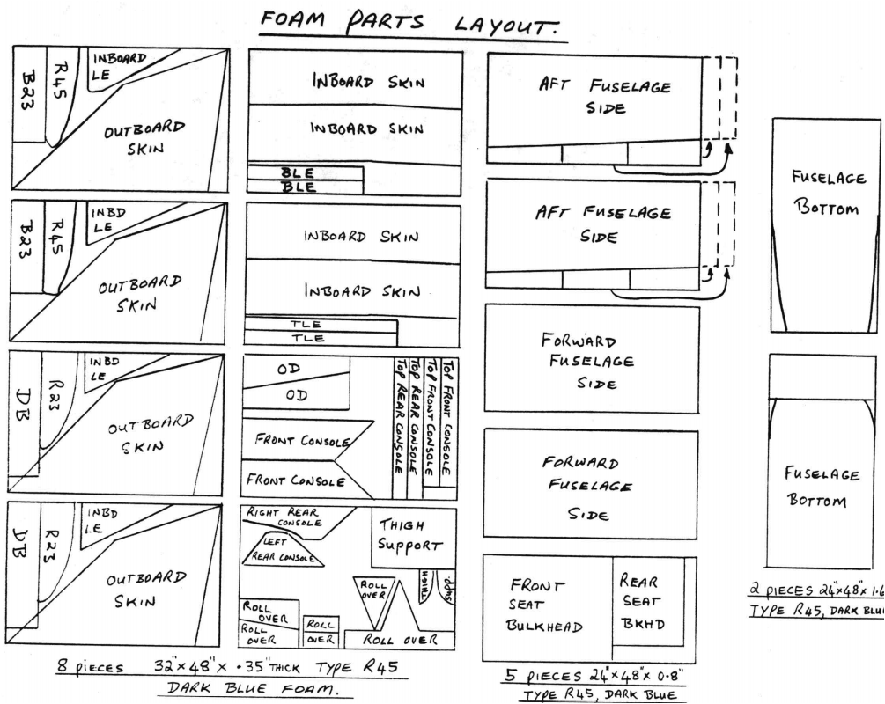

# Chapter 2

## BILL OF MATERIALS

This chapter is a listing of the materials and components which are required to build a Long-EZ. The parts are catagorized by type for your convenience when ordering. The parts are also categorized by plans chapter to assist you in locating them during construction.

RAF maintains a close liaison with the distributors listed to assure proper materials specification and quality control. The distributors listed here are the only approved sources for materials. Do not make substitutions for the structural materials shown. The indicated materials were selected, developed, tested, and optimized for ease of construction and structural integrity. RAF cannot provide assistance in the application of substitute materials. Each authorized distributor has a catalog or descrip­tive price list of the materials and components that they provide. The catalogs often cover a range of items beyond the basic requirements shown in this B.O.M. and serve as a very handy reference. Those distributors who charge for their catalogs will refund the catalog charge with your first order.

| AIRCRAFT SPRUCE & SPECIALTY | WICKS AIRCRAFT SUPPLY |
| --- | --- |
| P.O. Box 424 | 410 Pine Street |
| Fullerton, CA 92632 | Highland, IL 62249 |
| (714) 870 - 7551 | (618) 654 - 7447 |

| CUSTOM PREFAB PARTS | |
| --- | --- |
| (1) | SC Strut Cover (fiberglass) |
| (1) | NB Nosegear Box (fiberglass) |
| (2) | Seat belt/Harness Assembly |
| (2) | Main gear axles 1 1/4" dia. |
| (2) | SB Sump Blister (fiberglass) |
| (1) | CI Cowl Inlet (fiberglass) |
| (1 ea) | CCT and CCB Continental Cowl |
| | OR
| (1 ea) | LCT and LCB Lycoming Cowl |
| (1 kit) | Upholstry, including 2 custom-fit suitcases, 2 custom seat cushions and 2 custom headrests |
| (1) | Whelen A600 PG=14 Wingtip light, Right |
| (1) | Whelen A600 PR-14 Wingtip light, left |

| VFR INSTRUMENTS | |
| --- | --- |
| Airspeed | 0-200 kts or 0-230 mph |
| Altitude | Sensitive |
| Compass |
| Engine | Due to the many options, refer to Chapter 22 and Chapter 21 and order to suit |

| TOOLS | | |
| --- | --- | --- |
| 1 pcs. | ~~2 pcs 16" x 48"~~ 1/16" or 1/8" thick x 24" x 48" | Birch aircraft plywood for templates |  {CP 25 PC 15 MEO} |
| 1 pcs. | 103" 1.5" steel water pipe | Roncz canard alignment during foam glue up |
| Box of 200 | Disposable co-polymer examination gloves |  |
| (1 lb) jar | Ply No.9 Gell Skin Protector |  |
| (1 pint) | Epo Cleanse, epoxy hand cleaner |  |
| (2 each) | 6-in long rubber squeegee |  |
| (200 each) | 8 oz. Lily unwaxed paper epoxy mixing cups |  |
| (100 each) | 1-in wide Bristle paint brushes |  |
| (50 each) | 2-in wide Bristle paint brushes |  |
| 1 pair | Wiss model 20W scissors |  |
| (1 each) | Wood straight edge 1" x 4" x 72" |  |
| (1 each) | Decimal tape measure Stanley #61-112 |  |
| Box of 500 | Wood mixing sticks |  |
| (1 each) | Disston Abrader #401C |  |
| (1 each) | 5/8" counter bore with 1/4" pilot and 10" long shank |  |
| (1 quart) | Alodine and Aeroprep       | Aluminum corrosion prevention      |

Figure 2-1:10 inch counter bore tool

| PEEL PLY | |
| --- | --- |
| 1" wide 50 yd. | 4 rolls |
| 2" wide 50 yd. | 4 rolls |

| Safety Wire | |
| --- | --- |
| 0.041 safety wire | 25 ft coil |
| 0.035 safety wire | 25 ft coil |

Note: Aircraft Spruce catalog lists a large variety of composite-working tools.

| ~~~KEN BROCK MANUFACTURING INC.~~~ Cozy Girls | Aircraft Spruce also 
| --- |
| ~~~11852 Western Ave.~~~ email: CGParts@aol.com |
| ~~~Stanton, CA 90680~~~ http://www.cozygirrrl.com/aircraftparts.htm |
| ~~~(714) 898 - 4366~~~ Not all parts available from Cozy|

Catalog $2 - shows photos of all parts

| | CUSTOM PREFAB PARTS | CHAPTER | Canard Pusher |
| --- | --- | --- | --- |
| (1) | STEP - Formed aluminum | 8 | |
| (2) | LMGA Assembly | ~~9~~ 5 | {CP 26 PC 34 MEO} |
| (2) | LMBG1 forward main gear attach brackets | 5 | {CP 35 PC 109 MEO} |
| (2) | LMBG2 aft main gear attach brackets | 5 | {CP 35 PC 109 MEO}  |
| (2) | AX 5 Main gear axle 1 1/4" dia. | 9 | |
| (4) | A4-84 Axle spacers | 9| {CP 29 PC 71 MEO} | |
| (2) | J1.25 Axle nut    | 9 | {CP 29 PC 71 MEO} | |
| (1) | LB-12345 Weldment | 9 | |
| (1) | LB-6 Spacer| 9 | |
| (1) | LB-10 Arm | 9 | |
| (1) | LB-11 Spring clip | 9 | |
| (1) | LB-131415 Handle assy. with bearing | 9 | |
| (2) | LB-16 Spacer | 9 | |
| (2) | LB-18 Brackets | 9 | |
| (1) | LB-21 Rod | 9 | |
| (2) | CLT Lift tab | 10 | CU Canard |
| (2) | CLI Lift Insert | 10 | {CP27 PC53 MEO} CU canards |
| (2) | CL-1 Lift Inserts | 10 | R1149MS canard (same as CLI) |
| (7) | CS2 Formed hinge with bushing | 11 | CU Canard |
| (9) | CS3 Bracket | 11 | CU Canard  |
| (2) | CS9 Plug | 11 | CU Canard |
| (2) | CS10 Lead weight | 11 & 30 | Both Canards |
| (2) | CS11 Lead weight | 11 & 30 | Both Canards |
| (2) | CS12 Belhorn with bushing | 11 | Both Canards |
| (1) | PTB Belcrank | 11 | Both Canards |
| (2) | CNL Aluminum bushing | 12 | Both Canards |
| (2) | CN2 STL bushing | 12 | Both Canards |
| (2) |  NC-CLT | 30 | Lift tabs R1149MS Elevators |
| (5) |  NC-2   | 30 |  Hinge inserts R1149MS Elevators |
| (5) |  NC-3   | 30 |  Hinges R1149MS Elevators |
| (2) |  NC-3A  | 30 |  Hinges R1149MS Elevators |
| (1) |  NC-5A  | 30 |  Pitch Trim belcrank R1149MS Elevators  |
| (2) |  NC-6   | 30 |  Plugs  R1149MS Elevators |
| (2) |  NC-7   | 30 |  Hinge jigs  R1149MS Elevators |
| (2) |  NC-12A | 30 |  Control Arms (1 left and 1 right) R1149MS Elevators |
| (2) |  NC-13  | 30 |  Steel spacers  R1149MS Elevators |
| (1) | Worm-drive retract assy. including hand crank | 13 | |
| (1) | NG5 Plate   | 1 | {CP 29 PC 71 MEO} |
| (1) | NG6 Casting | 13 | |
| (1) | NG15A Casting | 13 | |
| (1) | NG16 Casting | 13 | |
| (1) | NG-3 Bracket | 13 | |
| (1) | NG-4 Bracket | 13 | |
| (1) | NG 10A/NG9 Assembly (pushrod) | 13 | |
| (1) | NG6 Assy including NG7 and NG23 Bracket | 13 | |
| (2) | NG8 Plates | 13 | |
| (1) | NG401A Lower node gear assy with tire tube friction, bolts, etc. | 13 |  |
| (2) | LE2026 Welded rudder pedal (1 left, 1 right) | 13 |  |
| (4) | CS13 Steel bushing | 13 |  |
| (2) | SH1 Strap | 14 |  |
| (2) | CS15 Belcrank with bearing | 15 |  |
| (2) | CS71 Brackets | 15 |  |
| (2) | CS72 Pulley brackets (2 pieces each) | 15 |  |
| (2) | CS75 Steel Bushings | 15 |  |
| (2) | BA Brake arms | 15 |  |
| (2) | CS171 Brackets | 15 |  |
| (2) | Stick grips - rubber | 16 |  |
| (10) | CS1 Inserts | 16 |  |
| (2) | CS1A Inserts | 16 |  |
| (4) | CS17 Spacer | 16 |  |
| (2) | CS131 Spacer | 16 |  |
| (2) | CS128 Belcrank with bearing| 16 |  |
| (4) | CS127 Bracket | 16 |  |
| (2) | CS201 Steel bushings | 16 |  |
| (2) | CS132L-R Welded belhorn | 16, 19 | {CP58 PC137 MAN-GRD}  |
| (1) | CS122/124 Welded belhorn | 16 |  |
| (2) | CS202 Aluminum bushings | 16 |  |
| (3) | CS181 Inserts | 16 |  |
| (2) | CS112 Steel bushings | 16 |  |
| (1) | PTH Handle | 17 |  |
| (1) | RT1 Handle | 17 |  |
| (2) | RT2 Brackets (1 left, 1 right) | 17 |  |
| (1) | C1-L Handle | 18 |  |
| (2) | C2-L Arm | 18 |  |
| (2) | C3 Lug | 18 |  |
| (1) | C4 Block | 18 |  |
| (2) | C5 Rod | 18 |   |
| (2) | C6 Tube | 18 |   |
| (1) | SC1 Catch | 18 |   |
| (1) | C21 Machined handle | 18 |  |
| (2) | CS13 Spacer | 18 |  |
| (12) | LWA9 Aluminum bushings | 19 |  |
| (2) | A2 Brackets | 19 |  |
| (4) | A5 Brackets | 19 |  |
| (2) | CS301 Steel belhorn (1 left, 1 right | 20 |  |
| (2) | FT-18 Fuel cap assembly | 21 |  |
| (2) |  NC-CLT | 30 | Lift tabs R1149MS Elevators |
| (5) |  NC-2   | 30 |  Hinge inserts R1149MS Elevators |
| (5) |  NC-3   | 30 |  Hinges R1149MS Elevators |
| (2) |  NC-3A  | 30 |  Hinges R1149MS Elevators |
| (1) |  NC-5A  | 30 |  Pitch Trim belcrank R1149MS Elevators  |
| (2) |  NC-6   | 30 |  Plugs  R1149MS Elevators |
| (2) |  NC-7   | 30 |  Hinge jigs  R1149MS Elevators |
| (2) |  NC-12A | 30 |  Control Arms (1 left and 1 right) R1149MS Elevators |
| (2) |  NC-13  | 30 |  Steel spacers  R1149MS Elevators |
| (1) | Lycoming exhaust system |    | {CP 35 PC 109 MEO} |
| (4) | Dynafocal engine mounts |    | {CP 35 PC 109 MEO} |
| (4) | Conical engine mounts   |    | {CP 35 PC 109 MEO} |
| (4) | A484 back up rings (4 required 2 each) |    | {CP 35 PC 109 MEO} |
| (1) | LE2-LL landing light mount kit |    | {CP 35 PC 109 MEO} |

Note: Brock also has available the individual parts for all assemblies listed.

## RAF has closed 

| RUTAN AIRCRAFT FACTORY INC. |
| --- |
| Bldg 13, Airport |
| Mojave, CA 93501 |
| (305) 824 - 2645 |

| Part | Description |
| --- | --- |
| MG-1L | Main gear strut 22-lb S-glass |
| NG-1L | Node gear strut 2.8 lb S-glass |
| | Plexiglass canopy bubble |

Note: This list is complete **only** if you purchase all available prefab parts. If you decide to build a prefab part, refer to its drawing and order material and hardware as required. **Do** obtain catalogs from all distributors. They contain photos of available parts and a considerable amount of information on hardware, components and use of them.

___

### __BASIC AIRFRAME KIT__

| Epoxy          |                                       |
|----------------|---------------------------------------|
| 5 minute epoxy | 1 qt. Kit                             |
| Epoxy          | 15 Gallons (10 kits of Safe-T-Epoxy)* |

* if you are using the RAE system, substitute 8 gal. RAEF + 7 gal RAES for the 15 gal Safe-T-Epoxy

| Rigid Foam                                        |                   |    |
|---------------------------------------------------|-------------------|----|
| Urethane foam 2 lb/cu ft (green or tan)           | 1” x 24” x 48”    | 3  |
| Urethane foam 2 lb/cu ft (green or tan)           | 2” x 24” x 48”    | 4  |
| Styrofoam Blocks 2 lb/cu ft (light blue or white) | 7” x 14” x 41”    | 5  |
| Styrofoam Blocks 2 lb/cu ft (light blue or white) | 7” x 14” x 64”    | 10 |
| Poly-vinyl PV-core R250 (Dark red, 16 lbs/cu ft)  | 0.2” x 37” x 26”  | 2  |
| Poly-vinyl PV-core R100 (light red, 6 lbs/cu ft)  | 1”x6”x10”         | 1  |
| Poly-vinyl PV-core R100 (light red, 6 lbs/cu ft)  | 0.25” x 35” x 44” | 2  |
| Poly-vinyl PV-core R45 (Dark blue, 3 lbs/cu ft)   | 0.35” x 32” x 48” | 8  |
| Poly-vinyl PV-core R45 (Dark blue, 3 lbs/cu ft)   | 0.8” x 24” x 48”  | 5  |
| Poly-vinyl PV-core R45 (Dark blue, 3 lbs/cu ft)   | 1.6” x 24” x 48”  | 2  |
| Pour-in-Place Foam                                | 1 quart           | 1  |

| Fiberglass |                               |
|------------|-------------------------------|
| 90         | Yds. BID  0.013 x 38” (7725)  |
| 150        | Yds. UND 0.009 x 38”(7715)    |
| 120        | Yds. UND 0.035 x 3” tape roll |

| Filler Material |                                    |
|-----------------|------------------------------------|
| 2 lbs           | Flocked Cotton                     |
| 4 Gallons       | 3M B23, 500 Glass Balloons (micro) |

| Wood |                                            |
|------|--------------------------------------------|
| 3    | Pcs. 0.7" x 1 “ x 104” Spruce              |
| 2    | Pcs. .7" x .4" x 60" Spruce                |
| 2    | Pcs. 0.7" x 0.7 “ x 104” Triangular Spruce |
| 1    | Pc. .7" x X.7" x 48" Triangular Spruce     |
| 1    | Pcs. 1" x 1" x 12” Spruce                  |
| 1    | Pc. 24" x 36" 5-ply Birch ¼” Plywood       |

| Aluminum Extrusions |                                          |      |   |   |
|---------------------|------------------------------------------|------|---| --- |
| <u>90 Degree angle </u> |                                          |      |   |    |
| 6061 T6             | 2” x 2” x 0.25”                          | 24“ | 1 |    |
| 2024 T3             | 1” x 1” x 0.125” or 7/8” x 7/8” X 0.125” | 60”  | 1 |   |
| 2024 T3             | 1.5” x 1.5” x 0.125”                     | 6”   | 1 |   |
| 4130N Steel         | 1" x 1" x 0.125"                         |  12" | 1 | {CP49 PC131 MAN-GND} |
| <u>Rectangular Bar</u> |                                          |      |   |   |
| 2024 T3             | 2” x 0.25”                               | 60”  | 1 |   |
| 2024 T3             | 2” x 0.25”                               | 30”  | 1 |   |

| Sheet Metal |                 |            |       |   |  |
|-------------|-----------------|------------|-------|---| --- |
| 301 or 302  | Stainless Steel | 24” x 30”  | 0.16” | 1 | {CP 25 PC 25 DES see  note 1} |
| 4130N       | Steel           | 4" x 2"    | 0.22  | 4 |  |
| 2024T3      | Aluminum        | 3” x 10”   | 0.16” | 1 |  |
| 6061-0      | Soft Aluminum   | 20” x 24”  | 0.20” | 1 |  |
| 2024T3      | Aluminum        | 12” x 8”   | 0.25” | 1 |  |
| 2024T3      | Aluminum        | 1.5” x 8”  | 0.32” | 1 |  |
| 6061T6      | Aluminum        | 8” x 10”   | 0.32” | 1 |  |
| 2024T3      | Aluminum        | 6” x 8”    | 0.63” | 1 |  |

***Note 1: {CP 25 PC 25 DES} 2024T3 24" x 30" x 0.16" Aluminum can be substituted for the steel firewall. ***

| Metal Tubing and Rod |              |         |                        |   |   |
|----------------------|--------------|---------|------------------------|---| --- |
| 6061T6               | Aluminum     | 62”     | 1.25” O.D. x 0.035W    | 1 |   |
| 6061T6               | Aluminum     | 80”     | 1.25” O.D. x 0.035W    | 1 |   |
| 6061T6               | Aluminum     | ~~10~~ 12 feet | 1.0” O.D. x 0.035” W   | 1 | HP Rudder  |
| 6061T6               | Aluminum     | 6 feet  | 0.75” O.D. x 0.58” W   | 3 |   |
| 2024T3               | Aluminum     | 6 feet  | 0.5” O.D. x 0.035”w    | ~~2~~ 1 | {CP49 PC131 MAN-GND} |
| 2024T3               | Aluminum    | 57"    |  1" O.D. x .035" wall   | 1  | R1149MS canard Torque Tube |
| 2024T3               | Aluminum    | 74"    |  1" O.D. x .035" wall   | 1  | R1149MS Canard Torque Tube |
| 304 Stainless        | Steel rod   | 61"   | 3/16" diameter   |  2 | R1149MS canard NC-8s |
| 1100-0 or            |
| 3003-0               | Aluminum     | 26 feet | 0.375” O.D. x 0.035” W | 1 |   |
| 1100-0 or            |
| 3003-0               | Aluminum     | 14 feet | 0.25” O.D. x 0.035”W   | 1 |   |
| 4130 N               | Steel        | 36”     | 0.625”O.D. x 0.049”W   | 1 |   |
| 4130 N               | Steel        | 6 ft    | 0.5" O.D. x 0.028" W   | 1 | {CP49 PC131 MAN-GND} |
| Cold Rolled          | Steel        | 36”     | 0.375”                 | 4 |   |
| Piano wire           | Steel (hard) | 12”     | 0.32”                  | 1 |   |

| Airframe Bolts |    |   |
|----------------|----| ---  |
| 3/16”          |    |   |
| AN3-4A         | 2  |   |
| AN3-5A         | 16 |   |
| AN3-6A         | 18 |   |
| AN3-7A         | 28 |   |
| AN3-10A        | 5  |   |
| AN3-11A        | 16 | {CP25 PC 14 MEO}  |
| AN3-12A        | 1  |   |
| AN3-13A        | 8  |   |
| AN3-15A        | 2  |   |
| AN3-16A        | 2  |   |
| AN3-20A        | 2  |   |
| AN3-6          | 1  |   |
| AN3-7          | 1  |   |

| __1/4"__ |    |
|---------|----|
| AN4-3A  | 3  |
| AN4-4A  | 2  |
| AN4-5A  | 11 |
| AN4-7A  | 6  |
| AN4-10A | 7  |
| AN4-11A | 2  |
| AN4-15A | 6  |
| AN4-16A | 26 |
| AN4-17A | 3  |
| AN4-21A | 1  |
| AN4-22A | 8  |
| AN4-24A | 2  |
| AN4-26A | 2  |
| AN4-41A | 2  |
| AN4-20  | 2  |

| 5/16”   |   |
|---------|---|
| AN5-41A | 1 |

| 3/8”    |   |
|---------|---|
| AN6-80A | 2 |

| Machine Screws     |    |
|--------------------|----|
| __Counter Sunk__   |    |
| AN-509-10R7        | 9  |
| AN-509-10R8        | 2  |
| AN-509-10R10       | 14 |
| AN-509-10R14       | 12 |
| AN-509-10R28       | 4  |
| AN-509-10R30       | 8  |
| AN-509-416R14      | 2  |
| AN-509-416R18      | 2  |

| __Button Head Screws__ |    |
| AN526-832-14       | 2  |
| AN525-10R8         | 28 |
| AN525-10R10        | 25 |
| AN525-10R12        | 8  |
| AN525-10R16        | 1  |
| AN525-10R24        | 1  |
| AN525-416R16       | 6  |

| Nuts      |     |   |
|-----------|-----| --- |
| MS21042-3 | 169 |   |
| MS21042-4 | ~~70~~ 62 | {CP25 PC67 MEO}  |
| AN310-3   | 2   |   |
| AN310-4   | 2   |   |
| AN315-3   | 20  | {CP26 PC40 MEO} |
| AN316-4   | 4   |   |
| AN316-6   | 2   |   |
| AN364-832 | 2   |   |
| AN365-524 | 1   |   |
| AN363-624 | 2   | {CP29 PC67 MEO}   |
| AN363-820 | 6   |   |

| Washers    |     |     |
|------------|-----| ---- |
| AN960-10L  | 200 |     |
| AN960-10   | 150 |     |
| AN960-416L | 150 |     |
| AN960-416  | 10  |     |
| AN960-616  | 4   |     |
| AN960-816L | 10  |     |
| AN960-816  | 12  |     |
| AN960-1016 | ~~8~~  3   | {CP30 PC83 MEO}    |
| AN970-3    | 28  |     |
| AN970-4    | ~~5~~ 11   | {CP28 PC 55 MEO}    |
| AN970-5    | 2   |     |
| AN970-7    | 2   |     |

Phenolic ½” O.D. x 3/16” I.D. x 1/16” T(hick) (Need 4)

| Nut Plates |    |
|------------|----|
| K1000-3    | 22 |
| K1000-4    | 16 |
| K1000-08   | 10 |

| Cotter Pins |   |
|-------------|---|
| AN380-2-2   | 4 |
| AN380-2-3   | 4 |

| Clevis Pins |    |
| AN393-7     | 2  | HP Rudder |
| AN393-9     | 4  |    |
| AN393-19    | 3  |    |
| AN381-2-8   | 2  | HP Rudder |

| Rivets         |                |     |
|----------------|----------------|-----|
| 1/8” Pop type  | AVEX 1601-410  | 100 |
|                | AVEX 1604-412  | ~~100~~ 128 | HP Rudder |
|                | Or             |     |
|                | Cherry MSP 43  | 100 |
|                | Cherry MSC 43  | 100 |
|                |                |     |
|                | Cherry BSC 44  | 28  | HP Rudder |
|                |                |     |
| Solid Aluminum | AN426-AD3-3    | ~~50~~ 62 | HP Rudder |
|                | AN426-AD3-4    | 50  |
|                | AN470-AD3-7    | 10  |
|                | AN470-AD4-5    | 10  |
|                | AN470-AD4-10   | 40  |

| Cable and Cable Hardware   |       |    |
|----------------------------|-------| --- |
| 1/16” 7x7 Stainless Cable  | 50 ft | HP Rudder |
| 3/32” 7x17 Stainless Cable | ~~50~~ 0 ft | HP RUdder |
| AN100-3 Thimble            | ~~30~~ 34 | HP Rudder |
| 18-1-C Sleeve              | ~~20~~ 28 | HP Rudder |
| 18-2-G Sleeve              | 12    |     |

| Plumbing and Conduits                |           |   |
|--------------------------------------|-----------|---|
| Brass Elbow                          | #269 P    | 4 |
| Polyethylene Tee                     | #0715-153 | 1 |
| Polyethylene Adapter                 | #0700-153 | 2 |
| Tygon Tube 3/8” OD x ¼” ID           | 4 ft      | 1 |
| Nylaflow Tube 3/16” OD x 0.025” Wall | 60 ft     | 1 |

| Wheels Brakes and Tires                      |        |
|----------------------------------------------|--------|
| Cleveland Wheels and Brakes 500 x 5          | 1 Set  |
| Tires Goodyear 3.40 x 5 6 ply Industrial Rib | 2      |
| Tubes for 3.4 x 5 Tires                      | 2      |
| Gerdes 049 Brake Master Cylinders            | 2      |

| MISCELLANEOUS           |                                                    |    |    |
|-------------------------|----------------------------------------------------|----| ---- |
| Safety Pin              | AN416-1                                            | 7  |    |
| Rod End                 | HEIM HM-3                                          | 10 |    |
| Rod End                 | HEIM HM-4                                          | 2  |    |
| Rod End                 | HEIM F34-14 Or FAFNIR REB3N                        | 2  |    |
| Rod End                 | RAFNIR RE4M6 Or HEIM HM-6 with Insert              | 2  |    |
| Pulley                  | AN210-2A                                           | ~~2~~ 4  | HP Rudder   |
| Universal Joint         | MS20271-B10                                        | 3  |    |
| Bearing                 | Boston FB-1013-8 Bronze                            | 1  |    |
| Phenolic (bearing)      | ¼” Sheet 4” x 12”                                  | 1  |    |
| Latch                   | Hartwell H-5000-2 Flush                            | 1  |    |
| Arrow Stock, Fiberglass | 5/16 x 0.028”wall 24 inches long                   | 3  |    |
| Insulation              | Fiber Frax 970-F 0.04”thick 24”x30”                | 1  |    |
| Fire retardent          | Ocean No.1644 Flexibilized                         |    |    |
|                         | Intumescent Fireproof Coating Compound             | 1 | {CP49 PC131 MAN-GND} |
| Hinge                   | MS20257-P2 3”                                      | 1  |    |
| Hinge                   | MS20001-P6 ~~84”~~ 114"                           | 1  | HPRudder |
| Spring                  | .35 OD x 0.06 wire Compression ½ inch long        | 2  | HPRudder |
| Spring                  | .35 OD x 0.06 wire Tension, 10” long               | 2  |    |
| Spring                  | 9/16" OD x 0.105" wire Tension, 3.75" long         | 2  |    |
| Spring                  | .35" OD x .05" wire; Compression, 4" long 110 in/lb [1] | 2 |    |
| Spring                  | .34 OD x 0.05 wire, tension, 6 in long             | 1  |    |

### Note 1: Century Spring corp., Los Angeles, CA. Part #1887

***

Figure 2-2: R45 Foam Parts Layout

Figure 2-3: R100, R240, Styrofoam parts layout

***

### __Materials list by Chapter__

#### <u>Chapter 3: Education</u>

| Education |   |                                            |
|-----------|---|--------------------------------------------|
| Glass:    | 1 | 1.1 yd BID                                 |
|           | 1 | 0.1 yd UND                                 |
| Epoxy:    |   | 0.1 gallon                                 |
| Foam:     | 1 | 1 board foot urethane board (tan) 1" thick |

#### <u>Chapter 4: Fuselage Bulkheads</u>

| Fuselage Bulkheads |   |                                          |
|--------------------|---|------------------------------------------|
| Hardware:          | 6 | AN509-10R10 screws                       |
| Glass:             | 1 | 3 yd UND                                 |
|                    | 1 | 5 yd BID                                 |
| Epoxy:             |   | 0.5 gallons                              |
| Foam:              | 1 | 8 sq ft 0.8" thick type R45              |
|                    | 1 | 9 sq ft 0.2" thick type R250             |
| Wood:              | 1 | 24" x 30" x 0.25" 5-ply birch plywood    |
| Metals:            | 1 | 24" x 30" x 0.016" stainless steel (301) |
| Misc:              | 1 | 24" x 30" x .040" fiberfrax 970-F        |

#### <u>Chapter 5: Fuselage Sides</u>

| Fuselage Sides |     |                                                |
|----------------|-----|------------------------------------------------|
| Prefab parts:  | 2   | LMGA assembly                                  |
|                | 4   | LMGA-B bushing (any steel)                     |
| Hardware:      | 2   | AN6-80A bolts                                  |
|                | 16  | AN4-16A bolts                                  |
|                | 4   | AN960-616 washers                              |
|                | 32  | AN960-416L washers                             |
|                | 16  | MS21042-4 nuts                                 |
|                | 2   | AN363-624 nuts                                 |
| Glass:         | 1   | 3 yds BID                                      |
|                | 1   | 9 yds UND                                      |
| Epoxy:         | 0.8 |                                                |
| Foam:          | 6   | 32 sq. ft. 0.8" thick type R45                 |
|                | 1   | 3 sq. ft. 1" thick urethane, tan               |
| Wood:          | 3   | 0.7" x 1" x 104" spruce longerons              |
|                | 2   | 0.4" x 0.7" x 60" spruce stiffener             |
|                | 2   | 0.7" x 0.7" triangle spruce 105" long          |
|                | 1   | 0.7" x 0.7" triangle spruce 48" long           |
| Metals:        | 1   | 24”, 2" x 2" x 0.25" 6061-T6 extruded 90 angle |

#### <u>Chapter 6: Fuselage Assembly</u>

| Fuselage Assembly |   |                                          |
|-------------------|---|------------------------------------------|
| Prefab parts:     | 1 | NB nose wheel box cover                  |
| Glass:            | 1 | 6 yd. BID                                |
| Epoxy:            |   | 0.4 gallon                               |
| Foam:             | 2 | 16 sq. ft. 1.6" thick type R45 dark blue |

#### <u>Chapter 7: Fuselage Exterior</u>

| Fuselage Exterior |   |                  |
|-------------------|---|------------------|
| Glass:            |   | 14 yd UND        |
| Epoxy:            |   | 0.85 gal EZ poxy |

#### <u>Chapter 8: Roll over and seat belts</u>

| Roll over and seat belts |    |                                                       |
|--------------------------|----|-------------------------------------------------------|
| Prefab parts:            | 1  | Step                                                  |
|                          | 2  | seat belt / shoulder harness assembly                 |
| Hardware:                | 6  | AN525-416R16 screws                                   |
|                          | 2  | AN509-416R18 Screws                                   |
|                          | 2  | AN509-416R14 Screws                                   |
|                          | 4  | AN4-5A Bolts                                          |
|                          | 2  | AN4-10A Bolts                                         |
|                          | 16 | AN960-416L Washers                                    |
|                          | 2  | AN970-4 Washers                                       |
|                          | 6  | MS21042-4 nuts                                        |
| Glass:                   | 1  | 2 yd BID                                              |
| Epoxy:                   |    | 0.1 Gallon                                            |
| Foam:                    | 1  | 4 sq. ft. .35” thick type R45 dark blue               |
| Metals:                  | 4  | 8” of 1" x 1" x 0.125" 2024-T3 aluminum 90 angle      |
| Wood:                    | 4  | scraps of 0.25" thick plywood left over from firewall |

#### <u>Chapter 9: Main gear and landing brake</u>

| Landing gear and brake |    |                                                      |
|------------------------|----|------------------------------------------------------|
| Prefab parts:          | 1  | MG1-L “S” Glass main gear strut                      |
|                        | 2  | Cleveland 500 x 5 main wheels and brakes             |
|                        | 2  | Goodyear tires, 3.50 x 5, 6 ply industrial rib       |
|                        | 2  | Axel for Cleveland 500 x 5 wheels                    |
|                        | 1  | LB-12345 Weldment (landing brake)                    |
|                        | 1  | LB-6 Spacer                                          |
|                        | 1  | LB-10 Aluminum Arm                                   |
|                        | 1  | LB-11 Spring Clip                                    |
|                        | 1  | LB-131415  Handle Assembly                           |
|                        | 2  | LB-16 Spacers                                        |
|                        | 2  | LB-18 Bracket                                        |
|                        | 1  | LB-21 Threaded Rod                                   |
| Hardware:              | 4  | AN3-7A Bolts                                         |
|                        | 5  | AN4-5A bolts                                         |
|                        | 8  | AN4-22A Bolts                                        |
|                        | 1  | AN4-24A Bolts                                        |
|                        | 1  | AN4-26A Bolts                                        |
|                        | 2  | AN525-10R8 screws                                    |
|                        | 6  | AN525-10R10 screws                                   |
|                        | 25 | AN960-416L washers                                   |
|                        | 24 | AN960-10L washers                                    |
|                        | 12 | MS21042-3 nuts                                       |
|                        | 10 | MS21042-4 nuts                                       |
|                        | 1  | K1000-4 Nutplate                                     |
|                        | 2  | 90 Nyloseal #269P Brass Fittings                     |
|                        | 2  | AN100-3 Thimbles                                     |
|                        | 3  | 18-1-3 Nicropress Sleeves                            |
|                        | 2  | AN316-4 Nuts                                         |
| Glass:                 |    | 5 yds BID                                            |
|                        |    | 10 yds UND                                           |
| Epoxy:                 |    | 0.8 gallon                                           |
|                        |    |                                                      |
| Foam:                  | 1  | 1" thick urethane (24"x24")                          |
| Metal:                 | 1  | 1 ft 2024-T3 aluminum 0.25" thick (16 square inches) |
|                        | 1  | 1 ft 1" x 1" x 0.125" 2024-T3 aluminum 90 angle      |
| Wood:                  | 3  | scraps of 0.25" plywood (left over from firewall)    |
| Misc:                  |    |                                                      |
|                        | 12 | 12 ft Nylaflow Tube 3/16” OD x 0.025” Wall           |
|                        | 1  | Hinge   MS20001-P6 8”                                |
|                        | 1  | 4ft of 1/16” 7x7 cable                               |
|                        | 2  | Rod End (HEIM F34-14 Or FAFNIR REB3N)                |
|                        | 1  | Phenolic (bearing) ¼” x 2” x 4”                      |

#### <u>Chapter 10: Canard Construction CU Canard</u>

| Canard Construction |    |                                 |
|---------------------|----|---------------------------------|
| Prefab:             | 2  | CLT Canard Lift Tabs            |
| Hardware:           | 6  | AN4-7A Bolts                    |
|                     | 6  | AN960-416L Washers              |
|                     | 6  | K1000-4 Nutplates               |
|                     | 12 | AN426AD3-4 Rivets               |
| Glass:              | 1  | 4 Yds BID                       |
|                     | 1  | 17 yds UND                      |
| Epoxy:              | 1  | 1 gallon                        |
| Foam:               | 2  | part of 7 x 14 x 41 Styrofoam   |
|                     | 2  | part of 7 x 14 x 64 Styrofoam  |
|                     | 1  | 1 “ x 6” x 10” type R100 PV     |
| Metal:              | 1  |  1/8" x 1.5" x 6" 2024-T3 Alum. |

#### <u>Chapter 11: Elevators</u>
| Elevators |    |                                                    |
|-----------|----|----------------------------------------------------|
| Prefab:   | 2  | CS-10 lead weights                                 |
|           | 2  | CS-11 lead weights                                 |
|           | 2  | CS-12 Bellcrank with bushings                      |
|           | 1  | PTB Bellcrank                                      |
| Hardware: | 7  | AN525-10R10 Screws                                 |
|           | 2  | AN3-6A Bolts                                       |
|           | 2  | AN3-15A Bolts                                      |
|           | 4  | AN3-10A Bolts                                      |
|           | 9  | AN509-10R7   (AKA MS24694-549) Flat head screw 10-32 | CS-11 |
|           | 4  | AN509-10R14  (AKA MS24694-556)                     |
|           | 22 | AN960-10L Washers                                  |
|           |  4 | AN365C-1032 Stainless Elastic Stop nuts (MS21044)  | CS-11 |
|           | 28 | MS21042-3 Nuts                                     |
|           | 2  | AN470AD 4-5 Rivets                                 |
|           | 8  | MS21042-3 Nuts                                     |
|           | 24 | BSPQ-43 Cherry pop rivets                          |
|           | 6  | BSPQ-44 Cherry pop rivets                          |
|           | 2  | 10-32 Allen head set screws                        |
| Glass:    | 1  | 3 yds UND                                          |
| Epoxy:    |    | 0.1 Gallon                                         |
| Foam:     | 2  | Part of two 7 x 14 x 64 Styrofoam blocks (pg 10-1) |
| Metal:    | 1  | 62” of 1.5” O.D. x 0.35 wall 6061-T6 Alum. Tubing  |
|           | 1  | 80” of 1.5” O.D. x 0.35 wall 6061-T6 Alum. Tubing  |

#### <u>Chapter 12: Canard Installation</u>

| Canard Installation |        |                       |
|---------------------|--------|-----------------------|
| Prefab Parts        | 2      | CNL Aluminum Bushings |
|                     | 2      | CN2 Steel Bushings    |
| Hardware            | 2      | AN3-20A Bolts         |
|                     | 2      | AN3-13A Bolts         |
|                     | 2      | AN960-416L Washers    |
|                     | 2      | AN970-4 Washers       |
|                     | 2      | K1000-4 Nut plates    |
|                     | 4      | AN426AD3-3 Rivets     |
| Glass               | scraps | BID                   |
| Epoxy               |        | Minimal amount        |
| Foam                |        | none                  |

### R1149MS Canard materials listed next to last of this chapter

#### <u>Chapter 13: Nose and Nose Gear</u>

| Nose and Nose Gear |    |                                                            |  |
|---|---|---|---|
| Prefab Parts       | 1  | NG1-L ‘S’ Glass Strut  |  |
|                    | 1  | SC Fiberglass strut cover  |  |
|                    | 1  | Worm Drive Retraction assy. (includes belcrank components) |  |
|                    | 1  | NG3 Bracket                                                |  |
|                    | 1  | NG4 Bracket                                                |  |
|                    | 1  | NG10A / NGO Assembly                                       |   |
|                    | 1  | NG6 Assembly                                               |  |
|                    | 2  | NG8 Plates                                                 |  |
|                    | 1  | NG401A Castering Nose wheel Assy.                          |  |
|                    | 2  | LE 2026 Rudder Pedals                                      |  |
|                    | 4  | CS13 Bushings                                              |  |
|                    | ~~1~~  | ~~SC Fiberglass strut cover~~                                  | {CP 30 PC 79 INFO} |
| Hardware           | 3  | AN525-10R10 Screws                                         |  |
|                    | 2  | AN526-832-14 Screws                                        |  |
|                    | 8  | AN509-10R14 Screws                                         |  |
|                    | 4  | AN509-10R28 Screws                                         |  |
|                    | 3  | AN4-10RA Bolts                                             |  |
|                    | 1  | AN4-15A Bolts                                              |  |
|                    | 2  | AN4-41A Bolts                                              |  |
|                    | 1  | AN5-41A Bolts                                              |  |
|                    | 2  | AN3-6A Bolts                                               |  |
|                    | 2  | AN3-7A Bolts                                               |  |
|                    | 2  | K1000-3 Nut Plates                                         |  |
|                    | 2  | AN364-832 Nuts                                             |  |
|                    | 19 | MS21042-3 Nuts                                             |  |
|                    | 6  | MS21042-4 Nuts                                             |  |
|                    | 1  | AN365-524 Nuts                                             |  |
|                    | 2  | AN316-6 Nuts                                               |  |
|                    | 14 | AN960-10 Washers                                           |  |
|                    | 6  | AN970-3 Washers                                            |  |
|                    | 7  | AN970-4 Washers                                            |  |
|                    | 2  | AN970-5 Washers                                            |  |
|                    | 4  | AN426AD3-3 Rivet                                           |  |
|                    | 10 | AN509 8R8 Screws                                           |  |
|                    | 10 | K1000-08 Nut plates                                        |  |
|                    | 20 | AN426AD3-4 Rivet                                           |  |
| Glass              |    | 7 yds BID                                                  |  |
| Epoxy              |    | ½ gallon                                                   |  |
| Foam               | 1  | 10 sq. ft. 2” thick urethane foam                          |  |
|                    | 1  | 4.5 sq. ft. 0.2” thick type R250 dark red                  |  |
| Metal              | 1  | 2.5 x 3 x 1/8” 2024T3 aluminum sheet                       |  |
|                    | 1  |  4 ft ¼” O.D. x 0.035 wall 5052-0 Aluminum                 |  |
|                    | 1  | 8” x 10” of 0.32 6061T6 alum. Tube                         |  |
| Misc               | 1  |  4 ft 3/8” O.D. x ¼” I.D. Tygon tubing                     |  |
|                    | 1  | 0715-153 tee                                               |  |
|                    | 2  | 0700-153 adapters                                          |  |
|                    | 2  | HM-6 rodends (RE4M6)                                       |  |

#### <u>Chapter 14: Center Section Spar</u>
| Center Section Spar |    |                                         |  |
|---------------------|----|-----------------------------------------| --- |
| Prefab Parts        | 2  | SH1 Aluminum Straps                     |  |
| Hardware            | 4  | AN4-15A Bolts                           |  |
|                     | 10 | AN4-16A Bolts                           |  |
|                     | 32 | AN960-416L Washers                      |  |
|                     | 16 | MS21042-4 Nuts                          |  |
|                     | 2  | AN4-17A Bolts                           |  |
| Glass               | 1  | 1 yd UND                                |  |
|                     | 1  | 18 yd BID                               |  |
| Epoxy               |    | 2 gallons                               |  |
| Foam                | 1  | 10 sq ft ½” thick, type R100 red foam   |  |
|                     | 6  | 10 sq ft 1” thick, urethane foam        |  |
| Metal               | 1  | 3 ft ~~1.8~~ 1/8” x 1” x 1” 2024-T3 Alum. angle | {CP25 PC 21 MEO}  |
|                     | 1  | 30” 1/8” x 2” 2024-T3 alum bar          |  |
|                     | 1  | 12” ¼” x 2” 2024-T3 alum. Bar           |  |
| Wood                | 1  | 1 ft 1”x 1” Spruce                      |  |

#### <u>Chapter 15: Firewall and Accessories</u>

| Firewall and Accessories |    |                                           |
|--------------------------|----|-------------------------------------------|
| Prefab Parts             | 2  | CS15 Belcrank with bearing                |
|                          | 4  | CS71 Brackets                             |
|                          | 2  | CS72 Brackets                             |
|                          | 2  | CS75 Bushings                             |
|                          | 2  | BA Brake arms                             |
| Hardware                 | 10 | AN3-6A Bolts                              |
|                          | 4  | AN3-7A Bolts                              |
|                          | 2  | AN509-10R8 Screws                         |
|                          | 2  | AN4-10A Bolts                             |
|                          | 2  | AN4-11A Bolts                             |
|                          | 34 | AN960-10L Washers                         |
|                          | 18 | AN960-416L Washers                        |
|                          | 22 | MS21042-3 Nuts                            |
|                          | 4  | MS21042-4 Nuts                            |
|                          | 4  | AN380-2-3 Cotter pins                     |
| Glass                    |    | None                                      |
| Epoxy                    |    | None                                      |
| Foam                     |    | None                                      |
| Metal                    | 1  | 6” 1/8” x 1” x 1.5” 2024T3 extruded angle |
| Misc                     | 2  | AN210-2A pulleys                          |
|                          | 2  | Gerdes Model 049 master cylinders         |
|                          | 2  | Nyloseal #269-P elbows                    |

#### <u>Chapter 16: Control System</u>

| Control System     |    |                                         |      |
|--------------------|----|-----------------------------------------| ---- |
| Prefab Parts       | 2  | Stick grips                             |      |
|                    | 10 | CS1 Inserts                             |      |
|                    | 4  | CS17 spacers                            |      |
|                    | 2  | CS1A inserts                            |      |
|                    | 2  | CS131 Spacers                           |      |
|                    | 2  | CS128 Belcrank with bearing             |      |
|                    | 4  | CS127 Brackets                          |      |
|                    | 2  | CS201 Bushings                          |      |
|                    | 2  | CS132L Belhorn                          |      |
|                    | 1  | CS122-124 Belhorn                       |      |
|                    | 2  | CS202 Bushings                          |      |
|                    | 3  | CS181 Inserts                           |      |
|                    | 2  | CS112 Bushings                          |      |
| Hardware           | 14 | AN3-5A Bolts                            |      |
|                    | 2  | AN3-6A Bolts                            |      |
|                    | 12 | AN3-7A Bolts                            |      |
|                    | 13 | AN3-11A Bolts                           |      |
|                    | 2  | AN3-16A Bolts                           |      |
|                    | 2  | AN3-13A Bolts                           |      |
|                    | 1  | AN4-15A Bolts                           |      |
|                    | 1  | AN4-17A Bolts                           |      |
|                    | 2  | AN4-20 Bolts                            |      |
|                    | 90 | AN960-10 Washers                        |      |
|                    | 8  | AN960-416 Washers                       |      |
|                    | 15 | NS21042-3 Nuts                          |      |
|                    | 2  | MS21042-4 Nuts                          |      |
|                    | 2  | AN310-4 Nuts                            |      |
|                    | 20 | AN315-3   (Jamb Nuts on control rods)   | {CP26 PC40 MEO} |
|                    | 20 | AN100-3 Thimbles                        |      |
|                    | 30 | AN470AD4-10 Rivets                      |      |
|                    | 8  | 18-1-C Nicropress Sleeves               |      |
|                    | 12 | 18-2-5 Nicropress Sleves                |      |
|                    | 15 | AN970-3 Washers                         |      |
|                    | 4  | AN393-9 Clevis pin                      |      |
|                    | 3  | AN393-19  Clevis pin                    |      |
|                    | 7  | AN416-1 Safety pin                      |      |
|                    | 2  | AN960-1016 Washers                      |      |
|                    | 2  | AN380-2-2 Cotter Pin                    |      |
| Glass              | 1  | 2 yds BID                               |      |
| Epoxy              |    | 0.1 Gallons                             |      |
| Foam               | 1  | 0.35” thick type R45 dark blue          |      |
| Metal              | 1  | 15 sq inch, 0.063” 2024-T3 Alum         |      |
|                    | 2  | 6 ft ½” x 0.28 wall 4130 Steel Tube     | {CP49 PC131 MAN-GND} |
|                    | 3  | 6 ft. ¾” x 0.058 wall 2024-T3 alum. tube |      |
| Phenolic           | 1  | ¼” thick sheet 2” x 12”                 |     |
| Wood:              | 1  | 4” x 6” x ¼” plywood (firewall)         |     |
| Misc:              | 3  | MS20271-BIO Universals                  |     |
|                    | 10 | HM-3 HEIM rodends                       |     |
|                    | 2  | HM-4 HEIM rodends                       |     |
|                    | 1  | 32 ft 1/16” dia. 7 x 7 steel cable      |     |
|                    | 1  | 22ft of 3/32” dia. 7 x 19 steel cable   |     |
|                    | 1  | 14 ft 3/16” x 0.025 Nylaflow tubing     |     |
|                    | 1  | Boston FB 1013-8 Bronze flanged bearing |     |

#### <u>Chapter 17: Pitch and roll trim</u>

| Pitch and roll trim |    |                                        |
|---------------------|----|----------------------------------------|
| Prefab Parts        | 1  | PTH Aluminum Handle                    |
|                     | 1  | PT1 Handle                             |
|                     | 2  | RT2 Steel bracket                      |
| Hardware            | 1  | AN3-6 Bolts                            |
|                     | 1  | AN3-7 Bolts                            |
|                     | 3  | AN3-11A Bolts                          |
|                     | 1  | AN3-13A Bolts                          |
|                     | 14 | AN960-10 Washers                       |
|                     | 1  | AN970-3 Washers                        |
|                     | 4  | MS21042-3 Nuts                         |
|                     | 2  | AN310-3 Nuts                           |
|                     | 2  | AN380-2-2 Cotter Pins                  |
|                     | 6  | AN100-3 Thimbles                       |
|                     | 6  | 18-1-C Nicroprss Sleeves               |
| Phenolic            | 1  | 0.5” O.D. X 3/16” I.D. X 1/16” Washer  |
| Glass               |    | BID Scraps                             |
| Epoxy               |    | Minimal                                |
| Foam                |    | None                                   |
| Wood                |    | 1/2” plywood scraps (from firewall)    |
| Misc:               | 3  | .35 x .05 steel springs 6” long        |
|                     | 1  | 4 ft 1/16” x 7 x 7 cable               |
|                     | 2  | .35 x .06 compression springs, .5 long |

#### <u>Chapter 18: Canopy</u>

| Canopy        |        |                                               |
|---------------|--------|-----------------------------------------------|
| PreFab Parts: | 1      | Long Ez Plexiglass canopy bubble              |
|               | 1      | C1-L Handle                                   |
|               | 2      | C2-L Arms                                     |
|               | 2      | C3 Lugs                                       |
|               | 1      | C4 Block                                      |
|               | 2      | C5 Rods                                       |
|               | 2      | c6 Tubes                                      |
|               | 1      | SC1 Catch                                     |
|               | 1      | C21 Handle                                    |
|               | 2      | CS13 Spacer                                   |
| Hardware:     | 8      | AN509-10R30 Screws                            |
|               | 8      | AN509-10R10 Screws                            |
|               | 3      | AN525-10R10 Screws                            |
|               | 8      | AN525-10R12 Screws                            |
|               | 1      | AN525-10R24 Screws                            |
|               | 1      | AN525-10R16 Screws                            |
|               | 1      | AN3-10A Bolts                                 |
|               | 3      | AN3-13A Bolts                                 |
|               | 3      | AN3-7A Bolts                                  |
|               | 2      | AN3-4A Bolts                                  |
|               | 2      | AN3-6A Bolts                                  |
|               | 1      | AN3-12A Bolts                                 |
|               | 4      | AN470AD3-7 Rivets                             |
|               | 53     | AN960-10L Washers                             |
|               | 6      | AN970-3 Washers                               |
|               | 35     | MS21042-3 Nuts                                |
|               | 2      | 18-1-C Sleeves                                |
|               | 2      | AN100-3 Thimbles                              |
| Glass         | 1      | 7 yds BID                                     |
|               | 1      | 2 yds UND                                     |
| Epoxy         |        | 0.8 Gallons                                   |
| Foam          | scraps | 1” x 2” Urethane (see page 2-3)               |
| Metal         | 1      | 1.5” x 5” x 0.32” 2024-T3 Aluminum            |
|               | 1      | 8” 1/8” x 1” x 1” 2024-T3 Aluminum angle      |
|               | 1      | 5” x 5” x .025” 2024-T3 Aluminum              |
| Misc          | 1      | 10” 3/32” steel piano wire                    |
|               | 1      | 1 ft 1/16 x 7 x 7 cable                       |
|               | 3      | 5/16 O.D. x 0.028 wall fiberglass arrow stock |
|               | 1      | 16” MS20001-P6 Hinge                          |
|               | 1      | 2.5” MS20257-P2 Hinge                         |
|               | 1      | Hartwell H-5000-2 flush latch                 |

#### <u>Chapter 19: Wings, Ailerons, Wing attachment</u>

| Wings, Ailerons, attachment |    |                                                 |
|-----------------------------|----|-------------------------------------------------|
| PreFab Parts                | 12 | LWA9 Bushings                                   |
|                             | 2  | A2 Brackets                                     |
|                             | 4  | A5 Brackets                                     |
| Hardware                    | 12 | AN960-816 Washers                               |
|                             | 10 | AN960-816L Washers                              |
|                             | 6  | AN363-820 Nuts                                  |
|                             | 14 | AN525-10R8 Screws                               |
|                             | 14 | AN960-10L Washers                               |
|                             | 14 | K1000-3 Nutplate                                |
|                             | 28 | AN426AD3-3 Rivets                               |
| Glass                       | 1  | 70 yds 3” wide x 0.35 UND Tape                  |
|                             | 1  | 56 yds UND                                      |
|                             | 1  | 9 yds BID                                       |
| Foam                        | 10 | 7x14x64 styrofoam blocks                        |
|                             | 4  | 7x14x41 styrofoam blocks                        |
| Epoxy                       |    | 4 Gallons                                       |
| Metal                       | 2  | 3”x10” of 0.016” 2024-T3 Aluminum               |
|                             | 2  | 24” of 1/8” x 2” 2024-T3 Aluminum bar           |
|                             | 2  | 12” of ¼” x 2” 2024-T3 Aluminum Bar             |
|                             | 2  | 18” of ¾” x 0.058 thick 6061-T6 Aluminum tube2  |
| Misc                        | 2  | 3 ft. MS20001-P6 hinge                          |
|                             | 4  | 3 ft x 3/8” diameter cld rolled steel           |
|                             | 1  | 25 ft of 3/16 O.D. x .025” wall Nylaflow tubing |

#### <u>Chapter 20: Winglets and standard rudders</u>

| Winglets and rudders |    |                                              |
|----------------------|----|----------------------------------------------|
| Prefab Parts         | 2  | CS301 Steel Belhorn                          |
| Hardware             | 10 | AN525-10R8 Screw                             |
|                      | 6  | AN950-10L Washers                            |
|                      | 4  | MS21042-3 Nuts                               |
|                      | 6  | K1000-3 Nut plates                           |
|                      | 12 | AN426AD3-3 Rivets                            |
| Glass                | 10 | UND                                          |
|                      | 6  | BID                                          |
| Epoxy                | 1  |                                              |
| Foam                 | 4  | scrap from wing styrofoam blocks             |
|                      | 2  | scrap from urethane foam                     |
| Metal                | 2  | 10” of 1” x .035” wall 6061-T6 Aluminum tube |
|                      | 2  | 16” MS20001-P6 hinge                         |
|                      | 2  | 4” long .35” x .05” steel spring             |
|                      | 2  | 10” 3/32” steel piano wire                   |

#### <u>Chapter 20: Winglets and high performance rudders and hidden belhorn</u>

| Winglets and rudders |    |             |                                  |
|----------------------|----|-------------|--------------------------------- |
| Prefab Parts         | 2  | FB-21       | Conceled belhorn                 |
| Hardware             | 18 | AN525-10R8  | Screw                            |
|                      | 2  | AN3-5A      | Bolt (@ rudder pedal)            |
|                      | 18 | AN950-10L   | Washers                          |
|                      | 2  | AN960-3     | Washers                          |
|                      | 4  | MS21042-3   | Nuts                             |
|                      | 14 | K1000-3     | Nut plates                       |
|                      | 24 | Pop Rivets  | AVEX 1604-0412 or Cherry BSC-44  |
|                      | 28 | Pop Rivets  | Cherry MSC-32 (nutplates to hinges) |
|                      | 12 | Rivets      | AD426AD3-3 (1/8" x 3/16") countersunk |
|                      | 2  | AN393-7     | Clevis Pin                       |
|                      | 2  | AN381-2-8   | Cotter Pin                       |
|                      | 2  | AN100-3     | Thimble                          |
|                      | 2  | 18-1-C      | NicoPress Sleeve                 |
|                      | 2  | AN210-2A    | Pulley (replace CS-15 belcrank)  |
| Glass                | 10 yds | UND     |                                  |
|                      | 6 yds  | BID     |                                  |
| Epoxy                | 1  |             | gallon kit                       |
| Foam                 | 4  |             | scrap from wing styrofoam blocks |
|                      | 2  |             | scrap from urethane foam         |
|                      | 1  | quart       | X-30  Pour-in-place foam kit     |
| Metal                | 2  | 10” of 1” x .035” wall | 6061-T6 Aluminum tube |
|                      | 1  | 36” MS20001-P6  | hinge                        |
|                      | 2  | 4” long .35” x .05” | steel spring             |
|                      | 2  | 3.75" x 9/16" x 0.105 | Steel spring  110 in/lb  |
|                      |    |               | Century spring corp. Part # 1887 |
|                      | 2  | 10” 3/32” | steel piano wire                   |
|                      | 2  | 12" .050" | steel piano wire                   |
|                      | 2  | 12" x 4" x .0125" | Aluminum 2024T3 plate      |
|                      | 4  | 4" x 2" x .022    | Steel 4130N                |

#### <u>Chapter 21: Strake, Fuel, Baggage</u>

| Strake, Fuel, Baggage |   |                                                   |
|-----------------------|---|---------------------------------------------------|
| Prefab Parts          | 2 | SB Glass sump blisters                            |
|                       | 2 | FT 18 fuel cap assembly                           |
| Hardware              | 2 | 6 ft 18 gauge braided copper wire                 |
|                       | 2 | 1/4" crimp electrical connector                   |
|                       | 4 | 18-1-C NicoPress sleeves                          |
|                       | 2 | Copper wire triangle (larger than fuel cap)       |
| Glass                 | 1 | 16 yds UND                                        |
|                       | 1 | 11 yds BID                                        |
| Epoxy                 |   | 1.9 Gallons                                       |
| Foam                  | 6.3 | 32” x 48” x .35” type R45 Dark blue             |
| Metal                 | 2 | 2 sq. in. 1/8” 2024-T3 Aluminum                   |
|                       | 1 | 26 ft 3/8” O.D. x .035” wall 1100-0 Aluminum tube |
|                       | 1 | 10 ft ½” O.D. x .035 wall 1100-0 Aluminum tube    |

Note! Fuel system plumbing and hardware, including engine components, hose lengths, pressure gauge, etc. can vary depending on engine installation. See plans and order components to suit.

#### <u>Chapter 22: Electrical</u>

Note!	Due to the various option, this bill of materials does not include electrical items. Order to suit.

#### <u>Chapter 23: Engine Installation</u>

| Engine Installation         |   |                                        |
|-----------------------------|---|----------------------------------------|
| Prefab Parts                | 1 | CI – Cowl inlet                        |
| Hardware                    | 1 | CCT and CCB – Continental Cowl         |
|                             |   | Or                                     |
|                             |   | LCT and LCB - Lycoming Cowl            |
| Glass                       | 1 | 3 yds BID                              |
| Epoxy                       |   | 0.2 Gallons                            |
| Metal                       | 1 | 20” x 24” x 0.020 soft aluminum 6061-0 |

#### <u>Chapter 24: Covers, fairings, consoles</u>

| Covers, fairings, consoles |   |                                   |
|----------------------------|---|-----------------------------------|
| Prefab Parts               |   | None                              |
| Hardware                   |   | none                              |
| Glass                      | 1 | 2 yds BID                         |
| Epoxy                      |   | 0.3 Gallons                       |
| Foam                       | 1 | 2” x 24” x 30” Urethane           |
|                            | 1 | .35 thick type R45 dark blue foam |
| Metal                      | 1 | 5” x 7” x .025 2024-T3 Aluminum   |

#### <u>Chapter 25: Finishing</u>

| Finishing         |     |                                                            |
|-------------------|-----|------------------------------------------------------------|
| Sandpapers        | 50  | Coarse – 36, 40 or 60 grit sheets                          |
|                   | 100 | Medium – 100 grit, wet / dry sheets                        |
|                   | 100 | Fine – 220 grit, wet / dry sheets                          |
|                   | 100 | Fine – 320 grit, wet/ dry sheets                           |
| Filler Materials: |     |                                                            |
|                   |     | Epoxy and Micro (as required)                              |
|                   | 6   | Feather Fill (with catalyst) quarts                        |
| Primer            | 3   | Dupont 100S, 70s or 3011s lacquer primer surfacer. Gallons |
|                   | 1   | Spot putty (tube)                                          |
|                   |     | Stitts Micro Putty*                                        |
|                   | 1   | Tube of Silicon Bath tub caulk                             |
| Paint:            | 3?  | Acrylic lacquer or Acrylic enamel (Dupont)                |

Note: Due to the wide variance of preferences finishing materials are not supplied with the basic kit.

#### <u>Chapter 26: Upholstery</u>

| Upholstery |                          |
|------------|--------------------------|
| 2          | Custom-fit suitcases     |
| 2          | Custom-fit seat cushions |
| 2          | Custom head rests        |

### <u>Chapter 30: R1149MS Canard (Equivalent to Ch 10, 11, 12)

#### <u>Miscellanious</u>
Locktite (Part #22, small screw threaded locker)

X-30 liquid foam

Small scraps of 1/4" plywood for Canard install

Oilite bronze bearings (used where NC-8 passes thru all NC-3s)

Navigation Radio Antenna 

#### <u>Foam</u>

| Qty  | Name       | Size          |
| --- | --- | --- |
| (1) | Styrofoam block | 7" x 14" x 64" |
| (1) | PVC foam block H-100 6 lb/ft | 1" x 6" x 10" |

#### <u>Epoxy</u>

One (1) 1 1/4 gallon kit of Safe-T-Poxy

#### <u>Glass</u>

| Name    |  Size          |
| --- | --- |
| UND Cloth 7715 | 18 yards x 36" |
| BID cloth 7725 | 2 yards x 36" |
| 3" wide UND tape (Long-EZ) | 30 yard roll |
| Micro baloons  | as needed |
| Floxed cotton  | as needed |

#### <u>Prefab Metal Parts</u>

| Qty | Name  | Function       | Drawing Figure |
| --- | --- | --- | ---  |
|  2  | *CL-1 | CLT Mounting Plates |     |
|  2  | *CN-2 | Steel bushings | 1/4" O.D. x 3/16" I.D. Steel  |
|  2  | *CNL  | Alum Bushing   | 1/4" I.D. x 5/8" O.D. Alum |
|  2  | *CS-10 | Lead Weights  |     |
|  2  | *CS-11 | Lead Weights  |     |
|  3  | *CS-202 | Spacers      |     |
|  2  |  NC-CLT | Lift tabs    | Canard    |
|  5  |  NC-2   | Hinge inserts |  Elevators   |
|  5  |  NC-3   | Hinges        |  Elevators   |
|  2  |  NC-3A  | Hinges        |  Elevators   |
|  1  |  NC-5A  | Pitch Trim belcrank | Elevators    |
|  2  |  NC-6   | Plugs               |  Elevators   |
|  2  |  NC-7   | Hinge jigs          |  Elevators   |
|  2  |  NC-12A | Control Arms (1 left and 1 right) |  Elevators   |
|  2  |  NC-13  | Steel spacers                     | Elevators     |

* Original Long-EZ GU canard parts.

#### <u>Hardware</u>

| Qty | Material  | Specification        |  where used |
| --- | --- | --- | ---- |
| 1   | Aluminum tubing 2024 T3 | 1" O.D. X  .035 wall x 57" long | Elevator torque tube |
| 1   | Aluminum tubing 2024 T3 | 1" O.D. X 0.035 wall x 74" long | Elevator torque tube |
| 1   | 304 Stainless steel rod | 3/16" diameter 61" long | Elevator hinge pin NC-8R |
| 1   | 304 Stainless steel rod | 3/16" diameter 61" long | Elevator hinge pin NC-8L |
| 4   | MS21042-3 Nuts  | | NC-12A weldment attachment  |
| 1   | MS21042-4 Nut   | |   |
| 4   | AN365C-1032 Stainless Elastic Stop nuts (MS21044) |   | CS-11 |
| 2   | AN3-5A bolts    | | NC-12A weldment attachment   |
| 2   | AN3-13A bolts   | | Belcrank offset attach to torque tube (AN3-12A might be shorter) |
| 6   | AN4-7A bolts    | | CLT to CLI  |
| 1   | AN4-21A bolt    | | Check NC-12A alignment  |
| 4   | AN509-10R14 Screw (AKA MS24694-556) |   | Mount CS-11 |
| 10  | AN960-10L washers | | NC-2 and NC-3 hinges  |
| 12  | AN960-416L washers | | NC-12A attachment  |
| 6   | K1000-4 nut plates | | CLT lift bolt |
| 2   | Allen set screws   | 10-32 x 1/2" | elevator hinge pin  |
| 17  | Cherry BSPQ-43 or  |                 |   |
|     | Avex 1601-0410     | 1/8" Pop Rivets | NC-2s +   |
| 2   | Cherry BSCQ-44 or  |                 |  NC-6 |
|     | Avex 1604-0412     | 1/8" Pop Rivets |   |
| 12  | AN426AD3-4 Rivets  | Flush rivets    | CLT nut plates |

### Section IV: Landing Brake (Parts not in aggregate overall list)

|Bill of Materials| Table 1    |    |    |
| ---   | ---   | ---   | ------            |
| Part | No. Req D | Material |  |
| ---  | ---------| ----------| --- |
| LB1  |  1  | STL 4130 or 1020 | Tube 5/8 O.D. x .058 wall  12.25" long |
| LB2  |  2  | STL 4130 or 1020 | .063 thick plate weld to LB1 |
| LB3  |  1  | STL 4130 or 1020 | .063 thick plate weld to LB1 |
| LB4 |  1  | 2024T3 | .125 thick plate |
| LB5 |  1  | 2024T3 | .063 thick plate |
| LB6 |  1  | Alum or phenolic | Spacer 5/8 I.D., 7/8 O.D., 1/2" long  |
| LB7 | 1  | Phenolic | 1/4" thick block, bearing for LB1 |
| LB8 | 1  | Phenolic | 1/4" thick block, bearing for LB1 |
| LB9 | 1  | 5-ply birch plywood | 1/4" or 5 mm thick, Can substitute dark red PVC with 3-ply BID both sides.
|  LB10 | 1 | 2024T3 | 1/8" thick plate |
|  LB11 | 1 | 2024T3 | .063 thick plate, clip to hold LB12 |
|  LB12 | 2 | Steel | Screen door spring .375 OD x 1/16" wire dia, unstretched length approx 10" |
| LB13 | 1 | 2024T3 | 1/8" thick plate |
| LB14 | 1 |        | Belcrank bearing BC4W10 (AN218-4) 1/4" bore |
| LB15 | 2 | Hardwood or phenolic | 1/2" O.D. dowel |
| LB16 | 2 | Aluminum | Spacer 1/2" O.D. x 1/4" I.D. 1/2" long |
| LB17 | 1 | 5-ply birch plywood | 1/4" or 5mm thick |
| LB18 | 2 | 2024T3 | .063 formed angle |
| LB19 | 1 | 5-ply birch plywood | 1/4" or 5 mm thick 3" x 5.6", notch for LB24 |
| LB20 | 2 |      | Rod-end, REB3N or REB3N-3 or Heim F34-14 or equiv.  |
| LB21 | 1 | STL or 2024T3 | Threaded rod, 1/ 4 x 28 thd., 3.8" long, 0.6" thd both ends. |
| LB22 | 3 | 2024T3 | 1/4" plate inserts |
| LB23 | 1 | 5-ply birch plywood | 1/4" or 5 mm thk 8" x 2.4" bevel one edge |
| LB24 | 1 |       | Piano hinge MS20001P5 8" long |
| LB25 | 1 | 3 1/2 ft | 1/16" 7 x 7 cable stainless or galvanized. |

| Hardware  |  Table 2 |               |   |
|---------  | -------- | ------------| --- |
|  No. Reqd |  Type    |  Function    | Measurements   |
|  3        | AN3-7A      | Bolt | 29/32" x 10-32 steel |
|  3        | AN4-3A   | Bolt | 15/16" long x 1/4 x 28 steel |
|  2        | AN4-4A   | Bolt | 17/32" long by 1/4 x 28 steel |
|  2        | AN4-5A   | Bolt | 21/32" long x 1/4 x 28 steel |
|  1        | AN4-24A  | Bolt | 2-17/32" x 1/4-28 steel |
|  1        | AN4-26A  | Bolt | 2 - 25/32" x 1/4-28 steel |
|  2        | AN525-10R8 | Bolt / Screw | 1/2" x 10-32 steel |
|  6        | AN525-10R10 | Bolt / Screw | 5/8" x 10-32 steel |
|  2        | AN316-4  | Jam Nut |   |
|  12       | MS21042-3     | Nut  |   |
|  1        | MS21042-4 | Nut |   |
|  2        | Pop Rivets  | Pop Rivets |   |
|  6        | AN470AD4-11  | Rivet |   |
|  4        | AN470AD4-3   | Rivet |    |
|  2        | AN970-7      | Washer |   |
|  2        | AN960-416    | Washer |   |
|  1        | AN960-1016    | Washer |   |
|  2        | AN960-10      | Washer |   |
|  1        | K1000-4       | Nutplate |    |
|  2        | AN100-3       | Thimbles |    |
|  3        | 18-1-C        | Nicropress sleeves |   |