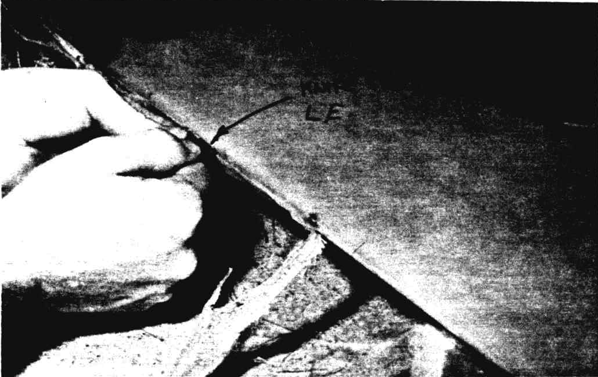

# CHAPTER 10

## ORIGINAL CANARD CONSTRUCTION

 Figure 10-1: Canard

**Overview** - This chapter involves construction of the canard wing, including the lift tabs that will attach to the fuselage, but not including the elevator attachment brackets.

The instructions in this chapter construct the original (CU) canard. Before it closed RAF published an alternative canard and elevator design referred to as the Roncz Canard. The reason for this alternative is the reduced lift the CU Canard produces when encountering rain. The Roncz canard does not experience the lift reduction.
The Roncz canard and its associated elevator instructions are included in Chapter 30 of these instructions.

 Figure 10-2: Canard Plan view

The canard consists of four foam cores: two outboard and two inboard.
The inboard cores have a tapered trough for the spar cap. The trough is about 1/4" deep in the centerline of canard and about 1/16" deep at the mid span to accommodate an efficient tapered thickness spar cap.
A vertical shear web is installed after slicing the inboard cores at the leading edge of the trough.
The shear web is strengthened locally where the lift tabs are installed.
It is important to build the canard without twist, so the cores are set up in a jig and the incidence is checked before installing the skin.
The tapered bottom spar cap and bottom skin can be installed in one layup, or you can peel ply the spar cap and layup the skin after the spar cap has cured.
The canard is turned over and twist is rechecked.
After installing 1" blocks of high density foam where the elevator brackets will be later attached, the top spar cap and top skin are installed.
The bottom skin is 3 ply: 2 UND and 1 BID.
The top skin is 4 ply: 3 UND and 1 BID.

 Figure 10-3: Section AA and BB

### STEP 1 -

This step should take about 2 hours.
You will need an assistant for the hot wire cuts.
Make the four hot wire cutting templates shown on page A-2, by gluing them to a 1/16" thick piece of plywood, and triming to the edges.
Since these templates must be used on both ends of the foam blocks, transfer the numbers and level lines to the other side of each template.

 Figure 10-4: Lift Tab

Note: your normal lamingating epoxy works well to glue paper tempaltes to the 1/16" plywood template material. Squeegee in place. Avoid water-based glue they shrink paper.

Place one {CP27 PC44 MEO} of your 7" x 14" x 64" foam blocks on your table, and using the straight trim templates, pages A-9 and A-10, cut them up as shown in the sketch.

 Figure 10-5: Cutting Canard foam block 1

This will give you 2 foam blocks 3.4" x 9.3" x 50.5", from which you will cut the canard inboard cores.
The 1.9" x 4.7" x 64" pieces must be saved to make your elevators, see Chapter 11.
The tapered foam block 5.1" x 14" x 64" must be saved to cut the center trailing edge cores for the wings, see Chapter 19, step 2.

Now cut up two 7" x 14" x 41" foam blocks per sketch, which will give you the foam to hot wire cut the canard outboard cores, and leave you with two 4.3" x 14" x 41" blocks that must be saved for making your winglets, see chapter 20 {CP27 PC51 MEO}.

 Figure 10-6: Cutting Canard foam block 2

Refer to chapter 3 before hotwire cutting your inboard and outboard canard cores.

Use your straight trim templates to hot wire cut the inboard cores into two pieces at the forward edge of the spar trough as shown.

 Figure 10-7: Separating Inboard core fore and aft

Use a coping saw or a knife to round the tips of the outboard cores as shown.

 Figure 10-8: Shape outboard core ends

You should now have six foam pieces as shown.

 Figure 10-9:Overview of cut foam cores

Do not reject a core due to minor imperfections caused by lifting or stopping the hotwire - these can be sanded level or filled during the skinning step.
A warped core can be held straight in the jig for glassing.

### STEP 2 -

This step should take 4 hours.
Make two aluminum inserts as shown.

 Figure 10-10: Aluminum inserts

Bondo a pair of 8-ft 2x4's to your table as shown.

 Figure 10-11: 2x4 frame

The 2x4's don't have to be perfectly straight nor very accurately aligned.

Grab the two aft inboard foam cores and mark a ~~centerline~~ WL 19.4 line {CP25 PC16 MEO} on the shear web face (WL 19.4). Sand a 1/8" radius on the corners shown.
Push large nails into these foam cores behind the spar trough spaced about a foot apart.

 Figure 10-12: Prep inboard aft core for bonding

Rest the nails as shown on the 2x4's with the cores' trailing edges down.

 Figure 10-13: Inboard foam cores preped for bonding

Butt the center foam faces of the two cores together and check the alignment by holding a tight string or straightedge spanwise and lining up the foam ~~centerlines~~ WL19.4 lines {CP25 PC16 MEO} to a straight line.

With the two blocks roughly aligned, which may require shimming or relocating some nails, bondo the nails of one core to the 2x4's.
A small dab of Bondo where each nail touches a 2x4 is enough to securely position the core.

 Figure 10-14: Bond cores

 Figure 10-15: Clean up spar cap

Now, carefully check that the shear web center­lines of the two foam cores are aligned without any dihedral or sweep using the string.
With the string held tight along the trailing edge, check that the two foam cores aren't twisted different ways.
Shim the nails as required to obtain good alignment (eyeball straight).

Slip the loose foam core back enough to spread dry micro on the joining foam surfaces, then push the loose foam core back into position.
Double check alignment and then bondo the remaining nails and shims to the 2x4's.
Clean the excess micro from around the foam joint.
The cores are now jigged straight and secure for installation of the shear web.

Recess foam as shown for the aluminum in­serts.

 Figure 10-16: Lift tab placement

This can be done with the Dremel or with a razor knife.
Do not glue the inserts in with dry micro yet – this is done when you are ready to glass the shear web to provide a 'wet bond' with the micro and glass.

Refer to the adjacent drawing and make two lift tabs out of 1/8" thick 2024T3 aluminum.

 Figure 10-17: Lift tab layout

Stack the lift tab, the aluminum insert (1.2 x 3 x 1/8) and a strip of scrap metal (up to 1/8" thick) together and clamp in a vice.
Drill the three holes through all three pieces.

 Figure 10-18: Lift tab placement

Mount 3 K1000-4 nut plates on the **aft** side of the aluminum inserts as shown in Figure 10-10.
Bolt the strips to the inserts.
Bond the inserts into the face of the shear web with dry micro.
The metal strips extend to boards Bondo'd to the table.
After cure, remove the bolts and strip.
Fill the holes with silicone to keep the epoxy out of the nut plate threads.

The shear web layup extends accross the shear web and down the spar cap faces, top and bottom, full span on the inboard foam cores.
Cut 12 pieces of 10" wide 45° UND, as shown.

 Figure 10-19: Glass for spar cap

Roll them up to prevent distortion (elongation of long dimension).
Cut one piece of BID at 45° 10" x 40".
Cut one piece of BID at 45° 10" x 20".
Cut two plies BID at 45° 4" x 8".
Cut 18 plies of BID at 45° 1.5" x 4".
Radius the foam edges, full span about 0.2 radius to allow a smooth layup around the corner.
Be sure all foam faces flow smoothly over all joints, without joggles.

Mix a small amount of micro slurry and squeegee a light coat over the shear web and spar cap faces.
Don't let a lot of micro or epoxy slop over the trailing edge foam.
Layup the first ply full span diagonally accross the shear web face at 45°.

 Figure 10-20: Glass canard spar cap

Wet out onto the three faces then trim edges just **short** of the joggle.
It's better to be 1/4" short of the joggle, than to lap or bunch up against it.
Do not allow a build up here.
Splice where necessary, butt, do **not** overlap the UND at the splices.
The second ply is the same, except **crossed** diagonally the **other** direction, also full span.
Check the approximate 45° fiber orientation of the shear web **and** spar cap faces.
Squeegee all plies well, from center along the fiber direction, out toward the joggle.
Do not leave excess epoxy or overlaps that buildup this area incorrectly.
The thickness of this layup must be correct.

The third and forth plies are similar, except they do not extend full span.
They are crossed and extend from B.L. 30L to B.L. 30R.
The fifth ply is one ply of BID at 45° extending from B.L. 20L to B.L. 20R.
The sixth ply is one ply of BID at 45° extending from B.L. 10L to B.L. 10R.

Now layup 9 plies of the 1.5" x 4" BID, centered over each aluminum insert.

 Figure 10-21: Setup lift tabs

Apply a little dry micro in the corner at the edges of the 9 plies to allow a smooth void free layup of one ply of BID 4" x 8" over the stack of plies as shown.
This thick glass pad will later provide the bearing strength for the lift tab bolts.
Check for voids or excess epoxy and then peel ply the spar cap area (top and bottom).
Allow everything to cure.
Knife trim any glass overhanging at the ends.

After the shear web layup has cured, reinstall the metal strips to use as a drill guide to accurately drill the fiberglass pad.
Do use a stop on your drill to be sure you do not drill into the nut plates.
Use a 1/4" drill.

Sand the lift tabs dull with 220 grit sandpaper, coat the tabs and the pad surface with wet flox, and install the lift tabs using AN4-7A bolts with AN960-416 washers.
See ~~page 10-11~~ Figure 10-52 section C-C.

### STEP 3

Refer to page A12 and make 6 \'A\' jig blocks, only one is shown.

Position the 6 \'A\' jig blocks as shown on your table.

 Figure 10-22: Canard Jib block layout

Use a string, straightedge or your eyeball and a level to line them up in a straight line on an even plane and level with each other.
Shim the blocks as required to correct for an uneven table.
Once they are lined up, glue them to the table with dabs of Bondo.

Now, grab your inboard leading edge foam cores and notch them to clear the lift tabs, pads and bolt heads.

 Figure 10-23:
Inboard leading edge foam notched to clear lift tabs

Now, trial fit the canard to the jig blocks.

 Figure 10-24: Location for Jib blocks

All six cores should be set on the blocks upside down as shown.
Shim under the spar cap as required to position the correct spar cap depth top and bottom.
Use 3" long nails to hold the cores in position.
Check for a straight leading edge and use the incidence block C and a level for twist - the canard should have no twist - shim as required.

Glue the inboard aft cores (the assembly with the shear web) to the jig blocks with several dabs of 5-minute epoxy (Bondo dissolves styrofoam) after marking their position, remove the outbard cores and the inboard leading edge cores from the jig.
Mix up some dry micro  – coat the area where the outboard cores touch the inboard aft cores and set the outboard cores back in the jig  – holding in place with weights and nails.
Coat the inboard leading edge cores as shown in "Core Assembly" below and install them in the jig holding in place with nails.

 Figure 10-25: Bond leading edge to trailing edge foam

Recheck for straight leading edge, trailing edge, and incidence, then secure all cores to the jig blocks with dabs of 5 minute epoxy.

 Figure 10-26: Ensure canard foam is level on Jib blocks

Minor mismatch at the joints are not critical; these can be faired in with a sanding block before glassing skin.

 Figure 10-27: Smooth foam glue up edges

Incidence is important though, be sure the canard is not twisted.
Remove all excess squeeze-out micro.
It is **not** important to fill all incomplete squeeze-out between cores at this time – any voids should be filled later, when you skin the surface.
Allow the assembly to cure in the jig.

Now cut the following glass pieces.
A single piece of UND 101" long, tapering at both ends to 28" as shown below, will be used to layup your bottom spar cap.
Two pieces of UND 12" x 152" will be used for the first and third plies.
Three pieces of BID cut at 45° to the selvage edge, 13" wide make up the second skin ply.

 Figure 10-28: Cut glass for spar cap

### STEP 4 -- \"FLAGGING\" THE SPAR CAP

Stop now, unless you and your helper can work the next two hours straight through.
Visit the bathroom at this time.
Epoxy should be mixed in 5 to 6 ounce batches as required during the layup.
A plastic squeegee cut to 3" length is handy for the spar cap.
Don't start without a **sharp** razor blade.

Apply a brush coat of epoxy to the spar cap trough.
Lay the long edge of the spar cap ply straight along the forward edge of the spar trough.

 Figure 10-29: Wet out spar caps first layer

Wet out the cloth over the trough,

Fold the ply over and wet out the cloth over the trough again.

 Figure 10-30: Fold UND for spar cap

Now, use a new, sharp single-edge razor blade to slice the fine cross fibers at the fold so that the cloth lays flat.

 Figure 10-31: Flatten cloth at fold

Don't gouge the blade in deep – a light pass right at the surface is all that's required.
Keep folding, wetting, squee­geeing and slicing until the spar cap is eleven (11) plies thick at the center.

 Figure 10-32: Folding UND Spar cap

Trim any excess and discard.

Make sure that you keep the major unidirectional fiber bundles straight.
Do this by pulling the cloth from the ends and using the squeegee only in strokes **from the center outward**.

 Figure 10-33: Keeping UND straight

You can now peel ply the spar cap, and allow this layup to cure, or you can continue with the layup of the three ply skin.

Mix dry micro and fill any gaps at the forward or aft edges of the notch so that no large voids are trapped under the skin.

 Figure 10-34: Repair foam prior to glass

Avoid micro on the spar cap itself, fill any bad dings or nail holes in your foam core with dry micro.

Mix a micro slurry and spread a **thin** coat over the foam core.
Wipe off runs that collect on the upper surface.

 Figure 10-35: Peel ply edges

Wet the spar cap with plain epoxy, not slurry.

Drape the 1st skin ply (UND) over the full length.
Let the cloth overhang the leading and trailing edges.

 Photo 10-36: Apply smoothed glass

 Photo 10-37: Draping glass to make canard skin

Slice the cloth locally for the CLT lift tabs.
Pull from both ends to straighten the fibers and remove wrinkles.

 Figure 10-38: Keep skin ply's straight and wrinkle free

Wet out the skin using a 2" brush and a squeegee.
Scissor trim the trailing edge and wing tips to about 1/4" overhang.

 Figure 10-39: Knife trim trailing edge and wing tip

The BID ply (2nd skin ply) is next. First use the scissors to trim off the selvage from each end of the BID pieces - otherwise the selvage will cause a bump in the top skin ply.

 Figure 10-40: Keep glass flat by trimming cross threads

Drape the pieces as shown.

 Figure 41: Canard BID layer layout

Wet out each piece before laying on the next.
Each piece should lay down without wrinkles.
The 3rd skin ply (UND) is laminated exactly like {the first ply remember to stipple up} as much epoxy up from the preceeding plies as possible before adding more.
After the last ply is wet out, go over the canard and double check for air bubbles.
Peel-ply from L.E. back 2".

 Figure 10-42: Peel ply trailing edge

 Figure 10-43: Micro areas for support

In three to four hours, go back and knife trim the leading edge as shown.
The wing tips are trimmed similar to the leading edge.

 Photo 10-44: Squeegee glass down smooth

 Photo 10-45: Knife trim lower glass on leading edge

### STEP 5 - INSTALLING THE UPPER SPAR CAP AND SKIN

This step will take 4 hours and two people.
Here again, a third person to mix epoxy and pour coffee is nice but not required.
Remove peel ply from the leading edge.
Using a sanding block, taper the initial 1/2 inch of skin as shown in the sketch.

Round up some 1" x 2" lumber and refer to the next sketch.
What you're doing here is stiffening and holding the trailing edge straight until the top skin is installed.
You are also installing a very simple jig to hold the canard level and straight while the upper skin is installed.
Let the Bondo harden and then remove the canard from the jig.
Clean your work table off and set the canard right side up with the leading edge extend­ing over the edge, to simplify the leading edge overlap.

 Figure 10-46: Flip canard and prepare edges

Carve the trailing edge foam block off as shown and remove peel ply to provide a direct bond with the last 1/2" of the skin (see section A-A, ~~page 10-11~~ Figure 10-52).

Use the upper surface incidence block to recheck the incidence at several places and shim as required.
Check dihedral and shim the boards as required.
When you're assured the canard is not twisted, bondo the shims and boards to the table.
The canard will now stay straight and secure while the skin is installed.
Remove the peel ply from the top spar cap.

Before glassing the top skin, install 1" wide blocks of high density foam at the positions you will later install the hinge brackets.
These provide the support required for the brackets.
Dig the foam out of the areas shown with a knife or drill bit in a hand drill.

 Figure 10-47: Insert high density foam for elevator hinge

Carve the high density blocks to fit and install with wet micro.

The digging doesn't have to be accurate or smooth, any roughness or oversized gouges will be filled with micro.
If the blocks are installed immediately before the top akin, no sanding will be needed, just level the surface with dry micro and glass over.

The glass cloth for the spar cap and top skin is cut as follows:

 Figure 10-48: Cutting upper spar cap and top skin glass

Don't start the next operation unless you and your assistant can stick with it for two hours.

You are ready to glass the top spar and top skins.
This operation is done exactly like step 4 with two exceptions:

1. The top cap is thicker, requiring more folds un­til there are 17 thicknesses in the center, rather than eleven. This requires two piec­es of UND.

2. An extra skin ply of UND goes over the top.

Everything else is the same.

A careful scissor trim is made along the leading edge so that the four top skin plies overlap the bottom skin 2 inches.
The overlap will be faired in by sanding after it is fully cured.

 Figure 10-49: Stipple the top to bottom skin

 Figure 10-50: Lap the leading edge top over the bottom

Be sure to use micro slurry on the bare foam and plain epoxy on the leading and trailing edges before the first skin ply.

The trailing edge is knife trimmed even with the bottom skin edge.

 Figure 10-51: Finishing Canard trailing edge

Your treatment of the wing tips isn't critical.
All foam surfaces should have at least two plies of glass for surface durability, but there isn't any further strength requirement at the wing tip.

 Figure 10-52: Full size sections