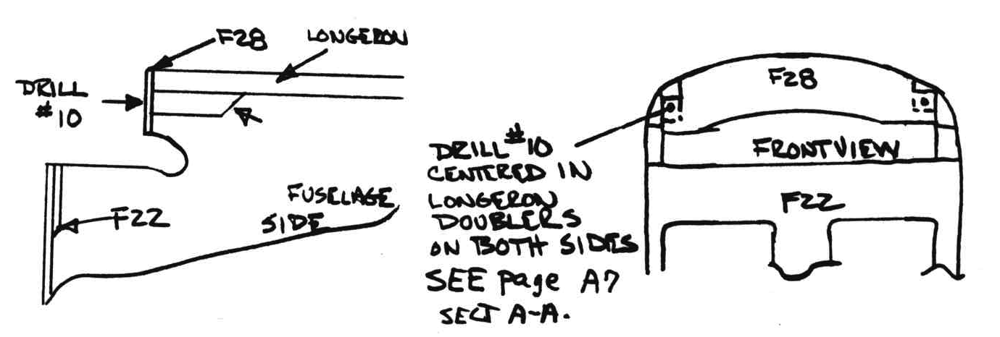
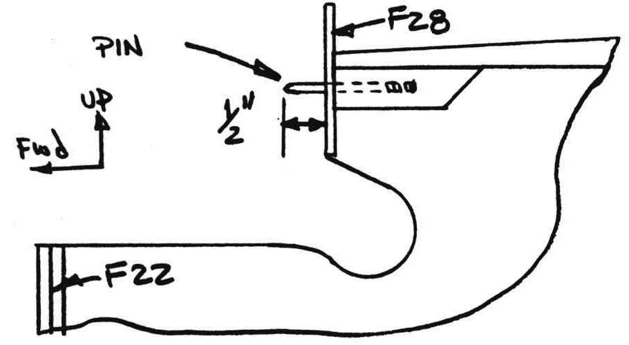
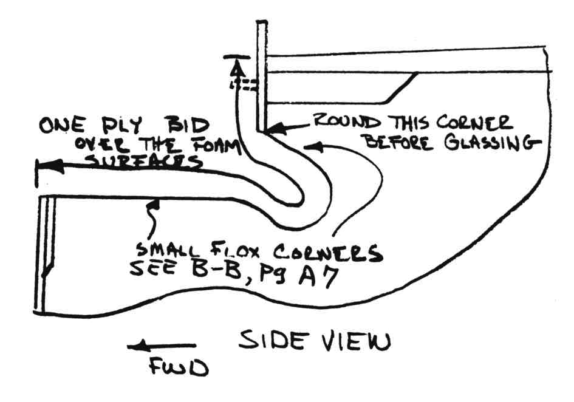

# CHAPTER 12

## CANARD INSTALLATION

 Figure 12-1: Context view

**OVERVIEW** – In this chapter you will align and temporarily install the canard on the fuselage.
The canard is aligned for zero sweep, zero dihedral, and zero incidence.
Alignment pins are installed in the F28 bulkhead and alignment tabs installed on the canard to match.
The canard tabs (aluminum tabs installed on the card in chapter ) are drilled in place and nut plates are installed to facilitate removal in service.
The following prefab parts used in this chapter are available from a distributor: CN1 canard attach bushing (2 required) and CN2 3/16" ID flanged bushing (2 required).

### STEP 1 – INSTALLING THE ALIGNMENT PINS

This should only take 1/2 hour.
Cut the heads off of two AN3-20 or -20A bolts and sand or file a round nose on the un­threaded ends.

 Figure 12-2: Make Canard Pins

Drill two holes in the F28 bulkhead and wood doublers as shown about 1 1/2 inches deep.

 Figure 12-12-3: Drill canard pin in F28

Check that the pins will slip into the holes and stick out only about 1/2".
Do not bond the pins in yet.

 Figure 12-4: Check Canard Pins

### STEP 2 – ALIGNING THE CANARD

This step may crowd your shop slightly, but only takes about an hour, and you need an assistant occasionally to help measure things.

Get your canard out of storage and position it (without elevators) on the fuselage as shown on page A-7 .

 Figure 12-5: Align Canard

Use a pair of "C" clamps to hold the lift tabs against the bulkhead (be careful not to bend or scratch them).
Check for zero sweep­back by measuring from the canard tips to the wing fittings as shown. Both should measure the same. Use shims between the canard lift tabs and the forward bulkhead to adjust the sweep if necessary.

Next, level across the top fuselage longerons and the canard spar cap.

 Figure 12-6: Level the Canard

Lastly (and most important), use your canard incidence blocks to accurately set the inci­dence at zero with the top longerons.
The patterns for the incidence block is found on page A-13.
If your canard has a slight twist, set the **average** incidence equal to the longerons. Recheck sweep, dihedral, and incidence and clamp firmly in position. Use the #10 pilot holes in the canard tabs and drill #10 through the F22 bulkhead. Go cut two tabs of high density foam (dark red) as shown.

Trim the tabs so that they fit against the top of the canard and against a 1/16" shim on the bulkhead with the pin in the hole as shown.
With everything trimmed to fit 5MIN the tabs to the canard. When hard, carefully remove the canard without knocking the tabs loose.

1. Measure the thickness of any shim that was used to correct the sweep of the canard (any shim between F22 and the lift tabs).

 Figure 12-7: Prep lift tab

2. Remove the shim and dull the forward surface of the F22 bulkhead where the lift tabs rest, and lay up additional BID pads to the thickness of the shim (BID is about 0.013"/ply).
3. After cure, back drill #10 through the bulkhead and new glass. Thus, you have replaced the shim with additional glass pad. The tabs on the canard are glassed as shown. 
4. Reopen the #10 holes with a drill (you can see the hole through the glass layup). Drill these holes out to accomodate a 3/16" CN2 I.D. flanged bushing (available from a distributor). 5MIN the bushings in position.
5. Reinstall the canard using AN3 (3/16" dia) bolts to locate the aluminum lift tabs.
6. Recheck your sweep and incidence.

Now, mount the elevators on the canard, trimming their inboard length to obtain about 1/16" clearance with the fuselage sides.

 Figure 12-8: Elevator clearance

Check that adequate clearance (0.1") exists around the elevator tubes (at the fiselage sides) when the elevators are moved through their full travel of 20º trailing edge up and 22ª trailing edge down.
The elevator angle template pattern is found on page 11-6.

 Figure 12-9: Elevator clearance

Remove the AN3 bolts and drill the aluminum lift tabs and F22 bulkhead up to 1/4 inch dia.
Remove the canard.

Using your 5/8 counterbore tool, drill the two 1/4" holes in the F22 bulkhead up to 5/8" for 5/8" O.D. x 1/4" I.D. aluminum bushings.
These are CN1 canard attach bushings available from a distributor.
They are supplied long, so you can trim to the exavt thickness of your bulkhead.

 Figure 12-10: CNL Bushing

Do not trim, not bond the bushings in yet because during chapter 13 you will be installing additional glass plies on the foreward face of F22 to tie it into the nose sides.
This will move your canard forward from where it now sits.

Now, remove the 3/16" pins from the F28 bulkhead and apply one ply BID to the entire area shown, using 1/4" flox corners at the edges of the bare foam.
When cured, drill out the #10 holes and permanently install the 3/16" alignment pins with wet flox.

 Figure 12-11: Prep lift tab

Note hardware shown on A7 to mount lift tabs to bulkhead.
These are permanently installed during chapter 13.

Note: If you are installing a VariEze canard on your Long-EZ, ignore its waterline.
The Long-EZ has 0.6 degree more canard incidence. Using the B and C incidence templates on page A13 will assure correct incidence of either canard.
