# CHAPTER 13

## NOSE AND NOSE GEAR

**Overview**
In this chapter, you will assemble a box consisting of two slabs of glass/foam/glass sandwich
and nose gear hardware (worm drive system).
The nose gear strut is mounted in this box, then the assembly and the nose bulkhead are installed on the fuselage.
The nose floor foam pieces and side pieces are installed and glassed inside.
The nose wheel and pivot assembly is then installed.
The pitot-static plumbing and rudder pedals are installed.
The top foam piece is then installed.
The outside is carved to shape and then glassed.
A door is laid up onto the top of the nose.
The top piece is then removed to fabricate the door flanges.
The SC strut cover and NB nose gear box is also installed.

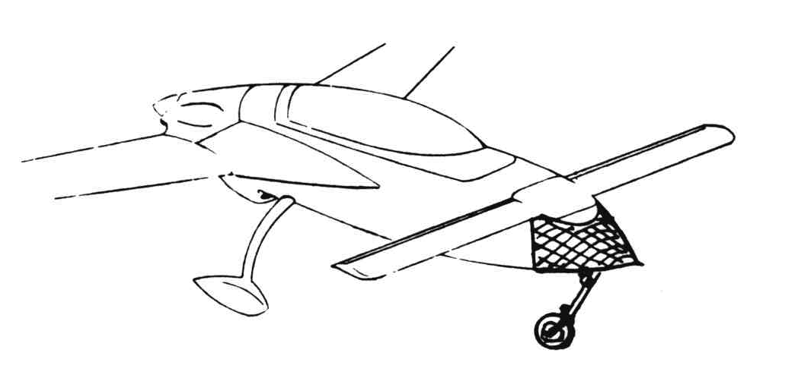 Figure 13-1: LongEz Nose

The following prefab parts used in this chapter are available from distributor: NG1-L fiberglass strut, SC fiberglass nose gear strut cover, NB fiberglass box, three castings - NG-6, NG15A, and NG16 (the castings are available in either the as-cast state, or machined in ready-to-install condition), NG14 spacers (2 required),NGlOA push rod,t-tE,.J ,N6"1 ,'>£.C! NG23 bushings (2 required), NG22 bushings (2 required),Nbl7 1 tube, NG21 ring, CS13 spacers (4 required) all worm-drive/crank components, NGB, and two rudder pedals.
The entire lower assembly from NG15A casting down, including friction damper, axle, wheel, tire, etc. (ready to bolt to the strut), is also available as well as the entireassembled worm drive assembly.
The NG10A pushrod with two NG9's pressed in is available as an assembly.

**Note: For rough or grass fields and to relieve stress on nosegear components, install the spring assembly (Figure 13-46) in place of the NG 9/10A rod. The absorber is available as an assembly. {CP25 PC 27 DES}**

 Figure 13-46: Nose gear shock absorber and spring

Caution: Do not use the NG1 fiberglass strut manufactured for VariEze aircraft.
It is 1" too short and only about 2/3 the strength of NGl-L

STEP 1 - Fabricating the metal parts and BID reinforcement on strut

The majority of work in this step can be eliminated 
by purchasing the prefabricated parts. 
Refer to the accompanying drawings and build/buy the following components: The worm drive system (see drawings and parts lists).

 Figure 13-2: Nose gear overview

- NG4 and NG3 brackets - see drawings
- NGB plates - see drawings
- NG6/NG23/NG7/NG5 - This is the upper attachment for the nose gear strut - see drawing.
- Lower pivot/ fork/friction damper/axle/wheel assembly - see drawing (this assembly can be purchased complete, without door). The friction damper should be tightened enough so that the wheel will pivot when a side load of about 5 pounds is applied at the axle.
- Rudder pedals - Refer to the drawing - be sure to make one left and one right.

**Operation of Worm-drive Nosegear**
The sketches show the operation of the system.
The NG50 arms travel 156º, striking the NG14 spacers at each end of travel.
It is over-center in the down position, thus, landing loads are not applied to the worm gear.
The pilot's crank uses 10.8 turns for full travel, taking five to seven seconds.

You can extend the gear at 140 mph, however, the crank is hard to turn above 130.
When we first installed this system, we used it to lower the nose with the pilot in the airplane.
This was successfull until one time when the crank slipped, turned fast, then caught.
The inertial loads failed the cast iron worm gear.
It is possible that "cranking down" on the ground would be acceptable with the steel gear shown, but this is not recommended.

Check the assembly for freedom from binding before installation.
It does not (nor should not) spin freely, just be sure it does not bind up enough to make the crank hard to turn.
If it binds, loosen the NG57 blocks and shim as required.
The NG53 and NG58 gears must be accurately positioned to avoid binding.
Use a gear lubricant on NG53 and NG60.
Note that four AN960-816 washers are used to position NG58.
One at the roll pin end and three at the other end.

Round the edges of your fiberglass NG-1L strut and layup 1 ply BID at **45º** orientation on three sides as shown (full length of strut).
After cure, glass 1 ply BID from the other side as shown.
This provides split protection of the strut.
 Figure 13-3: Nose gear strut reinforcement

 Figure 13-4: NGG assembly

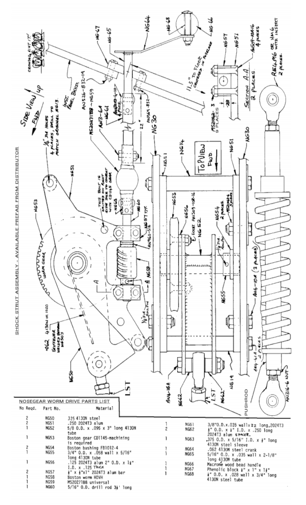 Figure 13-5: Overivew Retract assembly

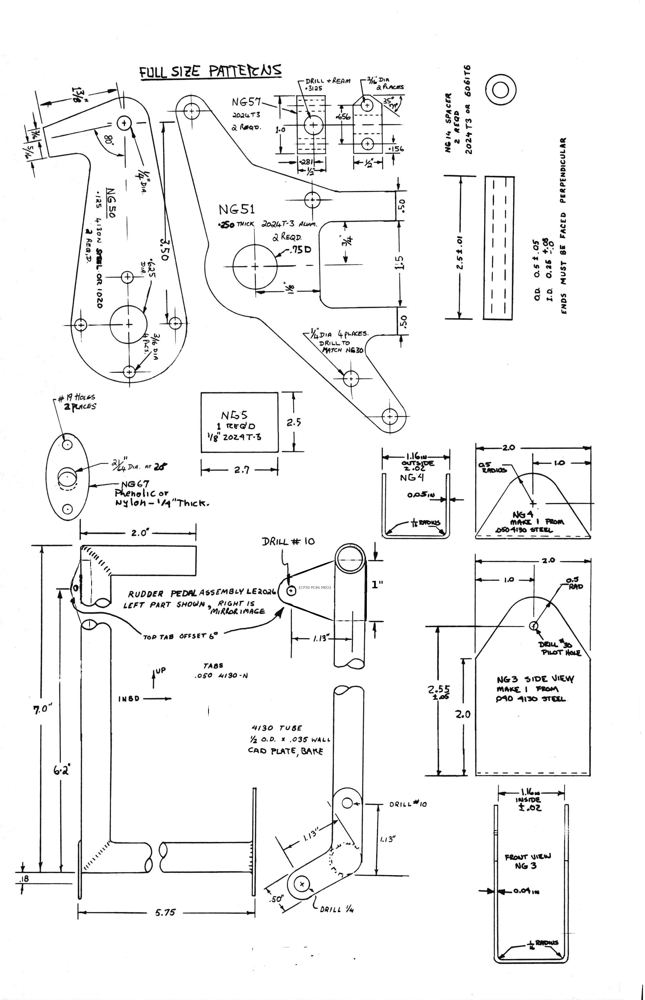 Figure 13-6: Rudder pedals

 Figure 13-7: Nose Gear attachment to strut (__Not to scale__)

### STEP 2 - FABRICATION AND ASSEMBLY OF THE HIGH DENSITY FOAM PLATES (NG30)

This step should take about four hours, not counting cure.

Use the full-size drawing on page A6 and A7 as a pattern to cut out the outline of the plates and to accurately mark five holes (one at the NG13 guide).
Follow the double tick marks on the full-size drawing to obtain the correct outline of NG30.

 Figure 13-8: NG 30 foam drill locations

Lay the NG30 pieces on your table with the **inside** surfaces up and lay up four plies BID (fiber orientation optional).
Knife trim around all edges.
When cured, place both NG30 plates together and drill pilot holes at the five locations previously identified.
Lay the plates on the table with the fiberglass sides down.

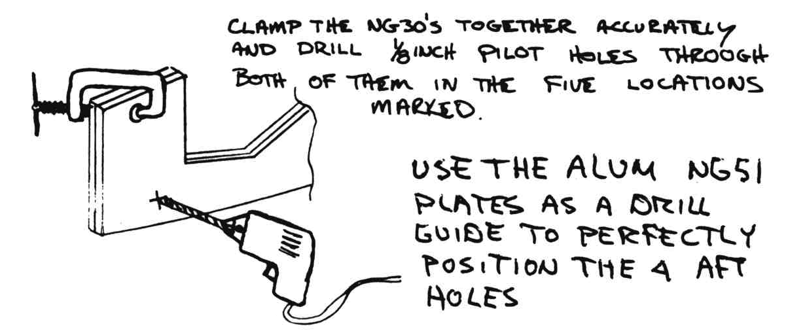 Figure 13-9: Drill NG 30

Remove all foam down to the fiberglass and round the edges in the areas shown.

 Figure 13-10: Glass NG 30 outside

A knife, dremel and coarse sandpaper are required.
Cut the BID pads shown; lay up into the depressions and lay up a 4-ply skin over the entire surface (outboard surface of NG30).
Clamp or weight a block on the pad areas to remove excess epoxy and force the pads to correct thickness (approximately 5 lb weight per pad).

After cure, open the front pivot hole to 5/16" and the other four holes to 1/4" – use very light drill pressure and a hard wood block as drill backup, and using NG-51 as a drill guide.

Now, round up the following parts and hardware: NG30 plates, NG6 casting with NG23 bushings and NG7 spacer, NG8 discs, AN5-41A bolt, two AN970-5 wide area washers, AN365-524 nut, eight AN509-10R14 screws, eight AN960-10 washers, eight MS21042-3 nuts, two NG51 plates, two NG14 spacers, two AN4-41A bolts, three AN4-10A bolts, eight AN970-4 wide area washers, six MS21042-4 nuts.
Bolt everything together as shown, applying wet flox on NG8 where it mates the fiberglass. 

Check that the assembly is square all around.

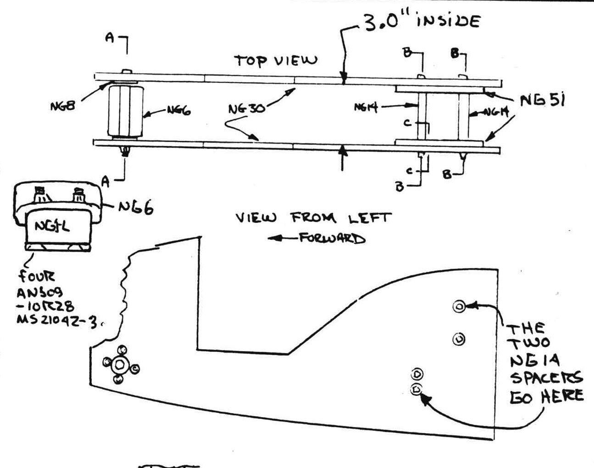 Figure 13-11: Nose Gear Box assembly

Now, bolt the NG1 fiberglass strut and NG5 plate to NG6 with four AN509-10R28 screws.
The strut is installed wet with flox.
Check to be sure it is aligned straight (centered between NG3O plates when retracted).
Refer to the full­size drawing on page A6 for strut posi­tion.

 Figure 13-12: Nose Gear box bolts

Refer and to to the full-size drawing (page A6) the sketches for installation of the NG4 and NG3 brackets on the strut.
The brackets are manufactured to a loose fit on the strut, dry BID until NG3 fits snug (2 to 3 plies).
Remove NG3, sand the strut,  layup the BID wet and coat the inside of NG3 with wet flox.
Install NG4 and NG3.
Remove excess flox.
Clamp as shown until cured, then remove the
clamps, drill the hole up to 1/4" diameter and install the 1/4" bolt, spacer washers, and RE4M6 rod end.
Note that the spacer washers can be shifted from one-side of the rod end to the other, to correct for any strut misalignment (if the strut is a little off-center, the rod end can still be centered. 

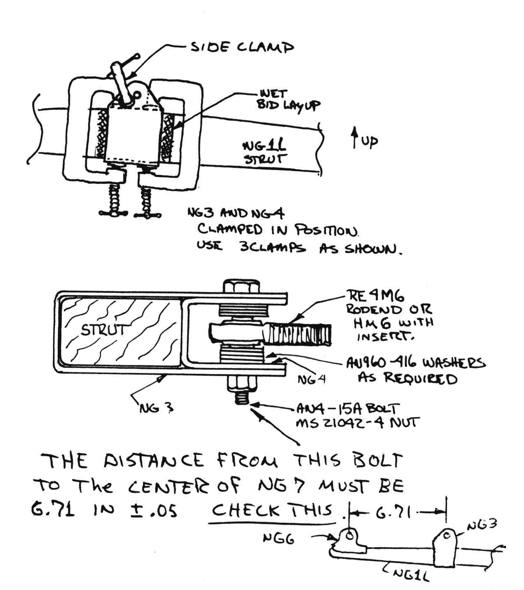 Figure 13-13: Mount NG3 and NG4 to strut

### STEP 3 - INSTALLATION OF ASSEMBLY ON THE FUSELAGE 

This step should take only an hour or two.
Cut out the NG3l disc and glass one face with one ply BID (use the full-size pat­tern shown).

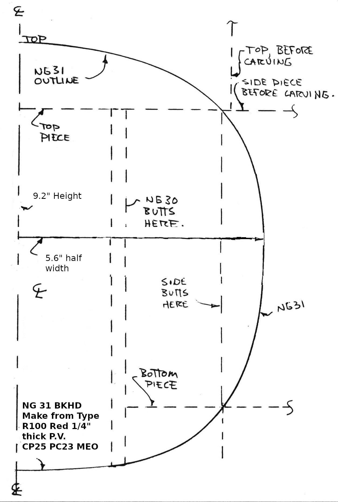 Figure 13-14: Confiugring NG 31 Bulkhead (__Not to scale, Actual: (CL to inside edge) 5.6" x High at CL 9.2"__)

While it's still wet, in­stall on the front of NG30 plates with flox and lay up glass tapes as shown.

This job is easier if the tapes are wet out on a piece of paper then lifted and stippled into place.
Mount the assembly to F22 with flox and BID tapes as shown.
It can be held in place during cure with nails  – drill a small hole for the nails to avoid splitting the foam.
Install F-6 as shown. 

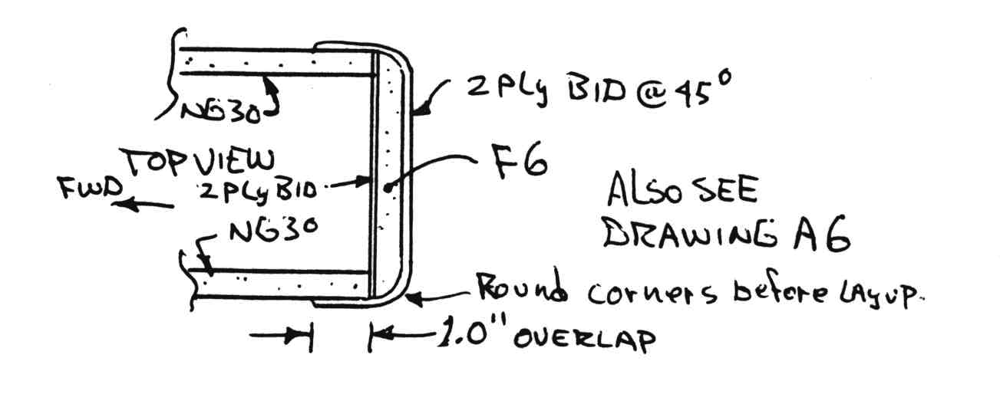 Figure 13-15: Mount F6 to NG 30

 Figure 13-16: F6 (__not to scale, Actual 3.2" x 6.7"__)

 Figure 13-17:Mount NG Box

 Figure 13-18: Top view NG box

### STEP 4 - NOSE FLOOR, SIDES, AND RUDDER PEDALS

This step involves about seven hours work.
Don't try to support the airplane on the nose gear now; it doesn't attain its strength and stiffness until step 8 is completed. 

Drill a #10 hole through the NG30 plates at the position shown for the rud­der pedal pivot bolt (see full-size drawing, page A7).
Round up your butch­er knife and some 2" thick green urethane foam and carve the floor blocks shown.
Note that they are dished out on their inboard edges to allow access to the screws at the nose gear pivot.
These blocks are **not** shown on the full-size drawing (page A6).

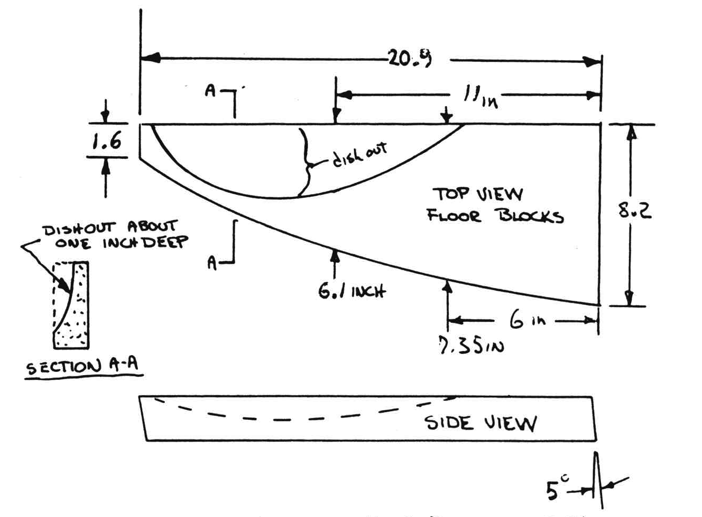 Figure 13-19: Floor block preparation

Now, carve the rudder pedal pivot foam blocks and mount the nut plates on the 0.063 aluminum pieces, using AN470AD3-3 rivets.

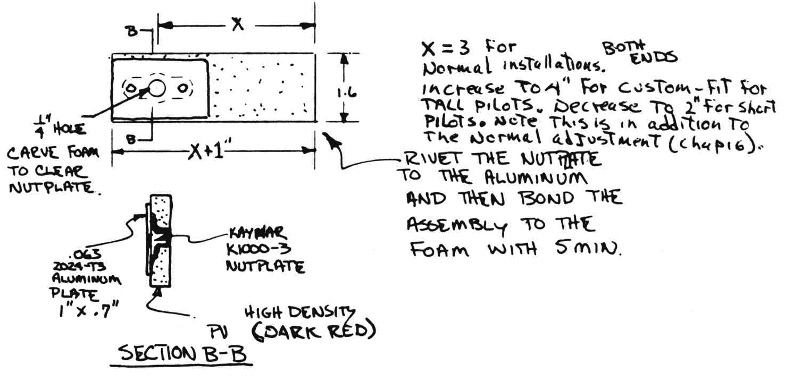 Figure 13-20: Rudder pedal nutplate

Screw an AN3 bolt into the plate to keep epoxy out of the threads, then 5MIN the plate and nutplate to the foam block as shown.
When cured, remove the bolt.

Fit the floor blocks to the fuselage, as shown.

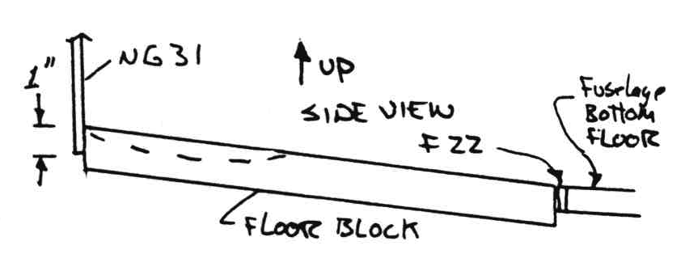 Figure 13-21: Position Floor block

Refer to the full-size pattern of NG31 bulkhead for placement at the front.
The top of the floor piece should be even with the floor, at the F22 bulkhead.
Install them with wet micro and glass with two plies BID, lapping 1" up onto NG30, NG31, and onto the floor aft of F22.
Lay up an additional ply on the aft 3" of the floor to protect it from damage from the pilot's heels.
Knife trim the glass along the outboard sides.
Refer to the sketch and to the full­size drawing on page A6/A7 to carve the side pieces from 2" thick green urethane foam.

 Figure 13-22: foam preparation

While the sketch provides a size reference, it is easier to take an over­size 2" thick block to your airplane and slice away, until the block fits in place. 
I once asked a sculpture how he carved a beautiful rock figure of an elephant. He said, "It's easy, you just take a block of granite and chip away everything that doesn't look like an elephant".
Again, the block doesn't have to fit perfectly; gaps can be filled with dry micro at assembly.
Hold the side piece into position while fitting the rudder pedal pivot blocks as shown.

 Figure 13-23: Fuselage side F22 to NG 31

The pivot block butts to the F22 bulkhead and should be mounted parallel to NG30 at a distance of 6.1" away as shown.

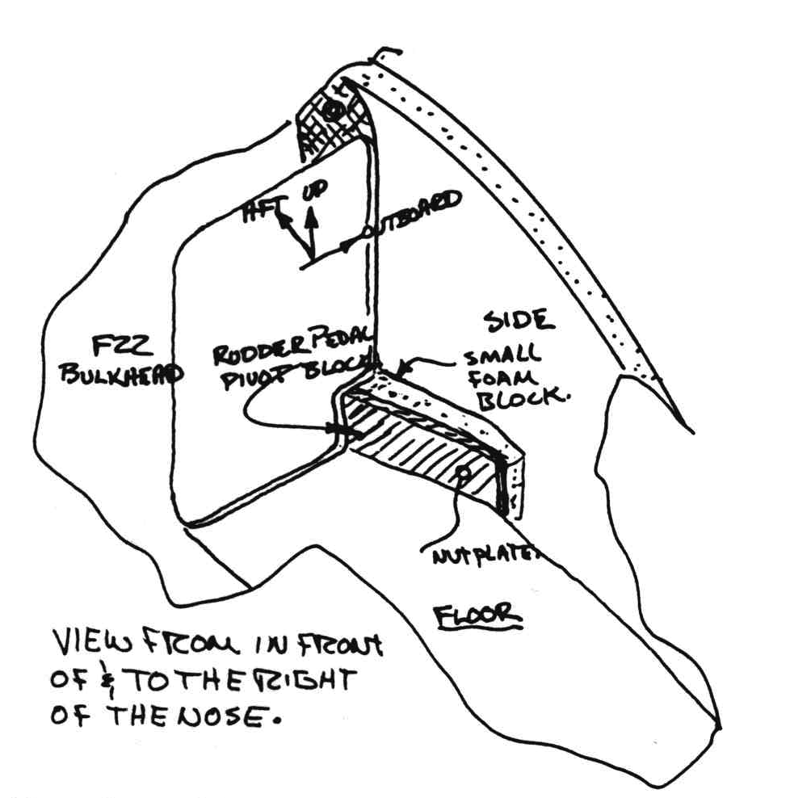 Figure 13-24: Rudder pedal Pivot block

Fill the gap between the pivot block and the side piece with a small foam block.
Remove the side pieces, glass the insides with two plies BID and mount with wet micro, lapping the glass edges down onto the floor, NG31 and the fuselage inside sudface at the back.
Mount the pivot blocks with wet micro and apply four plies BID over them as shown, being careful now to fill the holes with epoxy.

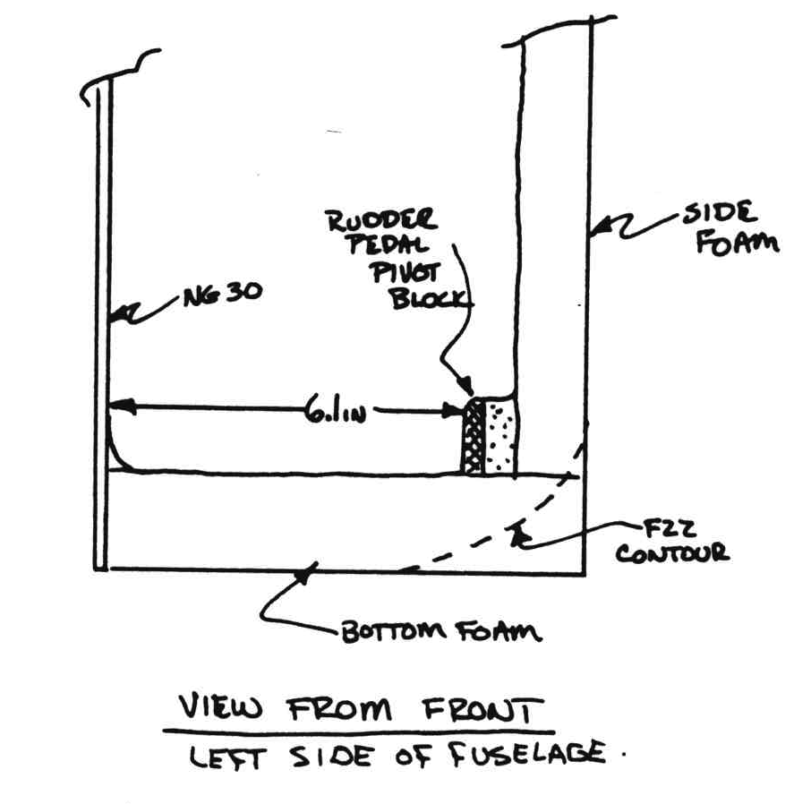 Figure 13-25: Rudder pedal pivot block

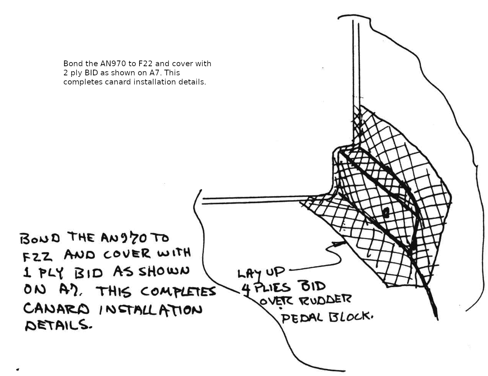 Figure 13-26: BID reinforce Rudder pivot

While the layup is still wet, apply three plies BID into the corner at the top of the F22 bulkhead, as additional reinforcement of the canard lift tab hole.
Knife trim along the top edge of the sides.

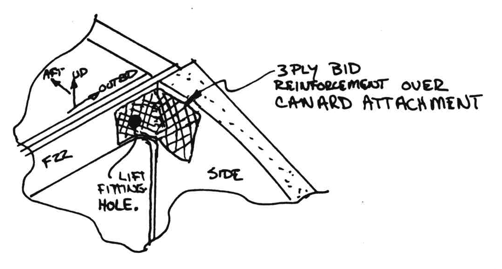 Figure 13-27: Reinforce canard attachment

After cure, open the canard lift tab holes to the 5/8" diameter.
Install the CNL spacer bushings wet with flox (the drawing on page A7 shows the CNL bushing as installed, trimmed flush with both sides of F22).
Open the holes in the ridder pedal pivot clocks and install the rudder pedals with the hardware shown.

 Figure 13-28: Rudder pedal instal

The CS13 spacers are clamped tight by the bolts.
The rudder pedal should pivot freely on the spacers.

Mount a small tab on the lower through-bolt as shown and hook a light spring to the rudder pedal tab as shown.

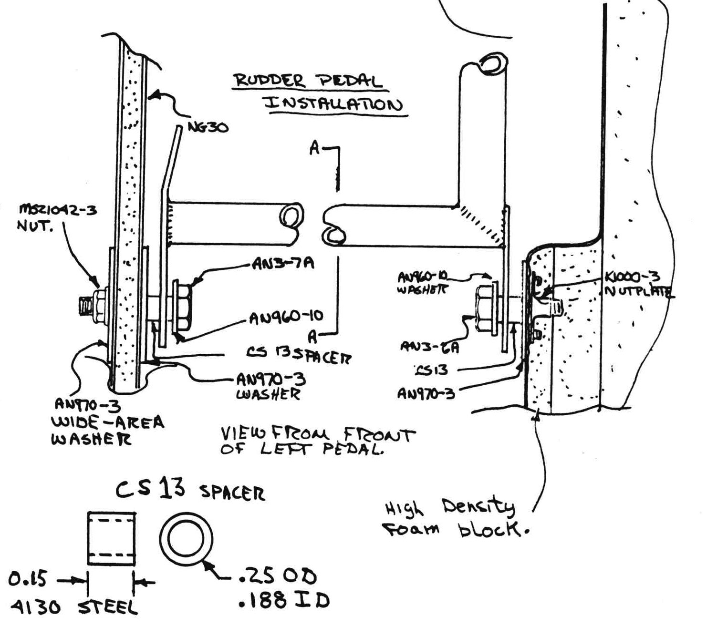 Figure 13-29: Rudder pedal return spring

This should not be a strong spring; it's only function is to keep the pedal from falling back under its own weight.

### STEP 5 - COMPLETION OF NOSE GEAR

This step involves mounting the lower nose gear assembly, fitting the strut to the bottom of the fuselage, fitting the nose gear box and strut cover, and rigging the retraction/extension system.
If all goes well, it should take you only about three hours.

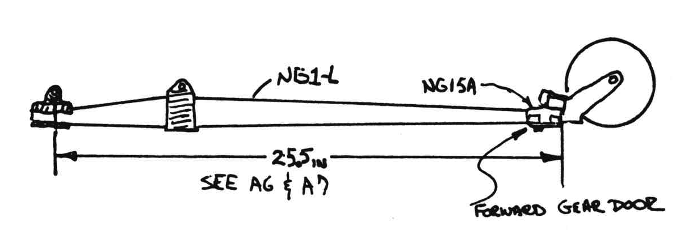 Figure 30: Nose Gear Assembly

Trim the end of the NG1L strut so that it nests into NG15A at the correct distance from the NG6 pivot block as shown.
See section A-A on page 13-4.

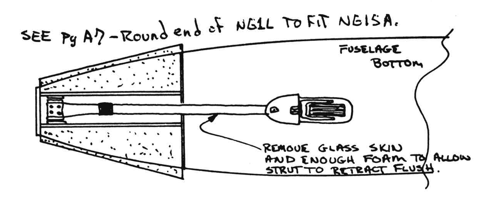 Figure 31: Strut fit adjustment

 Figure 13-32: Nose gear strut

Remove the assembly, sand the bonding surfaces and replace wet with flox.
The four AN525-10R24 screws also mount the forward gear door.
The aft gear door should not be mounted at this time.

Now, flip the fuselage upside down, take your dremel or razor saw and remove the bottom fuselage skin below the strut, from F22, aft to the nose wheel cutout.
Remove enough foam so that the strut will retract to the flush position shown on the full-size drawing (page A7).
The forward door should fit up against the skin; bend it, if necessary.

Now, find your SC. fiberglass strut cover.
This is a prefab part that seals the void between the nose gear forward pivot and F22.
Note the cutout in the top of SC.
This area needs to be removed (dremel or coping saw) to allow the NG10 push rod to pass through.
Fit in position as shown in the sketch and trim the outer edges as required.

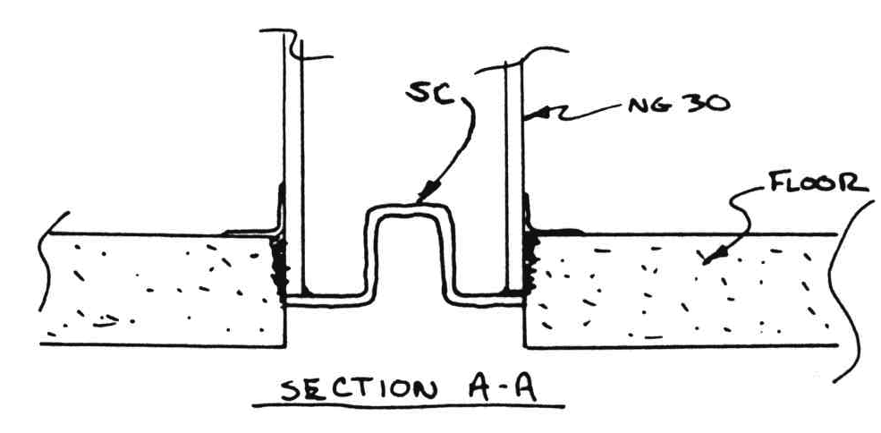 Figure 13-33: Nose gear Strut Cover

Check its fit to the strut.
Sand bonding surfaces and bond in place with wet flox.
Use two plies BID to glass over all bare foam in the wheel well/strut notch area aft of SC.
Use a small flox corner at the bottom skin edge.

After checking for sufficient clear­ance to the tire, mount the NB fiber­glass nose gear box (wet flox with 1-ply BID tape inside).
The flanges on NB should fit flush to the fuselage floor.
The aft face seals against the instru­ment panel bulkhead.
Carve a small scrap of plexiglass off the edge flange of your canopy and fit it to the opening in the instrument panel bulkhead.
This can be bonded in place with silicone.
This "window" allows the pilot to see the posi­tion of the nose gear.

Now, mount the aft nose gear door, using three AN525-10R10 screws (tap holes into the NG16 casting).
Note that the nose wheel well is not completely covered by doors.
The drag of the open hole can be reduced by rounding the aft edge of the hole.
This is done by installing a rounded foam block to the sharp edge as shown.

 Figure 13-34: Retracted Nose Gear

The rounded aft corner assures that any air flow through the wheel well comes out smooth and attached, rather than turbulent.
With the aft edge rounded, **the open hole causes less than 1/2-mph drag**.

#### Rigging the nose gear

Refer to page 13-2 for hardware used on the retraction mechanism.
Install the universal, NG61 torque tube and crank on the instrument panel.
Crank the mechanism to the fully retracted position.
This is when the NG50 arms stike the upper NG14 spacer.
Drill the #12 hole in the universal and NG61 for the AN3-6A bolt, with the crank in the best position to not block an instrument or hit the pilot's leg.

Hold the nose gear in the retracted position.
Then adjust one or both of the rod ends on the NG10A pushrod to fit between NG3 and NG50.
Then, shorten NG10A by one turn of a rod end.
This provides a good snub of the gear in the up position.
Extend the gear and check for the correct down position (see page 13-1) i.e. lower pivot vertical or canted bottom-forward up to 5°.
To install a gear-up warning, mount the micro switch so it is activated by NG50 or NG9 in its last 1/10 inch motion to the down stop. See chapter 22 for electrical wiring and switch mounting.

The gear is **not** intended to be used to raise or lower the gear on the ground with weight on the nose.
Refer to Owners Manual for normal operation of the nose gear.

Now, go to chapter 22 and install the gear-down microswitch for warning system.

### STEP 6 - PLUMBING THE PITOT AND STATIC SYSTEM 
If this step takes you more than about an hour, you must have bought this pro­ject from someone else!

Round up your soft aluminum (5052-0) 1/4"-dia tubing and cut one piece 6" long and one piece 38" long.
Refer to the full-size drawing on page A6, and drill a 1/4" hole in NG31 bulkhead.

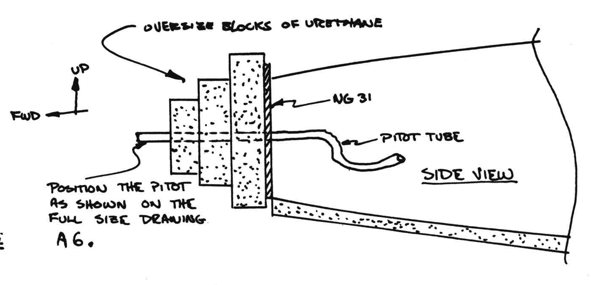 Figure 13-35: Nose Foam and pitot

Route the long piece of tubing aft, around the battery area and through a hole in F22, on CL about 3" under the canard.
Stack some over-size blocks of green urethane foam on over the pitot tube and bond to the NG31 bulkhead with dry micro or 5MIN.

Use epoxy only below the final contour to later simplify carving the shape.
These blocks will later be carved to shape when the entire nose is carved.
Insert a plug into the pitot tube to protect it from contamination.

The static port is located in the left fuselage side, 8" forward of the instrument panel and 10" below the top of the top longerons (W.L. 13). Mark that position on the **inside** of the fuselage side panel.

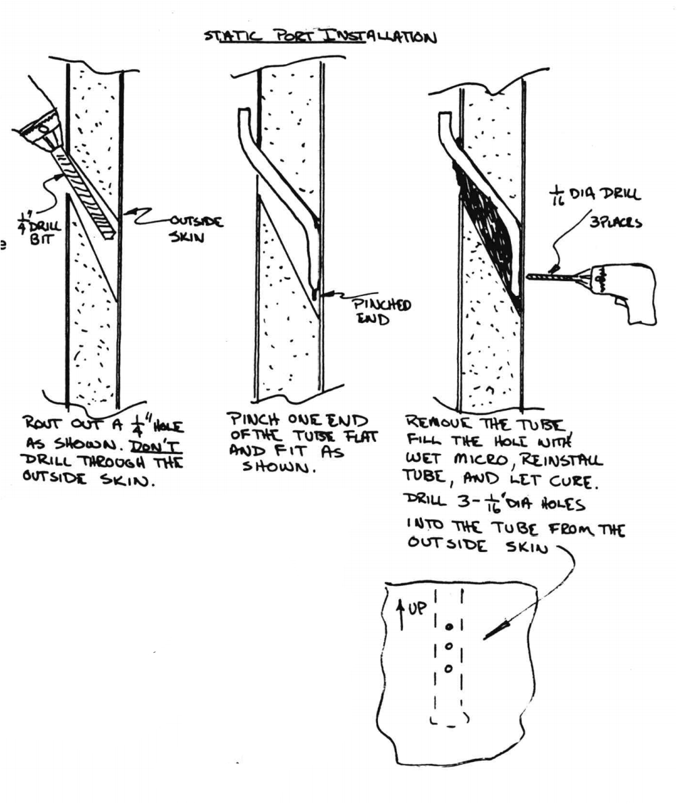 Figure 13-36: Static port

After installing the airspeed in­dicator and altimeter, hook up the pitot/static system using the hardware shown.
Add one adapter and one tee to the static line if using a rate-of-climb indicator.

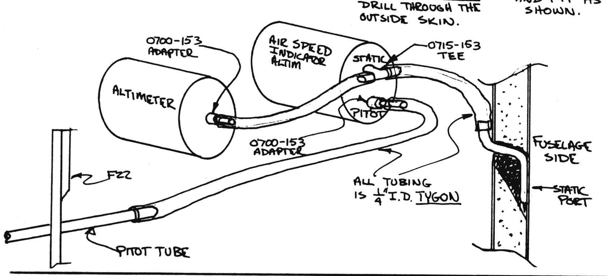 Figure 13-37: Pitot and Static port hose assembly

### STEP 7 -TOP FOAM BLOCK

Refer to the sketch, page A6, and A7.
Cut the top block from 2" thick green urethane foam.
This is temporarily installed now.
Weight it in place and bond to the side pieces and NG31 with a few dabs of 5 minute or epoxy.

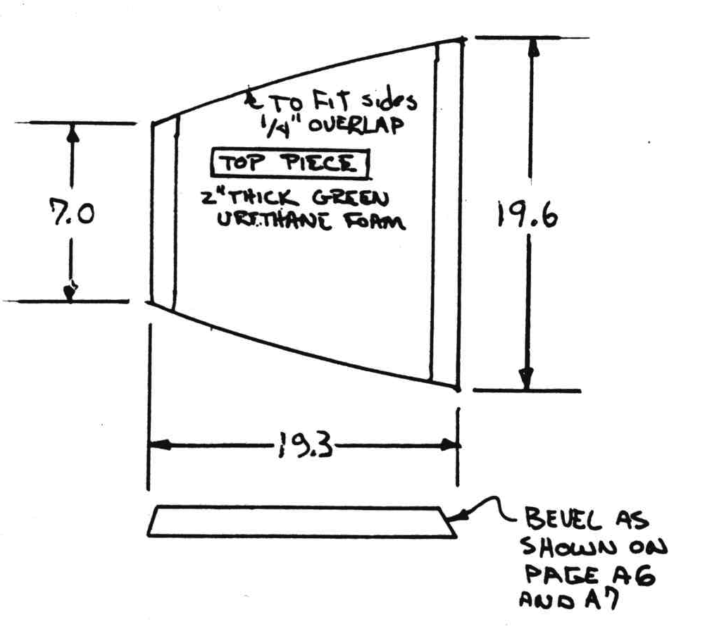 Figure 13-38: Top of Nose foam Block

### STEP 8 - CARVING AND GLASSING THE OUTSIDE OF THE NOSE

Due to the excellent carvability of ure­thane foam, your boxy/ugly/blocky nose section will look sleek and smooth and have a tough fiberglass skin in only about five hours work. You will need some help in turning the fuselage.
Re­tract the gear for this step.
The best tools for carving are the butcher knife (sharp), the surfoam file, the long sanding block and chunks of urethane, in that order. Fair the sides and bottom in tangent to the glassed fuselage and the SC cover.
Carve down into the NG31 bulkhead all around – this is a good reference for symmetry.
Turn the fuselage upside down when carving the bottom.
Believe it or not, you will find that it is VariEze to carve it to a pleasing shape using only the eye ball and without need for templates. SEE A6 and A7.

Fit and bond with 5MIN, a few small urethane blocks around the gaps at the front of the nose strut.
See A6.

Now, glass the nose with two plies BID lapping about 1" onto SC, the fuselage sides, and bottom.
This glassing job is easy if you use several small pieces and overlap them.
Turn the fuselage upside down or on its side as needed during the glassing operation.
Fiber orientation is optional.
Knife trim around the canard cutout in the top.
This leaves bare foam around the edges of the cutout.
Glass these areas with three plies BID, using 1/4" flox corners.

Refer to the sketch and to the full-size side-view (page A6) for details on the nose bumber.
The bumper is made from a thick piece of rubber from an old truck tire that is held to the fuselage bottom by a flange of 4-plies BID.
Layup the BID with 45º fiber orientation.

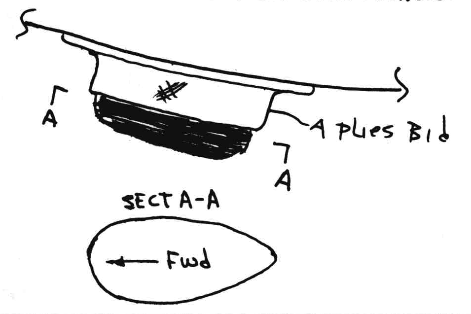 Figure 13-39: Nose parking bumper

### STEP 9 - Nose Door

In this step you will install the large battery-access door in the nose top.
This door also allows canard removal and landing gear inspection.

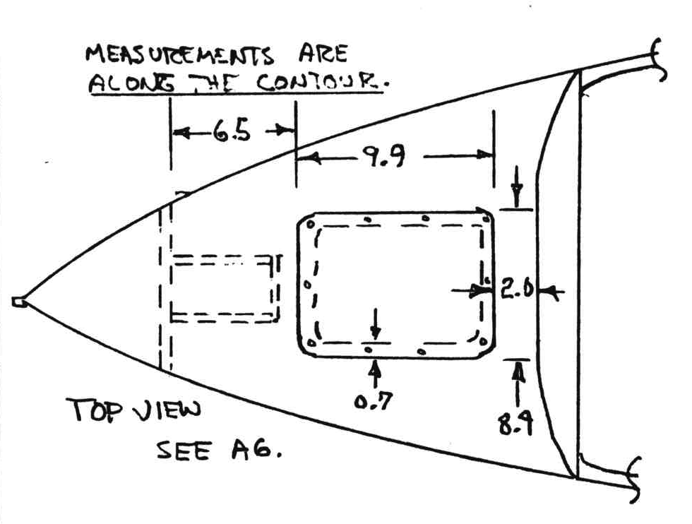 Figure 13-40: Placement nose door

Layout the door with a felt tip pen on the top as shown.
Tape a piece of thin plastic film (saran wrap) over 
this area for a release then layup 4 plies BID lapping over the door marks.
This is your door.
When cured, remove it and trim to size.
Now, measure **in** 0.7" all around for a flange, then cut the hole in the top of the nose along this **inner** mark. 

Using a razor saw cut off the entire top nose piece.
Cut just aft of NG31 and along the top of the side blocks. 

Turn the piece upside down and mark where it touches the NG30 top edges and the top of F6.

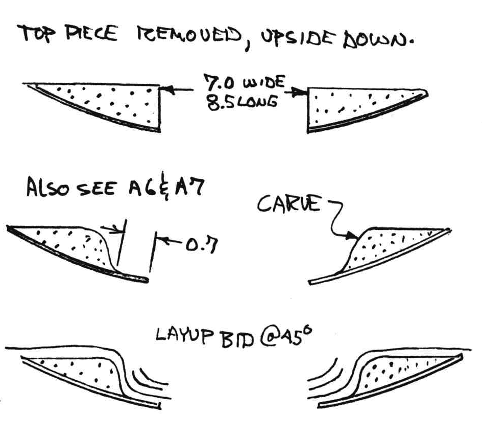 Figure 13-41: Top Piece removed

Referring to the sketches, remove foam to make a bare-glass 0.7" flange around the door cutout and a smooth taper of the foam with rounded edges.
Now, layup 1 ply BID over the entire inside of the block.
Add 2 more plies locally on the flanges to stiffen them.
While its still wet, stack flox on the sides, NG30, F6 and NG31, then weight or tape the top block back into place. Reach in from the canard cutout and wipe off excess flox.

After cure layup a 1" strip of 1 ply BID over the edges where the top block was cut from NG31 and the sides. 
Install ten equally-spaced screws (with nutplates inside) along the door edges. Use AN509-8R8 screws (flush #8) and K1000-08 nutplates. See A6. 

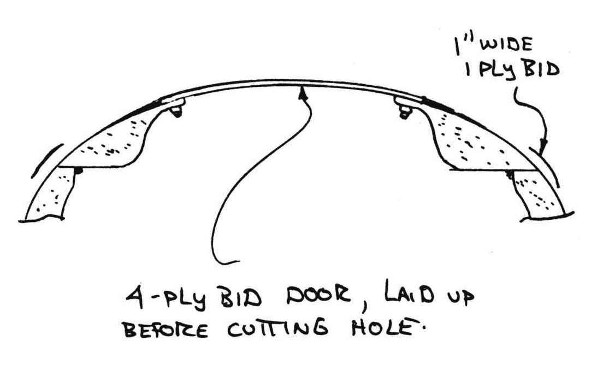 Figure 13-42: Nose Door

Now, refer to section VI - landing brake, page 2 for a neat method to fair your door in flush at the edges.

 Figure 43: Carve the nose
