#CHAPTER 16 - CONTROL SYSTEM

**OVERVIEW** - In this chapter you will install and rig the pitch, roll and yaw control systems.
The following items are available prefab:
CS1, CS1A, CS131, stick grips, CS17, CS128, CS127, CS201, CS132L, CS124/CS122, CS202, CS181, CS112, and CS120.
All prefab parts are welded and cad-plated (where applicable) and are ready to install (see photos in Brock catalog).

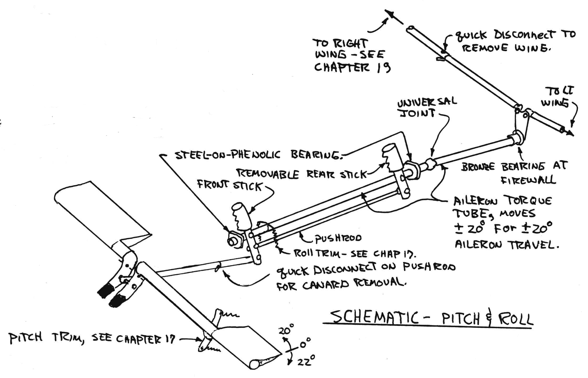 Figure 16-1: Control system schematic

### Step 1 - Side Consoles

Refer to the drawings and fabricate the right side consoles (arm rests).
Bond the side pieces to the tops with epoxy.
Hold with nails while you lay up one ply BID on the inside.
Knife trim.
Then, fit the consoles into position, trimming the 
edges to obtain a reasonable fit.
Bond them to the fuselage side, seat bulkheads and instrument panel with micro, then lay up two plies BID over their sides and top, lapping at least 1/2" onto the fuselage sides, floor and bulkheads.
Note that a large hole is open in the front console near the stick.
This is for stick installation and access.
It is later covered with a cosmetic cover (chapter 24).

 Figure 16-2: Front seat right console

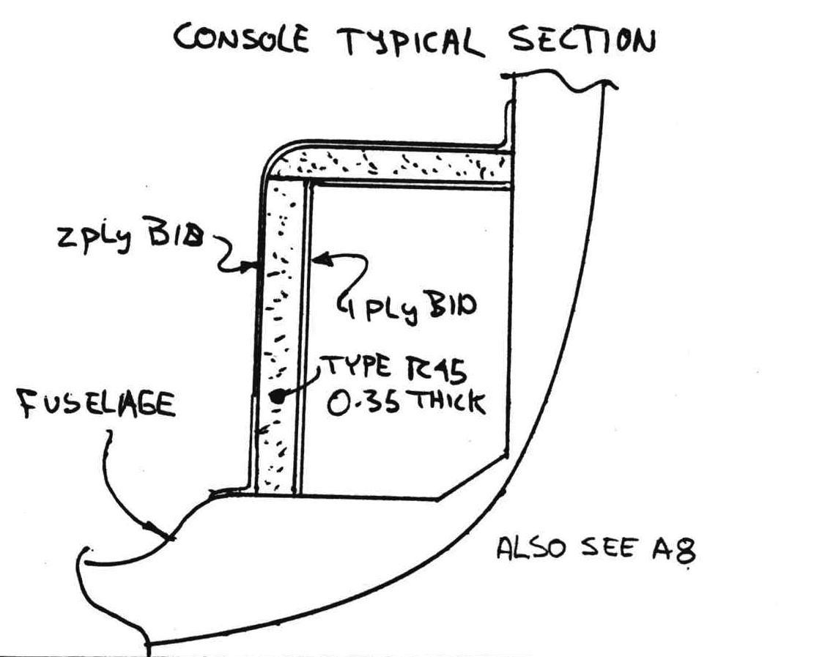 Figure 16-3: Console

### Step 2 - Pivot Mounts

Fabricate and install CS109 and CS118
plywood bulkheads as shown to the side consoles and with flox, fuselage edges sides.
They are bonded in place with flox, edges rounded as required and glassed all around with two plies BID lapping onto the consoles and fuselage side.

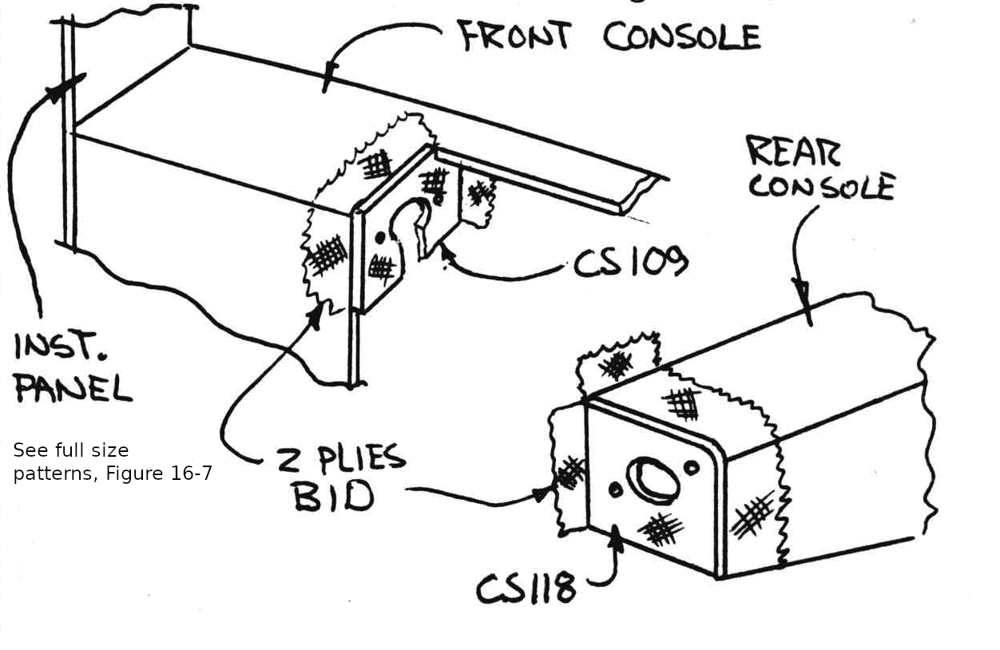 Figure 16-4: CS109 and CS118

Firewall Pivot Mount - Refer to page 16-5.
Drill or saw a one-inch diameter hole through the firewall centered at BL 6 2R and WL 12.3.
A hole saw or a fly cutter will be required.
The one-inch hole is not required to be precise, and it may be cut by drilling multiple smaller holes around the perimeter and using a rotary file to clean up the edges.

An oil-impregnated bronze bearing is used at
the firewall.
The Boston gear FB 1013-8 flanged bearing is used as shown on page 16-5. The bearing is potted into position using flox and must be dimpled as shown in the sketch to provide a "tooth" for the flex to hold onto.

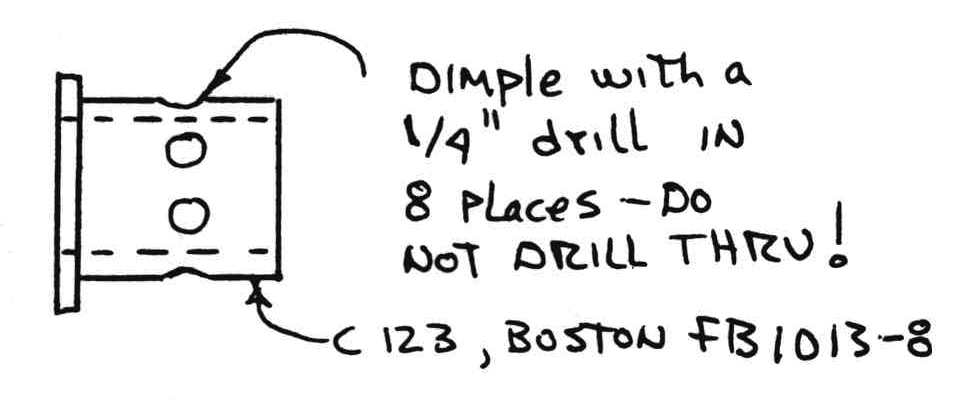 Figure 16-5: Boston FB1013-8

The CS121 torque tube should be in position while the flox cures to maintain proper alignment (see Step 3).

Use your 5/8" countersink tool to drill the 5/8" holes in the CS117 and CS108 bearing blocks (page 16-3).

The phenolic bearings must not be a sloppy fit to the 5/8" steel tubes but they shouldn't bind or drag either.
If the fit isn't perfect on initial installation the bearings can be hand­worked to fit or shimmed slightly, to obtain a non-binding alignment (2 places CS117 and CS108).

Note that wherever AN3 bolts are installed through the torque tubes or sticks, a #12 drill hole is required.
Use a pilot drill (#30 or 1/8") first, then drill up to #12.
This avoids sloppy holes.

### STEP 3 - Roll and Pitch Installation

Fabricate all parts, leaving CS121 long to later trim to fit.
Assemble CS124 to CS122 and weld.
Steel parts should have some type of corrosion preventive coating, cad-plate, zinc chromate, or lead oxide applied.
Fabricate the CS105 torque tube, CS106 and CS115 tubes, and the two CS112 steel inserts.
Study ~~page~~ Figure 16-8 ~~4~~ and the views on ~~page~~ Figure 16-10 ~~6~~ to get the relationship of these parts.
Slip the CS106 tube inside the CS105 tube and pilot drill (#30) the forward stick pivot hole through both tube and insert.
Repeat at the rear stick pivot with CS 115.
Be sure the front and rear stick pivot holes are in the same plane so that the two control sticks are aligned.
Increase the size of the pivot holes ~~to 23/64 inch~~ using a letter "U" drill (0.368) and then run a 3/8" press fit reamer (approximately 0.373) through the hole for a press fit on CS112 inserts. {CP32 PC95 DES}

File or grind a slight bevel on one edge of each CS112 insert and press them through CS105 and CS115 (or CS106) using a vise or an arbor press.
Ream 1/4" ID on the CS112 inserts for a free fit to the 1/4" bolts.
Drill CS121 into CS122.

Separate, then install through firewall.
Do not flox CS123 yet.
Slip CS108 on CS106.
Install the CS107 retaining ring.
This ring must snug the two washers to avoid end play (see section Z-Z).
Slip CS117 on CS115.
Place the assembly in the fuselage.
Bolt CS108 to CS109.
Bolt CS117 to CS118.
Check that CS105 and CS116 don't touch CS117.

Bolt CS120 on CS121.
Bolt CS116 to CS115.
Now, apply flox to CS123 and slide CS120 forward over CS116.
Let cure without moving.

Install CS103 front stick and CS119 rear stick.
Note that the 1/4" bolts should fit tight on the sticks so they don't rotate.
Fabricate CS110 and install the rod ends so that both sticks are parallel with each other.
Use a dremel rotary file to make clearance at fuselage side A-A).
Sticks move ±20º from the 5º inward cant.

Holding CS124 vertical and the sticks at 5° inboard (view F-F), drill CS116 into CS120 and install bolt.
Install CS102 and CS136 – see quick disconnect detail and drawings on page A7 and A8.
See B-B, page 16-6.

Be sure to install the CS201 and CS202 bushings as shown, to allow sufficient rotation of rodends for roll control.
NOTE: both sticks lean forward 5° with the elevator
at neutral. The front stick grip assembly is riveted to CS103 with six dome-head rivets.
The rear stick grip assembly tube is ovalized (squashed) slightly for a tight friction fit over CS119 so it can be easily removed (cockpit room or luggage clearance).

Note: This is all you can do until you build
the wings and ailerons. Return to this point after chapter 19 when fitting wings.

Install CS125L,CS126L, and quick disconnects,
being carefull to maintain the two 90-degree angles shown on page 19-15/16 (ailerons neutral).
The 90-degree angles insure that the ailerons differential is within limits (±.3").

Apply a small amount of light grease to the 5 pivots (CS123, 108, 107, and both CS112).

WARNING!
Control System Rod Ends:
The HM3 and HM4 rod ends used in the control system are susceptible to being damaged if you do not use care in installing them.
When adjusting the pushrod under the front stick **be sure** the normal stops in roll are reached before a twisting load is applied to the rod end.
Be careful to not bend the rod end threads.
If an HM3 or HM4 has been bent, twisted, damaged or overloaded in any way it must be discarded, or used in a non-critical area (landing brake, for example).
Check your rod ends, particularly in the pitch system where they are non-redundant – if they are marked HM4C return them to be replaced with HM4.
The "C" is a commercial grade and is not as strong as the aircraft HM4.

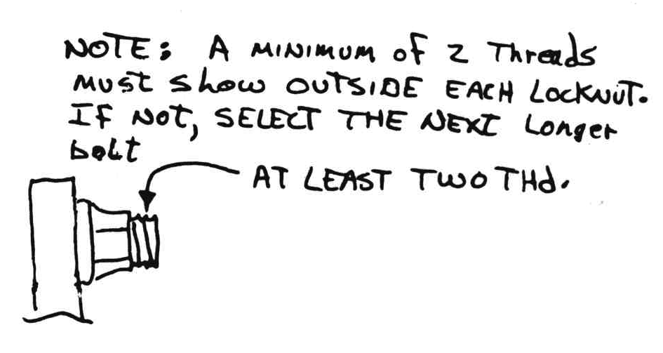 Figure 16-6: Minimum safe thread

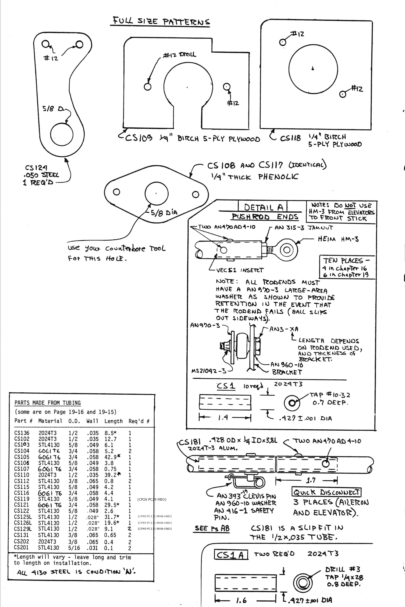 Figure 16-7: Control system patterns

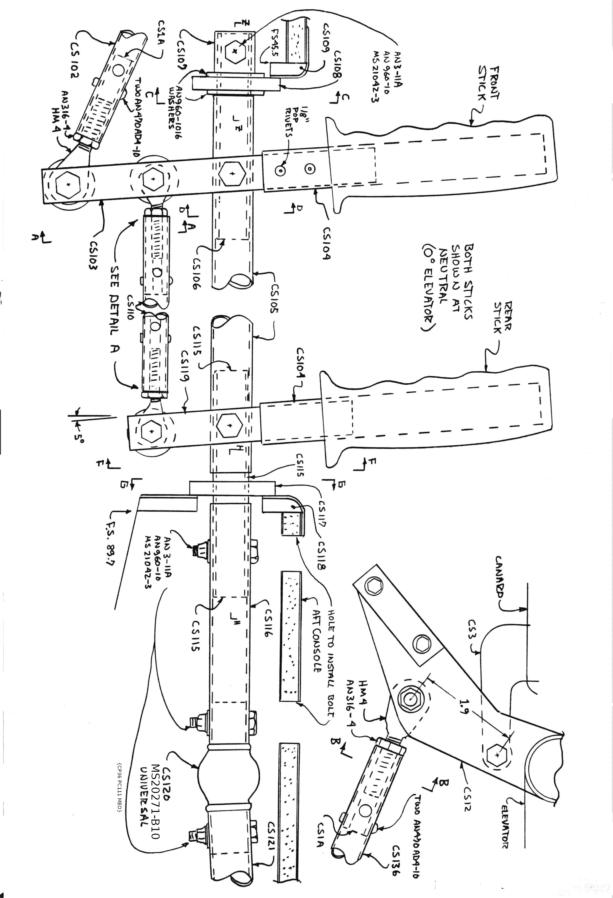 Figure 16-8: Control sticks

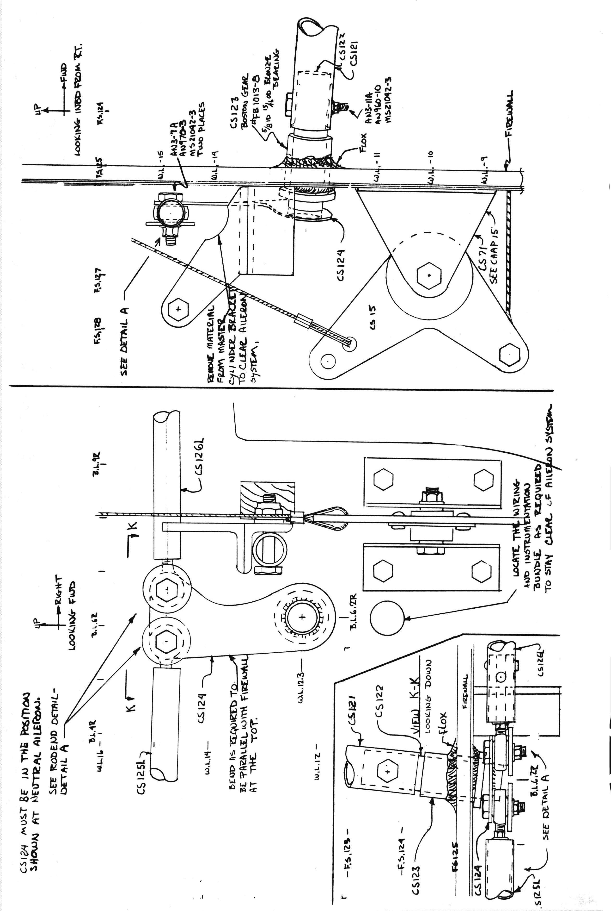 Figure 16-9: Control system at firewall

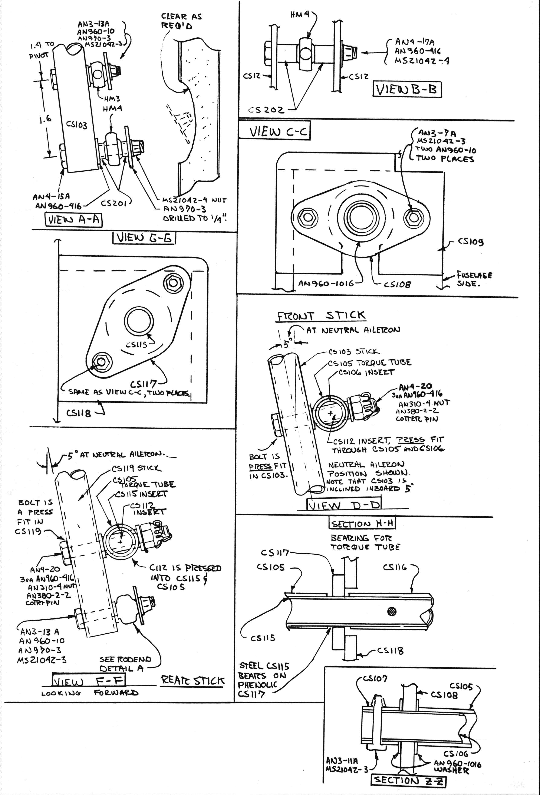 Figure 16-10: Connecting control tubes

### STEP 4 - Routing and Rigging the Rudder Cables

This step should take about three hours; a helper is handy to set the rigging and hold the cables for swaging.
Cut two lengths of 3/16 OD x 0.025 wall high-pressure
Nylaflow semi-rigid nylon tubing.
They are 82" long.
These tubes are the rudder cable conduits and are routed inside the cockpit along the fuselage side contours at WL 8.
See A1, A5, page 4-1 and page 4-2 to see where the conduit passes through the instrument panel,
the front seat bulkhead, the rear seat bulkhead and
the aluminum landing gear extrusion.
Sand the entire length of the 82" conduit dull for bonding – 60 or 100-grit.
Thread it into the 4 holes, tape to the fuselage side every 611 to hold it straight then flox it in place at each bulkhead and every 6" along the fuselage side as shown.
It maybe required to hold it in place with sticks extending across the fuselage.
The conduit sticks out 1 or 2 inches in front of the instrument panel.
Get two 10-ft lengths of 3/32-diameter 7 x 19 aircraft control cable and swage an AN100-4 thimble and 18-2-G sleeve on one end and bolt to the inside of CS15 as shown.

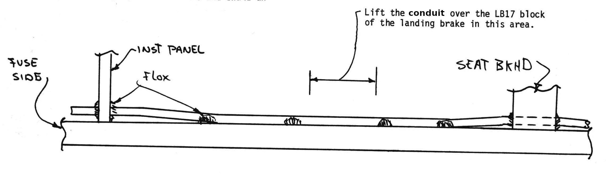 Figure 16-11: Rudder cable tube

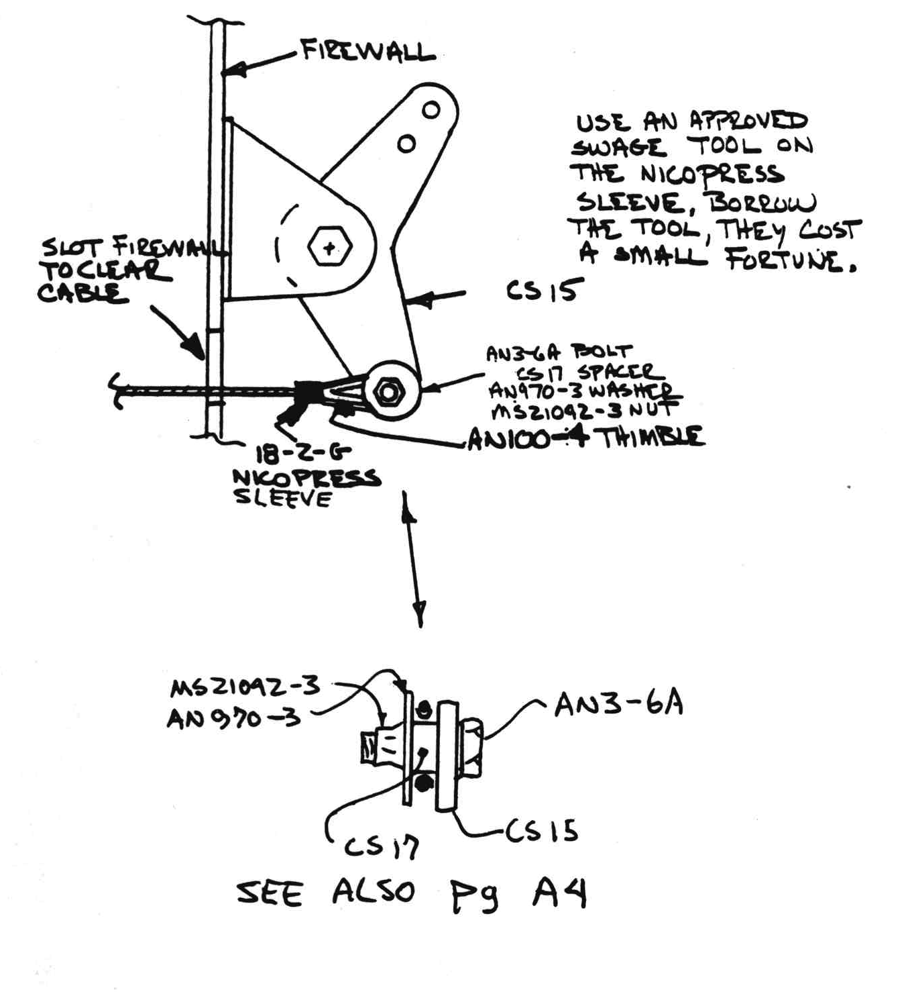 Figure 16-12: Rudder bellhorn

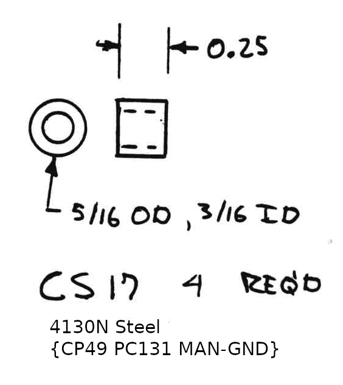 Figure 16-13: Spacer  CS17

Push the free cable end forward through the firewall slot and conduit to the front cockpit.
Carefully position the rudder pedals and CS15 belcranks as shown and swage the forward cable ends as shown.
This position (rudder pedal vertical at full rudder travel) is about right for the medium height pilot.
Tall pilots like the pedal about 2" forward at full rudder and short pilots need it 2" aft of vertical.
If you want to have the pedals adjustable, install the parts shown, about 8" forward of the instrument panel where they can be reached from the cockpit.

The rudder cable from the belcrank to the rudder is 1/16" 7x7 aircraft cable. Swage one end to the CS15 belcrank (inner hole), route the cable through the pully and swage on another thimble about 8" from the pulley.
Be sure the cable guards in the pulley brackets (the two cotter pins) are positioned to keep the cable in the pulley if the cable is slack.
Make the quick disconnect shown. This disconnect is unhooked when the wing is removed.

Swage another thimble and sleeve on a 13-ft length of 1/16" 7x7 cable and attach to the quick disconnect with a clev­is pin and aircraft safety pin (AN416).
Push the cable through the wing conduit until it comes out at the wing tip.
If it does not come out at the wing tip, recheck the length of your wing (chap­ter 19)!
Position the rudder with the **top** of the trailing edge 6 inches outboard from neutral – thirty (30) degrees rudder.
Hold it there by stick­ing a wedge between it and the winglet.
OOPS!
You and I have just noticed that the winglet/rudder is not yet installed on your wing tip!
Stop right now and complete chapter 20 before finishing the rest of this chapter.

With the CS15 belcrank positioned as  shown earlier (the nicopress sleeve 0.7" away from the firewall), take up the slack in the cables and swage the cable end through the rudder belhorn as shown.

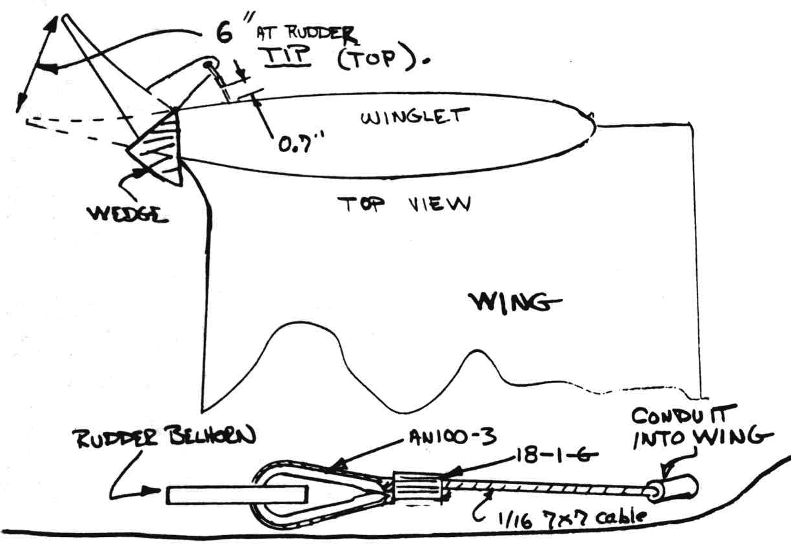 Figure 16-14: Rudder connection

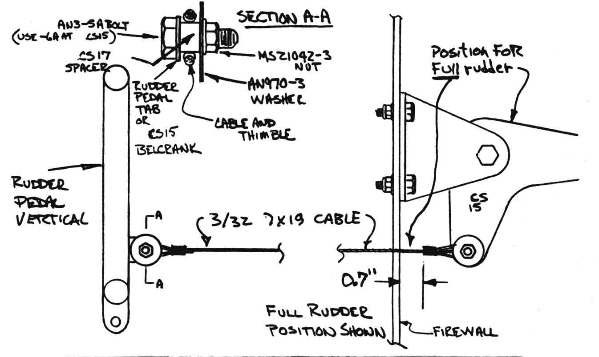 Figure 16-15: Rudder to belcrank rigging

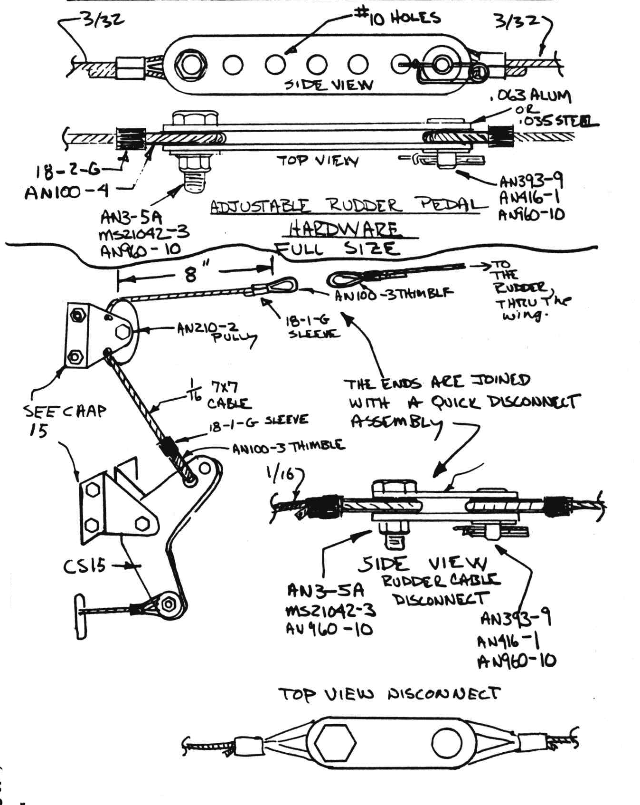 Figure 16-16: Adjustable rudder pedals and wing removal disconnect

### STEP 5 - RIGGING THE BRAKE ACTUATING CABLES

This is a quickie - one hour is enough.
Your brake system should be installed and **fullly serviced with brake fluid** (be sure to bleed the brake lines) before you proceed.
Install a piece of 3/32 cable (thimble and sleeve on each end) from the CS15 belcrank to the master cylinder actuating arm, so that as you reach the full rudder deflection shown in step 1, you are **hard** on the wheel brakes.

***See Chapter 15 Step 3***

Slip a piece of soft rubber tubing over this cable before swaging both ends.
This keeps the cable from chafing on the brake master cylinder and engine mount when it is slack.
Note that this short length of cable is slack until the rudder reaches its full position.
Note also that the stop for full rudder position is provided by the brake master cylinder.

**No** turn buckles are required; any adjustment to maximum rudder deflection that may be required can be done with the adjustment already provided at the top of the master cylinder.
The stops in this position also allow the use of small 1/16" cable to the rudders since the maximum load attainable in this cable is only about 20 pounds.

Check that your rudder and brake system works smoothly.
The spring at the rudder is much stronger than the one at the rudder pedal, so the rudder should return to neutral.
In flight, airloads return the rudder with loads much greater than the spring.

CAUTION!
Be sure you have at least 0.7" overtravel at the firewall **and** at the wingtip when at full rudder and hard on the brakes.
