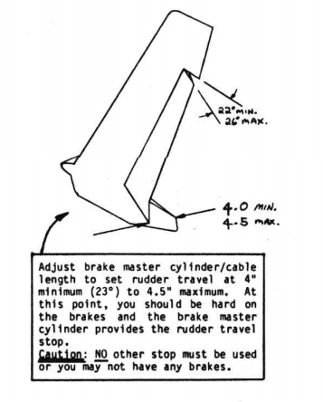

# Chapter 20

## Winglet and rudder

**Overview**: This chapter involves building the large vertical fins, mounting them to the wingtips, building and mounting the lower vertical fins, fabricating the rudders and hooking up rudder controls.
The right wingtip is shown.
Reverse to a mirror image for the left winglet.
The upper fin has undercamber facing outboard.
The lower fin is cambered inboard.
In-flight, the upper fin lifts inward and the lower fin lifts outward.
This lift distribution works against the normal vortex rotation at the wingtip, increasing the effective aspect ratio.
The result is an increase in climb and range, as compared to a vertical fin not designed using the NASA Whitcomb-winglet technology.

 Figure 20-1: Overview

### Step 1 - Cutting cores

Refer to the plan-form view {in Figure 20-2} and hot-wire configuration drawing.
The hot-wire templates are on pages A3, A11 and A14

1. A3 Winglet root and Winglet tip
2. A11 winglet trim template (bottom of page)
3. A14 Winglet bottom tip template (top of page)
{CP25 PC 13 MEO}

Refer to chapter 3 and 7 for details on hot-wiring cores.
The {A3} root (WL 18.4) template is used for the top and bottom fin.
Hot-wire the cores.
Then round the bottom pieces LE and shape it's tip as shown {in Figure 20-2}.
Do not round the top winglet.

 Figure 20-2: Plan view of winglet

### Step 2 - Glassing the winglet

Note the top fin is undercambered on the outboard side, full span.
The bottom fin matches the top at WL 18.4 then transitions to a cambered­ **inward** airfoil section at its bottom.
The left-over blocks the cores were cut from are used to jig the cores flat.
Glue these to a flat table.
The cores are easily warped until both skins are installed.
Jig them for glassing by nailing at the root and tip and, if necessary, with small dabs of 5 minute.
Recheck that **root and tip** level lines are parallel (no twist).

Glass the outboard skin with the following schedule:
1st ply UND – orientation diagonally from the root TE to the LE.
2nd ply is also UND, and crosses, from root LE to tip TE.
3rd ply is on upper winglet ~~surface~~ only – it is BID at 45° extending from root, up 18". {CP34 PC104 MEO}
Peel-ply the entire BID surface.
Knife trim all around.

#### Step 2a: High performance rudder Comm Antenna installation

To save re-glassing the inside of the winglet when installng the Comm Antenna, see Figure 20-30 for the Comm antenna installation.
The instructions are in Chapter 22 - Comm Antenna section, High Performance rudder.

 Figure 20-30: Comm Antenna location on the inside of one of the winglets

The antenna cable is fed through the electrical conduit that runs along the front of the wing, along with the wiring for wing tip lights.

#### Step 2b: Continue glassing the inside of the winglet

Refer to wing chapter {19 Figure 19-51} for similar LE and TE details to obtain the correct skin overlaps, then jig and skin the inboard side using the **same** layup schedule as outboard side.
Be **sure** the root and tip level lines are parallel.
Refer to the plan view.
Carve the 1" tall tip cap from urethane foam.
Round to a pleasing shape and skin with 1 ply BID.

 Figure 20-3: Glass layup

 Figure 20-4: Glass overlap on leading edge

### Step 3 - Jigging upper winglet to wing

After cure, refer to page A11 for the winglet **trim template**. Cut this piece of paper out and wrap it around the **inboard** side of the upper winglet, lining it up with the LE (extend the level-line up the LE), and lining it carefully along the root edge.
Mark the trim line then saw the piece out (coping saw) sawing roughly perpendicular to the mark.
Discard the piece.

 Figure 20-5: Jig winglet to wing

Now, layup your wing top-side up on the table, wedge it up so it doesn't rock around.
Weight it down with about 50 lb of sand bags.
Locate the winglet-positioning reference point (WPRP) and mark it clearly.
This is the inboard front corner of the aileron cutout.
BL 55.5 and FS 149.6 (see page 19-10).
Now, set the winglet on top of the wing top surface.
Have someone hold it and move it around until the A - B and C dimensions are achieved.
It's best to set a box along-side and tape a stick to it to hold the winglet upright while jigging.
The A dimension is (102.15") from WPTP to the LE mark on the winglet at the top surface of the wing.
The B dimension is (108.35") from WPRP to the root TE of the winglet.
The C dimension is (118.35") to the tip TE of the winglet.

A and B are critical and should be within 0.05".
C is not critical and can be ±1".
Once positioned, mark the wing top skin at the inboard edge of the winglet.
Remove winglet.
Cut the wing all the way through, being careful to not nick the rudder conduit.
Discard this piece.

 Figure 20-6: Brace winglet for attachment

Now, lining up the edges as shown {in Figure 20-7} and rechecking the ABC dimensions, jig the winglet to the wing.
This time hold it firmly in place with 2 or 3 3/4" diameter lumps of Bondo.
Support it sideways with a 3 foot length of 1 x 2 lumber with lumps of Bondo on each end.
Be sure this is not in the way of the A measurement.

 Figure 20-7: Turn wing upside down

When the Bondo is hard, remove the box and recheck A - B and C.

### Step 4 - Inside layups

Study {Figure 20-21} Section C-C to see the inside layups.
Turn the wing over, extending the winglet off the side of the table, exposing the bare foam faces. 
{Note that the winglet is over 44 inches long, so the table is going to be at least that high.}

 Figure 20-8: High stress areas

Remove the foam locally, with a knife, as shown {in Figure 20-9}, by cutting out a triangular flox corner all around.
This is 2" deep in the "high stress areas" {shown in Figure 20-8}, and 1/2" deep around the other edges.
The "high stress area" extends from the rudder conduit to the leading edge, along the winglet wing touching edges.

 Figure 20-9: Cut foam wedges for bonding

Do **not** remove the wings' shear web.
Sand the inside glass surfaces {of the wing}.
Carve block A to fit nicely as shown {in Figure 20-10}.

 Figure 20-10: Block A

This extends from the wing TE to the winglet LE.
It is carved from 2 lb (green-urethane) foam.
Laminate 2 pieces of 2" thick urethane {to form Block A. Block "A" runs from the leading to trailing edge of the winglet}.
Do **not** glue in block "A" yet.

Cut 8 strips of 45° BID, 4" wide by 12" long.
Now, layup the eight small inside tapes (layup #1).
Trowel in flox to fill the void.
Where the void is excessive, fill portions of it with foam wedges (see ~~sketch~~ Figure 20-10).
The flox and foam wedges hold this layup firmly against the winglet skin and wing skin and spar cap.
Notch the 8 plies locally to fit around the shear web in the wing.

Allow this to partially cure to avoid an exotherm, then fill the flox corners and glass layup #2, the inside ribs.
These are 8 plies BID forward of the rudder conduit.
Extend two of the 8 plies aft to the winglet TE.
Position the rudder conduit at 13.2" from the winglet TE **along** the outside edge of the winglet.

Layup #2 joggles up over the conduit - trowel in dry micro to avoid air bubbles.
After sufficient cure to avoid exotherm, trowel in some wet micro and install block "A".
Block "A" must fit well enough to avoid air voids.
Weight or nail block "A" in place for cure.

 Figure 20-11: Install Foam Block A

### Step 5 - Outside layups

After cure, carve block A to a flat diagonal, **not** round, as shown {in Figure 20-12}.
Remove peel ply {from wing and winglet}.

 Figure 20-12: Carve Block "A" to shape

Round the edges for layup and glass layup #3, the structural bottom - outboard layup.
This layup consists of 2 plies BID, extending 15" up the wing and 12" up the winglet in a tapering fashion as shown {in Figure 20-14} plus 7 plies UND.
Make the 2nd BID ply about 2" shorter {(13") to taper ~~its~~ {the BID ply} edges.
Thread the BID around the rudder conduit.
Now, cut the following 7 UND plies, using care to orient fibers along the A dimension {as shown in Figure 20-13}.

 Figure 20-13: Sizes of UND Plys for Block A

Refer again to the sketch {in Figure 20-14}, layup the 7 plies of UND with fibers running around the corner as shown centered on the corner.
Keep fibers straight.
Peel-ply all edges to make a smooth transition.
CURE.

 Figure 20-14: Outside UND Layup

### Note: Now is the time to install the COMM antenna in either of the winglets, see Chapter 22 Antenna's instructions

After cure, turn the wing over, knock out the Bondo lumps in the corner, remove peel ply and glass layup #4, the structural top - inboard layups.
This layup is identical in size, number of plies, and orientation as layup #3.
Lap the 2 BID plies 1" onto the outside of the winglet at the lower leading edge.
Peel-ply edges for a smooth transition.
Cure.

 Figure 20-15: Top of Wing to Winglet layup

The top winglet is now structurally attached to the wing.
Remove the 3 foot 1 x 2 board.

Do not increase the number of plies – your winglet joint can withstand 90-degrees sideslip flight at 170 mph – considerably over normal requirements.

### Step 6 - Lower winglet attach

Trim the lower winglet as shown so its root – WL 18.4 fits up to match the upper winglet.
Fill the small voids shown with urethane foam and micro it in place.
Glass a 2" wide tape of BID at 45° to structurally attach the lower winglet at the outside and inside as shown (layup #5).

 Figure 20-16: Attach lower winglet

Now you can install your desired wingtip light (see Figure 22-11 mid-page ~~Section III~~). {CP31 PC90 MEO}
The light must be installed at the position shown.
Do not add weight aft of that location.
Also do not cut into the structural area.
An optional fairing block can be installed as shown in ~~view~~ {Figure 20-21 Section} B-B to fair the wing tip into the the winglet surface.
Use any type foam covered with 2 plies BID.

### Step 7 - Rudder

There are three options to choose from for rudders. The rudders on both winglets must be of the same type.
Long-EZ was initially designed with "standard" rudders which required a lot of brake stearing because they were small, especially during cross wind takeoffs and landings.
Standard rudder are installed in Step 7a below.

RAF provided a revised rudder design called "High Performance Rudder" which reduces the use of brakes during taxi, takeoff or landing. High Performance rudders are installed in Step 7b. (Note that the high performance rudders may be installed with the external CS-301 belhorn that was used with standard rudders.)

High Performance rudder may also incorporate the hidden belhorn, which puts the rudder belhorn within the winglet, instead of exposed on the end of the wing where it is at some risk of damage due to ground handling incidents. Follow Step 7c if you wish to incorporate the high performance rudders with an internal belhorn.

#### Step 7a: Standard Rudders

Carefully layout the rudder dimensions shown {in figure 20-17}, on the outside and inside of the winglet.
Saw through the skin on both sides with a razorsaw, then cut through the foam, to remove the rudder.
The rudder is hinged on its outboard edge with a piano hinge.
The piano hinge is 7.5" long, extending from WL 18.4 up.
Study {Figure 20-21} section D-D and view B-B and {Figure 20-20} Section E-E.

 Figure 20-17: Rudder cutout from winglet

Set the wing leading-edge-down.
Remove foam {from the winglet} as shown {in Figure 20-21 Section D-D}, 0.6" deep at the top and bottom and 1" deep at the front.
Glass 3 plies BID in this entire area plus an extra ply on the edge where the hinge will go (layup #6).
Knife trim.
After cure, trim the hinge area forward 0.2" x 7 1/2" to recess the hinge.
Drill and fasten the hinge to the wing with three AN525-10R8 screws, with K-1000-3 nutplates on the hinge.
Trim the hinge width as required to fit.

Grab the rudder and, in a similar fashion, remove foam all around the edges.
Remove 0.6" top and bottom and 0.8" on the forward face.
In addition, remove a tapered depression to reinforce the belcrank as shown.
The depression extends 2.4" deep from the hinge line, on the outboard side.
It is conical in shape and centered at WL 18.7.
Glass this area (layup #7) with 3 plies BID plus an extra ply at the hing and belcrank depression.

 Figure 20-18: Rudder Hinge Installation

 Figure 20-19: Rudder cutout from winglet

When cured, install the hinge and belhorn using the 7 pop rivets and 2 each AN 525-10R8 screws, AN906-10L washers and MS 21042-3 nuts.
Install cable and swage fitting.
Max rudder travel is 30°.
However, the swage must **still** have at least 0.7" travel until it bottom on the conduit – {the} brake master cylinder **is** the rudder stop – any other stop will leave you without brakes!

Return spring – this returns the rudder to neutral on the ground.
In-flight, the airloads force the rudder to neutral unless the pilots steps on the rudder pedal.
Install the tube and hook shown {in Figure 20-21 View B-B}, near the top of the rudder along the inboard skin.
The 1" hole in the foam can be cut easily if you file some notches in the end of a tube and rotate it to saw the hole like a long "holesaw".

The edge, marked "A" {in Figure 20-21 view B-B}, is the rudder stop.
Long-EZs do not have, nor need in-flight rudder trim.
The edge at "A" can be trimmed to allow the rudder to move more inward or shimmed to move the stop outward, to provide ground-adjustable rudder trim.
Once trimmed for ball-centered flight, further adjustment should not be needed.

 Figure 20-20: Cross section views of the rudder

 Figure 20-21: Sectional views of the winglet

#### Step 7b: High Performance Rudders with standard belhorn

##### Step 7b-1: Layout the rudder dimensions on the winglet

Refer to Figure 20-22, and carefully layout the rudder dimensions shown on the inboard and outboard faces of the wing-let.
The easiest way to layout these rudders, is to measure down the trailing edge 9” from the top. Make a mark at this point.
Now measure 4.0” forward at 90° to the trailing edge from this point. Make a mark.
Measure down the trailing edge 48.5” from the top. This point should be at W.L. 18.4 on the trailing edge. From this point, measure forward on the wing-let at 90° to the hinge line as shown 7.5 inches.
The hinge line from top to bottom should be 43.5”.
The distance from bottom of the hinge to the bottom of the winglet will be between 10.2” and 10.5” depending on the finished shape of your wing-let. This last dimension is not critical.

 Figure 20-22: High performance rudder layout

##### Step 7b-2: External rudder belcrank (CS-301)

Before you cutout your high performance rudder refer to Figure 20-23 and mark the location for CS-301 belhorn.
Layout two #10 holes which will be drilled in the rudder to mount the CS-301 belhorn.

 Figure 20-23: Locating and pre-drilling CS-301 mounting holes.

##### Step 7b-3: Cut out the rudder

When you have the rudders laid out as accurately as you can on both sides of each wing-let, cut the rudders out using a hacksaw blade. Cut along the lines you have marked accurately, remember you are cutting what will be the “gap” around the rudder. If you cut a wavy line, that is how your rudder will look. Nice straight cuts will look the neatest.  

##### Step 7b-4: Prepare Winglet and rudder for hinges

The rudders will be hinged to the verticals with three (3) hinges. The bottom hinge is 6” long, the middle and top hinges are 4” long.
Use a rotary file in an electric drill or your dremel, and remove foam as shown in Figure 20-24.
You should dig out about 0.6” along the top and bottom of the rudder and of the winglet and about 1.0” deep along the hinge line of the rudder and of the winglet.

##### Note: Builders report that removal of 1.3" of foam where the hinge attaches provides a smaller gap between the rudder and winglet reducing drag

 Figure 20-24: Remove foam and reinforce winglet and rudder

Sand the foam as smooth as possible. A narrow sanding block works well here. Use your dremel with a small sanding drum to remove the foam and micro from the inside of the glass. Also remove a tapered depression to reinforce the belhorn attach area as shown in Figure 20-22 upper right corner.

Now layup 3 plies of BID at 45° into the winglet as well as around the rudder. The top of the rudder only requires 2 plies of BID. The depression area where the belcrank will be mounted, should have 3 plies of BID inside it as shown in Figure 20-22 upper right corner. Layup two (2) additional plies of BID locally where the hinges will be mounted.

Allow these layups to cure, (don’t forget to knife trim)

##### Step 7b-5: Mount hinges on rudder

Now mount the hinges on the rudder using 4 pop rivets (Avex 1604-0412 or Cherry BSC-44) per hinge. Space the hinges as called out in the 1/5 scale drawing on Figure 20-22. Take care to mount the three hinges in a straight line. Use a straight edge to check the alignment before you rivet the hinges to the rudder.

##### Step 7b-6: Mount rudder on winglet

Now hold the rudders in the cut-out in the wing-lets, and transfer the position of the hinges to the outboard skin of the winglet. Notch out the hinges (a razor saw or saber saw will do well) just as you did when mounting your ailerons into the wings. Bevel the inside of the winglet glass at 45 degrees to accomodate the "ramp" on the hinge where it moves from the flat to the hinge line, this aids in reducing the gap.

Install two (2) K-1000-3 nut plates on each of the 4” long hinges and three (3) K-1000-3 nut plates on the lower 6” long hinges.

Mount the rudders using AN525-10R8 screws (7 per rudder).

##### Step 7b-7: Mount CS-301 belhorn

Now drill the holes to mount the CS-301 belhorns and bolt the belhorn to each rudder using AN525-10R8 screws.
Note that the forward screw through the belhorn goes through the lower hinge. The aft screw should have an AN970-3 wide area washer and both should have MS21042-3 nuts.

Check your rudder for freedom of movement and good alignment with the winglet. Shim or sand to fit.

##### Step 7b-8: Rudder return spring

Now install the 1” O.D. x 0.35” Wall aluminum tube and hooks as shown in Figure 20-12. These should be floxed in at approximately WL.25.
The return spring is a 4” length of .35 O.D. x 0.050” steel spring. This provides the force to return the rudder to neutral on the ground.

##### Note: If you installed an antenna in a winglet do not install the return spring near the end of the antenna, as it interferes with the antenna's signal.  Instead install the return spring where the antenna and its coax are attached

##### Step 7b-9: Wood stops to adjust rudder trim (requires flight tests)

Install small wood “stops” at point “A” as shown and adjust by sanding, to close faired in, or as required for “ball centered” flight.  

 Figure 22-25:Verticle view of hinge cross section and stop blocks

##### STep 7b-10: Attache rudder cables

Now go to Chapter 16 step 4 and install the rudder cables, and brake actuating cables.
Adjust your brake master cylinders so that when you are hard on the brakes, you have to move the rudder outboard 26° or 4.5” at the base of the rudder as shown.

 Figure 20-26: Full travel on rudders

Drill a ¼” hole on the inboard side of the winglet for a water drain as shown.

#### Step 7c: High Performance Rudders with hidden belhorn

##### Step 7c-1: Layout the rudder dimensions on the winglet

Refer to Figure 20-27, and carefully layout the rudder dimensions shown on the inboard and outboard faces of the wing-let.
The easiest way to layout these rudders, is to measure down the trailing edge 9” from the top. Make a mark at this point.
Now measure 4.0” forward at 90° to the trailing edge from this point. Make a mark.
Measure down the trailing edge 48.5” from the top. This point should be at W.L. 18.4 on the trailing edge. From this point, measure forward on the wing-let at 90° to the hinge line as shown 7.5 inches.
The hinge line from top to bottom should be 43.5”.
The distance from bottom of the hinge to the bottom of the winglet will be between 10.2” and 10.5” depending on the finished shape of your wing-let. This last dimension is not critical.

 Figure 20-27: High performance rudder layout

##### Step 7c-2: Cut out the rudder

When you have the rudders laid out as accurately as you can on both sides of each winglet, cut the rudders out using a hacksaw blade. Cut along the lines you have marked accurately, remember you are cutting what will be the “gap” around the rudder. If you cut a wavy line, that is how your rudder will look. Nice straight cuts will look the neatest.  

##### Step 7c-3: Prepare Winglet and rudder for hinges

The rudders will be hinged to the winglets with three (3) hinges. The bottom hinge is 6” long, the middle and top hinges are 4” long.
Mark a one line on both sides of each winglet and rudder along the hinge line one inch into each winglet or rudder as the cut line.
Similarily mark the top and bottom rudder and winglet 0.6" deep for foam removal. 

Use a rotary file in an electric drill or your dremel, and remove foam as shown in Figure 20-28.
You should dig out about 0.6” along the top and bottom of the rudder and of the winglet, about 1.0 deep along the hinge line of the rudder and of the winglet, except in the hinge area of the winglet go 1.3" deep to allow the hinges to be slotted into the winglet skin.

 Figure 20-28: Remove foam and reinforce winglet and rudder

Sand the foam as smooth as possible. A narrow sanding block or file works well here.
Use your dremel with a small sanding drum to remove the foam and micro from the inside of the glass.

Also remove a flat depression along the bottom of the winglet to allow the hidden belhorn to move from inner to outer skin of the winglet as shown in Figure 20-27 upper right corner.

Now layup 3 plies of BID at 45° into the winglet as well as around the rudder. The top of the rudder only requires 2 plies of BID.

The depression area where the belcrank will be operating in the winglet, should have 3 plies of BID inside it as shown in Figure 20-27 upper right corner.

Layup two (2) additional plies of BID locally where the hinges will be mounted.

Allow these layups to cure, (don’t forget to knife trim)

##### Step 7c-5: Mount hinges on rudder

Now mount the hinges on the rudder using 4 pop rivets (Avex 1604-0412 or Cherry BSC-44) per hinge. Space the hinges as called out in the 1/5 scale drawing on Figure 20-27. Take care to mount the three hinges in a straight line. Use a straight edge to check the alignment before you rivet the hinges to the rudder.

##### Step 7c-6: Mount rudder on winglet

##### Note: The hinges specified are already anodized, they will not take further anti-corrosion treatments

Now hold the rudders in the cut-out in the winglets, and transfer the position of the hinges to the outboard skin of the winglet.
Notch out the hinges (a razor saw or saber saw will do well) just as you did when mounting your ailerons into the wings.
Bevel the inside of the winglet glass at 45 degrees to accomodate the "ramp" on the hinge where it moves from the flat to the hinge line, this aids in reducing the gap.

Install two (2) K-1000-3 nut plates on the inside of each of the 4” long hinges and three (3) K-1000-3 nut plates on the lower 6” long hinges.

Mount the rudders using AN525-10R8 screws (7 per rudder).

##### Step 7c-7: Construct the conceled belhorns

Figure 20-30 depicts internal belhorn components, you will need two (2) FB-2 belhorns made from 1/8” thick, 2024-T3 aluminum and then treated with Alodine.
RAF has found that if we glass bead blast aluminum parts then clean them in Alumiprep and then treat them with Alodine, we get best results.
Also make four (4) FB-1 steel, parts from 0.032 4130N Sheet. We simply cleaned these steel pieces with metal prep and painted them with a spray can zinc chromate.

Clamp the FB-1 steel pieces in position on the FB-2 belhorns and drill #30 holes in five (5) places per Figure 20-30.
All parts are drawn full scale in Figure 20-27. We used solid AD3-3 rivets to secure FB-1’s to FB-2.
(AD rivets are countersunk, you will need a 100 degree countersink tool. This will be used on both the rudder to hinge and when connecting FB-1's with FB-2.)

 Figure 20-30: Internal Belhorn assembly

##### Step 7c-8: Install the conceled belhorns

Remove the rudders and install the new belhorns, one into each rudder per the drawing Figure 20-28.

The belhorns are potted into the rudders with flox and two plys of BID are laid up over the belhorns and up the inside of each skin of the rudders.

Getting the belhorn into the correct position in the rudder is done by trial and error.

When the rudder is fully deployed as shown in Figure 20-31, that is to say between 4” and 4 1/2”, measured at the lower trailing edge of each rudder, the new belhorn must exactly line up with the center of the wing trailing edge at the inboard face of each winglet and the rudder cable conduit should point at the clevis pin in the forward end of the new belhorn. Temporarily “glued” the belhorn into position in each rudder with a few spots of instant glue, then mount the rudders and checked the position of each belhorn.
It may take several iterations to get them exactly correct.

Install two spacers under the belhorn and two AN525-10R8 screws thru the belhorn and then spacers in the 5/16" holes previously drilled in the belhorn to set the belhorn height in its depression so the belhorn clevis pin is the proper height for the rudder cable. Then permanently flox and glass the belhorn into each rudder.

When this has cured, install the rudders and check for correct alignment and position of each belhorn.

Connect the belhorn to the cable end with the clevis pin and try deploying the rudders by pulling on the cable at the wing root. Be sure that there is no hang up and that the belhorn strikes the corner of the wing trailing edge at the inboard skin of each winglet at full rudder travel. Measure at the rudder trailing edge for 22 to 26 degrees (4” to 4 ½”)  of rudder deflection as shown in Figure 20-31. When the rudders are closed or faired, the FB-1 steel pieces should be flush with the winglet outboard skin.

 Figure 20-31: Full travel on rudders

##### Step 7c-8: Close up the rudder

Remove the rudder from the winglet. Secure the rudder in a verticle position so that we can easily finish the bottom of the rudder and make it weather tight.

Use an expanding foam fill the remaining depression between the belhorn and the bottom of the rudder.
When the foam has dried, trim it with a knife level with the bottom of the rudder.
Now use your Dremel to prepare a flox corner around the edge of the foam filler, then flox the prepared corner and slurry the foam all along the bottom of the rudder.
Layup one ply of BID across the bottom, and trim when cured.  

##### Step 7c-9: Rudder return spring

Now install the 1” O.D. x 0.35” Wall aluminum tube and hooks as shown in Figure 20-12. These should be floxed in at approximately WL.25.
The return spring is a 4” length of .35 O.D. x 0.050” steel spring. This provides the force to return the rudder to neutral on the ground.

##### Step 7b-9: Wood stops to adjust rudder trim (requires flight tests)

Install small wood “stops” at point “A” as shown and adjust by sanding, to close faired in, or as required for “ball centered” flight.  

 Figure 20-32: Internal view of hinge cross section and stop blocks

##### Step 8: Water drain for winglet

Drill a ¼” hole on the inboard side of the winglet for a water drain as in Figure 20-27.

##### Step 8a: Rudder cables with master brake cylinders on the firewall

Now go to Chapter 16 step 4 and install the rudder cables, and brake actuating cables.
Adjust your brake master cylinders so that when you are hard on the brakes, you have move the rudder outboard 26° or 4” at the base of the rudder as shown in Figure 20-31.

If you have brake master cylinders mounted on the firewall, per the plans, you will have to connect the rudder cables to the CS-15 belcrank which is mounted on the firewall (see plans Section I, chapter 16 step 4) with one very important difference, you must install a compression spring which you will set up like a Cessna tail-wheel spring between the CS-15 belcrank and the rudder cable. The spring is detailed in Figure 20-33.

 Figure 20-33: Compression spring construction

(Springs, part #1887, from Century Spring Corp., 222 E. 16th , Los Angeles, Ca 90015.)

The reason for this is that your rudders now have a positive stop . (They did not have any stop before, when built per plans.) This means that without the spring in the cable, you could reach the rudder stop and not be able to reach the brake! The spring is there to assure that you can always apply pressure to the brake master cylinder.
You should set it up so that on the ground, the rudders go to full deflection (hit the stops in the wing trailing edges) before you start to get any braking. Now the spring should stretch, allowing you to apply the brakes.

With the rudders set up this way, you are assured of being able to use maximum rudder for steering on the ground before you have to use brakes. This will make taxiing easier and will give you more life out of your brake pads. Once you are airborne, 4 to 4 ½ inches of rudder travel is more than you need, especially at high speed. This is whee the spring is calibrated to stretch allowing you to deploy only about 3 to 3-1/2 inches at higher speeds which is just right. Our flight testing has involved several different spring to get this just right.

##### Step 8b: Rudder cables with master brake cylinders in cockpit

If your brake cylinders are mounted up front, as many builders have done to afford better acces to the magnetos and to achieve a more favorable CG condition, you will have to run the rudder cables inboard around the AN210-2A pulleys mounted in the CS-72 pulley brackets then down to the CS-15 belcrank. From the belcrank, the cable (it only needs to be 1/16” diameter since this cable no longer applies the brakes) should run forward to the rudder pedals. We removed the CS-15 belcranks and substituted pulleys in between the CS-71 brackets. Our rudder cables go around this new pulley and through the firewall (through Nylaflow conduit floxed into the firewall) to the rudder pedals. This eliminates the need for a vertical slot in the firewall for the rudder cable to travel up and down due to the action of the CS-15 belcrank.
