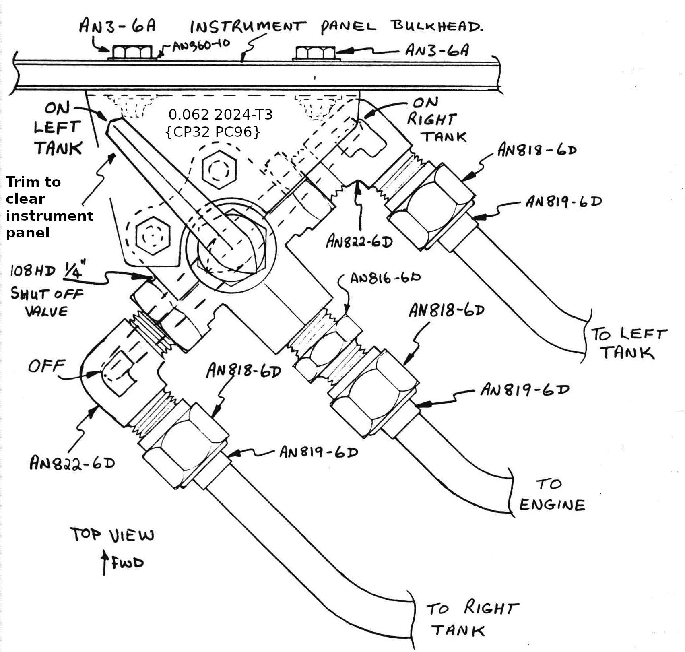

# CHAPTER 21

## Wing strakes - baggage, fuel tanks, and fuel system

**Overview** - This chapter is late in the construction so other things can be built without having to lean over the large wing strakes.
The strakes provide several functions:
1. torsional stiffness and strength for center-section spar,
2. crew accessible map stowage and baggage areas,
3. two 25.5 gallon selectable fuel tanks with sumps, and aerodynamic lift.

 Figure 21-1: Strakes

In this chapter you will jig and build the baggage areas and fuel tanks out of glass and type 45R rigid PV core, install fuel sumps (to provide fuel in unusual attitudes including sideslips, nose-down parking, and steep descents), plumb fuel lines forward to a valve and back to the pumps and gascolater, and plumb vent lines.
The complete fuel system shown **supersedes** information in Section IIA and IIC – do not use engine installation details from these sections for fuel system.
The location of all components and plumbing is important to the correct operation of the fuel system.
**Do not modify**.
The instructions refer to only the right side – left is similar except where indicated.
Start by studying the plan view drawing, and all section views to acquaint yourself with the strakes.
Exact plan-form accuracy is not required.
If in doubt just trim or shim to fit.
Do use care to set the incidence by setting the 17.4 waterline correctly.

 Figure 21-2: Fuel system

The ~~accompanying sketch~~ Figure 21-2 outlines the fuel system.
It is a two-tank, selectable, pumped (not gravity) system with an engine-driven pump plus an electrical backup pump.
This is similar to most low-wing light planes – Grumman, Piper and Beech.
The selection valve (left-right-off) is located on the lower front floor, just below the instrument panel.
The gascolator and electric pump are mounted on the firewall.
Each tank has a sump to provide continuous fuel flow during unusual attitudes, descents and nose­down parking with low fuel levels.

### Step 1 Mark and cut fuselage and make parts

Fabricate the parts shown below in Figure 21-3 and the R23 and R45 ribs shown full size on page A14.
These are all made from type 45 PV core (dark blue) foam.

 Figure 21-3: Strake rib dimensions

 Figure 21-3: Strake rib dimensions

{Refer to Figure 21-4 and mark} the out­board skins layout {especially} the 22.4 and "A" dimension **before** cutting off the 32 x 4.9 diagonal {at the rear of the foam}.
The T.E. bevel is to fit under and over the bevels on the center-section spar.
You will need 6 32" x 48" sheets of type 45 PV core.
Butt together with micro any necessary joints.

Figure 21-4: Right Strake Foam Dimensions

Refer to the drawing in Figure 21-5 showing fuselage dimensions.
Left side is shown, right is similar.

Figure 21-5: Left fuselage holes into strake

Layout the lines shown, inside **and** outside lines of the fuel tank skin (0.35" apart).
Using a sabre saw or pin router, cut the large holes in the fuselage side.
The aft edge of the forward hole is flush with the face of the front seat bulkhead.
A 2 inch diameter drum sander with coarse drum on your drill motor is great for final shaping of these cutouts.

### Step 2 - Jigging, and inital assembly

See page A14.
Jig the airplane to a flat table as shown {in Figure 21-6}, or jig a flat piece of 4' x 4' plywood up, flush with the bottom of the center-section spar.

Figure 21-6: Jig table for strake construction

**Level** the table (or plywood) and level the fuselage longerons.
Fabricate the 35 x 1.45 x 2.15 jig board from wood or foam.

 Figure 21-7: Jig Board

Now, fit the inboard and outboard bottom skin in place and fit the DB, R45, R23, B23, BAB, BLE and TLE parts together – temporarily hold in place with nails.

 Figure 21-21: Strake rib locations

Bevel ends of the TLE and BLE to fit.
Jigging is easy if the curve in the skins is permanent.
To put a permanent curve in the skins, weight them into a curved shape with 2 boards as shown {in Figure 21-8} and heat with a 1000 to 1500 - watt hair dryer or heat gun.
**After cooling**, remove boards.

 Figure 21-8: Bend Strake foam with a heat gun

When jigged properly, the WL 17.4 mark on rib R45 should be 2.65 inches above the table and rib R23's 17.4 WL mark should be 3.45 inches above the table.
Refer to page A 11 to see the use of the 1.45/2.15 jig board.
It supports the lower skin LE at the correct height, full span.

Lay some plastic or grey tape on the table to avoid gluing things to it, then mix up some micro and glue the following pieces permanently in place:
outboard and inboard bottom skin, BAB, TLE, BLE, R45 and R23.
Be sure to use enough micro to avoid voids in the fuel tank area.
Wipe a small radius in all corners and recheck alignment.
Allow to cure.

Cut the 1 1/4" hole near the inboard aft corner of the inboard bottom skin (see page 21-1).
Bevel it as shown in Figure 21-19} section H-H.

Install a 1" x 1" piece of 1/8" thick 2024T3 aluminum at the low drain position for nose down parking – {Figure 21-19} Section I-I.
This piece is drilled an tapped 1/8-27 ~~1/4-27~~ NPT pipe thread **before** installation. {CP28 PC60 MEO}
Be sure the tapped hole is deep enough for correct positioning of drain valve.

 Figure 21-9: Drain plug mounting plate

### Step 3 - Inside layups

Now glass layup 1 – one ply BID into the entire fuel area, lapping up 1" onto the fuselage and spar, and completely onto both ribs, TLE and BAB.
See {Figure 21-19} sections A-A, B-B, D-D and G-G.
This is easiest in several pieces - overlap 1" on any joints.
This layup should appear wet to avoid pinholes that can leak fuel.
While its still wet, install B23 and DB, glassing their sides with a single BID ply (layup 2) that laps onto the bottom – {Figure 21-19} section E-E.
B23 should be installed first so its glass laps directly onto the outside face of R23.
Glass one ply BID (layup 3) on the outside face of R45 that also covers the bottom skin and laps 1" onto the center-section spar ({Figure 21-19} section D-D).
Add a 2 inch wide strip of 2 plies UND along the outer diagonal edge of the bottom skin, lapping 1" onto the spar.
Fiber orientation along the long (22") dimension (see F-F).
Layup 3 also includes 1 ply BID that covers the bottom floor of the baggage area, lapping onto R23, BLE, BAB and the fuselage, as shown in {Figure 21-19} sections D-D, B-B, C-C, and G-G.
This layup laps up onto the glass-to-glass fuel sight-gauge on the fuselage side.
Knife trim the baffle notches.
Knife trim edges shown in all sections.
Knife trim open the l¼" diameter hole, and the drain hole.
Remove the foam under the drain insert as shown and install a 1/8 NPT plug.
Check that the drain is at the low point for nose-down parking.
If not, trowel in micro as shown.
Now, allow layup 1, 2, and 3 to cure.

Figure 21-10: Install drain plug

### Step 4 - Vent and screen

Referring to Figure 21-11 ~~the sketches~~, install the 1/4" aluminum vent line.
Apply a liberal amount of wet flox around the fuselage hole, both sides.
Be sure to sand the aluminium dull for bonding.
Install a dome-shaped aluminum screen over the 1 1/4" hole – see ~~sketch~~ Figure 21-11 and Figure 21-19 section H-H.
This provides the same function as a finger-strainer, protecting the fuel system from large-size contamination.

Figure 21-11: Fuel tank vent routing and sump location

### Step 5 - Top skin cores

Now, grab the two pieces of top skin, heat form the curve, and fit them into place.
Hold in place with weights.
Be sure they fit against, or within 1/10 inch, to all fuel tank walls.
Stack the lumber on as shown and attach the lumber with dabs of Bondo.
This lumber holds the top skin in its correct shape while you remove it for glassing.
If you omit the lumber trick, you **will** wrinkle the layup.

 Figure 21-12: Top skin formation

Now, remove the top skin/lumber assembly turn it inside ­up and glass its surface with 1 ply BID (layup 4) plus the 2" wide strip of 2 plies UND at the outboard diagonal ({Figure 21-19} section F-F). See Figure 21-15.
Leave 1" of the BID **dry** and hanging over the edge all along the inboard edge.
Sissor trim the other edges.
This layup should appear a little wet.
Let cure only about 2-4 hours – enough to get a good grip on the foam, but still tacky.
Then, **clean** the tank insides, paint epoxy along all joining edges.
Paint a fresh coat of epoxy on the inside skin (layup 4) where it will join, then invert the assembly and carefully place it down into place using care to not wipe off the flox with sideways motion.
This trick takes 2 to 4 people.
Hold in place with weights, nails or clamps. Wet the 1" dry edge of BID onto the fuselage side (section C-C and G-G.
Inspect in the baggage area and all around to insure the lid is down in place everywhere.

You may need to remove lumber to assure its all weighted into position.
Before cure, install layup 5 – tapes of 1 ply BID that connect the top to R45, R23 and BAB.
Also, layup 6 – a one-ply BID tape at {Figure 21-19} section C-C.
Cover any remaining bare foam edges around fuselage cutouts with 1 ply BID.
Use care to not get any micro or flox on the fuel sight gage area.
Be sure these layups are wet-enough to avoid air or pinholes that can leak fuel.
Allow to cure, without moving things and with the vent line open, so the tank can breathe.
Do **not** leak check yet – the tank is not structural until after step #8.

### Step 6 - End rib and outlet plumbing

You can now remove the table or plywood jig.
Fabricate OD by holding a piece of foam against the skin cores and marking top and bottom.
Cutout the oval hole.
Glass the inside with 1 ply BID (layup 7) and flox in place holding with nails.

 Figure 21-13: Rib OD

Layup 7 should connect to the spar at the aft end of OD, similar to layup did to the fuselage.
After cure, trim and round edges ({Figure 21-19} section F-F).

Layout and drill the 7/16" hole in the fuselage under the tank.
Fit an eight-foot length of 3/8 x 0.035 1100-0 soft aluminum tube from the front cockpit floor, right side of the cockpit and to the 7/16" hole.
The tube must lie in the corner of the fuselage side and after seat bulkhead before going through the 7/16" hole.
It should extend only 0.4" outside.

This provides stress relief to protect it from leakage at the fuselage side.
Note that both lines rout down the right cockpit side.
Route the left tank line aft of the aft seat bulkhead just below the large access hole.
Fabricate a small wood plug as shown to keep epoxy out of the tube.
Clean and dull its surface for bonding.
Paint epoxy on the tube and fill the hole with flox.
Install the tube through the fuselage using liberal wet flox covered with 1 ply BID to hold it firmly in the corner of the aft seat bulkhead.
If you hold a finger over the outside hole as you push the tube through it will force the flox around the tube, rather than push it out.
Remove the wood plug after installation.
Do not move things during cure.

 Figure 21-14: Fuel line exit from tank

 Figure 21-14: Fuel line routing

### Step 7 - Bottom outside skin and sump

Turn the fuselage over.
Stuff a rag inside the 1 1/4" hole to prevent contamination.
Using a hard 36-grit sanding block, fair the PVC edges as required to fair into the spar and fuselage.
Round the leading edge and OD {Figure 21-19 section F-F and B-B). Sand the spar surface for bonding.
Blow or vacuum off dust.
Trowel wet micro into any voids, particularly around the fuel tank area.
Remove the rag.
Remove the 1/8" NPT drain plug.
Trial fit the sump blister.

Referring to ~~the sketch~~ Figure 21-15, glass layup 7 the two crossing UND plies, lapping 4" onto the spar, 3/4" onto the fuselage, fully down the face of TLE and BLE and half way down OD.
The first ply covers the entire strake with fibers parallel to the **tank** leading edge.
The second ply also covers the entire strake with fibers running fore - aft.
**Butt** any required joints.
Third ply is a 5 inch UND strip.

 Figure 21-15:Skin of strake layups

Now, while this layup is still tacky install the sump blister with wet flox and a 1 ply BID tape (1" wide) all around (layup 8 - Figure 21-19 section H-H).
Caution – do not get flox in the 3/8" tube.
This layup must look **wet** to avoid fuel leaks.
Be sure the tank vent line or 3/8" tube is open to allow the tank to breathe during cure – otherwise a pressure change will cause a leak.

 Figure 21-16: Fuel tank sump

### Step 8 - Top skin

Fair the top, round the corners, sand the spar, remove dust, trowel micro in voids, and glass layup 9 - the top skin.
It is similar to the bottom skin {Figure 21-15}, except a 4th ply is installed as shown on the **left only** to allow you to later sit or stand on the strake when entering the aft cockpit.
Peel ply edges for a good transition.
Cure.

### Step 9 - Pressure check

Re-tap the 1/8" NPT drain hole and install the drain or a plug.
Do not over-torque.
Use Teflon tape thread seal.
Plug the 3/8 line in the forward cockpit.
Hook the vent line to an altimeter through a tee.
Blow a pressure of 1500 feet altitude **change** into the tee and plug. {1500 ft altitude change is 0.8 psi - don't use a shop air compressor! maybe an electric tire pump (small volume)}
Let the tank set for several hours to check for leaks.
Ignore small variations in the altimeter – these are due to atmospheric pressure changes and temperature changes.

If you have a leak, first use soap bubbles brushed around all plugs and fittings, then around tank joints.
It is OK to remove some of the forward end of OD to check or repair a leak in that corner.

If you find a leak in the composite structure, first rinse off all soap with clear water and let it **fully** dry (hair dryer helps – otherwise give it a full day).
Then suck a **negative** pressure on the tank and continuously brush epoxy into the leak, letting the negative pressure draw the epoxy into the hole.
Then, open the vent (no pressure) and continue to brush epoxy on the leak area.
Let cure with **no pressure**.

### Step 10 - Leading Edge and Outboard fairing blocks

The leading edge fairing blocks are made of solid urethane foam (styrofoam is
dissolved by fuel). It is a wise precaution to sand the leading edge of the tank
and squeegee still another coating of epoxy on this surface, because it will be
impossible to reach later on. Now 5-min. some urethane blocks in position, and
carve to a rounded shape, matching the nose of ribs R23 and R45. Don’t alter
the leading edge of the strakes from that shown in the plans. Spline sand smooth
and cover with 2 layers of UNI crossing at 45 degrees and lapping 1/2 in. onto
the top and bottom skins and fuselage. Peel ply edges. {CP30 PC84 MEO}

Drill a 1/4" hole through the bottom skin near the leading edge between OD and R45.
This will vent this area and drain any collection of moisture.
The remainder of this step can be omitted until finishing – since wings have to be fitted.

The fair block is non structural.
You may make it hollow or solid, using 2 lb/ft3 urethane or styrofoam.
See chapter 23 for installation of strobe unit, if desired.
Mount the wing, then fair the block to fit.
Cross two plies UND for a sufficiently durable skin.

### Step 11 - Fuel valve, electric pump and gascolator

Refer to Figure 21-17.

 Figure 21-17: Fuel valve

Install the shelf and valve on the instrument panel.
Orient for correct left ­right pointing of the valve handle.
Plumb the left and right 3/8" fuel lines.
Plumb and run the 3rd 3/8" fuel line down the right side and through the firewall.

Mount the electric pump and gascolator as shown and plumb the tubing.

 Figure 21-18: Firewall mounted fuel elements

**NOTE:** Many of the Continental 0-200 engines are not equipped with a mechanical fuel pump.
On some, a mechanical pump can be easily adapted.
On others, this requires major work involving a different cam and machine work on the case.

At press time for printing these plans, test work is underway to evaluate several fuel system configurations to allow use of the non-pump-equipped O-200s.
They include:

1. A system with free-flow check valves that use gravity as primary and the electric pump for backup and nose-down parking (no engine mechanical pump).
2. A system using the electric pump as primary and a Christian #844 wobble pump as backup (no engine mechanical pump).
3. A new pump drive on the engine's vacuum­ pump pad.

All three systems work.
We are currently evaluating all three and will select one, based on reliability, cost, and weight considerations.
Details of the selected system will be furnished in Canard Pusher newsletter #24 or #25.

### Fuel Cap and grounding

Fuel caps, specifically designed for ~~VariEze~~ LongEZ are available at a Long-EZ distributor.
These are a sealed unit, locked, as shown in the drawing, by a Dzus fastener.

Do **not** substitute a vented cap.
Do **not** substitute a cap that does not have a reliable lock.
Wait until after your aircraft is painted to install the fuel
caps: This will result in a neat installation and avoids contamination of your fuel tank.

To install the cap, bore a hole in the position shown in Figure 21-2 in the aft half of the fuel tank, with a 2-¼" hole saw.
Trial fit the cap.
Dull the metal rim bonding surface with 100-grit sandpaper.

To reduce the chance of a fire when fueling the aircraft, install a metal fuel cap on each fuel tank that has an attached grounding cable inside the fuel tank, with enough wire to reach the forward edge of the tank when the aircraft is kneelng. To ensure the fuel cap stays attached to the aircraft include an obstruction within a foot of the cap that is larger than the fuel filler hole as shown in Figure 21-19.
The fuel filler and cap should be installed before the fuel tank is vacuumed, as it will produce debry in the tank.
During filling the fuel trucks ground wire will be attached to the fuel cap.
{CP55 PCS134 MEO}

Now, tape a 1" tube to a vacuum cleaner hose and thoroughly clean the foam chips out of your tank.
Mix flox and trowel it into the lip and coat the metal rim.
Drop the rim in place and wipe excess flex from around the rim edges, tip, and bottom.
Be sure to wipe any flex off the inside of the rim.
Weight it into place and cure.

 Figure 21-18: Fuel cap construction

 Figure 21-19: Fuel cap grounding

 Figure 21-20: Strake to Center section spar sections

 Figure 21-21: Strake rib locations
