# Chapter 22

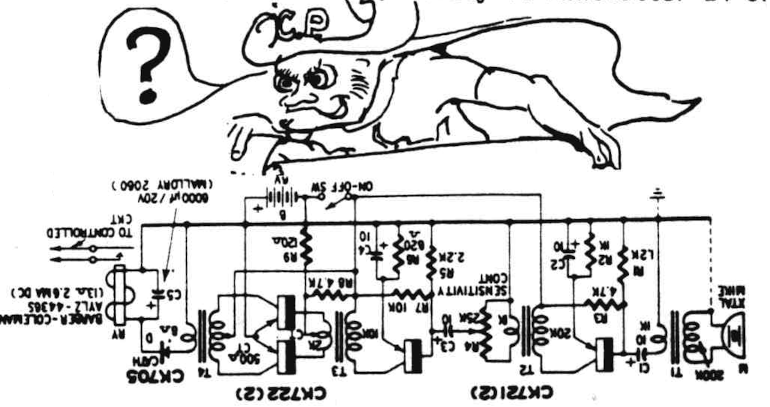 Figure 22-1

## Electrical System

This chapter presents two alternatives to the electrical system:
System I is low cost, **light-weight**, providing sufficient power for the engine instruments, the warning system, a NAV com radio and an electric turn/bank gyro.
This is adequate for day-VFR flying.

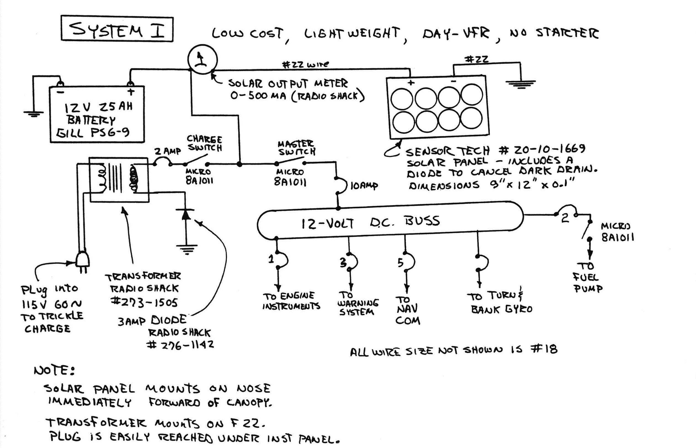 Figure 22-2: System 1 NO Starter

System II uses either an alternator or generator and is sized to allow installation of lighting for night flying, electric engine starting and additional avionics.
We recommend system I because it provides the lightest, lowest maintenance, lowest cost installation.
It results in a better performing airplane with longer range and more fun to fly.
In addition, it keeps the CG further forward where the flying qualities are most solid.
This is a definite consideration, particularly for pilots weighing less than 160 lb.
Both systems use the 25 amp-hour battery in the nose to provide the correct CG.

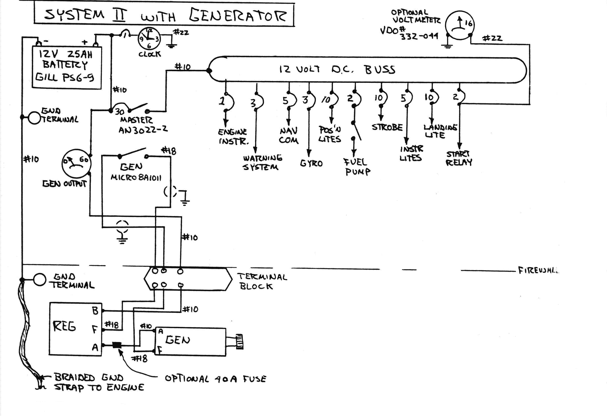 Figure 22-3: System 2: Add Generator and Starter Circuit Diagram

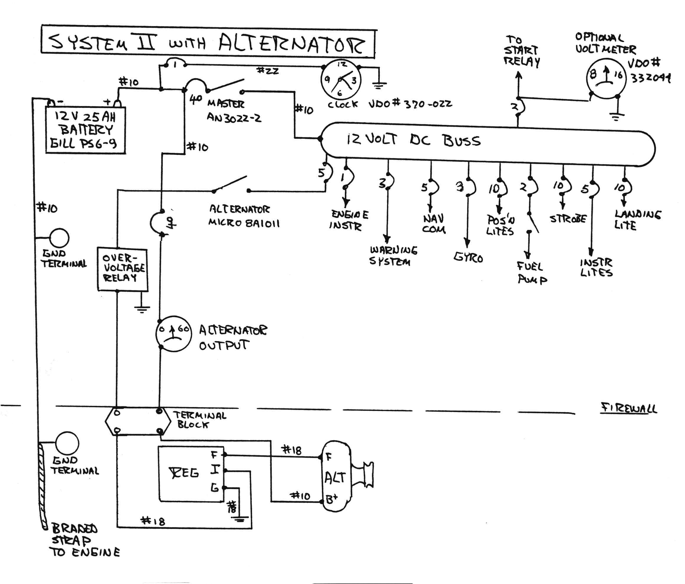 Figure 22-3: Systemm 3 - Starter and Alternator Circuit Diagram

Use system II **only** if you require night lighting or extensive avionics.
Remember, the Long-EZ is smaller than the average light plane and thus is effected to a greater extent by the addition of excess weight.
A light Long-EZ is a thrill to fly and has extensive utility.
A Long-EZ that is loaded down with extensive systems, avionics etc, can be so heavy as to preclude two-place operation and destroy its exciting solo performance.
**Resist the temptation to add anything**.
In an airplane this small you should be carefully counting grams, not just pounds of excess weight.
The best test to decide whether something should go in the airplane is as follows.
Take the object in your hand.
Toss it up into the air – if it comes down, it's too heavy to belong in your airplane!

Starter – Electric start, while available for the Long-EZ, does compromise it enough so that we recommend **against** its installation.
The engines are easily hand-propped, particularly since you
have a pusher with nose-down parking.
In this configuration most aspects of manual start are considerably safer than for conventional aircraft – see Owners Manual.
The plastic airplane does not conduct.
Thus, your large heavy start cable must run to the battery and back.
Electric start adds over 25 lb weight, most of it aft on the engine.
You will initially want to fly your first flights at forward CG and at as light a weight as possible (see Owners Manual).
Therefore, even if you insist on needing electric start, **leave the starter and heavy cable out for your initial test flying**.
This will avoid possible nose ballast (thus a double weight penalty).

The systems are presented as follows:
Basic wiring schematics for System 1, System II -
generator and System II - alternator.
Then, the individual diagrams for warning systems, lighting, engine instrumentation and starter.
Finally, installation general arrangement sketches detail items like mounting of equipment, battery box,
routing harnesses, antennas etc.

If you are not familiar with aircraft electrical systems, get some help from someone, or study references covering basic wiring practices/techniques.
The "Mechanics Bible", EA-AC 43.13-1A2 *Aircraft Inspection and repair - Acceptable Methods and Practices* covers much of this.
Obtain from US Government Printing office or Aviation Maintenance Foundation, Box 739, Basin, WY 82410.

Due to the wide variety of builder preference, no attempt is made to list a bill of materials.
Add up your own requirements from the specifications shown.
**Always follow individual manufactures recommendations** when installing electrical equipment
(strobes, regulators, etc).

In general, it is preferred to mount equipment as
far forward in the airplane as possible for CG reasons – except for heavy pilots and no electric start.
For example, it is better to put the start relay, over voltage protection, etc. up on the front of F22 bulkhead rather than back on the firewall.

We show an over-voltage relay in the alternator field circuit.
This relay is not required for normal operation but would protect your radios if the regulator failed closed and the alternator produced more voltage than the other systems could handle.
Generally, the battery prevents this from happening, but the over-voltage relay is good insurance if you have a stack of expensive radios.

We don't show a master relay.
All normal current can be run through the master switch shown.
However, if you are considering an extensive amount of avionics and other gadgets, a master relay may be necessary.
Remember throughout your wiring that each unit must be grounded.
Leave enough room on the ground bus to accommodate the large number of ground wires that will be connected there.

If your aircraft has a starter be careful that it is not inadvertently activated.
Use a guard on the switch and **always** disconnect the starter lead before performing **any** maintenance on the aircraft.
The alternator needs the field circuit energized (12v) before/during operation.
The alternator won't operate without a battery (dead or disconnected).

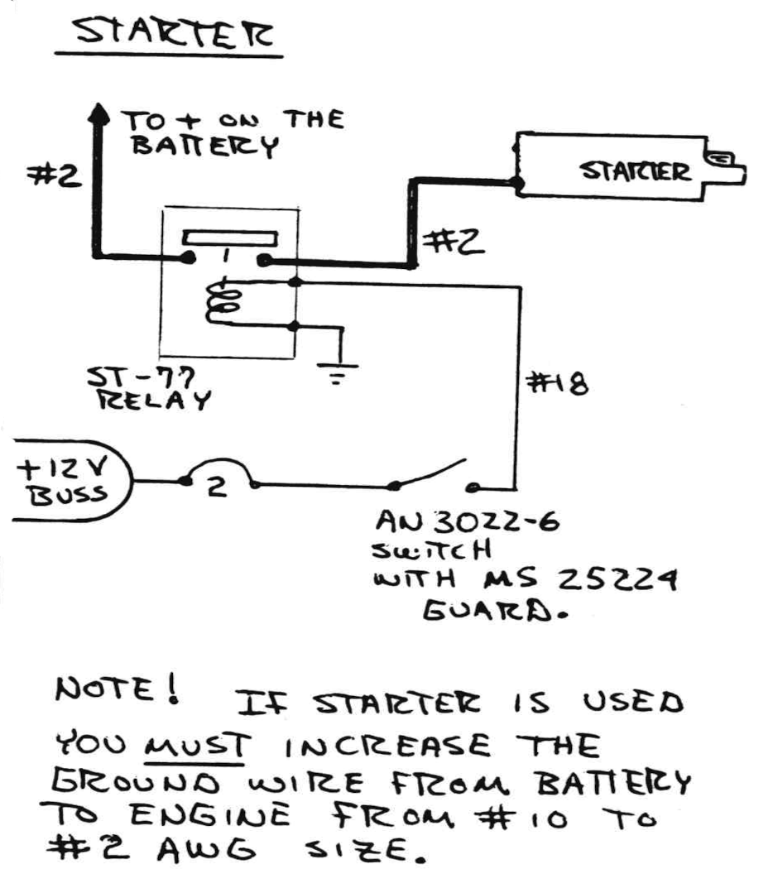 Figure 22-4: Starter circuit diagram

However, the generator will.
Refer to the generator wiring schematic if one is used.
Generators use a different regulator and wiring.

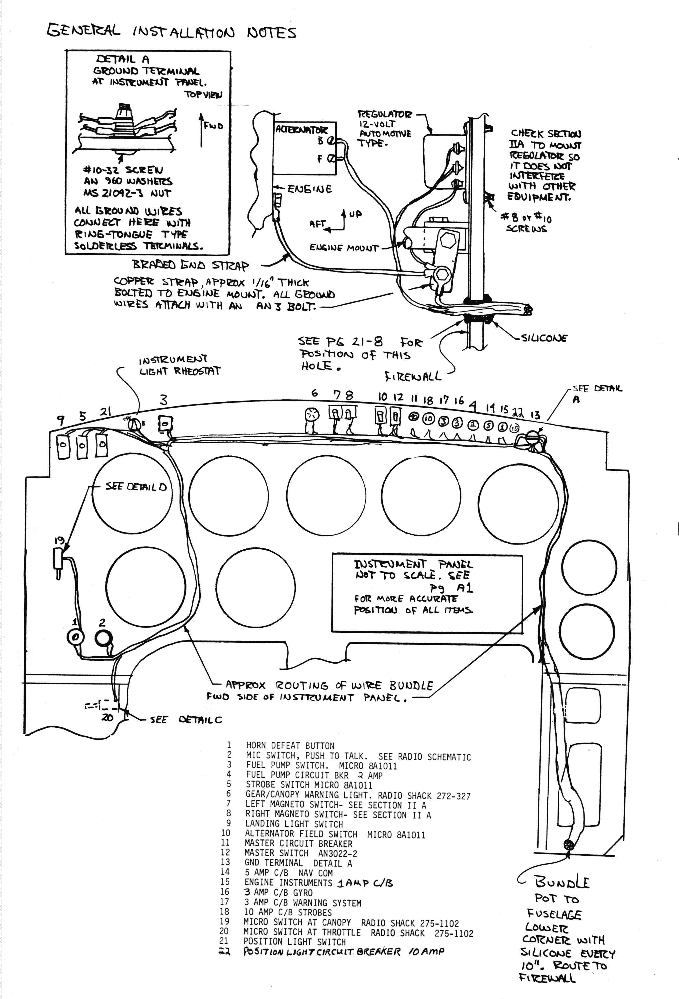 Figure 22-5: Generator and Instrument panel wiring

Always be sure the battery is connected to the main bus at any time the alternator or generator is on.
This provides a buffer against voltage spikes/surges and give some protection to your avionics.

Be sure the amp output of the regulator is compatible with the generator.
Regulators for generators regulate both volts and amp out and also have a reverse current protection where regulators for alternators only control voltage output.

### Warning System

This warns the pilot with a light and horn if he advances power for takeoff without fully locking the canopy.
The same light and horn warn him if he retards throttle for landing without the landing gear fully down.
A horn-defeat circuit is included so you can silence the horn (light stays on) for low power flying with gear up (stalls, descents, etc).
The defeat resets upon throttle increase.

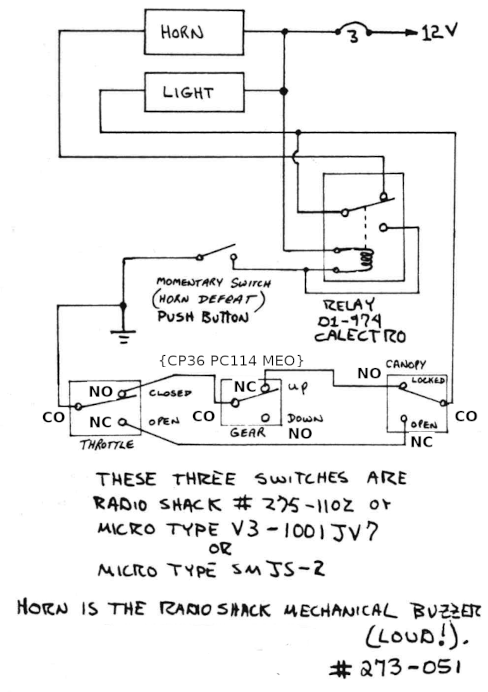 Figure 22-6: Warning system circuit diagram

### Strobe Lights

The Long-EZ is relatively small and is sometimes difficult to see especially in areas of low visibility.
Therefore, a strobe light system is advised, even
for daylight flying.
This can be a single strobe under the nose.
The Whelen System shown provides wingtip strobes and all the red/green/white position light requirements.
It meets the FAA requirements for operations at night.
If you select another system be sure it meets the FAA requirements.
When ordering the strobe power supply, be sure to state Model A413A-HDA-14 "single flash".
This model was made especially for us and has a 30% reduction in current drain.
If it has a "DF" after the HDA it is the higher current model.
Mount the power supply in the center spar fairing (left side) as shown, or on the back of the front seat bulkhead or in the left thigh support.
The A600 PG/R-14 lights must go where shown.
Do not mount lights in the structural winglet attach area or up on the winglet.

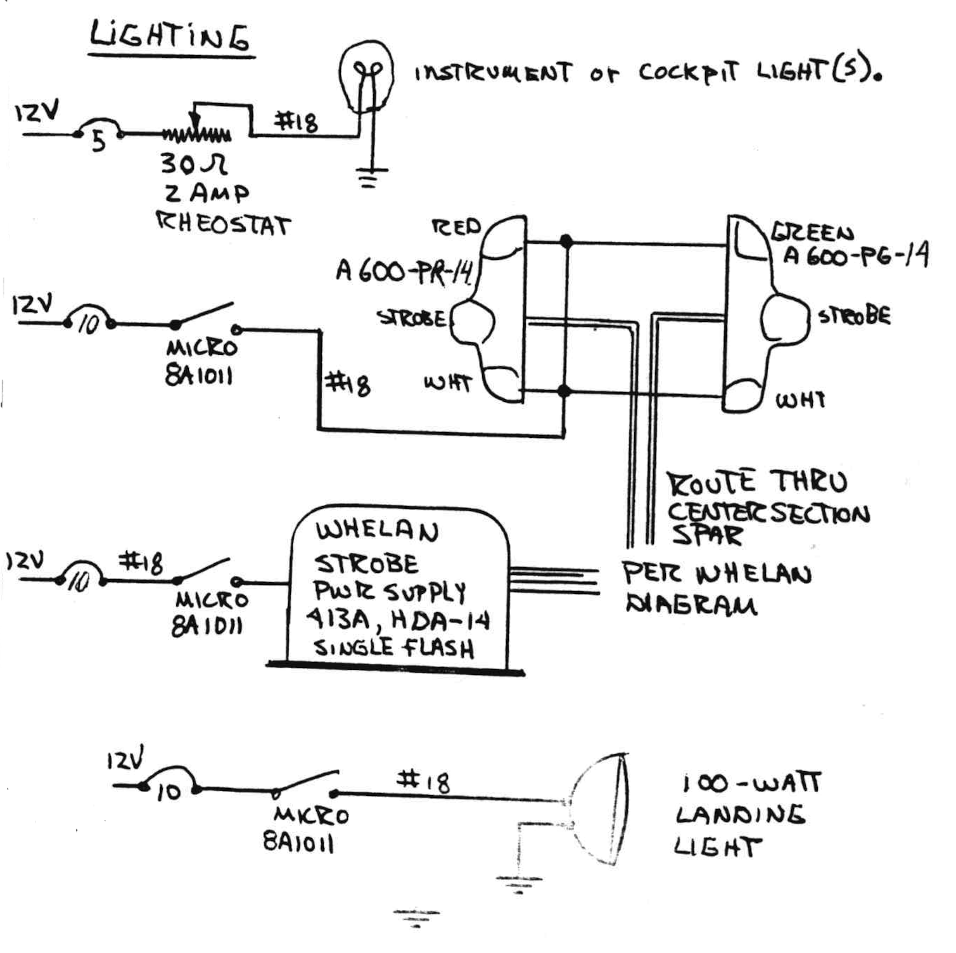 Figure 22-7: Lighting circuit diagram

### Landing Light

The landing and taxi light on our prototype N79RA is mounted in the right thigh support cavity.
It extends when needed to a taxi or landing position.
At press time for these plans we were considering improving the actuation design of this system to make it easier to reach.
When available this design will be provided – probably in Newsletter 24 or 25.

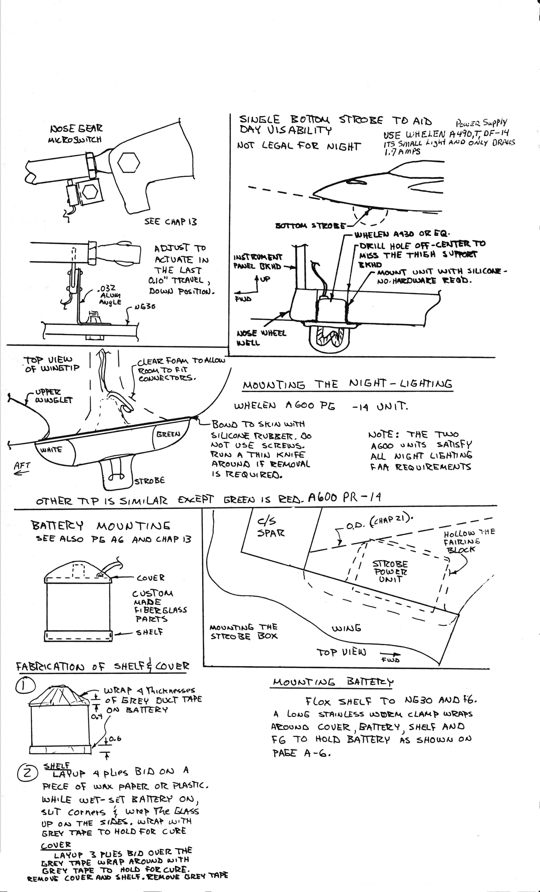 Figure 22-8: Battery and External lights

### Gear and canopy warning

This system has a resetting defeat feature.
The main advantage is the ability to silence the horn, while doing gear-up, slow flight or descents.
The light stays on as long as the throttle is retarded.
Each time you cycle the throttle the horn will sound and will have to be re-silenced.
This eliminates the possibility of switching the warning system off during gear-up descents, and forgetting to rearm it for the landing approach.

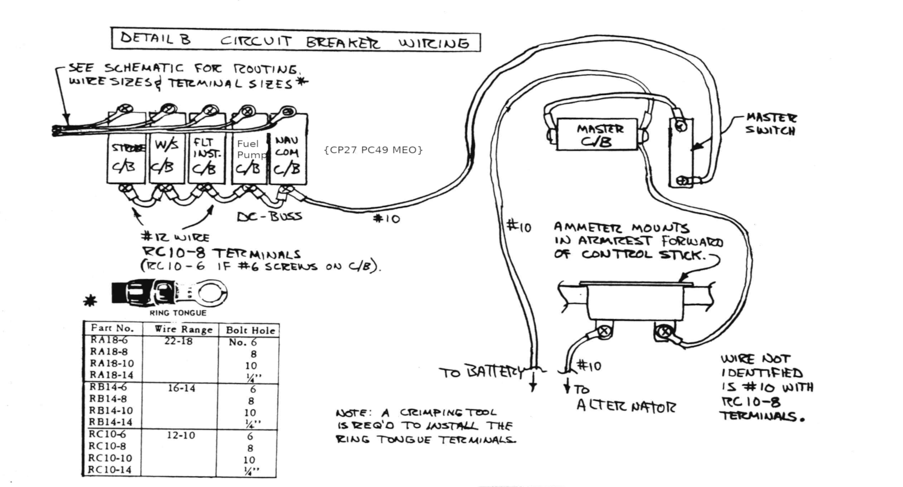 Figure 22-9: Circuit Breakers

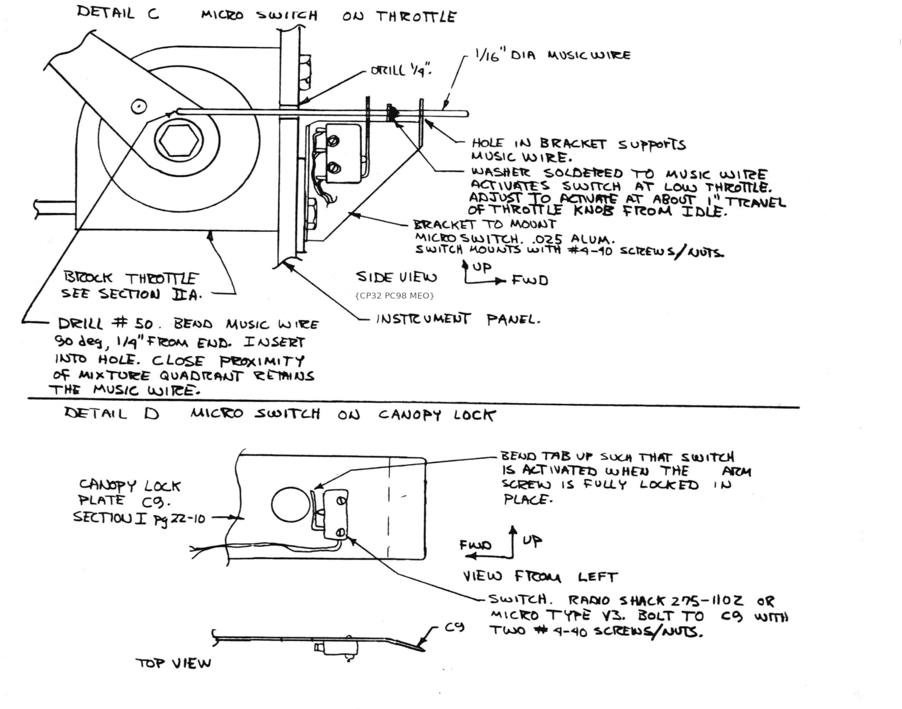 Figure 22-9: Throttle and canopy sensors

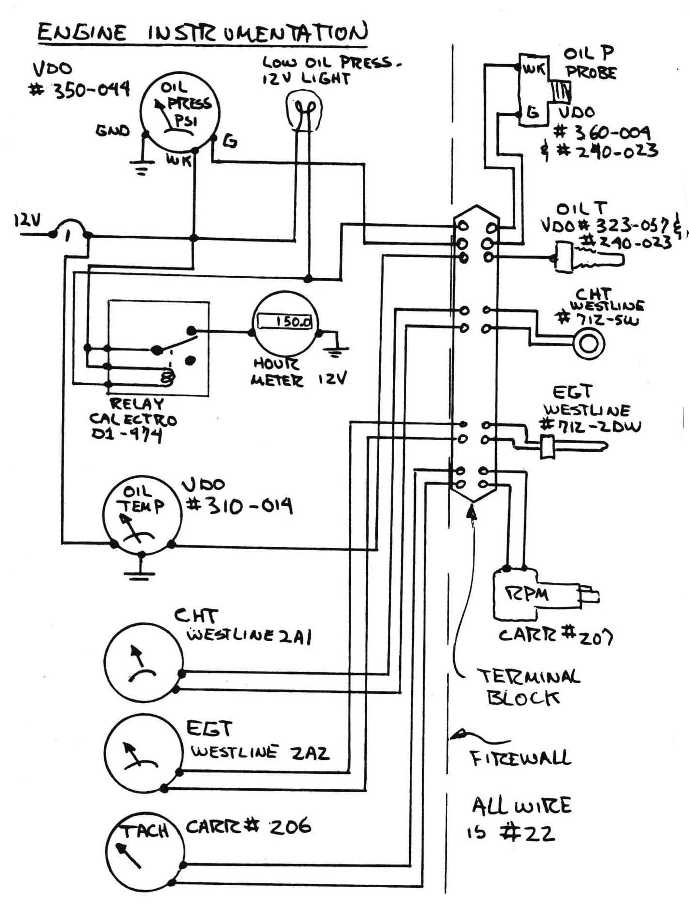 Figure 22-10: Instrumentation ciruit diagram

### Antennas

The antennas that we recommend, and use on the prototype N79RA, are available from Jim Weir of Radio Systems Technology, 10985 Grass Valley Ave. Grass Valley, Ca 95945.

These antennas are cheap, simple and work well.
They consist of four toroids and 48" of 1/2" wide copper foil tape, for each antenna, which means you need two "kits", one for the comm. antenna and one for the Nav. antenna.

#### NAV Antenna

The Nav. antenna should be installed under the canard (on the bottom skin, after the canard is glassed).
The 48" (approx) length of copper tape should be cut into two equal lengths of 22.8" {CP30 PC78 DES}, these two pieces should be
stuck to the bottom skin in a 'V' shape, with the open end of the 'V' facing forward (see ~~sketch~~ Figure 22-11).
The center of the 'V' is treated as per the photo B and Figure 22-11 ~~sketch~~.
Strip your RG-58U coax, and place four toroids over the unstriped coax per photo A.
Note that the toroids are spaced approximately one toroid width apart.
The toroids may be epoxied into place, or you may use shrink tubing as shown in photo B.
The two copper foil elements must be connected to the coax cable as shown in photo B, by means of
two short wires, soldered to the coax terminal strip (supplied), and to the copper foil elements.
A protective ply of BID may be layed up over the copper foil elements, peel ply for a good transition.

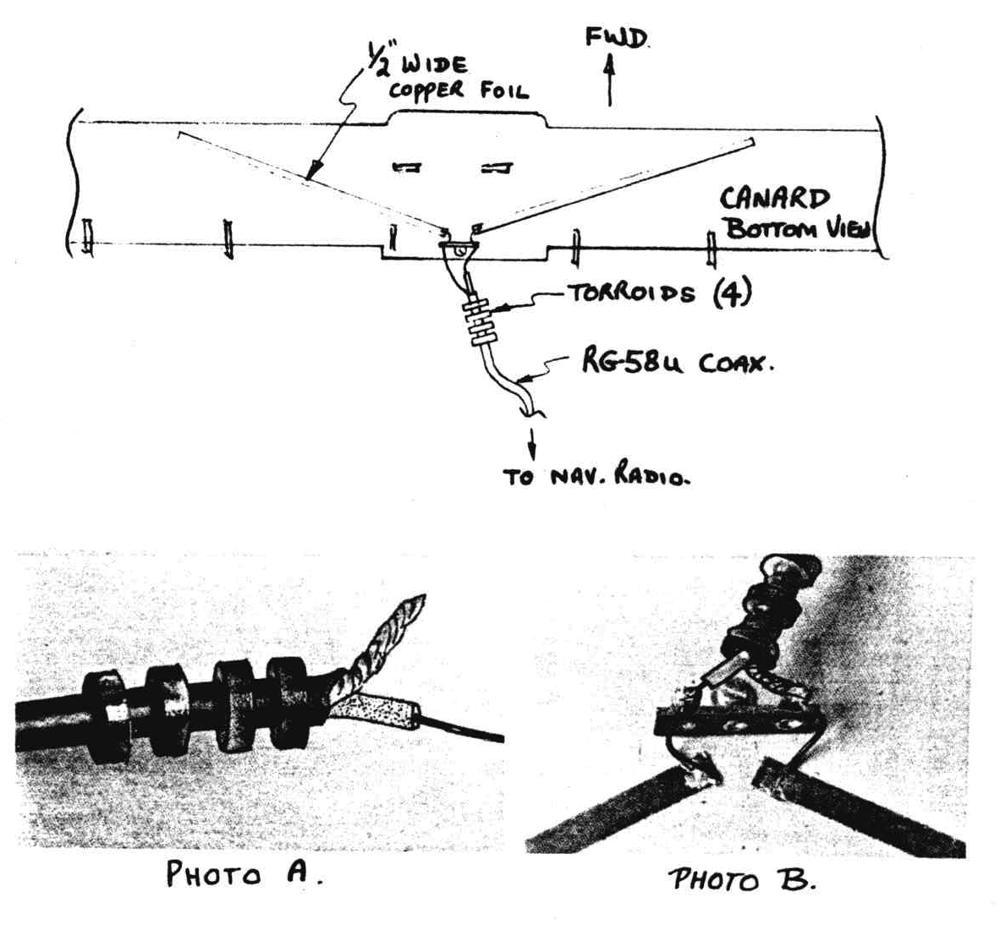 Figure 22-11: Nav Antennas

#### COMM Antenna - Normal Rudder

If you've chosen to construct the original rudder design, then follow this sections guidance and install your COMM Antenna in one winglet.

~~The Comm. antenna is exactly the same, and it is mounted on the bottom of the main gear strut.
Mount the coax terminal strip as near to one side of the fuselage, (where the gear exits the fuselage), as possible.
This ensures that one copper foil element extends out of the fuselage and down one leg, with as much vertical orientation as possible.
The **center** conductor of the coax must be connected to this copper foil element.
The other element will go through the fuselage, over each gear attach tab, and must be connected to the coax shield.
You may apply a narrow strip of BID over the copper foil for protection and again, peel ply it for smooth transition.~~ 

The COMM antenna fits in the winglet as shown in Figure 22-11. Install copper foil before glassing the inside skin of the winglet (left or right). Cut two strips of copper foil 20.3" long, remove the protective backing and stick the foil to the foam an inch from and parallel to the trailing edge. Measure the rudder cut out area and bend the lower (2") end of the foil forward to miss the rudder. From where the two foil strips come together cut a slot just deep enough to hold the RG-58U/A lead in cable flush with the foam surface. Hold the lead in with tooth picks similar to the method used to hold the rudder conduit in Chapter 19. Be sure the Ferrite Balums are installed just above the connection as shown. Solder the center wire of the RG-58U/A to the top foil strip and the outside "ground" braid to the lower foil strip.

Be sure the upper and lower foil strips don't touch or short out. Use about 1/8" separation. Check that none of the wire, ferrite balums etc. stick up above the foam surface, trowel in dry micro around the solder joints as well as other voids and glass the inboard winglet as per the plans.

Coil up the excess cable and thread it through the wing during winglet installation.

The antenna kit is available from Radio Systems Technology, 10985 Grass Valley Ave., Grass Valley, Ca. 95945.

{CP26 Page 7 - Mounting the COMM antenna on the main gear broke the antenna foil, the antennas failed.}

This completes the antenna installation.

 Figure 22-11: Comm Antenna

#### COMM Antenna -- High Performance Rudder

If you have chosen to construct the high performance rudder then follow these instructions to install your COMM antenna.

The COMM antenna fits in the winglet as shown in Figure 22-12. Install copper foil before glassing the inside skin of the winglet (left or right). Cut two strips of copper foil 20.3" long, remove the protective backing and stick the foil to the foam 3 inches forward of and parallel to the rudder hinge line. The upper end of the foil should be as close to the end of the wing-let as possible so that the lower end is above the W.L.25 location of the rudder return spring. From where the two foil strips come together cut a slot just deep enough to hold the RG-58U/A lead in cable flush with the foam surface. Hold the lead in with tooth picks similar to the method used to hold the rudder conduit in Chapter 19. Be sure the 3 Ferrite Balums (beads) are installed just before the connection as shown in Figure 22-13. Solder the center wire of the RG-58U/A to the top foil strip and the outside "ground" braid to the lower foil strip.

Be sure the upper and lower foil strips don't touch or short out. Use about 1/8" separation. Check that none of the wire, ferrite balums etc. stick up above the foam surface, trowel in dry micro around the solder joints as well as other voids and glass the inboard winglet as per the plans.

Coil up the excess cable and thread it through the wing during winglet installation. The electrical conduit is at the forward tip of the winglet where it meets the wing. This may also be a good time to pull the navigation and strobe light wiring thru the conduit, if you haven't already.

 Figure 22-12: COMM antenna in the Winglet with High Performance Rudders

 Figure 22-13: Connection of RG-58U/A to Copper tape antenna
