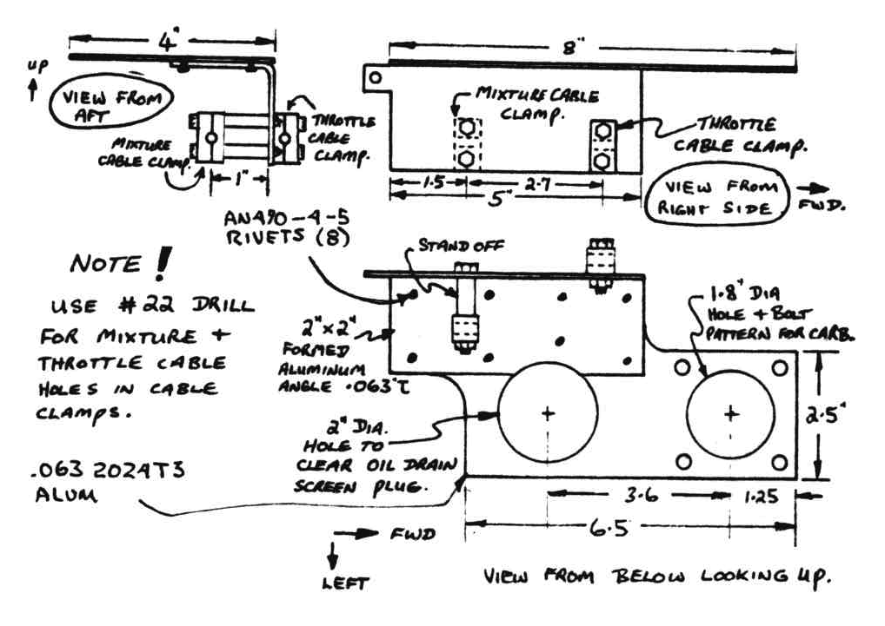
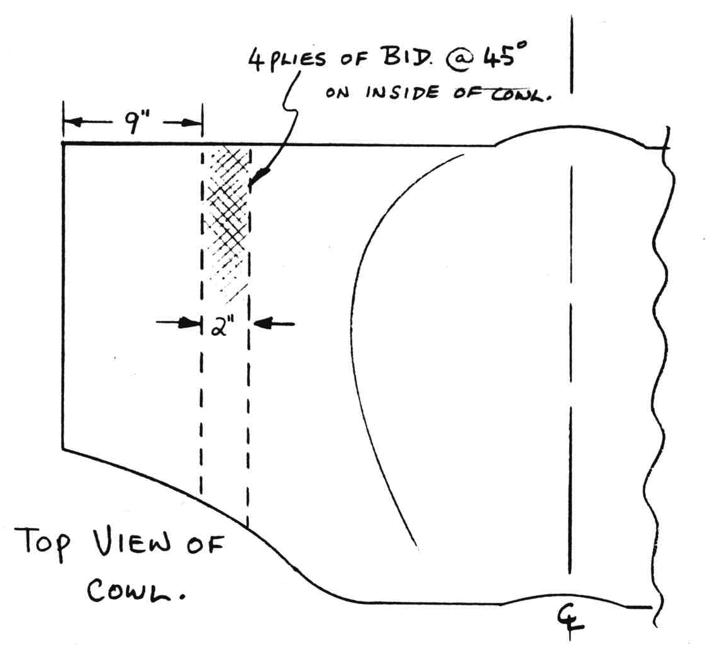
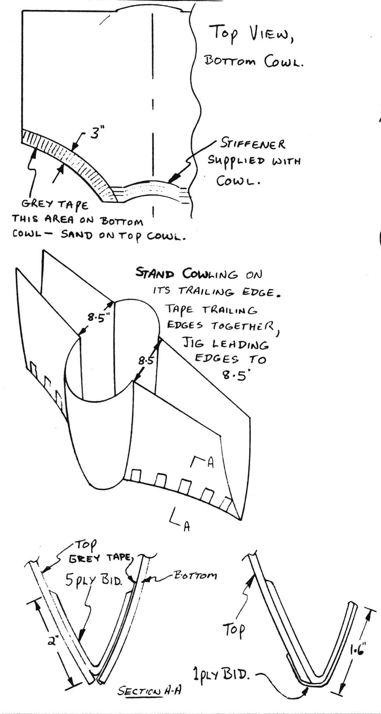
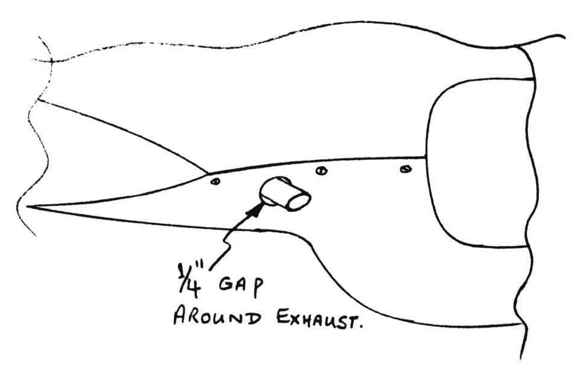
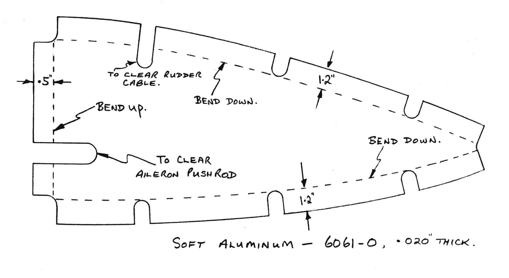

# Chapter 23

## Engine Installation

**General** - Installation of your engine and its systems should be done using either the VariEze sections IIA (Continental) or Section IIC (Lycoming) with the exceptions shown in this chapter.
This chapter updates Sections IIA and IIC **second editions only**.
When the 3rd and subsequent engine installation editions are published these changes will be incorporated and this chapter (23) will not be applicable.

Engine selection - The only recommended engines are the Continental O-200 and the Lycoming O-235.
Anydash number versions of these two engines are acceptable.
These engines, with their normal accessories are within Long-EZ weight requirements.
They have a history of proven reliability and provide more than adequate performance for the Long-EZ.
Both are currently in new production or can be purchased used or overhauled at a considerable cost savings.
Stripped down versions of higher horsepower engines do meet the **weight** requirement but are not recommended because the aircraft would be operating in an area outside the design/aerodynamic envelope intended.

The gravity-only VariEze fuel system is not adequate for a Long-EZ.
Do not follow any IIA and IIC information regarding fuel system – fuel tanks, plumbing, valves, gascolator, etc.
**Do** install your complete Long-EZ fuel system as shown in chapter 21 of **these plans**.

Remove and destroy the bill of materials, page 2 Section IIA / page 38 Section IIC.
The bill of materials for the engine installation section is found in chapter 2 of this manual.
Note: The vendor listed in IIA and IIC, is no longer the fiberglass supplier.
These parts are now available through Aircraft Spruce and Wicks Aircraft, check current catalogs for prices.

#### Accessories

Section IIA and IIC warnings on accessory removal or canard span changes for CG reasons.
While we do recommend you do **not** use a starter (to increase your useful load), a starter is approved engine and weight can be used if you desire.
Maximum allowed **engine** weight with accessories for a Long-EZ is 246 lb. (up from 215 for VariEze).
Heavy propellors or additional systems (turbo etc) are **NOT** recommended.
Maximum vibrating mass including engine, accessories, exhaust, prop and extensions, oil etc is 286 lb.

#### Throttle Cables

lgnore the YT-3 bracket in Step 1.
Hold the throttle cables temporarily to the fuselage side with tape.
Pot between the tape with silicone and allow to cure (Long-EZ does not have the trough in the fuselage side).

#### Instruments

The VDO instrument options provide better reliability than the lower cost Westach gages shown.
The following are a list of those we have tested and recommend: See Chapter 22.

#### Exhaust System

A new exhaust system was developed specifically for the Long-EZ in 1979.
It features fatigue-relieving joints at the flanges.
It is described in the drawings on page 23-3.
It is available from Brock Mfg.

#### Induction Hose

Caution: Safetying of the wire and cord on the ends of the induction hose (page 13 in IIC and page 17 in IIC) must be **exactly** as shown.
Hose collapse can cause engine failure.

#### Baffles

Baffles should be made 1" large at cowl-fit areas, then trimmed to fit (1/4" between metal baffle and cowl) when cowl is installed.

#### Lycoming Carb Bracket

The throttle/mixture control bracket for the Lycoming (section IIC page 27) has been improved.
Use the drawing below.
It now is a "gasket" between the carb and engine and requires two normal gaskets (either side) when installing the carb.
The small tab on the aft end should be bolted to a 0.063" x 0.6" aluminum strap.
The strap is bolted to an oil pan bolt.
Apply additional damping one by bonding the support to the oil pan with silicone rubber sealant.
The large hole in the support provides clearance for the oil drain.
When rigging the throttle and mixture controls be sure the cable clamps are positioned to aim the cable **directly at**
the actuated arm, with as little flexing as possible.
The controls must work **without** the return springs.
Check this before installing the springs.
The springs provide better snub and eliminate slack.
The throttle and mixture springs return to full open and full rich, should a cable fail.
The throttle return spring can be attached to the firewall.
Some dash models of the 0-235 engine have the oil drain hole in a different location.
Check your engine prior to cutting the oil drain screen plug hole.

 Figure 23-1: Lycoming throttle / mixture control bracket

#### Continental Engine Directive

If you are using a Continental 0-200-48 engine in your Long-EZ, without a starter, be sure to install the "starter needle roller bearing keeper plug" before running the engine.
If you are using a starter disregard the following modification.

Pull the starter cover plate on the top of the accessory section and with a mirror and flashlight determine if your engine has this open roller bearing.
Be very careful not to drop anything down in the case or you will be faced with an engine teardown to remove it.

 Figure 23-2: Starter cover plate and Continental needle keeper

The open needle bearing must be "plugged" to prevent the rollers from falling out.
The plug is a 1/2" diameter shaft inserted in the hole taking the place of the starter shaft.
Refer to the adjacent drawings.
Drill and tap a 10-32 thread in the starter cover plate at the location shown.
Cut a 1/2" diameter aluminum rod to a length of 3.15".
Drill a 3/16" (#10 drill) hole through the center and bolt it to the cover plate with an AN3-34A bolt and AN 960-10 washers under the bolt head.
Safety it with a MS21042-3 lock nut on the outside of the cover plate.
This assembly then inserts into the needle bearing, providing retention of possible loose rollers.
This is a mandatory modification for all Continental 0-200-48 engines without starters.

#### Cowling Installation

The VariEze cowling must be trimmed approximately 9"
on each side to fit a Long-EZ.
The cowl end ribs used on the VariEze are not needed for a Long-EZ.
The cowl attachment to the fuselage and spar are the **same** as a VariEze.
Attachment at the outboard edges where it meets the wing are
Follow the instructions below.

Sand inside faces and layup a 4-ply BID reinforcement on the inside edges of the cowl halves, 2" wide – 4 places, as shown.
Then trim the 9" off the outboard ends, or to fit your wing edges butt to wing edges.

Figure 23-3:Reinforce left cowl

Apply shiny-surface grey duct tape on the inside TE of the **bottom** cowl half as shown.
Sand dull, the **top** cowl half TE area as shown.
Jig the cowl on your floor **TE down**, with the TE taped together and with the front opened 8 1/2" as shown.
Cut 10 strips of 45° BID 4" wide x 15" long and 2 strips of 45° 3" wide x 15" long.
Now, layup the 5-ply BID TE close out.
Cure, then pop off the bottom cowl and layup the 1 ply BID ply lapping onto the top.
Trim the closeout to 1.6" as shown.
This TE close out will have three equally spaced fasteners **on each side**.

Figure 23-4: Cowling trailing edge reinforcement

Screw placement is 8 equally spaced holes along entire forward top edge (cowl to spar and fuselage) and 5 equally spaced holes along **each** forward bottom side (cowl lip to spar and fuselage).

Ignore exhaust cutout holes shown on IIA and IIC.
Install cowl with exhaust system off the engine.
Then, install exhaust and cut the holes in lower cowl where exhaust exits.
Patch any gap greater than 1/4" to avoid excessive loss of cooling pressure.

Figure 23-5: Gap around exhaust stack

The end ribs shown in IIA and IIC are not used.
Instead, the cowl is screwed (or camlocked) to a flange on the wing using 4 equally spaced screws per flange.
The flange is made bottom first, then top when aircraft is inverted, as shown.
Lastly, after screws are all drilled a soft aluminum rib is installed.
It is held by the cowl screws.
The soft aluminum rib (0.20 6061-0) is easily hand-formed to fit your completed flange.
Butt it to the spar at front.
This aluminum rib protects wing and aileron controls from exhaust heat.
The metal rib is cutout to clear aileron and rudder controls.
Make these cutouts small to avoid excessive cooling air loss.
Loss through these can spill air out along any gaps in wing-to-spar joint resulting in aerodynamic drag.
Seal this well in Chapter 24.

There are a total of 40 fasteners in the completed cowl.

Note: If you later make a minor wing incidence change to refine roll trim you will have to elongate slightly the cowl holes at the wing and at the cowl trailing edge.

 Figure 23-6: Reinforce Cowl Edges

The Aircraft must be turned over once to install the cowl.
At this point it is suggested that you skip to Chapter 24 and install the fuselage lower aft cover.
This will eliminate the need to turn the fuselage over during Chapter 24.
Turning the fuselage with the engine installed is not easy.
It requires 7 people, or 3 people plus a hoist with strap attached to the crankshaft flange or prop extension.

You may also want to skip to Chapter 25 (finishing)
and finish the bottom (through primer) while its upside-down.

 Figure 23-7: Metal rib dimensions and construction
