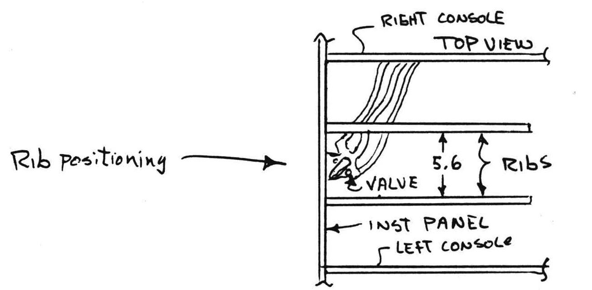
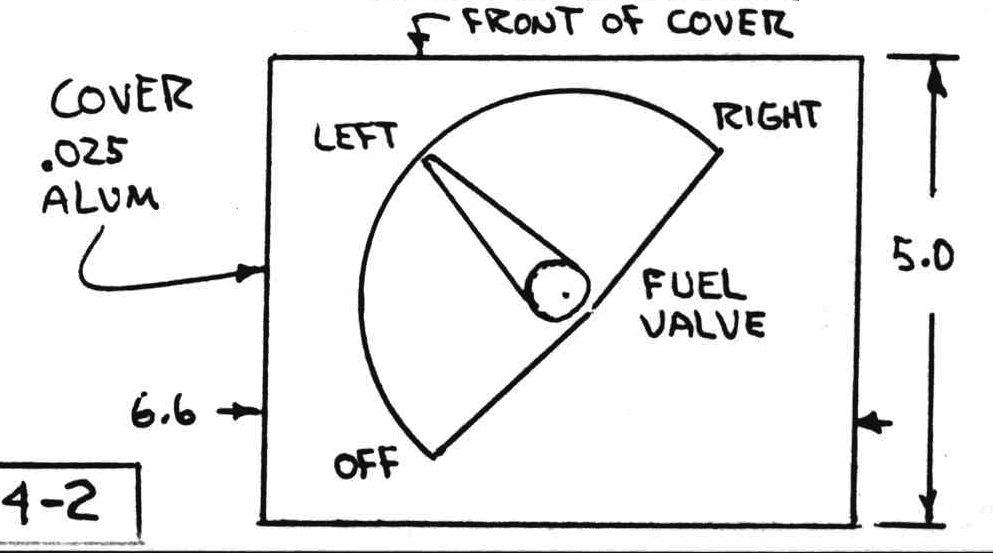
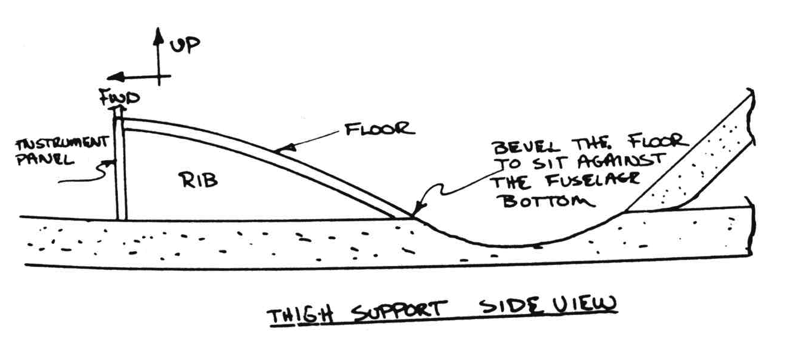
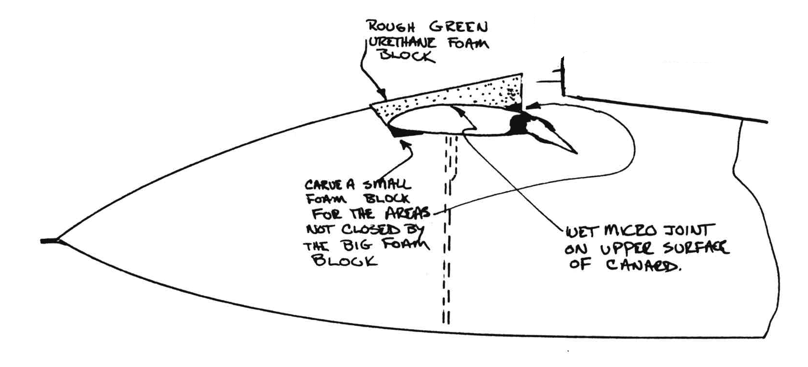
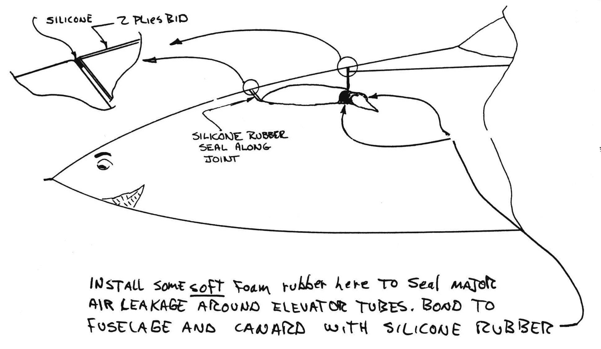
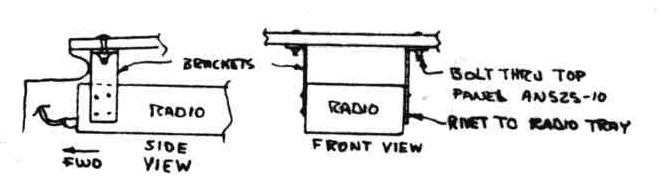

# Chapter 24

## Covers/Fairings/Consoles

**Overview** - This chapter involves installation of
the left consoles (armrests), the lower aft cover of the fuselage, front seat thigh support and canard fairing.

### STEP 1 - Fuselage lower aft cover

This is a single block, glassed inside and out.
It involves two cures, but should only about five man-hours.
Remove the canopy.

Flip the fuselage upside down and rest the longerons on the sawhorses.
Grab an 18"x 20" chunk of 2" thick green urethane, sharpen your butcher knife and hack away until it sits down on the bottom longerons, butts against the firewall and fuselage bottom block, and has about 1/8" clearance around the main gear strut (see sketch).
Hold it in place while you work around the front and back as shown.
Now, remove the block, draw a line about 1/2" inside the previous mark on both the front and back.
Dish out the block up to the new lines.
This dish job is done to obtain more baggage room and to clear the fuel system components at the firewall.

Place the block on your table with the dished side up and glass with 1 ply BID (optional fiber orientation). {CP28 PC54 MEO}
After about two hours cure, scissor trim the glass all around the edges and install in place on the fuselage with flox.
Hold in place with weights to cure.
Wipe excess flox from the outside and inside the baggage  compartment.

 Figure 24-1: Fuselage lower aft cover (main landing gear)

When cured, remove the weights and carve to fair in with the forward fuselage, sides, and firewall.
Glass the outside with two plies BID (optional fiber orientation), lapping 1" onto the fuselage at the front and sides.
Use a small flox corner at the joint around the landing gear strut.
Knife trim at the firewall and around the strut.
Do not seal the gap around the main gear strut now.
Wait until after the airplane has been painted, then seal the gap with silicone seal or RTV (Dow or G.E. silicone rubber bathtub caulk).
The 1/8" silicone-filled gap allows the gear to flex without cracking the paint.

#### STEP 2 Left Consoles

Now that you've reached this point you should have
everything installed in the console area (engine controls, rudder cable, landing brake and any electricals).
Referring to the drawings below, cut the remaining parts of the left front console and the left rear console
from 0.35" thick type R45 PV core and install using micro and glassing with 1 ply BID on insides and 2 plies BID on outside.

If you installed a manual landing brake control arm in the front left console in chapter 9 then an opening must be made in LC2 to allow operation of the Landing Brake control arm (LB13). This slot need only be 0.25" wide extending from F.S. 48.9 to F.S. 56.5. The slot is 1.25" from the fuselage wall. Ensure full throw for LB13.

Note that the rear left console is shorter than the rear right console, to allow room for the left suitcase (Chapter 26) to sit flush against the side.

 Figure 24-2: Forward Left Console construction

### Steo 3 - Front seat thigh support

See Page A-8.
This is the floor of the cockpit immediately aft of the instrument panel.
It consists of two supporting ribs and the floor piece.
It also forms the roof of the two forward map cases (reached through the holes in the lower instrument panel bulkhead).
Cut the 3 pieces shown from 0.35" type R45 PV (dark
blue) foam.
Bond the two ribs to the floor and instrument panel and glass with 1 ply BID.
The floor piece is over-size to allow for tolerance.
Trim it to fit so it butts to the side consoles, butts to the instrument panel, and its beveled aft edge butts to the fuselage bottom as shown.
This piece can be taken to a heat source (kitchen stove, oven 280°, heat lamp, hair dryer, etc), and heated while it's bent to its curved shape.
After it is cooled, it will remain in its curved shape.

Now, glass the inside of the floor piece with 1 ply BID and bond in place with wet micro.
When cured, glass with two plies BID lapping onto the instrument panel, fuselage bottom, and side consoles.
When cured, it is strong enough to stand on.
Fabricate the removable cover from .025 aluminum.
This covers and placards the fuel valve.
Label as shown.
Bond the cover in place with silicone rubber so it can be removed.
Do not use screws.

 Figure 24-3: Front thigh support

 Figure 24-4: Floor

 Figure 24-5: Rib positioning under floor

 Figure 24-6: Fuel Valve

 Figure 24-7: Side view of front floor

### Step 4 - Canard cover

Install the canard on the fuselage.
Cut a 2" thick green urethane foam block and fit it to the fuselage and canard as shown.
Make the block wider than the fuselage con­tours; it will get carved down later.
Protect the fuselage, nose, F28, elevator slot, etc., with gray tape or Saran Wrap.
Sand the top of your canard dull for bonding where it contacts the foam block.
Mix wet micro, apply it to the top of the canard) and squish the foam block onto position.
Clean off any squeeze-out.
Let the micro cure.
Carve the outside of the foam fair with the fuselage contours and glass with two plies of BID.
Lap the glass onto the canard about 1/4 inch.
Knife trim all edges.
When the glass is cured, remove the canard.
Remove foam to allow room for the inside layup.
Glass the bare foam surfaces with two plies BID and flox corners as shown.
Knife trim when ready.

After the glass work is finished and painted, you can seal any gaps between fuselage and the canard cover with white silicone rubber.
Protect the fuselage with Saran Wrap, apply a thick bead of silicone to the areas to be sealed, and reinstall the canard.
Clean off any excess.
Let the silicone cure for two or three days before removing it again.
The canard cover surfaces should be sanded in the areas where the silicone is supposed to stick.
This gives you a permanent rubber seal strip.

This step should not take over four man­hours.

 Figure 24-8: Canard cover rough foam layout

 Figure 24-9: Silicon rubber seal around canard

### Step 5 - Wing/Centersection seal

Refer to the sketches to seal the approximate 1/2" gap between the wing and CS spar.
Cut wedges of urethane foam, apply micro to the wing side, push into place and allow to cure.

Sand to contour and sand a 1/16" gap at front.
Remove wing and glass around with 1 ply BID.
Cure.
After painting, fill the gap with silicone rubber.
Use release (saran wrap) on one side if you plan to remove wings often.
If not, simply fill the small gap (cut with razor blade when removing wing).
Seal this area, including wing LE/Strake gap, well - air spillage here reduces performance significantly and spills engine cooling air.

 Figure 24-10: Sealing the wing to center section spar joint

### Radio Support
If you are installing a little one and one/half NAV/CON radio like the Alpha 200, Escort 110, or RT 553, as shown on
the instrument panel drawing (A1), an undefined support bracket is required.
The radio comes with a mounting tray designed to attach to the instrument panel.
On N79RA we decided to add a pair of aluminum straps from the front cover (forward of canopy) down to the radio tray for better support on the most forward (away from cockpit) end.
The brackets are .025 thick and 2024-T3 sheet metal, in­stalled as shown here.
To clear the elevator tubes and pushrods, the radio must be angled down about one inch and inboard 1/2 inch from being perpendicular to the instrument panel.
Be sure that the control system does not bind on the radio!
The angles between radio and instrument panel are small and not objectional aesthetically.

 Figure 24-11: Radio tray connection to fuselage
