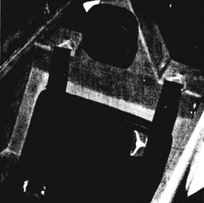
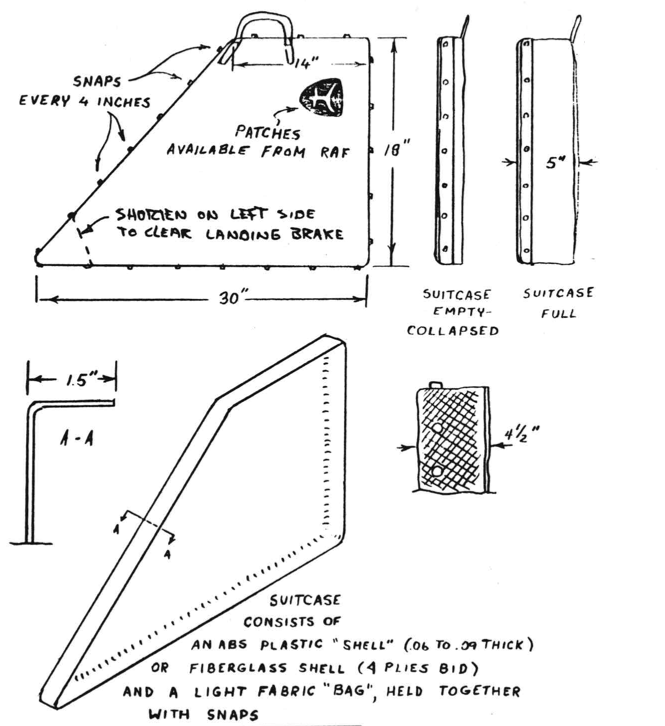
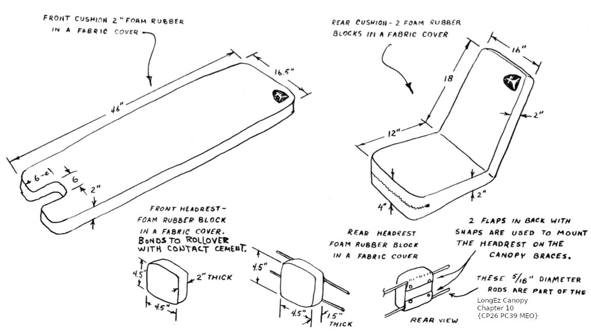
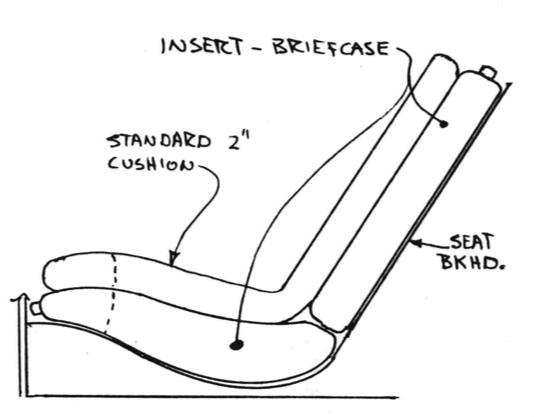

# Chapter 26

## Upholstery

All of the six items shown can be purchased from a distributor.

The front head rest is bonded to the rollover structure with contact cement.
The rear head rest snaps over the two canopy
braces.
It can be positioned in the center, or to each side, for those who like to sleep in corners.  

 Figure 26-1: Custom suitcases

The rear seat cushion is an adequate size for any person.
However, medium/short people may want to add a pillow or cushion to sit higher to see better.
The front seat cushion is the correct size for the average pilot (6' 3" to 6' 5").
The smaller than average pilot **must** add cushion thickness in order to position himself high enough for adequate forward visibility (see owner's manual for optimum pilot position).

 Figure 26-2: Custom seat pad

 Figure 26-3: Seat pads and shoulder harness

Short pilots (less than 5'11") may want to take advantage of some extra baggage room rather than fly sitting on several cushions.
This can be done by fabricating two inserts to custom-fit the unused area.
The two inserts can be used as custom-made map
cases or briefcases.
Some use these areas for a survival kit and/or ELT.

 Figure 26-4: Briefcase as booster for shorter pilots
