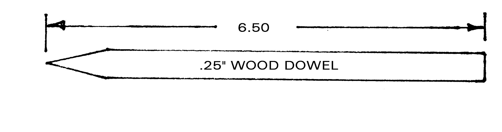
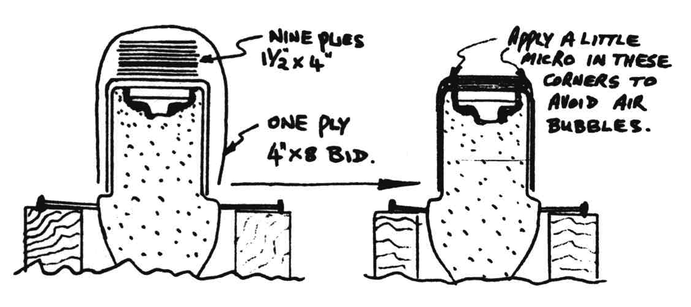
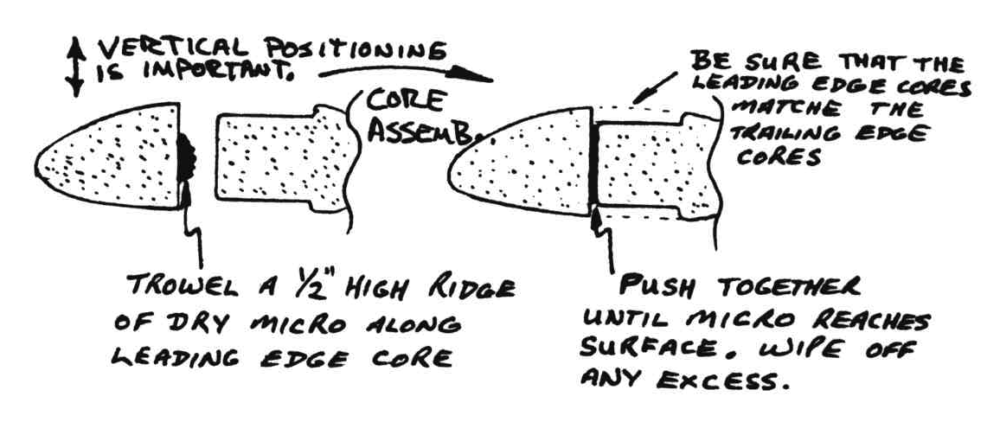
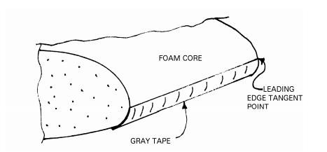
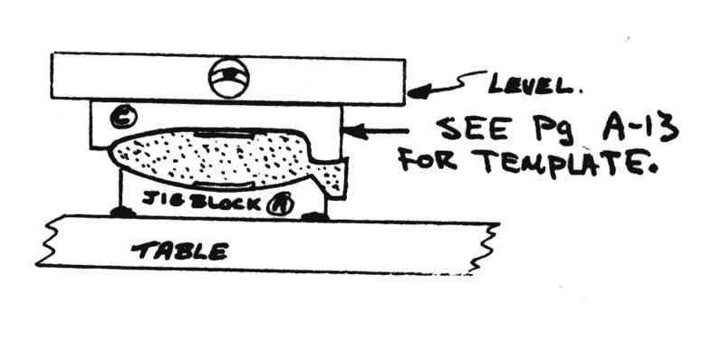

# CHAPTER 30

## RONCZ CANARD CONSTRUCTION

 Figure 30-1: Canard

**Overview** - This set of plans contains all the information necessary to build and install the new R1145MS canard on the Long-EZ airplane during initial construction. If you are retrofitting the R1145MS canard on an existing LongEZ please use the original instructions from RAF.

When this new canard is installed on a Long-EZ, it is <u>absolutely mandatory</u> that the 6 small "fences" called vortilons, are installed on the leading edges of the main wings as described in Chapter 19.

 Figure 30-2: Plan view

Due to the higher available lift coefficient, we have had to incorporate Vortilons on the main wing. Stall speed is essentially the same, while maximum cruise speed at 75% power is increased from 1 1/2 to 3 knots. Vortilon installation is described in chapter 19.

The trim change while flying into or out of rain is very small. Actually, our tests have shown zero to a very slight nose up trim change on encountering rain. At no time during our testing have we seen a nose down trim change.

## Drill bit sizes for reference

| Drill Bit Number | Size in Inches |
|------------------|----------------|
| #10              |   (0.1935")    |
| #12              |   (0.189")     |
| #16              |   (0.177")     |
| #30              |   (0.1285")    |

## Bill of Materials

### <u>Miscellanious</u>
Locktite (Part #22, small screw threaded locker)

X-30 liquid foam

Small scraps of 1/4" plywood for Canard install

Oilite bronze bearings (used where NC-8 passes thru all NC-3s)

### <u>Foam</u>

| Qty  | Name       | Size          |
| --- | --- | --- |
| (1) | Styrofoam block | 7" x 14" x 64" |
| (1) | PVC foam block H-100 6 lb/ft | 1" x 6" x 10" |

### <u>Epoxy</u>

One (1) 1 1/4 gallon kit of Safe-T-Poxy

### <u>Glass</u>

| Name    |  Size          |
| --- | --- |
| UND Cloth 7715 | 18 yards x 36" |
| BID cloth 7725 | 2 yards x 36" |
| 3" wide UND tape (Long-EZ) | 30 yard roll |
| Micro baloons  |  |
| Floxed cotton  |  |

### <u>Prefab Metal Parts</u>

| Qty | Name  | Function       | Drawing Figure |
| --- | --- | --- | ---  |
|  2  | *CL-1 | CLT Mounting Plates | 2024T3 1.2" x 3"  |
|  2  | *CN-2 | Steel bushings | 1/4" O.D. x 3/16" I.D. Steel  |
|  2  | *CNL  | Alum Bushing   | 1/4" I.D. x 5/8" O.D. Alum |
|  2  | *CS-10 | Lead Weights  | Elevators  |
|  2  | *CS-11 | Lead Weights  | Elevators  |
|  3  | *CS-202 | Spacers      | Control rod connection |
|  2  |  NC-CLT | Lift tabs    | Canard    |
|  5  |  NC-2   | Hinge inserts |  Elevators   |
|  5  |  NC-3   | Hinges        |  Elevators   |
|  2  |  NC-3A  | Hinges        |  Elevators   |
|  1  |  NC-5A  | Pitch Trim belcrank | Elevators    |
|  2  |  NC-6   | Plugs               |  Elevators   |
|  2  |  NC-7   | Hinge jigs          |  Elevators   |
|  2  |  NC-12A | Control Arms (1 left and 1 right) |  Elevators   |
|  2  |  NC-13  | Steel spacers                     | Elevators     |

* Original Long-EZ GU canard parts.

### <u>Hardware</u>

| Qty | Material  | Specification        |  where used |
| --- | --- | --- | ---- |
| 1   | Aluminum tubing 2024 T3 | 1" O.D. X  .035 wall x 57" long | Elevator torque tube |
| 1   | Aluminum tubing 2024 T3 | 1" O.D. X 0.035 wall x 74" long | Elevator torque tube |
| 1   | 304 Stainless steel rod | 3/16" diameter 61" long | Elevator hinge pin NC-8R |
| 1   | 304 Stainless steel rod | 3/16" diameter 61" long | Elevator hinge pin NC-8L |
| 4   | MS21042-3 Nuts  | | NC-12A weldment attachment  |
| 1   | MS21042-4 Nut   | |   |
| 4   | AN365C-1032 Stainless Elastic Stop nuts (MS21044) |   | CS-11 |
| 2   | AN3-5A bolts    | | NC-12A weldment attachment   |
| 2   | AN3-13A bolts   | | Belcrank offset attach to torque tube (AN3-12A might be shorter) |
| 6   | AN4-7A bolts    | | CLT to CLI  |
| 1   | AN4-21A bolt    | | Check NC-12A alignment  |
| 4   | AN509-10R14 Screw (AKA MS24694-556) |   | Mount CS-11 |
| 10  | AN960-10L washers | | NC-2 and NC-3 hinges  |
| 12  | AN960-416L washers | | NC-12A attachment  |
| 6   | K1000-4 nut plates | | CLT lift bolt |
| 2   | Allen set screws   | 10-32 x 1/2" | elevator hinge pin  |
| 17  | Cherry BSPQ-43 or  |                 |   |
|     | Avex 1601-0410     | 1/8" Pop Rivets | NC-2s +   |
| 2   | Cherry BSCQ-44 or  |                 |  NC-6 |
|     | Avex 1604-0412     | 1/8" Pop Rivets |   |
| 12  | AN426AD3-4 Rivets  | Flush rivets    | CLT nut plates |

## Step 1: Prepare Templates

Templates are found on page C-3.

Paste the provided full size template drawings onto a piece of formica or a piece of 1/16" thick phenolic. 1/8" aircraft quality birch plywood also works quite well. We like formica, and the protoype canards were built using this. We used 3M 77 Spray glue to stick the paper to the formica. We used a fine tooth band saw to cut out the templates. A saber saw will also do a good job.

Clamp the left and right tempaltes together in a vice and using a fine metal file, smooth the edgers of the templates until approximately <u>half</u> of the pencil line is removed. If you file the "A" and "B" templates as a pair, they will be identical. The "C" and "D" template are not identical, the spar trough in "C" is 1/4" deep while the "D" trough is 1/16". You should match up the non-trough areas of "C" and "D" so that you get good alignment of the templates to the previously cut "A" and "B" ends of the inboard cores.

Now stack the "A", "B", "C", and "D" hotwire templates precisely on top of each other, clamp them in this position and drill and nail holes through all four templates. This ensures that the nail holes match. Measure the thickness of your nails, add .010 and use an appropriate drill.

## Step 2: Foam Cores

A 36" aluminum ruler, available at any hardware store, cut in two equal pieces and drilled every inch to allow nailing to the foam blocks works great here as a verticle guide. These straight edges can be used to cut and square the block as required.  

You will need a styrofoam block 7" x 14" x 65". Using two straight edges as verticle guides, hotwire cut the block per Figure 30-3.

1. Hot wire FB-2, the outboard canard sections, from the end of the foam block.
2. Separate the two outboard foam core blocks by hot wiring between them.
3. Hot wire FB-3, the elevator block, from the remaining block, set FB-3 asside.
4. Hot wire FB-1 in half, along the long dimension, so you can cut the central cores.

 Figure 30-3: Foam core preparation

## Step 3: Hotwire the Inboard foam cores

Nail the hotwire templates "A" and "B" onto the ends of one of the FB-1 foam blocks as shown in Figure 30-4. Stick a nail into the foam at the leading edge of each template. This "leading edge nail" is the starting point for the hotwire cut. Weight the foam block at each end. 25 lb lead shot bags work great here. Now, it is extremely important that the foam block and its weight is <u>not removed at all</u> from the first hotwire cut to the last for each block.

 Figure 30-4: Hot wire canard inboard core

Start at the leading edge nail and cut around the top of the template. You will <u>not</u> be cutting the spar troughs. Start again at the leading edge nail and cut around the bottom.

Remove the "A" and "B" templates, install the "C" and "D" templates for the spar troughs. You can remove the nail from the front of the cores.

 Figure 30-5: Inboard core spar trough

This must be done <u>without</u> moving the lead shot weights or the faom blocks. Cut horizontally across the foam blocks by eyeball until directly above the forward edge of the spar trough.

When both people are ready, start down, pause at least one second in the corner, move aft across the bottom to the spar trough and pause for 2 seconds in the corner. Cut vertically up until clear, the, cut horizontally by eyeball until out of the faom block. See Figure 30-5.

For the bottom trough you will have to hot wire from the front (or back) of the block to the trough position before making the plunge cut.

Now move the "A" and "B" templates to the other inboard block, place the starting nail and place the weights to keep the block stationary. Repeat the process for preparing an inboard core as described previously, except exchange the ends of the inboard core where "C" and "D" are mounted so that your are making a mirror image of the first inboard core. The two "C" ends will be butted together at B.L. 0.

Use a knife and sanding block to smooth out the leading edge of each block where the "starting" nail kept the hot wire from removing the nail high, block wide ridge. Be gentle with the sanding don't destroy the leading edge profile.

## Step 4: Outboard cores

Now place the "A" and "B" templates from page C-3 on one of the two canard outer block. Pace the starting nail in the leading edge of the block.

Repeat the hot wire cut proces described in Step 3 for the "A" and "B" templates.

The left and right tip cores have no spar troughs, set the "C" and "D" templates aside. You will not need them again.

You will add a "tip" to these outboard cores after the elevator is attached, so <u>do not</u> round the outboard tip of the outboard cores.

## Step 5: Elevator cores

Hotwire cut the elevator cores using the elevator templates on page C-3, lower left of page. These are cut from one piece of foam 54" long.

## Step 6: Create dowels

Before you cut the left and right inboard foam cores vertically for the shear web, make up ten dowels as shown. We sanded a point like a pencil on one end of a 6.5" long, 1/4" diameter wood dowel, as shown in Figure 30-6. Also, make one that is perhaps a foot long. Use this one in your electrical drill to "drill" holes from under the trailing edge, through the shear web into the leading edge of each core to align the leading and trailing edge core after you have layed up the shear web as shown in Figure 30-7. For now set the dowels asside.

 Figure 30-6: An Individual Dowl

## Step 7: Cut center cores along shear web

Now, set the left and right inboard cores back into their foam blocks to support them and keep them straight while you hotwire cut the leading edge from the trailing edge by cutting through along the line of the shear web.

 Figure 30-7: Open shear web

To help keep the cut square, nail a verticle guide along the left and right edge of the forward edge of the trough. You can use the "half" aluminum ruler you created in Step 2 to as a verticle guide as shown in Figure 30-7.

## Step 8: Canard Lift Tab and Lift Tab inserts

Cut two Canard Lift Tab Nutplate Inserts (CL-1) from 1/8" 2024-T3 Aluminum with dimensions 3" x  1.2".

 Figure 30-8: "CL-1" Canard Lift Tab Nutplate insert

Cut two Canard Lift Tabs (CLT) from 1/8" 2024-T3 Aluminum with dimensions as shown in Figure 30_9.

 Figure 30-9: Canard Lift Tab

Find two 3" x 15" metal strip up to 1/8" thick which you can use as a Lift Tab install template.

## Step 9: Jig inboard cores for shear web layup

Install 2 8 foot 2x4's on your workbench. The 2x4's don't have to be perfectly straight nor accurately aligned as shown in Figure 30-10.

 Figure 30-10: Work table Jig setup

Place 4" long nails at 12" intervals on both sides of both cores, just aft of the spar troughs, as shown in Figure 30-11.

 Figure 30-11: Nails to hold cores in Jig

Jig the inboard left and right cores vertically as shown in Figure 30-12. If you have access to a piece of straight steel pipe, such as a 1 1/4" water pipe, (You will need a piece 130" long). This can be used to great advantage to help assure that your cores are dead straight. Clamp the pipe to the trailing edge of one of the inboard cores, use tounge depressors or thin plywood strips to spread the load across a larger area than just the clamp face.

 Figure 30-12: Cores in Jig

Place the clamped inboard core in the jig use nails inserted into the foam to get the foam stable and level then bondo the nails of the clamped core to the 2x4.

Now insert and align the second of the two inboard cores.

Now, carefully check that the shear web center­lines of the two foam cores are aligned without any dihedral or sweep using the string. (if your using the pipe, there should be no problem)
With the string held tight along the trailing edge, check that the two foam cores aren't twisted different ways.
Shim the nails as required to obtain good alignment (eyeball straight).

Once the two cores align (shiming as necessary), separate the cores enough to spread dry micro on both cores. Push the loose foam core back into alignment. Bondo the nails to the 2x4s and clamp the loose core to the pipe (using tounge depressors or thin plywood to spread the clamp load). Clean up any excess micro around the joint.

Now use gray tape to mask the foam cores to protect all but the shear web area from epoxy.

## Step 10: Layout the CLT position on the inboard cores

Mark the center line of the two cores with a ball point or felt tip pen.

The canard lift inserts are installed on the forward centerline of both aft inboard cores starting at B.L. 6.5 and extending to B.L. 9.5 on both the left and right sides as shown in Figure 30-13.

 Figure 30-13: CL-1 Location in the shear web

Mark their position and remove the foam so that the inserts sit flush with the surface of the foam core. Do not install the inserts yet. These depressions will be dished out for the nut plates after the nut plates are attached to the inserts.

## Step 11: CLT Drilling Jig Setup

Build a drilling jig as shown in Figure 30-14. This simple jig will allow you to drill through the shear web where the attach lift tabs will be mounted, after the shear web is layed up. You need one for both left and right sides.

 Figure 30-14: CL-1 Nut plate finder Jig

With the Jig strip of metal perpendicular to the centerline of the cores and screwed to the 2x6 supporting blocks, mark the center line of the cores on the metal strip. Also label on each jig the side of the aircraft they represent so they can be placed correctly later. Mark each of the 4 2x6 support blocks so that you can properly place the metal strips when you need to find the lift inserts.

## Step 12: Match drill the Lift tab, the insert and the Jig

Stack the lift tab, the aluminum for the insert and the Jig strip together in a vice, be careful of alignment. Match drill the three 0.25" holes through all three pieces.  Repeat for the second set of lift tab, insert and the jig strip.

Drill the #10 hole in each of the CLTs.

Drop the inserts into their respective holes and verify that their respective strip of metal will align with the holes in the inserts when installed on their respective 2x6 blocks.

## Step 13: Install nut plates on lift tab inserts

For each of the three nut plates on each insert, locate the rivet holes by threading AN4-7A bolts throuh the insert plate and a nut plate, position and mark the rivet holes for the nut plate rivets as shown in Figure 30-15. Drill 6 0.1" rivet holes in each insert. Counter sink the rivet holes on the front of the insert plate. Mount the nut plates on the rear of the insert using AN426AD3-4 Rivets. See Figure 30-15.

 Figure 30-15: Canard Lift Tab Nutplate insert

Using a dremel, deepen the CL-1 nut plates flush into the face of the foam shear web area with the nut plates attached. The nut plates are buiried in the foam.

Do not glue the inserts in with dry micro yet – this is done when you are ready to glass the shear web to provide a 'wet bond' with the micro and glass.

## Step 14: Glass the shear web

Plug the three CL-1 nut plate bolt holes with rolled up plastic wrap to avoid fouling the threads with micro or epoxy.

Micro the inserts in place.

Slurry the entre shear web area and layup the shear web per Figure 30-16.

1. Two crossing plies of UND full span (108")
2. Two crossing plies of UND to B.L. 30 left and B.L. 30 right
3. Then one ply BID at 45 degrees from B.L. 20 left and B.L. 20 right
4. Finally one ply of BID at 45 degrees from B.L. 10 left and B.L. 10 right.

 Figure 30-16: shear web layups

Now layup 9 plies of BID at 45 degrees center over each CL-1 nutplate, 1 1/2" x 4". Cover these layups with one ply BID at 45 degrees, 4" x 8". See Figure 30-17.

 Figure 30-17: CL-1 Nut plate layup

Use a sharp nail or scribe to prick through the shear web layup to keep track of the ten 1/4" diameter holes for the wood dowls, you may want to do this after laying up each ply, especially inboard.

Peel ply the entire shear web and allow to cure.

## Step 15: Install CLTs

Remove the peel ply from the shear web and using your drill jig, carefully drill through the 10 ply pads to expose the three holes in each CL-1 nut plate. Use 6 AN4-7A bolts with AN960-10L washers to bolt the CLTs onto the CL-1 nut plates. Sand both sides of the lift tabs with 320 grit and apply a generous film of flox to the shear web before bolting the lift tabs into place. These bolts should be torqued down firmly, but not so tight as to cause any crushing. (Approximately 50 in/lb). Wipe off any excess flox.

## Step 16: Install Dowls

Using a dremel or 1/4" drill <u>carefully</u> open the ten holes in the shear web. Trowel a little wet micro into these holes and wipe some micro onto the aft end of the 10 wood dowels. Gently push them into the 10 holes so that you have 10 pointed dowels protruding vertically from the face of the shear web as shown in Figre 30-18. These should be quite a tight fit. If they are loose, you can expedite things by judiciously applying a small amount of Hot Stuff glue at the shear web face around the dowel. This will cure rapidly and hold the dowels firmly, even though the micro has not cured.

 Figure 30-18: Use of 1/4" wood dowels for alignment

## Step 17: Mount the leading edge cores

Now trial fit the leading edge foam cores. Slip the existing holes in the leading edge cores down onto the pointed dowels. Note that the shear web is thicker inboard, and 10 ply pads and lift tabs will protrude into the foam leadin edge cores. Mark the cores, remove them and carefully cut away foam as required until they fit reasonably well to the shear seb face, and the leading edge is straight (eyeball) as shown in Figure 30-18.

 Figure 30-18: Trim leading edge foam for lift tab clearance

Trowel a 1/2" high ridge of Dry Micro along the leading edge cores as shown in Figure 30-20. Then push the leading edge cores onto the dowls with sufficient force that the micro reaches the surface. Wipe off any excess.

 Figure 30-19: Mount leading edge

Clamp a straight edge to these cores to keep them straight. Positioning alignment with the aft core is important, make sure they match and the leading edge does not twist.

Allow this assembly to cure.

## Step 18: Mount canard jigs on workbench

### Note: If your workbench is not 130" long, construct a 130" long "ladder" platform from 2x4s. The "rungs" should be no more than 6" wide. Bondo the ladder to your workbench. Then Bondo the jig blocks to the ladder. The ladder "rails" should be absolutely level to avoid warping the canard during layup

Bondo the two outboard jig blocks "K" to your work bench 126" apart. Stretch a tight string at the leading edges. All 9 of the "k" jib block should be Bondo'd to the table at 90 degrees to the string at the B.L.s shown in Figure 30-21. Be sure that all of these jigs are vertically in line. Eyeball or stretch a second tighter string across the top of these jigs. The accuracy of these jigs will have a direct bearing on the accuracy of you finished canard.

 Figure 30-20: JIG block spacing

## Step 19: Place canard on Jigs

Remove the "center section" of you canard from its jigs, flip it upside down and using <u>small</u> dabs of 5 minute epoxy, bond it into your "perfectly accurate" jigs. Be sure it is centered. Now get your tip foam cores and trial fit them into the jigs and onto "center section". They should fit well and the leading edge and trailing edge should be straight. Check with a tight string or eyeball.

## Step 20: Micro the outboard cores to the center section

Check the outboard core match up with the inboard cores. Use light sanding of the outboard cores to get perfect matchup.

Micro the outboard foam cores to the "center section" and use <u>small</u> dabs of 5 minute epoxy to hold them into the jigs.

Use a long straignt edge or your eyeball to check for a perfectly straight leading edge and trailing edge. The careful use of a sanding block on the foam coare to true it up at this point, can save much filling and sanding after the skin is on and cured, but do not change the basic airfoil shape.

Check the botom contour with Template "E". Some discrepancy is bound to occur along the aft bottom due to hot wire lag. This should not exceed 1/8" in 24". This is the only acceptable contour discrepancy. Keep in mind that Template "E" is designed to check the bottom contour after the skin has been layed up, so allow for the skin thickness (approximately .030").

## Step 21: Bottom Spar Cap preparation

You now need to prepare the shear web area for the spar cap layup. Remove any peel ply, and carefully sand dull any areas not covered by the peel ply. Actually, it is a good idea to sand the whole shear web to be sure no oily finger prints or areas exist that could degrade the bond between shearweb and spar cap.

Mix up a small quantity of dry micro and carefully fill any voids between the leading edge foam and shear web. Do not get dry micro onto the shear web. Up to 1/4" onto the shear web from each foam edge is ok in order to have a smooth area for the glass spar cap, but no other micro should be allowed between the cap and shear web.

 Figure 30-21: Dry Micro voids in bottom of canard

Mask off all exposed foam leaving only the shearweb area, where you will layup the glass spar cap, with masking tape or gray tape and newspaper.

## Step 22: Bottom Spar Cap layup

This spar cap layup is new for the canard. The material is the 3" wide, unidirectional glass tape that is used for the centersection spar and wing spars. Place your roll of 3" wide UND tape at one end of the canard so that you can conveniently pull off lengths as required to place in the spar trough. Paint a generous coat of epoxy onto the shear web area full span.

Pull a length of 3" UND tape off the roll and cut it to fit from tip to tip of the shear web, and lay it onto the wet shear web. Smooth it into place with your fingers or a 3" wide squeegee. Do not wet it out yet.

Carefully examine the edges of the 3" tape. Along one edge only, there is a fine thread that is obviously not fiberglass. It is woven cotton. Cut this thread in the center of the canard and pull it from the tape. This is the "key" thread that holds the cross fibers of glass that are used to weave the UND tape. You will find that you can now easily pull the entire cross fiber out of the tape, leaving only unidirectional roving. This strand may come out in one piece or you may have to clip it and pull it out in several pieces. Try not to displace the remaining major roving fibers lying spanwise.

 Figure 30-22: Remove tape cross threads

Wet these out with a brush and or squeegee and carefully squeege this first full span ply out as though it were the last ply. You will find that these major unidirectional roving fibers will spread out to perfectly fill across the 3" wide spar trough and they will wet out very nicely. They will be very straight and smooth because they do not have the disruption of the cross fibers that were used to weave the 3" wide tape.

When this first ply is wet out and squeegeed perfectly, pull off another length and lay it on top of the first ply. You will find that this one will have to be shorter at each end, in order <u>not</u> to overfill the spar trough out at the outboard tips of the shear web. Cut it shorter <u>as required</u> to just barely fill the trough depth. This will vary slightly with each ply, but will probably be on the order of 4" to 6" less at each end, with each additional ply.

Trim the ends at about a 60 degree angle from the front to back to minimize the sudden "drop off" at the end of each ply. In fact you can actually "tailor" each end for perfect spar trough filling by cutting across at a 60 degree angle and perhaps leaving several roving strings uncut as necessary. This will become obvious and easy to judge as you go along. Continue to fill the trough, one ply at a time, wetting out and squeegeeing each ply as if it were going to be the final ply. Concientious care is required here. Use your contour checking template to check for a full spar trough as you work inboard. Do not <u>over fill</u> and do not <u>under fill</u> the spar trough. The better job you do here, the less filling and contouring will be required after the skin goes on and the stronger your canard will be.

Continue to layup shorter and shorter lengths of 3" wide UND tapes until the full length of the bottom spar trough is full and level with the foam as confirmed by laying the checking Template E acrosss the spar cap.

Of course each ply is treated exactly as the first was, the single woven thread is cut and the glass cross fibers are removed entirely. Your spar now consists of very straight, true, unidirectional roving fibers, 100% of which are distributed spanwise along the canard. All of these fibers are perfectly wet out and your spar cap is a uniformly tapered, smooth , straight glass cap for maximum efficiency.

At this point, you can peel ply the spar cap and call it a day, or if you have time and still feel fresh, you can continue and layup the bottom skin. We usually do the second option here at RAF. It does give the maximum strength and saves a cure. If you are tired, peel ply the cap and stop.

## Step 23: Bottom skin layup

If you plan to continue with the skin, remove the tape and paper masking and stick 1.5" gray tape full span along the upper leading edge so that the top edge of the gray tape is approximately the tangent point of the leading edge as shown in Figure 30-23.

 Figure 30-23: Prep leading edge for bottom layup

Stretch a piece of 1" wide peel ply full span along the trailing edge. Hold this in place with a small brad or staple every foot or so. See Figure 30-21.

Now slurry the foam from leading edge to trailing edge, full span of the canard. Any "dings" in the foam should be filled with dry micro, as should any gaps or imperfections along the leading edge and trailing edge of the still wet spar cap. Do <u>not</u> get dry micro on the spar cap.

 Figure 30-24: Dry micro bottom of canard

Now layup the bottom skin which consists of 3 plys:

1. one ply of UND, span wise
2. 1 ply of BID at 45 degrees, full span (this takes 4 pieces)
3. 1 ply of UND spanwise.

 Figure 30-25: Glass for bottom of canard

Peel ply the bottom skin leading edge with 2" wide peel ply. This is for the top skin overlap. Micro the trailing edge on top of the peel ply per Figure 30-26 while the bottom skin is still wet.

 Figure 30-26: Peel ply Leading edge, micro trailing

Allow to cure.

Knife trim (or use a razor saw if the epoxy has fully cured) along the top edge of the grey tape at the leading edge. Also knife trim along the trailing edge. This edge should be <u>absolutely</u> straight. Use a sanding block to true it up. Knife trim the ends flush with the foam cores.

## Step 24: Prepare Canard to be turned over

Now you will need your straight 1 1/4" water pipe (130" long) or at least a perfectly straight 1/x" pine board. The 1 1/4" water pipe will need to be thoroughly degreased with gunk or acetone. Lay it (or the pine 1" x 2") into the trailing edge radius as shown in Figure 30-27.

 Figure 30-27: Use Pipe to align foam segments

Use <u>small</u>dabs of Bondo every 6" or so to bond the pipe or pine 1" x 2" to the trailing edge. Keep the Bondo dabs small or it will be difficult to break the bond later. Now use four 1" x 4" x 8" pine boards (they should be exactly the same height in the 4" dimension) and Bondo them to the 1 1/4" pipe and canard. Shim to get them perfectly level. Sight across all four to verify that they are uniform. Remember to keep them aft far enough to allow you to voerlap the top skin over the bottom skin at the leading edge.

 Figure 30-28: elevation boards

When the Bondo has cured, carefully pry the canard away from the nine (9) Jig blocks (K). With care, minimum damage to the foam will result from the small 5 minute epoxy blobs. Any damage can be repaired with dry micro.

## Step 25: Mount canard right side up

Flip the whole assembly over, be careful if you are using the 1 1/4" water pipe, it is heavy. Bond the four supports to the table, so that the leading edge overhangs the table slightly to facilitate the top skin / bottom skin overlap.

Use a small knife to cut the foam "fish tail" section off as shown in Figure 30-29.

 Figure 30-29: Trim off the fish tail trailing edge

Pull the 1" wide peel ply away from the bottom skin at the trailing edge. This may take a while as the peel ply doesn't come off as one strip sometimes.  

Use the sanding block and your top contour checking Template "F" to fair the top foam to the correct shape at the trailing edge as shown in Figure 30-30. <u>Go slowly</u> here, it is difficult to correct errors.

Remove the grey tape from the leading edge.

Use a sanding block to sand the bottom skin to a feather edge at the leading edge.

 Figure 30-30: Feather bottom skin at leading edge

See Figure 30-31, set your Template "F" on the canard at several positions and check that the top is level. It is <u>very important</u> that there is no twist in the canard at this point. If there is, pry one end away from the table and shim to correct the twist. Before laying up the top cap and skin, the canard core <u>must</u> have zero twist. After the top skin has cured, it will be impossible to fix this kind of problem.

 Figure 30-31: Check level of top of canard

## Step 26: Insert foam for elevator hinge

Layout the hinge points on the foam aft of the spar trough. You can use your elevator torque tubes with the NC-2 inserts installed to check to be sure that you have the hinge points at the correct butt lines.

 Figure 30-32: High density foam inserts

Make 7 foam inserts from 6 lb/ft3 PVC foam, per Figure 30-32.

Dig foam out of the canard in the appropriate areas to allow installation of these seven (7) PVC foam hard points. Use a sharp knife or a 1/4" drill in an electric drill motor. Micro these PVC foam hard points into the canard foam core. Sand the PVC flush or slightly low and fill with dry micro.

 Figure 30-33: Locate high density foam inserts for hinges

## Step 27: Top Spar Cap Layup

When you are satisfied that your canard is as straight and true as you can get it, mask off the foam areas using gray tape and newspaper. Layup the top spar cap using the same method as you use to do the bottom spar cap (see Step 22). It will take several more plies for the top cap, since the top spar cap is thicker because it has to be able to take the compression loads in flight.

Note that the spar troughs have been sized correctly on the hotwire templates to allow for the shear web build-up as well as the spar cap material. Do <u>not</u> try to change the depth or width of the spar troughs as dictated by the hot wire templates "C" and "D".

After the top spar cap is layed up and perfectly wet out, you can peel ply the whole cap and allow it to cure or you can continue with the top skin. Either way is satisfactory, but doing the skin and cap at one time usually will result in a smoother contour requiring less filling and is stronger since the cap and skin cure as one piece.

## Step 28: Layup the top skin of Canard

Cut UND and BID strips as illustrated in Figure 30-34.

 Figure 30-34: Top skin plys

1. Layup 1 ply of UND full span, oriented spanwise
2. 1 ply of BID at 45 degrees full span
3. 2 plies of UND full span.

Remove the tape and newspaper used to mask off the foam from the top skin.

Slurry the foam and fill any "dings" with dry micro.

Paint epoxy under the bottom of the leading edge for about 2" aft, full span, and along the glass trailing edge.

Allow this to cure for at least 24 hours.

Knife trim the trailing edge and each tip.

Carefully break the 4 supports away from the bottom skin and the steel water pipe. Use a razor saw to cut the Bondo between the steel pipe and the trailing edge skin. Remove the water pipe, and check your canard trailing edge. Plane it, or sand it perfectly straight by eyeball.

Sand the transition of the top skin wrap onto the bottom skin. Check contour here with Template "E". See Figure 30-35.

 Figure 30-35: Contour Canard Trailing edge

Set your canard aside. Store it on its leading edge carefully so it will not warp.

# Elevators

If you bought your torque tubes and NC-2 inserts from a RAF distributor, you are ready to install the NC-2 inserts into the pockets machined into the 1" O.D. torque tubes. If you have access to a lathe and a vertical mill such as a "bridgeport" mill, you can make these parts yourself, or you could have them made for you at a local machine shop. Unfortunately these parts cannot be made by the average builder using a file and drill!!

## Step 1: Install NC-2 inserts into torque tube

The NC-2 inserts should fit perfectly into the machined pockets in a 1" O.D. torque tubes. Press them in to check that they fit flush with the outside of the tube, by holding a straight edge such as a 6" machineist steel rule along the tube over the NC-2 insert. The NC-2 inserts must fit flush.

Now drill a #30 hole through the tube and the insert, in all 5 places. Remove the inserts and deburr the #30 holes. Carefully trowel a small slug of vaseline or grease into the hinge pin holes in all inserts. Now press the inserts back into their respective pockets and fasten them with a pop rivet (Cherry BSPQ-43). Use a few drops of Hot Stuff (the thick variety) to seal the edges of each NC-2 insert as shown in Figure 30-36.

 Figure 30-36: NC-2 into elevator torque tube.

This will prevent any epoxy wicking down into the hinge pin holes during the skin layup.

Now the torque tube slot must be deepened to match the depth of the NC-2 insert on both side. Use metal cutting saw and files to cut away the tube and remove any burrs.

 Figure 30-37: Complete NC-2 installation

## Step 2: Bond Torque tube to elevator cores

Thoroughly sand the torque tubes in the area where the foam cores will bond, using 220 grit wet or dry paper. Now check the fit of the tubes into the foam cores. Sand the cores slightly if necessary to get a good fit.

Cut a notch in two foam blocks that matches the trailing edge of the elevator, you will use these to hold the elevator and torque tube elevated while the micro cures.

Mount the hinge jigs NC-7 (see drawing C-2) into two of NC-2 inserts, using the stainless hinge pins, NC-8, as shown in Figure 30-38.

Rotate the torque tubes up onto the hinge jigs so that the torque tube is "airborn" above NC-7 jigs so you can evenly micro the tube and slide the elevator cores onto the tube. See Figure 30-38. Hot Glue (or 5-minute, or bondo) the NC-7 jigs to your work table to keep things stable while you proceed.

 Figure 30-38: Torque tube positioned for elevator foam install

Micro the foam cores (contact areas) sparingly, spreading the micro evenly with your finger tips, then slip the foam core onto the torque tube, while keeping the torque tube rotated up and onto the jigs as shown in Figure 30-38. Be sure the outboard end of the foam cores are <u>flush</u> with the <u>outboard</u> end of the torque tubes.

Pull the NC-8 from the torque tube.

Place the elevator trailing edge in the foam block you prepared earlier to cure.

Repeat for the other elevator.

 Figure 30-39: NC-7 JIG

## Step 3: Skin the bottom of the elevator

Use your elevator contour checking Templates Page C-3 "H" and "I" to check the top and bottom shapes and carefully sand the foam core and the torque tube to the correct faired shape. The bottom should be flat. Remember these templates ("H" and "I") are designed to check the <u>finished</u> elevator - allow for skin thickness (approximately .020).

Using small blobs of hot glue, jig the elevator cores upside down on your work table as shown in Figure 30-41. The table should be straight at least for the length of the elevators. Mask the table under the elevator trailing edge with gray tape.

 Figure 30-40: Elevator ready for layup

In preparation for the bottom of the elevator layup, prepare for each elevator four plies of UND at +/- 30 degrees to the leading edge. Two of these plies will be used on the top skin.

 Figure 30-41: Prepare UND for Bottom of Elevator

Micro the foam cores and layup two crossed plies of UND at +/- 30 degrees to the leading edge.

After this layup cures, mark the trailing edge using a straight edge and felt tip pen. Knife trim or razor cut the trailing edge.

Use a dremel to remove foam at the trailing edge to allow a glass to glass trailing edge structural closeout as shown in Figure 30-42.

 Figure 30-42: Prepare trailing edge

Sand the leading edge and feather the glass onto the tube with a hard sanding block.

## Step 4: Skin the top of the elevator

Jig the elevators flat-bottomed down on the table using <u>small</u> hot glue dabs. Mask the table at the trailing edge with grey tape.

Layup two crossed plies of UND at +/- 30 exactly like you did on the bottom skin. Be sure to overlap the bottom skin at the leading edge at least 1/2". Trowel dry micro into the depression along the trailing edge. Cover this dry micro with a piece of peel ply and squeegee the dry micro well into the trailing edge depression, working through the peel ply. Allow to cure.

## Step 5: Knife trim

Knife trim the trailing edge, inboard and outboard ends. Sand or plane the trailing edge straight. Check the elevator shape with templates "H" and "I". The shape and size of the elevator is critical to ensure that the elevator floats to the correct trim position, and that trim forces are correct.

## Step 6: Mount NC-6 onto the elevator

Use your stainless hinge pins (NC-8L  and NC-8R) to be certain that the NC-6 inserts are correclty aligned with the NC-2 inserts.

Carefully drill a #10 hole through the torque tube to align with the 10-32 threaded hole in the NC-6 inserts.

Clean out the outboard ends of the torque tubes, sand with 220 grit and install the NC-6 inserts. Hot stuff glue or epoxy will help hold the NC-6 inserts in place. 

Drill a #30 hole as shown in Figure 30-43 and install a pop riviet (Cherry BSC-44).

 Figure 30-43: Install rivet in NC-6

## Step 7: Close outboard end of elevators

Square up the outboard ends of each elevator, sand the foam smooth. Use a small flox corner and lay up 1 ply of BID over the outboard ends.

## Step 8: Mount NC-3 Hinges to the elevator

Use a dremel to remove the glass locally in the area where the NC-3 hinges will insert into the NC-2s.

Your stainless hinge pins (NC-8L and NC-8R) should be filed to a pencil point on one end to facilitate pushing them into the NC-2 inserts.

If you didn't purchase your NC-3s press fit the "oilite" bushings into the .190" hole in each of the NC-3 or NC-3A hinges.

5-minute epoxy an AN960-10L washer on each side of all the NC-3 and NC-3A hinge .190" holes, slide an AN3 bolt thru each washer, hinge, washer set to keep everything aligned while the epoxy sets.

Now mount your NC-3 hinges in each elevator using the NC-8s.

## Step 9: NC-12A weldments attach to the elevator

Slip the NC-12A weldments into the inboard ends of each torque tube.

Temporarily mount the NC-3A hinges using an AN3-5A bolt and 10-32 hardware store type nut. Be careful while handling the left elevator, because it is delicate at the inboard NC-2 insert at this pont. Later on the NC-5A pitch trim belcrank weldment will mount in this area and bring it up to the required strength.

## Step 10: Locate NC-3 slots in the canard

With the NC-3 hinges mounted onto each elevator, and the canard laying upside down on your table, mount the elevators to the canard using 2 "L" jigs on each elevator. <u>CAUTION:</U> Do not try to change the gap betwen the canard trailing edge and the top of the elevators. This gap of approximately 0.2" is required in order that the slot works properly and to ensure that you have adequate nose down (elevator trailing edge up) authority. The "L" jigs should position the elevators in precisely the correct relationship to the canard, provided your canard and elevators are the correct shape.

Support the elevator so that the slot gap between the canard and elevator is uniformly 0.2". Use something you can incrementlly adjust in height, such as 3x5 index cards. Also weight down the elevator in case it is not perfectly flat already. You want a uniform gap.

Use small hot glue dabs to secure the "L" jigs to the canard and elevators.

Swing the NC-3 and NC-3a hinges so that they rest on the canard bottom skin. Using a felt tip pen mark their exact location.

Using an electric drill with a 1/4" drill bit as a "router", cut the 7 slots. Keep the slots as thin as possible.

 Figure 30-44: Slots for NC-3 in canard

## Step 11: Test elevator up travel

Now we must test elevator up travel to be at least 15 degrees. This is very important to assure adequate nose down authority at aft limit CG. The test that your elevators meet this criteria is to temporarly insert the NC-3's into the non-floxed slots (prior to floxing) and bond the NC-3s to the canard with tounge depressors and hot melt glue to the canards bottom skin. See Figure 30-45.

 Figure 30-45: Elevator up travel test setup

Use scraps of tounge depressors (stirring sticks) and hot melt glue to bond the NC-3s in place (with the elevator connected to the NC-3s). With the NC-3s temporarily bonded into position, carefully break off the elevator jigs. This should let you swing the elevators on their pivot pins. Using an angle finder check the full available elevator travel. If you are unable to get the full 15 degrees of elevator trailing edge up-travel, disconnect the NC-3's from the canard, and add a shim of wood between the canard and the NC-3 supporting tounge depressor. This has the effect of moving the NC-3 away from the canard, allowing the elevator further range of movement in the up direction. Repeat this process until you can achieve at least 15 degrees up-travel on the elevator. Once you have 15 or 16 degrees of travel, to allow for finish, hot glue the "L" jigs to the canard and elevators. Separate the tounge depressors from the canard with all the shims still attached so the NC-3s will be floxed at the proper depth.

## Step 11: Flox the NC-3s into the canard

Mix up a wet batch of flox, it should be the consistency of honey or slightly thicker. Pour it into each of the 7 slots so as to fill them 2/3 full. Sand the NC-3 and NC-3A hinges with 320 grit wet or dry sand paper in the area that will be buried in the canard. Carefully install the NC-3 and NC-3A hinges into the slots. Work the hinges down into the canard to get them the correct depth. Top up the slots with flox as required. Wipe off any excess flox with a paper towel.

## Step 12: Attach NC-12a weldments to elevator torque tubes

Use your 100 degree counter sink to recess the heads of the AN509-10As that will attach the CS-11 lead weights into the right side of NC-12As at the lower two mounting holes.

Now drill the #12 holes through the elevator torque tubes and the NC-12A weldments to secure them in their correct positions. Check that the NC-12A weldments are correctly positioned by bolting them to each other using an AN4-21A bolt and appropriate spacer (a piece of scrap tubing 1 3/4" long).

Remove the "L" Jigs from the canard and elevator.

Swing the NC-12As fore and aft by pivoting them in the torque tubes. Hold a small straight edge vertically against the leading edge of the torque tubes. Measure from the edge of this vertical reference <u>aft</u> 0.55" as shown in Figure 30-46.

 Figure 30-46: Elevator spacing from Canard

An AN3-5A bolts (hinge pivots) should be centered at this 0.55" point.

Use a vice grip or clamp to squeeze the torque tube onto the NC-12A weldments. Change to a #12 drill and carefully open the #30 (0.1285) hole to #12 (0.189"). Install an AN3-12A bolt and MS21042-3 nut on each elevator torque tube.

## Verify elevator balance

Check the balance of your elevators. The elevators should immediately hang nose down when supported at the hinge points. If the elevators are correctly built, and the standard CS-10 and CS-11 lead weights are correctly installed, the elevators will be nose heavy as they should be. If there is <u>any</u> tendency for the elevators to hang trailing edge low, sand the elevators vigorously with 40 grit sandpaper. You can sand as much as 50% of the top ply of UND off the top and bottom of each elevator. If you start to see the fibers of the first ply crossing, stop sanding. As long as these areas are no larger than a silver dollar, there is no need to repair them. If your elevators still won't balance, it is permissible to add a maximum of 0.3 lb to the forward end of the outboard mass balance weight. If this fails to balance your elevator nose down, you will have to start again and build new elevators. The elevators absolutely <u>must</u> balance nose down. Nothing else is acceptable.

## Step 13: Check Elevator full range of travel

Mount the elevators back onto the canard with the elevator hinge pins.

Now check your elevator travel using the "G" template. Your elevators should easily swing trailing edge down (nose up command) to the +30 degree position shown on Template "G". They should also swing trailing edge up (nose down command) to ~15 degrees. If you have not done this right, (perhaps your elevators are too fat), you may not be able to get to ~15 degrees. A little judicious sanding of the underside of the canard trailing edge will help. Consider 12.5 degrees to be an absolute minimum nose down (trailing edge up) position. Less than 12.5 degrees will <u>not</u> give you sufficient nose down authority.

# Canard Tip

Reinstall one "L" jig on each elevator to position the elevators at 0 degrees which should correspond very closely to the cruise position of your elevators in flight, (at least at a mid to mid/aft CG position). Now you are ready to install the "turned up" wing tips on each end of your canard. Refer to Figure 30-47 for more information here.

 Figure 30-47: Canard Tip

## Step 1: Attach Tip foam outboard of canard

Cut two pieces of styrofoam to the dimensions shown in Figure 30-48. A band saw, hand saw or hot wire saw can be used.

 Figure 30-48: End of canard treatment foam

One each of these pieces should be micro'd onto the ends of the canard as shown in Figure 30-46. Note that he hinge pins NC-8L and NC-8R will protrude out of the end of the elevators and <u>through</u> the wingtip foam blocks. When you micro these foam blocks onto the end of the canard, you will have to drill a hole to allow the hinge pins to protrude through. We drilled these holes large enough to allow us to micro a plastic tube into the foam block, surrounding the hinge pin. Hardware store variety of 1/4" I.D. x 3/8" O.D. plastic tubing (stiff, not soft variety, looks like brake line material). It is probably easier to install these plastic tubes after the tip is glassed. That is how we did the prototype. Hold them in place with a few nails until cured. Note that these blocks are deliberately a little oversize.

## Step 2: Mark the foam for sanding

Measure up vertically from the trailing edge of the canard 1". Stick a pin or nail into the foam block here. Lay a straight edge on top of the canard and the nail. Make a mark with a felt tip pen at the trailing edge of the foam block. Transfer this mark to the outboard aft tip with a level as shown in Figure 30-49.

 Figure 30-49: Canard end foam

## Step 3: Shape the canard tip foam

Sand the aft face of this foam block flush with the trailing edge of your elevator (which is firmly held at the 0 degree position). Use your template "M" to layout the shape of the wintip as shown in Figure 30-52.

 Figure 30-50: Canard Swoop Template

Note that the "M" template "dish" swoops from the upper surface of the elevator/canard at the trailing edge up to a height matching the top of the canard at the tip (the line drawn in the preceeding paragraph.)

Now you will need a half round rasp, a half round sanding block (easily made from a foam scrap) and some 40 grit sandpaper.

Work slowly and carefully. If you file or sand styrofoam too aggressively, it will "chunk" and break up. If you sand gently, you will easily and quickly sand the foam blocks to match the end of the canard and elevator and to match the line drawn on the aft face.

The leading edge of the foam blocks should be rounded to a pleasing shape. This is not critical. It helps to cut a cardboard template to transfer from left to right and get each tip symmetrical.

## Step 4: Layup the upper surface of the tip

Sand the glass on the canard 1" inboard from the end and slurry the foam block. Layup 2 crossing plies of UND or BID glass, (structure is not critical but we prefer UND). Allow to cure.

## Step 5: Layup the lower surface of the tip

Turn the canard over and sand the bottom of the foam block to match the bottom of the canard and elevator and the curved shape of the trailing edge.

 Figure 30-51: Tip trailing edge glass to glass

Sand 1" of the canard where it connects to the tip, dremel a minimum of 0.4" of area along the trailing edge and outboard edge for glass to glass as shown in Figure 30-51. Layup 2 crossed plies of UND or BID. This bottom skin should overlap the top skin at least 1/2" around the leading edge. Fill the glass to glass areas with dry micro and allow to cure.

Allow the tip to cure.

Trim the canard tip and feather the leading edge and end for a smooth surface.

## Step 6: Trim hinge pins to length

You can now trim your hinge pins (NC-8L and NC-8R) to length, the right side should be 36" long and left side should be 61" long. Drill a 1/16" hole in the outboard end of each hinge pin and file the end to a shape as shown in Figure 30-52 so that they will not hang out in the breeze.

 figure 30-52: Set screw to hold elevator hinge pin in place

The elevators should now be installed. Push the hinge pins in flush with the wing tips as shown. In order to pull the pins, a sharp scribe or awl can be inserted in the 1/16" hole and the pin pulled out. While the hinge pins are installed in their correct position, use a sharp scribe to scratch a mark on the pin through the 10-32 tapped hole in the end of the elevators. Withdraw the hinge pins, and carefully file a small notch in the hinge pin at the scribed mark. This should be just deep enough to allow a 10-32 set screw to be installed in the end of the elevator to lock the hinge pins into the elevators. File a little at a time, using trial and error until thse set screws will just barely screw into the tapped hole.

These setscrews will be installed with locktite to safety them for flight (Part #22, small screw threaded locker). Don't do this until later.

## Install Pitch Trim Belcrank

Remove the canard. Remove the NC-12A weldment from the inboard end of the torque tube on the left elevator. Slide the pitch trim belcrank weldment (NC-5A) onto the torque tube as shown on page C-1. Center the slot in the pitch trim tube over the slot in the NC-2 hinge insert, and drill 6 evenly spaced #30 holes at each end of the pitch trim tube through the torque tube. Attach the pitch trim belcrank assembly permanently with 12 pop rivets. (Cherry BSPQ-43). Be certain that none of thes pop rivets will interfere with the hinge pin as it slides through the NC-2 inserts.

## Install Outboard Mass Balance Weights

These mass balances are extremely important to ensure immunity from flutter. Do <U>NOT</u> omit this step.

Remove the elevator hinge pins, lay the elevators on your work bench top up, and leading edge toward you.

This should only take about one hour.

Refer to the scale drawing on Figure C-1 for the final dimensions of each elevator.

Trim the torque tube flush with the outboard foam edge.

Trim the inboard end of the tube as required to the final length.

### Note: The CS-10 weights may not be identical, so mark both the spacer and CS-10 for each side to ensure you keep the weight and spacer together and with the same elevator

Locate the outboard mass balance weight mount point span­wise (inboard side is 7.5" from end of elevator) and mark this location for future reference.

Cover the elevator hinge slot with blue tape (to prevent any epoxy run off from getting in).
Sand the mounting surface and the weight dull in preparation for glue up.

Bond a couple of the "J" template to the work table, one at the outboard mass balance point and another closer inboard temporarily for a stable support.

Shield the table with the plastic wrap and "J" jig between the Jig and weight / spacer.

Cut two foam spacers 1" wide x 6" x 5" from 6 lb/ft3 PVC foam 1" x 6" x 10" piece listed in materials for the mass balance.

Back the foam spacer up to the end of the elevator at its leading edge and mark the elevator leading edge outline on the foam spacer.

Trim the foam spacer to match the leading edge of the elevator.

Set the elevator and weight on the "J" jig. Hold and foam spacer adjacent to the CS-10 and mark the trim line for the foam to match the CS-10 weight.

 Figure 30-53: CS-10 weight dimensions

Trim the foam spacer along the CS-10 mounting line.

Size the foam spacer to be the same width and height as the CS-10 weight.

Check that the foam spacer and CS-10 are properly sized by placing everything on the "J" jig as shown in figure 30-54.

Keep the spacer and weight square to the leading edge of the elevator during bonding.

Bond the foam spacer and CS-10 weight to the elevator at the proper location with 5-min epoxy.

Cut "V" shaped notches in scrap foam to hold the elevators trailing edge (and the elevators more or less verticle) while the 5-min epoxy cures.

 Figure 30-54 Counter weight Template "J"

This is a good time to verify that your elevators, when not on the canard and suspended horizontally at the inboard and outboard hinges, hang nose down. If they don't then see the next step to remedy off balance elevators.

Prepare the UND glass strips as shown in Figure 30-54.

Cover the portion of the elevator to receive the layup, the spacer and the weight with plain epoxy. Layup two strips of UND around the spacer weight and elevator as shown in Figure 30-57.

The sides of the mass balance are painted with epoxy but do not receive a layup.

 Figure 30-55 counter weight glass cut and install

Peel ply the top and bottom of the elevator where the layup was installed.

After the layups cure, remove the peel ply and trim the two layups (left and right elevators).

## Adjustments for elevators that are not properly balanced

The elevators should immediately hang nose down when supported at the hinge points. If the elevators are correctly built, and the stanard CS-10 and CS-11 lead weights are correctly installed, the elevators will be nose heavy as they should be. If there ia <u>any</u> tendency for the elevators to hang trailing edge low, sand the elevators vigorously with 40 grit sandpaper. You can sand as much as 50% of the top ply of UND off the top and bottom of each elevator. If you start to see the fibers of the first ply crossing, stop sanding. As long as these areas are no larger than a silver dollar (2") there is no need to repair them. If your elevators still won't balance, it is permissible to add a maximum of 0.3 lb to the forward end of the outboard mass balance weight. If this fails to balance your elevator nose down, you will have to start again and build new elevators. The elevators absolutely <u>must</u> balance nose down. Nothing else is acceptable.

## Elevator mass balance pockets in Canards

Since the mass balance extends off the front of the elevator, the canard gets in the way of the mass balance when the elevator is operated through its normal range of movement. The pockets allow the mass balance to reside mostly within the canard and keeps the canard from interfering with the elevator movement.

Lay the canard upside down on your workbench, with some foam padding underneath to keep from deforming the canard by accident.

Remount the elevator on the canard.

Mark the location of the mass balance on the bottom of the canard by rotating the elevator up against the canard and then marking on the canard where the pockets need to be.

Use the Canard contour checking template "E" to draw straight lines down the canard to the trailing edge.

Remove the elevator.  You will likely need to check clearances several times during this process so use a long AN3 bolt on the inboard end and your "excess" hing pin material on the outboard to allow you to rotate the elevator without full hinge pin install.

Now cut the bottom skin of the canard to create the mass balance pocket.

Then dremel the foam out and trim the sides to clear room for the mass balance.
A file may help in getting the last of the edge foam out of the pocket.
Remember that the pocket is going to clear the mass balance by 0.06" clearance on all sides.
The pocket must allow the mass balance to "dive" toward the upper surface of the canard to allow the elevator to reflex down. Do not remove any of the  upper skin of the canard, but you can remove all of the foam if necessary. See Figure 30-59.

 Figure 30-56: Outboard balance weight canard pocket

Before you move to the next step test the movement of the elevator and verify with your angle measurement that you have full elevator travel. If not then adjust the mass balance pocket foam until there is correct freedom of movement.

Once the elevator movement is correct.

Tape the hinge that is just outboard of the mass balance pocket to protect it from flox and epoxy.

Flox corner the inside of the mass balance pocket and then layup 1 ply BID into the pockets.

Also, if you haven't already done so, sand an inch back from the canard tip "rib" top and bottom skins, then put a flox corner around the inside "rib" of the canard tip and then layup 1 ply BID.

Peel ply around the canard tip "rib" to allow feathering after cure.

## Anti-Ice shield for CS-10 mass balance weight

Although it is not recommended that you fly in icing conditions, heavy IFR pilots sometimes do. Be aware that if ice collects on the leading edge of the mass balance weight, it could interfere with elevator travel. If there is any possibility that you might ever encounter icing, you should build a fiberglass fence in front of the mass balance to shield it from ice.

The mass balance ice shields will be installed directly in front of the mass balance slot, and be as wide as the mass balance slot. They end up being 1.4" wide x 4" long by at least 1" high at the lip of the mass balance notch in the canard.

 Figure 30-57 Outer mass balance ice shield

To construct the two ice shields cut two high density foam cores that are 1.4" wide x 4" long x 1.3" high at the mass balance end tapering to .5" high at the forward end.  

 Figure 30-58: Foam core positioning in front of mass balance

Now use the "E" template to mark on both sides of the foam the contour of the canard in the segment just in front of the mass balance recess. Taper the leading edge of the ice shield to improve aerodynamics.

Trim the base of the foam core to match the contour of the canard.

Put plastic wrap down on your workbench, pre-preg two plies of BID and lay them over the foam core, leaving at least 1" of glass flat on the work surface to make a "flange" to attach the ice shield to the canard after it is cured and trimed.

Let cure.

Once cured trim to a uniform look.

Remove the foam cores within the ice shields with your dremel or a knife.

Sand the surface of the canard where the ice shields mount and the bottom of the flange on the ice shields. Then attach the ice shield to the canard with 5-min epoxy.

## Install CS-11 weights on NC-12As

When installing CS-11s the AN365C-1032 nuts should recessed into the CS-11 lead weights to avoid interfering with the other NC-12A.

The control stick for the LongEZ is on the right side of the fuselage. The right elevator is shorter than the left because the right elevator NC-12A is really close to the right side of the fueselage. So close that the CS-11 will be mounted on the inboard (left, facing forward) side of the NC-12A for the right elevator. The CS-11 for the left elevator is also mounted on the left of the left NC-12A, to avoid interfering with the right NC-12A.

Round up the CS-11 (inboard weights) as shown in Figure 30-59, hold them along the left side of their installation location on NC-12As and use a marker thru the NC-12As existing mounting holes (on the lower part of the NC-12A) to locate the screw holes required for mounting.

 Figure 30-59: CS-11 size

Drill two 0.177" holes (#16) in each CS-11, this will produce "spikes" of lead. Let the spikes cool then cut them off with a hacksaw.

Drill a .25" wide x .25" deep recess on the nut side to keep the nut from interfering with the other NC-12a.

Install the CS-11s with the AN509-10A screws and AN365C-1032 stop nuts.

# Install Canard

## STEP 1 – INSTALLING THE ALIGNMENT PINS

This should only take 1/2 hour.

Cut the heads off of two AN3-20 or -20A bolts and sand or file a round nose on the un­threaded ends, see Figure 30-60.

 Figure 30-60: Make Alignment Pins

Drill two holes in the F28 bulkhead and wood doublers as shown in Figure 30-58 about 1 1/2 inches deep.

 Figure 30-61: Drill Alignment pin in F28

Do not bond the pins in yet.

 Figure 30-62: Check Alignment Pins

## Step 2 - Adapt the fuselage to the Canard

Get your canard out of storage and position it (without elevators) on the fuselage as shown on page A-7.

Level the fuselage longerons fore and aft on both sides in the front seat area.

Temporarly attach the "G" template to the top of the canard (hot melt glue works) so that the "G" template butts up to the F28 bulkhead.

You will have to lower the fuselage sides to allow the canard to fit at the proper incidence. The canard must be able to sit on the F22 bulkhead. The rear of the canard is going to be lowered by this change.

Lower both of the sides while keeping the canard level side to side.

 Figure 30-63: Use canard to adjust fuselage

Check the fit now with the elevators installed on the canard and grind away only as much of the fuselage sides as required to allow the full throw of the elevators as dictated by the Template "G".

The smaller the holes are around the elevator torque tubes, the less cold air will find its way into the fuselage. You do need at least 0.1 of clearance around the torque tubes at both extremes of the elevator travel. You can use a spark plug gap guage to make this measurement.

## STEP 3 – ALIGNING THE CANARD

This step may crowd your shop slightly, but only takes about an hour, and you need an assistant occasionally to help measure things.

 Figure 30-64: Align Canard

Use a pair of "C" clamps to hold the lift tabs against the bulkhead (be careful not to bend or scratch them). Don't block the attachment holes with the clamp.

Check for zero sweep­back by measuring from the canard tips to the wing fittings as shown in Figure 30-60. Both should measure the same.

Use shims (washers) between the canard lift tabs and the forward bulkhead to adjust the sweep if necessary.

Next, level across the top fuselage longerons and the canard spar cap.

 Figure 30-65: Level the Canard

Lastly (and most important), use your canard incidence blocks (Figure C-3 template "G") to accurately set the inci­dence at zero with the top longerons. The top of template "G" should be level when the longerons are lever fore and aft.

If your canard has a slight twist, set the **average** incidence equal to the longerons by shimming under the canard with foam. Glue the shims on later.

Recheck sweep, dihedral, and incidence and clamp firmly in position.

## Step 4: Connect the lift tabs to F22 Bulkhead

Use the #10 pilot holes in the canard lift tabs and drill #10 through the F22 bulkhead.

Slip an AN3 bolt temporarly thru the F22 bulkhead to assure alingment and then clamp the canard to the F22 bulkhead.

## Step 5: Rear canard alignment tabs

Go cut two tabs of 1/4" plywood (without voids) as shown in Figure 30-66.

Drill a #10 (3/16") hole in each plywood tab per measurements in Figure 30-66.

 Figure 30-66: Prep location tab

Slide the tabs over the pins and trim them so that they just touch the canard trailing edge when installed on the pins with a 1/16" shim between the tab and F28.

Wet the top of the canard and the tip of the tab then Hot Stuff glue the plywood tabs to the canard.

Remove the canard and layup the forward and aft faces of these plywood attach tabs per the plans (5 plies of BID on the forward face and 4 plies of BID on the aft face) at one time, saving a cure. See Figure 30-67.

 Figure 30-67: Glass location tab

After these layups cured use a flash light to locate the 3/16" hole and drilled it out to 1/4".

Press a CN-2 bushing, 3/16" I.D. x 1/4" O.D. x 3/8" long, into this hole.

## Step 6: Replace lift tab shims with BID

1. Measure the thickness of any shim that was used to correct the sweep of the canard (any shim between F22 and the lift tabs).

2. Remove the shim and dull the forward surface of the F22 bulkhead where the lift tabs rest, and lay up additional BID pads to the thickness of the shim (BID is about 0.013"/ply).

3. After cure, back drill #10 through the bulkhead and new glass. Thus, you have replaced the shim with additional glass pad. The tabs on the canard are glassed as shown.

4. Reopen the #10 holes with a drill (you can see the hole through the glass layup). Drill these holes out to accomodate a CN-2 3/16" I.D. flanged bushing (available from a distributor). 5 MIN the bushings in position.

5. Reinstall the canard using AN3 (3/16" dia) bolts to locate the aluminum lift tabs.

6. Recheck your sweep and incidence.

## Step 7: Check exterior clearance of elevator with fuselage

Now, mount the elevators on the canard, trimming their inboard length to obtain about 1/16" clearance with the fuselage sides as shown in Figure 30-69. Note: the fuselage slims toward the nose, so the trailing edge of the elevator is narrower than the leading edge.

 Figure 30-68: Elevator clearance

Check that adequate clearance (0.1") exists around the elevator tubes (at the fiselage sides) when the elevators are moved through their full travel of 15º trailing edge up and 30º trailing edge down.

The elevator angle template pattern is found on page C-3.

 Figure 30-69: Elevator clearance

## Step 8: Finish F22 and Lift Tab connection

Remove the AN3 bolts and drill the aluminum lift tabs and F22 bulkhead up to 1/4 inch diameter.

Remove the canard.

Using your 5/8 counterbore tool, drill the two 1/4" holes in the F22 bulkhead up to 5/8" for CNL bushing (5/8" O.D. x 1/4" I.D. aluminum bushings).

These are CNL canard attach bushings available from a distributor.
They are supplied long, so you can trim to the exact thickness of your bulkhead.

 Figure 30-70: CNL Bushing

Do not trim, nor bond the bushings in yet because during chapter 13 you will be installing additional glass plies on the foreward face of F22 to tie it into the nose sides.
This will move your canard forward from where it now sits.

## Step 9: Install the positioning pins in F28 bulkhead

Now, remove the 3/16" pins from the F28 bulkhead and apply one ply BID to the entire area shown in Figure 30-71, using 1/4" flox corners at the edges of the bare foam.

When cured, drill out the #10 holes and permanently install the 3/16" alignment pins with wet flox.

 Figure 30-71: Install canard positioning pins

## Step 10: Connection to control system (useful in Chapter 16)

For reference Figure 30-72 details the connection of the elevator NC-11's to the elevator control rod from the pilots control stick. The key difference is the additional CS-202 spacer used to offset the HM-4 Rodend outboard from its previous position.

 Figure 30-72: Connect elevator to control rod

This completes the construction of the R1145MS canard and elevators.
See Chapter 12 for Canard installation instructions.

 Figure C1: Overviews, CLT, NC-3, NC-3A

 Figure C2: Templates L, K, elevator metal parts

 Figure C3: Templates A, B, C, D, E, F, G, H, I and elevator

 Figure C4: Torque tube asssembly, template M

