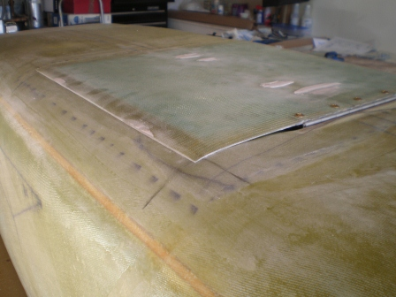

LongEz: Manufacturing Manual Section VI: Landing Airbrake

The landing airbrake is a device used to greatly increase the airplane's drag for landing. The airbrake greatly improves the airplane's landing performace. Without the airbrake, the airplane must be flown with a relatively flat approach and an excessive amount of runway is used to slow the airplane down in the flare. The airbrake allows the approach to be flown steeper and faster, therby improving visibility over the nose. Deceleration in the flare is 70% more rapid than without the airbrake. The airbrake thus allows the pilot to use shorter runways since less precision is required to obtain the correct touchdown point.

The airbrake does <u>not</u> change approach speeds, touchdown speeds, or stall speeds. The airbrake is <u>not</u> a deceleration device for highspeeds. Maximum airbrake speed is 90 knots (104 mph). Above 95 knots (110 mph) indicated airspeed, the airbrake automaticall closes to prevent overstress in case the pilot inadvertently flies to fast with it deployed.

The airbrake is operated by a handle on the left console (armrest). The handle is forward for airbrake closed and aft for airbrake deployed. There are no locks or detents on the handle. A spring in the system snubs the airbrake up in the closed position, provides a down load to relieve most of the drag load, and holds the airbrake down, once deployed. The awkward position of the handle in the airbrake deployed position aids in reminding the pilot that the airbrake is deployed if they forget it on their takeoff checklist. The airbrake induces aerodynamic buffet (similar to a Cesna 150 with full flaps) which is also a good reminder of airbrake position. Even though the ~~VariEze~~ LongEZ still has adequate climb with the airbrake deployed (with the larger engines), climbs should be avoided due to the possibility of over heating the engine (the airbrake blocks air flow {through} the {standard} air intake).

Normal operation is as follows:

1. Upon entry to the pattern, slow to below 90 kt (104 mph)
2. Extend the nose gear
3. Slow to below 85 knots
4. Extend the airbrake
5. Fly the approach (70 to 80 knots / 80 to 92 mph)
6. Land (touch down 55 to 65 knots)
7. Close the airbrake after landing deceleration

The airbrake is also handy to wave back at onlookers as you taxi by!

The airbrake does not affect the airplane's trim, stability, roll rate, or stall characteristics.

Airbrake deplyment loads were less than expected and since airbrake operation is only a once-per-flight cycle, phenolic bearings will provide satisfactory service with a savings in cost and machining. Steel-on-phenolic bearings are common in light-plane control systems and should require no lubrication in this application.

 Photo LB-1: Landing airbrake lowered from front

 Photo LB-2: Landing airbrake lowered from rear

 Photo LB-3: Landing airbrake blade extended from front

### Note these instructions assume the builder is here as part of Chapter 9, with the fuselage upside down and the canopy off

Start by installing the Landing airbrake board on the bottom of the fuselage.

## Step 1 Fuselage belly up

Refer to the Figure LB-4 and using a felt tip marker draw out the landing airbrake board outline on the bottom of the fuselage. Then using a pin router or a small dremel saw, slit the bottom skin along the 17.5" x 17.5" outline. Peel the 17.5" x 17.5" skin piece off and discard.

 Figure LB-3: Overview of Landing airbrake board

## Step 2 Cut out Hinge mounting slot

Make LB23 from 5 ply birch plywood 1/4" or 5 mm thk 8" x 2.4" bevel one edge at 45-degrees to lay flat with the bottom of the fuselage.

Now grab a drill with a 1/4" bit, hold it at a 45-degree angle as shown in Figure LB-4 and slot the bottom floor foam to allow LB23 to be installed. This slot is 8" wide and centered about B.L. 0. Refer to Figure LB-A3. Don't drill through the inside skin. Slip LB23 into the slot - don't bond it yet.

## Step 3 Cut out the landing airbrake board recess

Referring to Figure LB-A2 and A3 and to the accompanying sketch {in Figures LB-5}, remove fuselage bottom foam to provide a space for the airbrake board. The depression is about 0.5 to 0.6 inches below the original outside contour over the entire 17.5" x 17.5" area to allow the airbrake board to recess with-in the fuselage contour.

## Step 4 Control arm access to Landing airbrake board

To allow the control arm connection to LB18 (the attachment to the landing airbrake board) after removal of the 0.5" to 0.6" landing airbrake board depression cut a 2-inch long x 1-inch wide hole in the floor at B.L.= 0 and F.S. = 67.5, as shown in Figure LB-2. the easiest way to cut this hole is to use a router bit in your dremel or electric drill. Extend this hole through the bottom skin.

 Figure LB-2: Hole in bottom of fuselage

## Step 5 Clean up the hinge mounting hole foam

To provide structural strength at the LB23 {plywood hinge support} bulkhead remove enough foam to allow LB23 and the LB24 hinge fuselage side to clear the landing airbrake board. Refer to the Figure LB-A2 and A3 and Figures LB-2, 3 and 6 to see the extent of foam removal aft of LB23 and around the hole as shown in Figure LB-2.

The exact shape of the .5" - .6" depression and other shaping is not critical. If you remove too much, even down to the inside skin in places, this is satisfactory. A sharp chisel, wire brush, or sanding block can be used to remove the foam. Once the depression is roughed out, use a 3" x 3" x 1" block of urethane for final carving and smoothing the corners.

 Figure LB-4: Glassed LB cutout

 Figure LB-5: Routing the lip for LB23

## Step 6 Prepare to layup recessed foam

Sand the outside skin dull 2" around the large cutout. Grab a file or hard sanding block and carve a radius on the outside skin as shown in Figure LB-6.

 Figure LB-6: Landing airbrake cutout depth

This prevents an air bubble when laying up the depression skin. If you have difficulty getting a nice radius here without undercutting the foam, don't worry about it; just trowl some dry micro in the corner immediately before laying on the BID cloth. Careeful stippling in the corner will result in a nice radius formed by the micro and an absence of any tendency to trap air. Trowling dry micro in the corners and around the edges on LB23 is recommended after slurrying the foam and before laying on the BID, <u>even if</u> you do have nice radiused corners. This will make the layup easier and eliminate air bubbles.

## Step 7 Bond in the hinge mounting bulkhead

Remove LB23. Refer to Figure LB-A3 to locate the position of the three bolts that will hold the hinge to LB23. Glue the three LB22 blocks {aluminum} to the front fwd face of LB23 with 5-min. Mark their position on the <u>back</u> of LB23 (toward the airbrake board) with a black marking pen so you can later locate them after installation LB23 will be visible in the flap recess. Refit LB23 to the fuselage, removing foam to clear the LB22 blocks so the LB22 blocks and LB23 are recessed into the bottom skin and out of the Landing airbrake cavity as shown in Figure LB-A2.

 Figure LB-7: LB depression layup

Cut two pieces of BID 22" x 22" with fibers at 45-degrees orientation. Now, using plenty of wet micro, install LB23 with 3 LB22s attached. Wipe micro squeeze-out smooth, slurry the foam surfaces, and wipe a little dry micro into the corners. Lay up (RAEF) the two plies BID starting deep in the hole and wetting out toward the edges. If you encounter any air bubbles in the corners, lift the cloth and trowel in some wet or dry micro. Add, one additional ply, a 10" x 4" piece of BID (@45-degrees) laid up directly over LB23 as additional reinforcement. At knife trim time, remove the glass at the 1" x 2" hole in the bottom of the fuselage. Allow this layup to completely cure.

## Step 8 Fabricate the foam for the airbrake board

Next step is to fabricate the foam core for the airbrake board. Grab a 16.5" x 16.5" piece of 1" urethane foam; fit it down into the depression as shown in Figure LB-8. Put a small dabe of 5-min about every 3" around the edges, weight the block down into the depression, and allow to cure.

 Figure LB-8: Landing airbrake board contour

## Step 9 Prep the fuselage bottom for airbrake board layup

Now, round up your knife, long sanding block and a piece of urethane and carve the block down to a smooth surface, flush with the outside skin as shown. Make sure it's flat in the area where the hinge will be located. Tape the outside {fuselage} edges of the fuselage skin with grey Duct-tape (hardware stores have this) as shown in Figure LB-9. This keeps the airbrake board outside skin layup from bonding to the fuselage. Note that the duct tape protects the inside surface of the recessed area from drippng epoxy.

 Figure LB-9: Flap preparation

## Step 10 airbrake board layup

Now, cut three pieces of BID 20" x 20" @45-degrees fiber orientation. Lay up the three-plies over the {flap board} foam, lapping onto the grey tape. Knife trim as shown, being careful to cut down to the grey tape without cutting the fuselage skin. This outline now defines the overall size of the air-brake. 18" wide and 17" long with about 1" <u>radius</u> at each corner. Refer to the full size side-view drawing Figure LB-A3 for trim at the front (at hinge). Let layup completely cure.

 Figure LB-9: Skin the outside of board

## Step 11 Remove the airbrake board

Now, build a frame to hold the airbrake from warping. Grab some scrap lumber (1x2 or 1x4) and lay over the airbrake as shown in Figure LB-10 using daps of Bondo to bond the boards to the airbrake and each other.

 Figure LB-10: LB18 mount point for board

## Step 12 Prep to install hinge and LB23

When the Bondo is hard, slip a knife under the edge of the airbrake outside skin all around and pop it free, lifting the scrap lumber/brake skin/ foam core assembly off the airplane. Bring it to your table and plae it foam-side-up. Remove all foam in the 3" x 5.8" area where LB19 (the strengthner for LB23 attachments is located as shown in Figure LB-A2. Also remove all foam where the hinge is located as shown in Figure LB-A3. Referring to the full size section drawings on Figure LB-A3, grab a small block of urethane and use it to round the foam core to the required shape around the hinge and LB19, and to make a smooth radius around all edges. Be sure to remove enough foam (1/10") around edges so the air airbrake will fit the cavity after glassing the inside.

## Step 13 Bond LB23 (the hinge) and LB19 (control rod connection support)

LB19 (control rod connection) and LB24 {the hinge} are now bonded in place with flox. Use 5-min if you're in a hurry; RAEF if not. Tape the LB24 hinge around its cneter to avoid getting epoxy between its moving parts.

## Step 14 Layup the inside skin of the landing airbrake board

Lay up the inside skin using three-plies BID  22" x 22" pieces @45-degree orientation. Knife trim flush with outside skin all around and as shown in Figure LB-9 at the hinge.

## Step 15 Screw in LB24 and mount LB18 brackets to LB19

When completely cured (two days at 65 degrees or one day at 75 degrees) knock the scrap lumber off, install the four screws through LB24, and mount the two LB18 brackets. Check the dimensions shown in Figure LB-12.

 Figure LB-11: LB18 mount point for board

Check the fit of the airbreke on your airplane. Rotate the free flap of LB24 up against the face of LB23 to check its fit. When satifsfied with the fit, put a couple of dabs of 5-min or Bondo on the flap of LB24 and place it against LB23 with the airbrake lying flat in its cavity. When cured, operate the airbrake and check for free operation over its 60 degree travel. Drill the three #3 drill holes through LB24/LB23/LB22. Tap 1/4" x 28 with #3 (.2130"). Remove the airbrake, and sand LB24 and the glass surface for bonding and install the three AN4 bolts using flox between LB24 and the glass.

## Step 16 Fair in the landing airbrake board to the fuselage

The next step adds a fairing ledge all around the airbrake to streamline it in the closed position. With its edges faired and sealed against leakage, the airbrake has a negligible offset on cruise speed when closed. Open the airbrake and tape saran-wrap or other thin plastic wrap to its edges as shown in Figure LB-13.

 Figure LB-13: Fair the board into the depression

Close the airbrake and trowel dry micro (RAEF) around the edges. When cured, sand it faired. Open the airbrake and remove the plastic. This easy fairing method cna make a beautiful fill of any open areas or poor fits in front of the airbrake. You may have to remove a little micro ahead of the hinge to allow the airbrake to fully open.

# If your going to install an electronic airbrake control, proceed to the instructions for its installation

## Step 17 Turn Fuselaage upright or on left side

Chapter 9 will have you turn you fuselage over onto its gear after you complete the chapter. To reduce fuselage rollovers, finish the rest of this process once Chapter 9 is complete.

## Step 18 Cut out all the parts

Refer to the list of building materials in Table 1 and parts patterns in Figure LB-14
Cut out all parts shown in Figure LB-14.

Refer to figure LB-A2 for the hole pattern in LB2/LB3/LB5. There are 6 rivit holes and a separate different sized hole where LB10 attaches to LB3, LB4 and LB5. See section C-C in Figure LB-A3 and LB-14.

 Figure LB-14: Pulley side view

Drill a 17/64" hole in LB10 as shown in Figure LB-13 to attach to LB3 and instal a CS13 bushing.

Drill a #21 hole (0.1590") and tap a #10-32 hole in the pully {LB3} at the position shown in Figure LB-A2 or LB-14 to attach LB10.

## Step 19 Attach control arm levers to the LB1 axel

Weld 2 LB2's to LB1 to form the attachment for the LB21 rod that push / pull on the landing airbrake board. See Figure LB-A3. The LB2s bracket the LB21 a rod end, ensure the space between them will allow the LB 21 rod installation.

Note that the outboard LB2 has a triangular structural support welded to LB1 and LB2 in Figure LB-A3.

## Step 20 create a pulley for cables to rotate LB1 axel from the landing airbrake handle

Weld LB3 to LB1 on the other end of LB1 from LB2s. LB3 will probably warp in the welding operation. Straighten as necessary. See Figure LB-A3.

## Step 21 Finish pulley construction

Align the holes in LB4 where the control cables will be installed with the LB2s on the other end of LB1. Rivet LB4 and LB5 to LB3 with six AN470AD4-7 rivets.

## Step 22 Bolt LB10 onto the pully (LB3, 4, 5)

 Bolt on LB10 arm to the pully (LB3, 4, 5) as shown in Figure LB-A3 Section J-J by inserting a CS13 busing in LB10 then insert an AN3-7A bolt thru CS13. Place an AN960-10 washer between CS13 and LB3. Screw the AN3-7A bolt into LB3 and an MS21042-3 nut on the backside of LB3.

## Step 23 Control cable attachment to the pully (LB 3, 4, 5)

 Install a Nicropress sleeve on the ends of two 20-inch lengths of 1/16" cable and thread through the holes in LB4, this is best done from the inside of the pully pushing the cables to the outside, refer to Figure LB-A2.

Coat the LB1 weldment with zinc-chromate primer to protect the steel weldment from rust.

## Step 24 Prepare to mount the phenolic bearings for the LB1 axel assembly

Round up some new 36 or 60-grit sandpaper and sand (to a dull surface) the areas around LB9 (back of pilot seat bulkhead and bonding edges of LB9) and LB7 plus 1" all around  both locations. See Figure LB-A3 Sections C-C and D-D.

## step 25: Front seat bulkhead slot for control cable passage

Cut the 5.3-inch x 0.9-inch hole in the front seat bulkhead, as shown in Figures LB-A2 and LB-A3.
The bottom of this hole on the rear of the bulkhead is 1" above the fuselage bottom inner surface and its edge is 3/8" from the fuselage side.

## Step 26: Bond LB7 to the fuselage side

Roll up a bit of plastic wrap and stuff it in the LB1 hole in LB7, to keep the hole open during layup.

Bond (5-min or RAEF) LB7 to the fuselage side at W.L 4.9, F.S. 68 as shown Figure LB-A3 Section C-C.  
This is 2.4" above the inside surface of the fuselage bottom.
Lay up a four-ply BID patch over LB7 extending about 1" onto the fuselage side.

When this layup reaches knife trim stage, remove the glass covering the hole in LB7 to expose the 5/8" hole in LB7 and pull out the plastic wrap stuffing.

Let Cure.

## Step 27: Seal LB9

Paint LB9 with a coat of RAEF to seal the wood surface of LB9.

Let dry.

## Step 27: Mount LB8 to LB9

LB8 is installed on LB9 2.4" above the fuselage bottom and 1.42" measured perpendicularly from bulkhead back to intersect with the height line. This locates the center of LB8 for mounting.

Drill 2 LB8 mounting holes with #3 bit (.2130") and tap for 1/4-28 bolt.

Drill 2 1/4" holes in LB9 to mount LB8.

Now, bolt LB8 to LB9 with AN4-5A bolts and AN950-416 washers.
Cut off any of the bolt that extends past LB8 as it will interfere with the operations of the LB1 weldment.

## Step 28: Temporarly Install LB9, the interior support for LB1

Slip the LB6 spacers and washer onto LB1. Stick one end of the weldment into LB7 and the other end into LB8. Check the fit of LB9 to the seat bulkhead and to the floor. Don't be concerned about gaps up to 1/8"; they can be filled with flox.

Verify that the LB1 weldment is perpendicular to the bulkhead and the fuselage bottom, adjust LB8 position if necessary for smooth operation of the weldment.

When you're satisfied with the fit, reinstall the assembly using flox (RAEF) to bond LB9 to the seat bulkhead and fuselage bottom.

Allow the flox to cure.

## Step 29: Finish installing LB9

Remove the bolts through LB8 and remove the weldment by sliding LB8 aft. Install a 2-inch wide, two ply BID tape (RAEF) where LB9 butts to the seat and floor (see Figure LB-A2 section F-F).
Let Dry.

## Step 30: Install LB1 weldment

Reinstall the weldment by slipping the outboard end (where the LB3 pully is located) into LB7. Then re-attach the LB1 weldment with LB8 attached to LB9 ensuring the LB6 spacers and washers are between LB8 and LB2. Bolt LB8 onto LB9 with two AN4-5A bols.

## Step 31: Mount nut-plate on LB17

Drill two 1/8" holes in LB17 for the AN470AD4-3 Rivets.
Rivet the K-1000-4 nut-plate to LB17 using 2 AN470AD4-3 Rivets.

## Step 32 Prep the fuselage side, prep LB17 for install

Stuff rolled plastic into the LB17 screw hole to keep flox and epoxy out.

Locate the LB17 mounting point on the fuselage side at W.L. 8.57 and F.S. 54.7

Remove foam at the LB17 mounting point to allow the nutplate to be imersed in foam.

Sand the adjacent fuselage side for bonding of LB17 and sand LB17 itself.  Bond (5-min) LB17 and attached nutplate to the fuselage side and lay up the three-ply BID pad lapping 1" outside the edges of LB17.

At knife trim time, open the 1/4" hole in LB17 by removing the glass and the plastic stuffing.

## Step 33: Prepare landing airbrake control handle for install

Use 4 AN470AD4-3 Rivets to connect the landing airbrake control handle (LB13) to the belcrank bearing LB14.

## Step 34: Install Landing airbrake control handle inside the pilots left armrest

This step will install LC1, an 8-inch long segment of the vertical face of the pilots left armrest as shown in Figure LB-12, extending from FS 52 to FS 60.

 Figure LB-12: LC1 location

## Step 35 Prepare LC1 for installation

Cut LC1 from 0.35" thick type R45 PV (dark blue) foam with dimensions of 9.1" x 8".

Cut 3 Plies of BID 9.6" x 8" at 45-degrees.

Cut four strips 4 1/2" wide x by 8" long of duct tape and cover the BID that overhangs the bottom of LC1 by 1/2" on both sides so that the glass is in place when we mount LC1 to the fuselage in step 35.

Glass the side that faces the fuselage side with 1 ply BID and the pilot's side with 2 plies BID.

Let cure

## Step 36 Align LC1 with pivot point

Place a short 1/4-28 bolt into LB-17.  Place LC1 against the fuselage overlaping LB-17 and 3" forward of the front of the front seat bulkhead. Mark LC1 corresponding location to LB-17 by tapping gently on LC1. Ensure that LC1 sits on the fuselage bottom as it would when in position.

Remove the bolt from LB-17.

## Step 37 Bond washers to LC1 at pivot hole

Drill a 1/4" hole thru LC1 at the pivot point marked in Step 32.

Bond the two AN970 washers to LC1 around the 1/4" pivot hole on both sides of LC1 with 5 min.

Let cure.

## Step 38 - Trial fit

Insert the AN4-26A bolt through the AN970 washers and LC1, stack on the LB13 / LB14 handle and 2 LB16s.
Align LC1 into position and verify that the AN4-26A bolt aligns with LB17. Adjust the position of LC1 as necessary to gain alignment. Leave the entire assembly in place as additional support during install.

Tack LC1 in position with 5 min.

## Step 39 - Mount LC1 to aircraft

Mount LC1 and its landing airbrake handle assemby to the aircraft 2"s (top and bottom) from the fuselage sidewall with RAEF or 5 min.

Jig in place to cure by holding LC1 2" away from the fuselage with a pair of sticks that jams across the fuselage with a notch for LC1 at the 2" position from the left sidewall. Ensure the bottom of LC1 is 2"s away from the sidewall as well.

Check the 2" gap between it and the fuselage side.

Screw the AN4-26A bolt and rest of the handle assembly into LB17 as further support and positioning.

Cure.

After cure you can remove the AN4-26A bolt and the arm assembly to ease connection of the control cable to LB13.

## Step 40: Put the T-handle (LB15) on LC13

See Figure LB-A1 Section G-G (upper left corner of drawing).  Install an AN4-24A bolt, 2 LB15 spacers and a MS21042-4 nut on the end of LB13 to create the T-handle for the landing airbrake.

## Step 41 Connect control cables to control arm

Install the two AN100-3 thimbles and 18-1-C Nicropress sleeves on LB13, being careful to jig proper position of the weldment corresponding to the proper position for LB13. That is handle forward, airbrake retracted. Handle elevated, airbrake extended. Lower attachment point on LB13 is cabled to the underside of the LB3/4/5 pully. The cables should be tight, without slack. You purests may want to install a turnbuckle, but at $12 each, we don't think it's required.

Reinstall LB13 in the left console with the AN4-26A bolt.

## Step 42: Install LB20 / LB21 pushrod

Install the LB20/LB21 pushrod assembly, adjusting its length for the proper position of LB2 in the closed position. Check that LB20 strikes the edge of the hole as shown in the side view in Figure LB-A2 at a position about 1/2" aft of the on-center position.

## Step 43: LB12 springs

Install the LB11 bracket with flox and rivets as shown in Figure LB-A3 on the upper left top of the front seat bulkhead.

Let cure.

Now, hook up the two LB12 springs as shown in Figure LB-A3. They can be hooked over the AN3-9A bolt on LB10 and LB11 bracket on the top of the pilots seatback bulkhead or sewn on to the bolt with 3 loops of .041 stainless safety wire.

Adjust the spring (LB12) tension such that a 40-lb pull at the trailing edge (as shown in Figure LB-13) will kick the LB20 (Figure LB-A3, connection to the landing break board from LB2) away from its stop and automatically close the airbrake. If it closes at less than 40 lb. tighten LB12 tension by shortening LB12. This adjusts the airbrake so it will close itself above 95 knots to prevent overstress.

 Figure LB-13: Check force required to push board back into depresion

This completes landing airbrake installation.

|Bill of Materials| Table 1    |    |    |
| ---   | ---   | ---   | ------            |
| Part | No. Req D | Material |  |
| ---  | ---------| ----------| --- |
| LB1  |  1  | STL 4130 or 1020 | Tube 5/8 O.D. x .058 wall  12.25" long |
| LB2  |  2  | STL 4130 or 1020 | .063 thick plate weld to LB1 |
| LB3  |  1  | STL 4130 or 1020 | .063 thick plate weld to LB1 |
| LB4 |  1  | 2024T3 | .125 thick plate |
| LB5 |  1  | 2024T3 | .063 thick plate |
| LB6 |  1  | Alum or phenolic | Spacer 5/8 I.D., 7/8 O.D., 1/2" long  |
| LB7 | 1  | Phenolic | 1/4" thick block, bearing for LB1 |
| LB8 | 1  | Phenolic | 1/4" thick block, bearing for LB1 |
| LB9 | 1  | 5-ply birch plywood | 1/4" or 5 mm thick, Can substitute dark red PVC with 3-ply BID both sides.
|  LB10 | 1 | 2024T3 | 1/8" thick plate |
|  LB11 | 1 | 2024T3 | .063 thick plate, clip to hold LB12 |
|  LB12 | 2 | Steel | Screen door spring .375 OD x 1/16" wire dia, unstretched length approx 10" |
| LB13 | 1 | 2024T3 | 1/8" thick plate |
| LB14 | 1 |        | Belcrank bearing BC4W10 (AN218-4) 1/4" bore |
| LB15 | 2 | Hardwood or phenolic | 1/2" O.D. dowel |
| LB16 | 2 | Aluminum | Spacer 1/2" O.D. x 1/4" I.D. 1/2" long |
| LB17 | 1 | 5-ply birch plywood | 1/4" or 5mm thick |
| LB18 | 2 | 2024T3 | .063 formed angle |
| LB19 | 1 | 5-ply birch plywood | 1/4" or 5 mm thick 3" x 5.6", notch for LB24 |
| LB20 | 2 |      | Rod-end, REB3N or REB3N-3 or Heim F34-14 or equiv.  |
| LB21 | 1 | STL or 2024T3 | Threaded rod, 1/ 4 x 28 thd., 3.8" long, 0.6" thd both ends. |
| LB22 | 3 | 2024T3 | 1/4" plate inserts |
| LB23 | 1 | 5-ply birch plywood | 1/4" or 5 mm thk 8" x 2.4" bevel one edge |
| LB24 | 1 |       | Piano hinge MS20001P5 8" long |
| LB25 | 3 1/2 ft |       | 1/16" 7 x 7 cable stainless or galvanized. |

| Hardware  |  Table 2 |               |   |
|---------  | -------- | ------------| --- |
|  No. Reqd |          |  Function    |   |
|  1        | AN4-26A  | Bolt | 2 - 25/32" x 1/4-28 steel |
|  2        | AN4-5A   | Bolt | 21/32" long x 1/4 x 28 steel |
   2        | AN4-4A   | Bolt | 17/32" long by 1/4 x 28 steel |
|  3        | AN4-3A   | Bolt | 15/16" long x 1/4 x 28 steel |
|  1        | AN4-24A  | Bolt | 2-17/32" x 1/4-28 steel |
|  3        | AN3-7A      | Bolt | 29/32" x 10-32 steel |
|  2        | AN525-10R8 | Bolt / Screw | 1/2" x 10-32 steel |
|  6        | AN525-10R10 | Bolt / Screw | 5/8" x 10-32 steel |
|  2        | AN316-4  | Jam Nut |   |
|  9        | MS21042-3     | Nut  |   |
|  1        | MS21042-4 | Nut |   |
|  2        | Pop Rivits  | Pop Rivits |   |
|  6       | AN470AD4-11  | Rivit |   |
|  4       | AN470AD4-3   | Rivit |    |
|  2        | AN970-7  | Washer |   |
|  2        | AN960-416 | Washer |   |
|  1        | AN960-1016    | Washer |   |
|  2        | AN960-10      | Washer |   |
|  9        | MS21042-3     | Nut  |   |
|  1        | K1000-4       | Nutplate |    |
|  2        | AN100-3       | Thimbles |    |
|  3        | 18-1-C        | Nicropress sleeves |   |

 Figure LB-15

 Figure LB-A1

 Figure LB-A2

 Figure LB-A3
