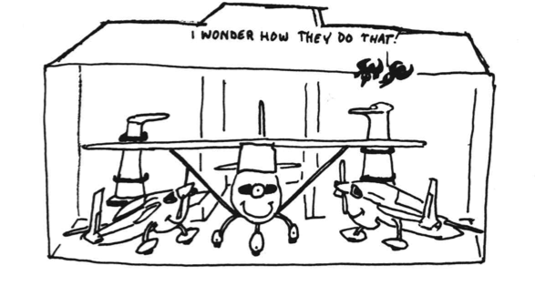

# CHAPTER 1. GENERAL 
## TABLE OF CONTENTS. 

Long-EZ documentation is available in the sections shown below. Section I consists of this book, plus an appendix of 14 18" x 24" drawings. The contents of all sections are shown in the following: 

| SECTION |
|---|---|
| **I** | MANUFACTURING MANUAL for basic air­frame - includes education on composite materials and construction, plans and construction manual for entire aircraft except engine installation. |
| **IIA** | Engine Installation - Plans for O-200 Continental aircraft engine. Includes drawings and installation instructions for the engine, baffling, engine controls, exhaust, carb heat muff and box, engine instruments prop, spinner, cowling and induction. |
| **IIC** | Same as IIA, except for the Lycoming O-235 engine. |
| | **Owners Manual** - Flight and maintenance manual. Includes normal and emergency procedures, weight and balance, check lists, detailed flying qualities descriptions, operating limitations, performance charts, maiden flight test procedures, pilot checkout procedures, and record keeping requirements. 
| **VI** | Landing Brake** - Drawings for landing drag device to increase glide angle and reduce float in the flare.

NOTE - Section I, II, VI and a subcription to "The Canard Pusher" newsletter starting with No. 24 (April 80) are **required** to build a Long­EZ. The Owners Manual is **required** before flying your Long-EZ . 

WARNING -These plans are obsolete unless updated by newsletters 24 and on. Do not fail to do this, as it is possible that MANDATORY flight­ safety improvements may occur.

**TABLE OF CONTENTS**

| **CHAPTER** | **TITLE** |
|:---:|---|
| 1 | Description |
| 2 | Bill of Materials |
| 3 | Education |
| 4 | Fuselage Bulkheads |
| 5 | Fuselage Sides |
| 6 | Fuselage Assembly |
| 7 | Fuselage Exterior |
| 8 | Roll Over/Seat Belts |
| 9 | Main Gear/Landing Brake |
| 10 | Canard |
| 11 | Elevators |
| 12 | Canard Installation |
| 13 | Nose and Nose Gear |
| 14 | Center Section Spar |
| 15 | Firewall and Accessories |
| 16 | Control System |
| 17 | Roll/Pitch Trim System |
| 18 | Canopy |
| 19 | Wings, Ailerons/Wing Attach. |
| 20 | Winglets/Rudders |
| 21 | Strakes - Fuel/Baggage |
| 22 | Electrical System |
| 23 | Engine Installation |
| 24 | Covers/Fairings/Consoles |
| 25 | Finishing |
| 26 | Upholstry |
| Appen. | Appendix Drawings 18" x 24" |

**DESCRIPTION/INTRODUCTION**

**Description**

The Long-EZ is a high performance, homebuilt aircraft. Its compact external size results in superb performance and economy using low horsepower engines. Inside, it provides comfort for two, both up to 61611 tall and 240 lbs, plus two meduim-size custom suitcases and 6 cubic feet of strake baggage area -all accessable from the cockpits. Its canard configuration was designed not only for performance, but to provide improved flying qualitites and safety as compared to the conventional light plane (see owners manual, for complete details on flying qual itites and performance). The Long-EZ uses the latest aerodynamic features. It uses the NASA -developed winglet system, and modern airfoils.

Its high-lift canard wing has full-span flaps which double as elevator and landing mounted inboard for control sytem s1mpl1c1ty􀀃 􀀄 and low adverse yaw. The aircraft has a drag devise, called a Landing Brake, to dirty it up, allowing use of r􀀆nways as short as 1800 ft, with appropriate pilot skill. The glide angle at idle power without the landing brake deployed is only 3.7 degrees. Thus, the brake is required to provide the normal descent control of conventional (less efficient) aircraft. 

Yaw control and main-wheel brake systems are combined, to further result in major simplification and improved flying qualities. The pilot has simple, one-piece rudder pedals to control rudder and wheel-brake to its functions. rudder A with cable a is spring run from returning each pedalthe rudder to a sealed neutral position. The outward camber of the winglet's rudder is such that the rudder brakeout force is increased with airspeed. This allows pleasantly low rudder forces at low speed where rudder is needed and higher initial forces at high speed where there is no requirement for rudder control. The rudder pedals are narrow enough to allow the pilot to tilt so his feet and move them in front of thepedals he can stretch out and relax his feet forward during cruise. The rudder cable moves a b􀀒lcrank at the firewall such that after full rudder is reached, further motion of the rudder pedal actuates its respective wheel-brake master cylinder. This system is less complex than the coupled rudder and toebrake system found in conventional aircraft. Also, it results in less brake wear since it is impossible to apply brake in a given direction without already using full rudder power. An adjustable bungee system provides pitch trim, adjusted by a lever on the left console. Roll trim is via bungee adjustment to the aileron controls. 

The main landing gear is a one-piece, molded, unidirectional fiberglass strut extending from design one axle eleiminates to the the other. excessive The leverage one-piece loads found in conventional two-piece gear legs. This allows a much lighter structural attachment at the fuselage. The gear and attactrnent ·have successfully undergone drop test to FAR-23 criteria. The gear strut is molded in an airfoil shape. The strut is designed to enter at the top of the to reduce wheel pant, interference rather than drag. at The the cruise side, penalty due to the main gear being fixed, is only 6 knots. Thus, the increase in empty weight, increased cost, and increased maintenance of a retractable main gear is not justified. 

The nose landing gear is a fiberglass strut, molded to the outside contour of the fuselage. The strut fits into a groove in the fuselage, thus a strut door is not required. The gear is retracted/extended by simple worm­ drive mechanism. The gear is retracted on the ground after the pilot gets out to allow the aircraft to park with its nose down, resting on a rubber bumper. Kneeled parking is used for several reasons: The aircraft is not as susceptible to upset its from nose, high the surface propeller winds is when raised parked to ona convenient height for hand starting, and the nose bumper provides a chock so that chocking the wheels is not required for hand starting. Refer to the owners manual for inflight and ground operation of the nose gear and for details on tiedown procedure. 

The fuel system glass/foam/glass-composite cons-us of two, fuel tanks, 26-gallowhi􀀚 ch form wing strakes along the sides. The wing tanks have SllDps to provide fuel in small. all Gauging attitudes. is provided Unuseable by fuel is directly **very** reading the fuel's coloration in a translucent p l«3 1 -2 portion of the tank in the back seat. See Chapter 21 for fuel system details. See Owners Manual for its operation. 

Each wing and the canard are easily removed to allow compact storeage or trailering. Refer to the Owners Manual for specific procedures for disassembly. While, in some cases trailering is the only solution to the crowded airport situation, we feel that the work required to completely disassemble, tie down on a trailer, etc., defeats the high utility of the airplane and results in the pilot not flying enough to stay proficient. We rec001Tiend the system shown in the sketch, where only one wing is removed and the airplane is hangared on a non­interference basis with a high wing aircraft. Assembly/disassembly time during this method is only about 15 minutes. 

Trailering at a road-towing width limitation of 8 feet requires a 33" high block under a wheel to tilt the airplane. 

The composite structure o-f your Long-EZ provides some important advantages over conventional metal, wood, or fabric construction. It has been tested to loads far in excess of those required for FAA certification. Fatigue margins are higher. Contour is maintained underload, the structure does not "oil can", buckle or distort. It provides excellent insulation and damps noise. It has no hidden joints, no water traps, and is far less susceptible to corrosion. It is easier to inspect, more redundant and easier to repair. It is not susceptible to thermal stress due to temperature changes. Properly protected from UV (see Chapter 25), it has a very long life. 

**Introduction**

This manufacturing manual has been speci­fically designed to educate you in the construction materials, their use, and to guide you through each step of assembly in the most efficient manner possible. It is our intent to drasitcally reduce the non-completion rate common to homebuilt aircraft. With that in mind, we have: 

1.	Preceded the plans with an education chapter intended to thoroughly acqaint you with the tools and materials and how to use them. 
2.	Laid out the plans in a detailed, step-by-step format to answer the question of "what do I do next?". 
3.	Provided all appropriate information to each step adjacent to the words. Due to binding requirements, the larger drawings are grouped together in an appendix. 
4.	Provided full-size templates where re­quired, to avoid.the work and confusion associated with scaling up drawings.
5.	Set up distributors to provide all materials and the hard to find tools.
6.	Identified the difficult to build items, and made them available (pre­fabricated.and ready to install) from competent manufacturers/distri­b.ttors.
7. Set up our newsletter, "The Canard Pusher." as a continuing plans up­dating/correcting system.** "The Canard Pusher," also, distributes build­er tips, etc., as they become avail­able. 

Over 80% of homebuilt airplane construc­tion projects started, are never finished and flown. Because plans updates occa sionally 􀁠􀁡 ,.of a mandatory nature, a subscription to The Canard Pusher" is mandatory for those building. 

**Building Sequence** 

The nature of the type of Lon!,-EZ structure requires that a part be left alone to cure for a longer period of time than that required to build it. Thus, you will find that when following the step-by-step order, you will often find yourself out of work, waiting for a cure. In most cases you can skip to another c.hapter and build another part while waiting. With a little planning and familiarity with the entire manual, you should be able to use all your time productively. 

**Building Time**

Note that N􀁳ny stepsinclude an estimate of the number of man-hours required and the number of people required. This infor­mation was compiled from our experience building N'l,RA and N4EZ. If you add all these together, you will get a total of oho􀀖't 500 man-hours for section I. This does not include (1) studying the plans and round--­ing up required tools and materials in preparation for a chapter, (2) cleaning up your shop, (3) standing around watching things cure, (4) discussing your workman­ship with friends that stopped by to help. Many of you will find that through efficient work practice, you can consistantly beat the time estimates on most of the steps.

Others may find that they are spending as much as twice the time estimates. If you are spending considerably more time than that shown, go back and study §J.l the de­tails in the education chapter. Most slow work is due either to overcautious work habits as a result of being unsure of workmanship, or ignorance of the correct way of doing things. 

**Questions?** 

Please follow the following procedure if you do not understand something and need an answer. First of all, do not be concerned if you do not understand everything the first time you read through the plans. Many things that may not be obvoius just reading the drawings, will be obvious when you have that portion of the airplane in front of you or have built a similar part in a previous chapter. Also, we will be able to help you better if you are look­ing at that portion of your airplane. So, do not ask for clarification until you are really working in that chapter. We have found through our VariViggen experience that the majority of questions the home­builder asks are already answered somewhere in the plans. W􀂅 have made consiarable effort in tte Long-EZ manual to make the information Visible. If you do not under­stand something, study the words in the step, study the sketches and all related sections/ views/photos, then look through the full­ size drawings that show that portion of the airplane. Check the over-view and parts list. If its a methods-type question, re-read the education chapter for clari­fication. If the answer is still not found, it may be that, that item is covered in detail in another chapter (there is some necessary overlap). Remember .related to section II tle control, oil pressure gauge, etc,) are covered only in that section. It is pos­sible that a question related to the op­eration of a part of the airplane or its maintenance is answered in your owners manual, Also,check your back issues of "The Canard Pusher ( number?'! on) for plans updates or clarifications. Okey, you have checked everything and you are still stumped. You can do one of three things:

1. Ask a friend. Often a description of an item is unclear- to one indi­v.idual and clear to another. 
2. Write to RAF, leaving room on the paper under each question for our answer. **INCLUDE A SELF-ADDRESSED, STAMPED ENVELOPE** and **INCLUDE YOUR AIRCRAFT SERIAL NUMBER**. We do our best to answer all such questions within two days of receipt. We can­not answer questions regarding the application of non-recommended materi­als or regarding non-approved modi­fications. Address: RAF, 1'1Rl't>􀀵T ll, Mojave, Ca. 93501.
3. Call RAF (805) 824-2645. 

Also, let us know if you have found a better way of doing something. If we agree, we'll publish it in "The Canard Pusher" so that all builders can benefit. If it is JlQj; a good idea, we'll tell you why, ti you include a self-addressed, stamped envelope.

Do keep us up to date on the progress of your project, Send us a black and white snap ·shot of your airplane for publica­tion in "The Canard Pusher." Photos in the newsletter are particularly beneficial if they are of an area of the airplane that's not clearly shown with photos in the plans. Remember, the primary purpose of "The Canard Pusher" is to support your airplane project. 

If you are not a member of The Experi­mental Aircraft Association (EAA), do Join. This is the only organization who looks out for the homebuilder as far as FAA regulations ·are concerned. Membership in your local.EM can be extremely benefi­cial both in building your airplane and in meeting people who share your interests. Their monthly publication, "Sport Aviation," is worth the $25-per-year membership fee in itself. Write to EAA, Box 229, Hales Corners, Wisconsin 53130. EAA often publishes reports on builder's projects -􀂬end them photos and some words on your progress. 

**License Agreement/Serial Nunber Disclaimer** 
ny peop e uy aircra t pans wit out the specific intent to build an airplane. If you definitely plan to build a Long-EZ from these plans, fill out and sign the license agreement (both copies) in the box below, clip them out, and mail to RAF, Bldg 13, Airport, Mojave, Ca 93501. We will then assign a serial nunber to your aircraft, and mail copy one back to you. Refer to this serial number when contacting us for any assistance on you project. Builder support is provided only to those holding this license to build a Long-EZ. Use this serial number when registering your aircraft with the FAA. 

**Prospective** 
The builder of an amateur-bull t airer.aft is the manufacturer, he is responsible for quality control on all parts, all construction, and the conduct of his flight tests. While Rutan Aircraft Factory is not the manufac­turer of your aircraft, we do, through these p􀂅ans and services, provide you with. informa­tion about how our Long-EZ was bull t and how we feel is the best way for you to build a safe, reliable airplane. We do encourage you to build the airplane as shown on the plans because we have found that our airplane pro­vides us with reliability and safety, and any problems that we experience with our air­craft are documented and reported in "The Canard Pusher." We have gone to a consider­able effort in developing the design, the stI";1cture. and th􀀏 systems, and proving their adequacy with appropriate tests. 

If you modify the airplane and then ask us if your modification will work, we cannot give rou an answer without conducting the ap­pro􀀒r􀀓ate tests 􀀔d totally qualifying the modification. This would obviously be quite expensive. Our concern then, is that if your modification is not successful, and causes an incident or accident, this would be attributed to our design, the Long-EZ Because of this, we must insist that if you modify the airplane with any major change (such as an aerodynamic change, primary struc­􀀜ural ch􀀝e, or using a non-approved engine installation), you call your airolane a dif­ferent name, rather than a Long-EZ If you make a major change, you must consider your self involved in basic aircraft design and development, an extremely risky business. As such it is not fair to us to be associated with any results of your development. We state this,not to discourage inventiveness and progress, but to release any connection of your new development efforts with our proven design. 

We are particularly concerned about the trend among the amateur builder to use high performance homebuilt airplanes, as fly􀂷ng test beds for brand new, unproven engine developments. Initial flight testing of a new po·we.rplant, even though it is "well proven" in a car, snowmobile, motorcycle, test stand, etc., is an extremely risky op­eration. These tests should be done on an airplane like a Piper Cub, Aeronca Champ, etc., for two reasonsa 1. The slow flying, light wing loading types are much more for­ giving for forced lantl.ings · in the trees and 2.the accident you may have is not just another statistic, it is a homebuilt accident the results of which can.have an effect on the overall regulations governing the building and flying of amateur-bull t aircraft. The U.S.A. has the mo.st lenient regulations for homebuilts of any country in the world and we can keep those regulations if we, through caution, common sense, and self-policin& re­tain our excellent safety record.

So, if you have a strong desire to try your idea of a turbo-injected rotary watzit or your geared-razzle dazzle, good, do it, 
but first put it in a Piper Cub (FAA will 
apply appropriate restrictions during your 
tests), fly it 1000 hours, keep strict main­tenance/failure records, get the right atti­tude toward reliability for an aircraft-­
powerplant and then, when you're convinced 
it is good, install it in a homebuilt air­
craft. In this way, maybe we can finally 
get a good. low-cost powerplant without giving EAA a bad name and without forcing tighter 
restrictions on the operation of homebuilt 
aircraft.

**FAA Licensing Procedures**

This procedure applies .in the U.S.A. only. The FAA has a definite procedure for regis­tering and licensing homebuilt aircraft. There is nothing complicated about it but they insist that you follow each step care­fully. 

1. Contact your local FAA engineering and manufacturing district office or FAA general aviation district of­fice. Tell them you are bui.lding a Long-EZ homebuilt. Give them the fol­rowing information, 
    - 3-view (copy or clip from plans bcLcK cover,
    - Aircraft serial number (obtain from RAF See P'lj e 1-"I}. Aircraft registration number, if available (see step #2)
    - Approximate date of completion
    - Engine-type you plan to use, FAA will then answer you, and give you an idea of how much notice they Wa'l􀀂 for them to inspect yotrairplane, tell you where the approved test areas are, etc. 
2. This step is optional, and applies only if you want to reserve a specific re­gistration number (the number you will paint on the tail). You can ask for all numbers, numbers followed by a single letter or numbers followed by two letters. They are preceded by the letter "N," (For example, N?EZ, N4EZ, etc.) Be sure to give them yotrsecond and third choice, in case the number you want is already taken. Send $10 to reserve your special number. Ad­dress, FAA Aircraft Registry, Box 25082, Oklahoma City, Ok. 7J125, Do not register your aircraft yet, you don't need to pay registration fees, property taxes, etc., until your air­plane is ready to fly. 
3. When you are ready for inspection contact your local FAA office. Be sure you have an airframe log book (avail-able from a distributor) so that FAA can make an inspection entry.
4. To prepare for your final inspection, be sure you have:the "N" number painted. Tt M'1􀁛l he a:t lect-.'t 'l·,, '"";Jh «.1\1 Ir\ bloc.I< ltn􀀆􀀇<;:, ....,,,-􀀋 uo􀀍'r􀀏A􀀐T•loJt C.CL􀀂. the "Experimental" sign ( 2" high letters) _on the canopy frame, the ID plate and passenger warn­ing plate mounted (available from a distributor), and have an air­frame log book and an engine log book. Before final inspection, fill out an application for registration (FAA form \#AC8050-1), a notarized affidavit that you built the airplane from parts that you bought yourself, and include $5 registration fee. Send those three things to the FAA Registry, Box 25082, Oklahoma City, Ok, 73125 
5. After you have made a final inspection of your aircraft, run the engine, con-duct low speed taxi tests, etc., (see owners manual), contact your local FAA office and tell them you are ready to fly. They will:have you fill out an application for airworthiness (form #8130-6), inspect your airplane, and issue you an airwothiness certificate and a list of operating limitations, that will restrict you to an unpopu­l􀃦ted area for your initial test period (10 hours). When you have completed your initial test period, contact FAA to get your operating limitations amended so you can fly outside your test area. 

\* Refer to education section -inspection is done to major areas (wing, canard, wing­let, fuselage) after the glass is applied, but before the area is painted with any primer, etc., so the glass structure can be inspected. The FAA office has been sup­plied with the same inspection criteria that you have described in your education section.
