# CHAPTER 3

## EDUCATION

**DO NOT SKIP THIS SECTION.** Every hour you spend in this preparation section will save you five when you really start building your aircraft.

## GENERAL

In this section you won't build any part of your airplane.
What you will do is learn how to build your airplane the right way.
This construction technique is radically different from anything you've done before (including building boats, surfboards, airplanes, and Go-Karts),
and you should assume there is only one correct way to do it.
We've discovered lots and lots of wrong ways of doing things and have written the plans to keep you from repeating our mistakes.
We insist that you do things our way.
If you have a better idea, suggest it to us.
We'll publish details in the "Canard Pusher."

This section will teach you all of the techniques required to build your airplane, show you what special tools you need and how to use them.
The educational samples that you will build in this section are designed to give you experience and confidence in all of the techniques that you will use in the construction of your airplane.
The steps in the construction of each sample are arranged in sequence (as are the steps in construction of the actual aircraft parts) and you should follow the sequence without skipping any steps.
You will learn the basic glass layup technique used throughout the aircraft,
special corner treatments, foam shaping/cutting, and joining methods.
A summary of these techniques is provided on yellow paper for you to tack up on your shop wall.

## TOOLS

There are certain tools which are necessary to complete the aircraft.
Three lists of tools are provided here.
The first is the absolute bare minimum required, sacrificing efficiency; the second is a recommended list for the best compromise of cost and work efficiency; the third is a list for the "Cadillac" of shops where ease of construction is more important than money.
The uncommon items are stocked by the Long-EZ distributors.

### Basic Required Tools

- Common household butcher knife
- Coping saw
- 1/4" drive socket set
- Small open-end wrenches
- Sandpaper
  - 36-grit carborundum Aloxite Fastcut (50 sheets)
  - 220-grit wet or dry silicon carbide (20 sheets)
  - 320-grit wet or dry silicon carbide (20 sheets)
- Disston Abrader #401c - Tool for carving fiberglass.
- 5/8" conterbore with 1/4" pilot; 10" long shank
- 12" long, 1" dia. drill bit
- Peel-ply
- 2" dia. drum sander (coarse) for 1 1/4" drill
- Coarse rotary file bit for 1/4" drill
- Pliers
- 1" putty knife
- Hacksaw
- Blade and Phillips screwdriver
- Box of single-edge razor blades
- 24" carpenter's level
- Carpenter's square
- Felt marking pens
- 3-ft straightedge
- 200 8-oz paper cups
- 50 3-oz paper cups (wax-free)
- 12-ft decimal steel tape (Stanley #61-112)
- 1/4" drill with #30, #3, #10, 1/4", #3, 15/64", #12, and #21" bits
- #10-32 and 1/4-28 taps
- Roll of gray duct tape
- 1" and 2" paint brushes (100 each)
- 6" plastic or rubber squeegees
- Scissors
- Wire brush
- Pop rivet puller
- Homemade balance for measuring epoxy ratios
- Wall thermometer 50-100 degrees F
- 1/4" hand drill

### Recommended Tools

(the following tools are to be used in addition to the basic tools)

- Dremel-type miniature high-speed hand grinder with saw and router bits
- 6" to 9" disc-type hand sander
- Set of 1/4", 1/2" and 1" chisels (wood)
- Small set of X-Acto knives
- Stipple rollers
- 1/2" dia. 100 degree counter sink (piloted)
- 6" machinist steel ruler
- X-Acto razor saw
- Box of wood tongue depressors to mix epoxy
- 6-ft straightedge
- Cheap hole saw set or fly cutter
- 3/8" variable-speed hand drill
- 12" long drill bits - #10 and 1/4"
- Hand broom/brush
- Large commercial 12" scissors (Will #20W)
- Sabersaw
- Bench-mounted belt sander
- Stanley surform plane
- Square and half round file
- Several 6" C-clamps
- Shop vacuum cleaner
- 10" 18 tooth/inch handsaw (see sketch)
- Approx. 150 lbs of small weights*

\* Weights are used to hold various parts down while epoxy cures.
They're best in 5 to 15-lb pieces.
The items in the photo work great.
We got them for 5¢/lb at a local scrap yard.
Sand-filled milk cartons also work well.
Lead shot bags also work well.

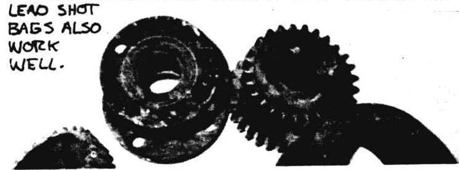Figure 3-1: Example of Weights

### For the First Class Shop

(the following tools are to be used in addition to the basic tools)

- Drill press
- 18-inch bandsaw
- Vernier Caliper
- Epoxy ratio pump (Michael Engineering dispenser)
- 90 degree drill adapter
- Air compressor with blow nozzle
- Orbital sander
- 3/8" and 1/2" spotface
- Drill sets #1 - #60 and 1/16 - 1/2 (1/64 inch)

### Occasionally Used Items (can be borrowed)

- Nicopress sleeve tool
- 1 dozen 1/8" Clecos
- Hotwire voltage control

### Homemade Tools

#### Sanding Blocks

These are required in many areas during construction and for finishing.
You may aso use a "soft block,"
which is a block of the blue styrofoam wrapped with sandpaper.

A lot of elbow grease is saved if you replace the sandpaper often.

#### Long Straightedge

This is not absolutely required,
but is quite handy when jigging or checking the straightness of flying surfaces.
It is merely a 6-ft or 8-ft 1x3 or 1x4 piece of lumber that is hand-selected to be "eyeball straight."

You can get it one of two ways:

1. Order it from Aircraft Spruce or Wicks - they plane them perfect from dry lumber.
2. Sort through the lumber (dry fir or redwood) at your local lumber yard until you find one that looks straight when you eyeball it from one end. Mark it and hang it on the wall so it doesn't end up as part of a shelf!

#### Epoxy Balance

Devices which automatically ratio the correct amount of resin and hardener and dispense it with the pull of a lever are available from Long-EZ distributors for approximately $130.
These save time and epoxy.
You can also ratio the epoxy the way we did in building N7EZ and N4EZ by building the following simple balance:
Cut out the 5-step instructions and glue to your balance - don't skip steps!
Follow each step **exactly** every time you mix epoxy.

##### __Balance Instructions__

Place the following instructions on your balance:

1. Place both empty cups as shown (wet the hardener cup).
2. Adjust ballast weight to level mark.
3. Fill resin cup with desired amount of resin - 1 to 6 oz.
4. Add hardener to hardener cup to balance scale on level mark.
5. Pour the hardener into the resin cup and mix.

Cut the instructions out and glue them to your balance.

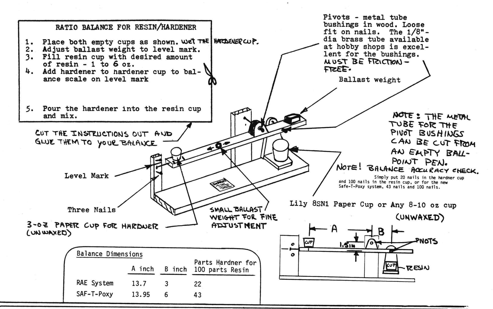Figure 3-2: Epoxy Scale

#### Hot Wire Cutter
You will need a hot wire cutter to carve all the foam cores for the canard, winglets, and wings. Refer to sketch.

Figure 3-3: Hot wire cutter

The variable voltage control can be obtained from a Long-Ez distributor, or you can substitute any contrllable power supply to include the 14 to 20 volt range with at least 4 amp capability. An alternative is to borrow two 12-V battery chargers or auto batteries and lash up the following device. The "A" blocks represent either a battery or a 12-V DC battery charger with 4-amp capability.

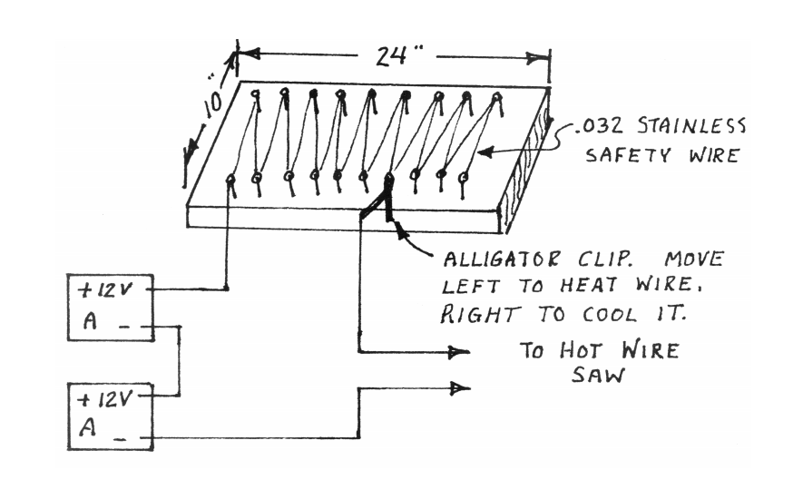Figure 3-4: Hot wire cutter temperature control

The cutter should <u>only</u> be used on the blue or white styrofoam. A hazardous gas is emitted if you try to cut urethane.

You can substitute 0.25 nicrome wire which can be run at a lower current (about 2 amp) but nicrome wire is difficult to find. Adjust the current to obtain a wire temperature which will allow the wire to cut the foam at a rate of one inch every four to siz seconds when pulled with a light load (less than 1/2 pound). This can be checked with a small scrap f foam. If temperature is correct, foam will have a smooth hairy surface. A cratered surface means too much heat. If the wire is too cold, the cutter will have to be forced hard, causing the wire to lag. Lag should not exceed 1/2 inch over the top and bottom of the wing and nt over 1/8 inch around th eleading edge. If the wire is too hot, it will burn away too much foam, making the part too small and will result in ruts i the foam if the wire is inadvertently stopped during cutting. The wire should be tightened until the wire starts to yield. Check this by tightening the wire while plunkint it listening to the sound. The pitch will increase until the wire yields.

#### Jig Table

You will need a table to jig and build the wings and canard.
It should be at least 11 ft ft by 3 ft.
Any larger than 4 ft by 12 ft will just get in the way.
Use a little care in making a flat, untwisted surface.
The following is a sketch of the one we made and it works fine.
The box design makes it stiff in torsion.
Set it up with the top 35 to 39 inches above the floor.
Don't get carried away with surface finish since you are going to be gluing blocks to it with bondo and chiseling them off several times.

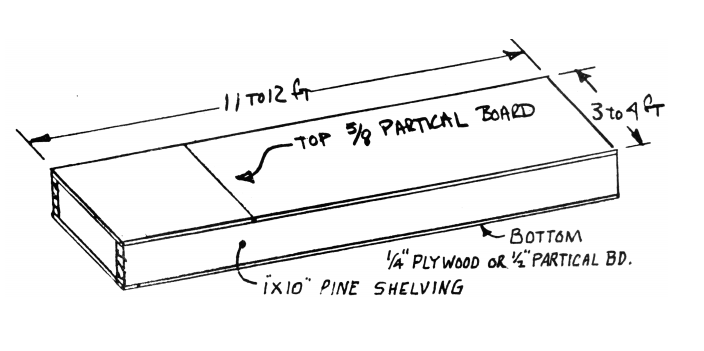Figure 3-5: Work Table

## MATERIALS

The materials, processes, and terminology used in the construction of your Long-EZ are new to homebuilding.
This section is devoted to familiarizing you with the language, materials, and techniques used in these plans.
This information is basic to the construction of your airplane.
You should study this section and be sure that you understand all of it before continuing.

There are five basic materials that you will be working with:
fiberglass cloth, epoxy, microspheres, flox, and foam. Each material, its properties, and uses will be discussed in detail.
Basic processes using these materials will also be discussed.

### <u>Glass</u>

The most basic structural material in your LongEz is glass cloth. Glass cloth is available commercially in hundreds of different weights, weaves, strengths, and working properties. The use of glass in aircraft structures, particularly structural sandwich composites, is a recent development. Very few of the commercially available glass cloth types are compatible with aircraft requirements for high strength and light weight. Even fewer are suitable for the handlayup techniques developed by RAF for the homebuilder. The glass cloth used in the LongEz has been specifically selected for the optimum combination of workability, strength, and weight.
The glass cloth in your LongEz carries primary loads, and its correct application is of vital importance. Even though doing your glass work correctly is important, this doesn't mean that it is difficult; in fact it's VariEze!

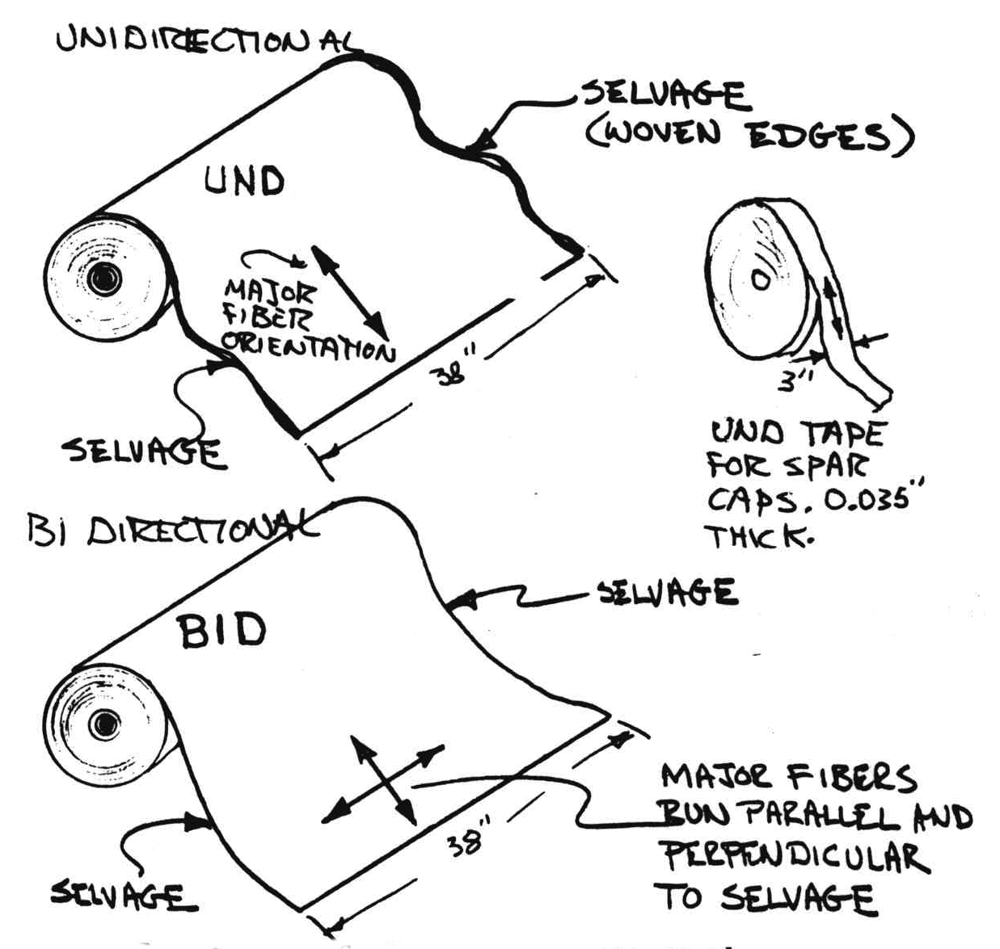Figure 3-6: Types of Fiberglass

Two types of glass cloth are used, a bi-directional cloth (RA5277BID), and a unidirectional cloth (RA5177UND).  (Use the full part number for ordering your cloth, but for simplicity the plans will use only the BID and UND designations.) BID cloth has half of the fibers woven parallel to the selvage edge of the cloth and the other half at right angles to the selvage, giving the cloth the same strength in both directions. The selvage is the woven edge of a bolt of fabric as shown in the accompanying sketch.

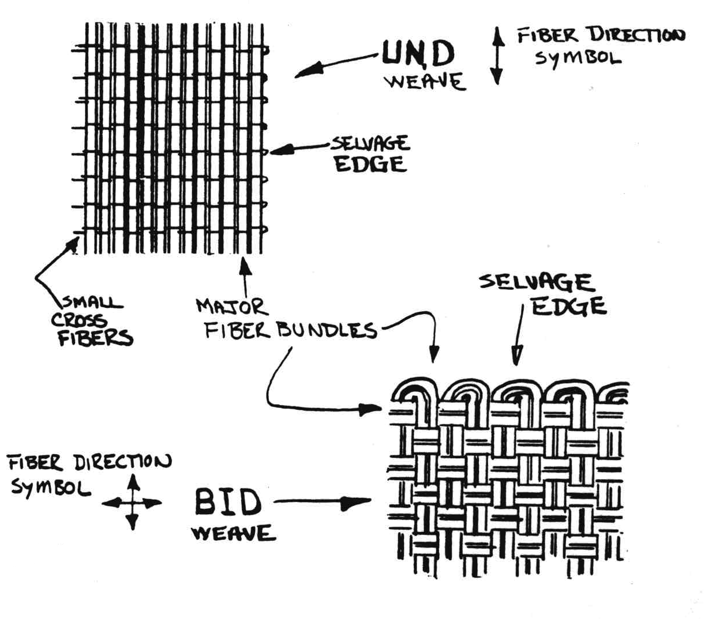Figure 3-7: Selvage edge of fiber

UND cloth has 95% of the glass volume woven parallel to the selvage giving exceptional strength in that direction and very little at right angles to it.

BID is generally used as pieces which are cut at a 45-degree angle to the selvage and laid into contours with very little effort. BID is often applied at 45-degree orientation to obtain a desire torsional or shear stiffness. UND is ussed in areas where the primary loads are in one direction, and maximum efficiency is required such as wing skins and spar caps.

Multiple layers of glass cloth are laminated together to form the aircraft structure. Each layer of cloth is called a ply and this term will be used throughout the plans.

Making and cutting the plies of glass cloth is a job that you will repeat often in the construction of your LongEz. Glass cloth should be stored, marked and cut in a clean area with clean hands and clean tools. Glass contaminated with dirt, grease, or eposy should not be used. A clean, smooth surface is needed fo marking and cutting. the area used for storng an cutting glass cloth should be separated from the aircraft assembly area because it will be exposed to foam dust, eposy and other things wich can contaminate the cloth. You will need a good sharp pair of scissors, a felt-tipped marker, a fairly straight board and a tape measur for marking and cutting. The small amount of ink from marking and numbering plies has no detrimental effects on the glass cloth.

In each step the size, type and fiber orientation of each ply is given. Take the list to your glass cutting table, roll out a length of the appropriate cloth, straighten the selvage, mark all of the plies, and cut them.

Now is a good time to stop reading long enough to go and cut a square ply of BID and see how easy it is to change its shape by pulling and pushing on the edges as shown in the sketches. Cut a square with the fibers running at 45 degrees and pull on the edges to shape the piece.

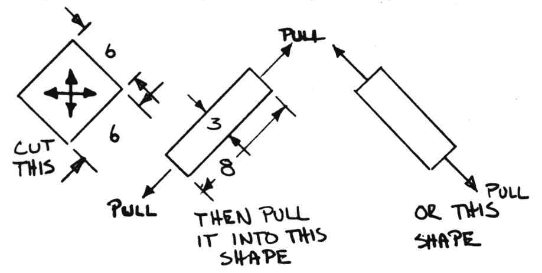Figure 3-8: Exploring BIDs adaptability

It helps if you make fairly straight cuts but don't worry if your cut is within 1/2 inch of your mark. As you cut BIT it may change shape, just as the square ply that you are experimenting with does when you pull on one edge. Plies that distort when cut are easily put back into shape by pulling on an edge. Rolling or foldng cut plies will help keep them clean and make it easier to maintain their shape. If several plies are called for, it may help to number them before cutting. Save your clean scraps and make an effort to use them for smaller plies. If the cloth is spotted with epoxy throw it away.

When cutting long strips or large pieces of 45 degree BID, always roll or fold it so it keeps it shape when handled. When it's applied it can be set on one end of the part and <u>rolled</u> onto it. If you pick up each end, it will distort and nt fit the part properly.

The fiber orientation called for in each materials list is importand and shouldn't be ignored. UND is characterized by the major fiber bundles running parallel to the selvage and being much larger than the small cross fibers which run at right angles to the selvage. In BID the cross fibers are the same size as those running parallel to the selvage, giving BID an even "checker board" appearance. BID is commonly used for plies cut at 45 degrees to the selvage. Your tailor would call this a "bias" cut. The 45 degree cut makes it easy to work wrinkles out of a  ply locally, without having to chase it to the far edge. The 45 degree cut also makes it possible to make a ply slightly longer than origianlly cut by pulling the ends or wider by pulling the sides. The 45 degree orientation isn't critical; you don't need to measure it. Your eyeball of a rough diagnal (45 degrees +/- 10 degrees) is adequate when either cutting or laying up the cloth.

### <u>Epoxy</u>

In recent years the term "epoxy" has become a household word. Unfortunately "epoxy" is a general term for a vas number o specialized resin/hardener systems, the same as "aluminum" is a general term for a whole family of specialized metal alloys. Just as the "aluminum" in the spar of high performance aircraft is vastly different from the "aluminum" pots and pans in your kitchen, the "epoxy" in your LongEz is vastly different from the hardware store variety.

Epoxy is the adhesive matrix that keeps the plies of load-carrying glass cloth together. Epoxy alone is weak and heavy. It is important to use it properly so that the full benefits of its adhesive capability are obtained without unnecessary weight. A large portion of you educatio in composit structural work will be spent learning how to get the full strength of an epocy/glass mixture with the minimum weight. This section will discuss the terminology and techniques for working with epoxy resin and its hardener.

An "epoxy system" is made up of a resin and a hardener tailored to produce a variety of physical and working properties. The mixing of resin with its hardener causes a chemical reaction called curing, which changes the two liquids into a solid. Different epoxy systems produce a wide variety of solids ranging from extremely hard to very flexible. Epoxy systems also vary greatly in their working properties, some are very thick, slow pouring liquids and others are like water. Some epoxy systems allow hours of working time and other harden almost as fast as they are mixed. A single type of resin is sometimes used with a variety of hardeners to obtain a number of different characterists. In short, there is no universal epoxy system; each has its own specific purpose and while it may be the best for on eapplication, it could be the worst possible for another use.

The RAE-type epoxy systems used in the construction of your LongEz are tailored for the best combination of workability and strength, as well as to protect the foam core from heat damage and solvent attack. These systems are also low in toxicity (SPI-2) to minimize epoxy rash. These epoxies are not similar to the common types normally marketed for fiberglass laminating. Three different systems are used in the LongEz for three differen types of work: a slow curing system, a fast curing system, and a 5-minute system. The very fast curing (5-min) system is used much like clecos are used in sheet metal construction (or clmps in woodwork) for temporary positioning. Five-minute is also used in some areas where high strength is not required, but where a fast cure will aid assembly.

As an epoxy system cures, it generates heat and in some areas, the heat buildup of a medium or fast curing epoxy system is unacceptable. Where this is a potential proble, a slow curing system is used. Slow cure epoxy is always used with styrofoam, where heat can melt the foam away and ruin the jont. In other areas where heat buildup isn't a problem and a faster cure is desirable, a fast curing system is used. Both the fast and slow cure epoxies will cure to a firm structure at room temperature within one day. Complete cure takes 14 days.

The RAF epoxy systems are called RAES (for slow curing), RAEF (fast curing), and 5 MIN. Both the RAES and RAEF hardener use the same RAE resin.

Note! See page 3-15 for new low toxicity Safe-T-Poxy.

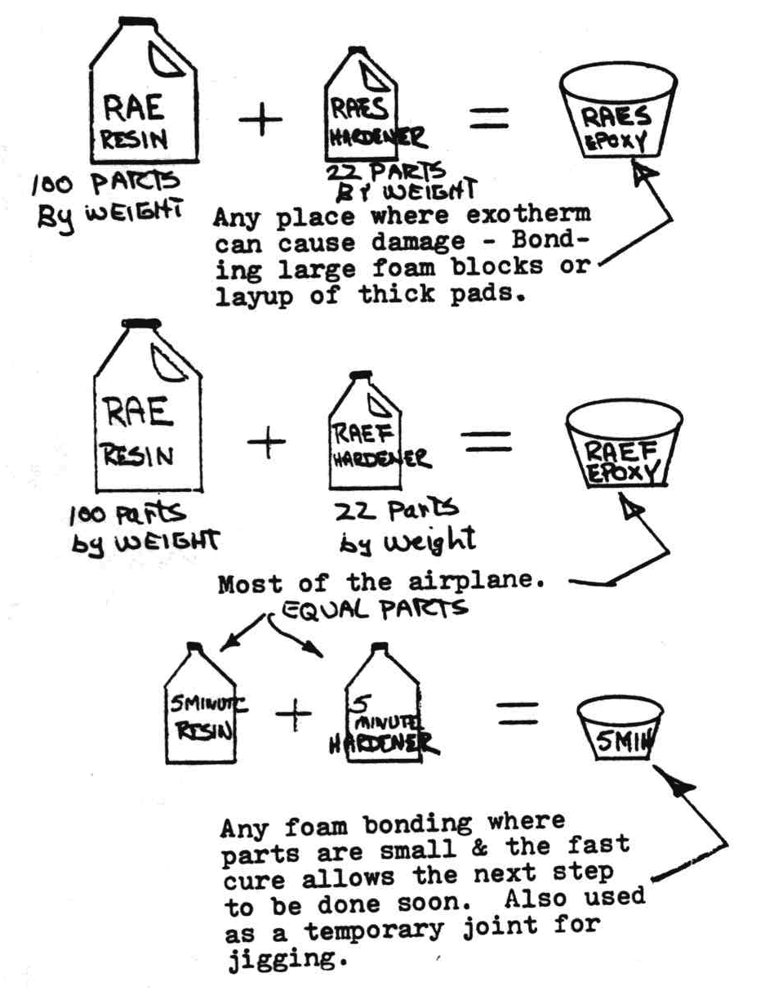Figure 3-9: Mixing Epoxy

Note: If working conditions are hot (85 to 90 degrees), RAES can be used where RAEF is called out. While this practice is allowable, the best results are obtained working between 70 and 80 degrees Farenheit with the specified epoxy.

The working and strength characteristics of an epoxy system are dependent on the resin, the hardener, and on the amount of each in a given mixture. Epoxy sysstems are engineered for a specific ratio of resin and hardener. It is quite important that the proper mixture be obtained. An accurate balance or ratio pump must be used to accomplish this. A drawing of an inexpensive ratio balance is included in these plans, page 3-2. The mix ratio accuracy is particularly important with rAEF & RAES. The 5-min can be adequately ratioed by merely pouring a blob of part A in a cup and adding a blob of part B that looks the same volume before mixing. <u>Never</u> eyeball estimate RAEF or RAES, <u>always</u> carefully use the balance or pump.

Epoxy resin and hardener are mixed in small batches, usually 6 ounces or less, even in the largest layup. The reason for the small batches is that, in large batches, as the hardening reaction progresses, heat is generated which speeds the reaction, which causes even more heat, which ends up in a fast reaction called an exotherm. An exotherm will cause the cup of epoxy to get hot and begin to thicken rapidly. If the occurs, throw it away and mix a new batch. The small volume batch avoids the exotherm. For a large layup, you will mix many small batches rather than a few large ones. With this method you can spend many hours on a large layup using epoxy that has a working life of only a few minutes. If the epoxy is spread thin as in a layup its curing heat will quickly dissipate and it will remain only a few degrees above room temperature. However, in a thick buildup or cup, the low surface area to mass ratio will cause the epoxy to retain its heat, increasing its temperature. This results in a faster cure causing more heat. This unstable reaction is called an exotherm. Exotherm temperatures can easily exceed the maximum allowable for foam (200 F) and damage the foam-to-glass bond. This is why the slow epoxy system is used in joining foam cores as exotherm is impossible as long as epoxy joint thickness is less than 1/8".

Unwaxed paper cups are used for mixing and ratioing resin and hardener. Convenient 8-oz cups for resin are available from RAF distributors. The hardener cups are 3-oz unwaxed bathroom paper cups available at any grocery store. Don't use waxed cups; the wax will contaminate your epoxy.

If you are using the homebuilt balance, follow this procedure. Place the resin (8 oz) cup on the right cradle. The resin cup can be either a new clean cup, one with a little uncured epoxy left in the bottom, or a clean cup from a previous layup with hard epoxy in the bottom (smoot, not lumpy). Now, take a clean 3-oz hardener cup - pour a splash of hardener into it the scrape the hardener back into the cotainer. This gives the hardener a wet surface, so its remaining hardener will not be counted in the balancing. Now, place the wet hardener cup on the scale, check that it swings freely and balance it perfectly by moving the small weight. Epoxy is then poured into the 8 oz cup (6 oz or less). Hardener is then puured into the 3-oz cup at the other end of the balance until the arem is level. When ready to mix, pour the hardener into the resin cup and mix completely. If you have th eratio pump, you simply put one cup under the spout, pump out the amount that you want and mix. Mixing is done by stirring with a stick, being careful not to spill any. If you spill part of an unmixed cup, the ratio of resin and hardener may be inaccurate and it shouldn't be used. Mix each cup for <u>at least to minutes.</u> You should spend 80% of your mixing time stirring the cup and 2o% scraping the sides to assure complete mixing. Don not mix with a brush. The bristles can soak up the hardener, changing the ratio. Use a tounge depressor or wood stick.

The working temperature has a substantial effect on the pot life and cure time. Very hot conditions will cause the cure to speed up. In cold working conditions the cure will be delayed and if it is cold enough, epoxy may not cure at all. Working temperatures must be 65 to 95 degrees F. A range of 75 to 85 F is best. Be sure to get a wall thermometer (approx. $1.50 at any general store) to check the temperature of your work area. At 75F, 5-min must be used within four minutes, RAEF must be used within 20 minutes and RAES must be used within 50 minutes.

Cold epoxy results in increased time required to do a layup, since it takes longer to wet and squeeze the cloth. A layup at 65F may take almost twice the time as a 75F. On most layups (except for joining foam cores) its best to have 70F to 80F room temperature and 80F to 90F epoxy. Resin and hardener can be kept warmer than room temperature by keeping it in a cabinet with a small light bulb on. Do not store your resin or hardener on a cold floor if you plan to use it within the next several hours. If you let your shop get cold between working periods, keep some resin & hardener in the warmest place of your house for use on the next layup.

Save your mixing cups, as they can be used as a quality check of your epoxy. After a day or two take a sharp knife point or scribe and scratch the surface of epoxy in the cured cup. If the epoxy cured properly the scribe will make a <u>white scratch mark</U>. If the epoxy hasn't cured the scribe will make a dull ridge, indicating a soft surface. If this occurs the epoxy is not cured either due to inadequate time or temperature, or bad mixing or bad epoxy. Refer to page 3-15 for details on the new SAF-T-Epoxy.

### <u>Microspheres</u>

Microspheres are a very light filler or thickening material used in a mixture with epoxy. Micro, as the mixture is called, is used to fill voids and low areas, to glue foam blocks together, and as a bond between foams and glass skins. Several different types of microspheres and microballoons are available commercially. The quartz-type supplied by RAF distributors is lighter and cheaper than most common types. Microballoons must be kept dry. If moisture is present it will make them lumpy. Bake them at 250F then sift with a flour sifter to remove lumps. Keep the microballoon container covered.

Micro is used in three consistancies: a "slurry" which is a one-to-one by volume mix of epoxy and micro-spheres, "wet micro" which is about two-to-four parts microspheres by volume to one part epoxy, and "dry micro" which is a mix of epoxy and enough mirospheres to obtain a paste which will not sag or run (about five parts-to-one by volume). In all three, microspheres are added to <u>completely mixed</u> epoxy.

You do not have to accurately mix the microspheres; just dump them in until the desired consistancy is obtained. Micro slurry is used to paint over foams before glass cloth is appied over them.  Slurry is almost the same viscosity as the pure epoxy and is runny enough to apply with a brush. However, the easiest way to apply slurry is to pour it onto the surface and spread it out evenly using a squeege. When skinning urethane foam use a <u>full thick</u> coat of slurry. Inadequate slurry on urethane can result in a poor skin bond.

Wet micro is used to join foam blocks and, while it is much thicker than slurry, it is till thin enough to sag and run (like thick honey).

Dry micro is used to fill low spots and voids and is mixed so that it is a dry paste that won't sag at all. 

In all three micro types, you don't measure, just add microspheres until the desired consistancy is obtained. Use micro only as specifically shown - <u>never</u> use micro between glass layers.

### <u>Joining foam blocks with microspheres / epoxy</u>

<u>Always</u> use the followng method to join foam blocks. This is extremely important. Always use RAES or SAF-T-POXY.

1. Check that the foam blocks fit closely together. If there are voids over 1/16 inch, sand to fit, or fill the void with a sliver of foam.
2. Paint a light coat of micro slurry on both surfaces. If joining foam to fiberglass paint pure mixed epoxy (no microspheres) on the fiberglass surface and micro slurry on the foam surface.
3. Refer to the sketch and trowel wed or dry micro in the center of the joint. Thus, when joined the micro is pushed outward expelling (rather than trapping) air. If the fit is excellent use wet micro. If it is open enough and vertical such that epoxy may run out, use dry micro.
4. Push the two pieces together, wiggling each to move the micro toward the surfaces. Be sure the mciro is no thicker than 0.1 inch at any place, to avoid exotherm. Wipe off any excess. Do not be concerned if the micro does not completely reach the surface. That void can be filled immediately before skinning the part.

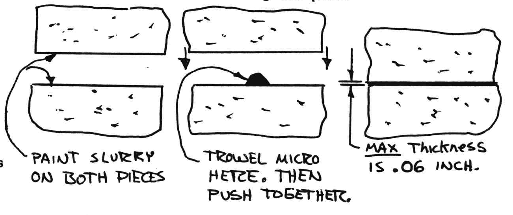Figure 3-10: Microballons

### <u>Flox</u>

Flox is a mixture of cotton fiber (flocked cotton) and epoxy. The mixture is used in structural joints and in areas where a very hard durable buildup is required. Flox is mixed much the same as dry micro, but only about two parts flock to one part epoxy is required. Mix in just enough flock to make the mixture stand up. If "wet flox" is called out, mix it so it will sag or run.

When using flox to bond a metal part be sure to sand the metal dull with 220-grit sandpaper and paint pure mixed epoxy (no flox) on the metal part.

### <u>Bondo</u>

Throughout these plans the term "Bondo" is used as a general term for automotive, polyester body filler. Bondo is used for holding jig blocks in place and other temporary fastening jobs. We use it because it hardens in a very short time and can be chipped or sanded off without damaging the fiberglass. Bondo is usually a dull gray color until a clored hardener is mixed with it. The color of the mixture is used to judge how fast it will set. The more hardener you add, the brighter the color of the mixture gets., and the faster it hardens. This simple guide works up to a point where so much hardener is added that the mixture never hardens. Follow the general directions on the Bondo can for fast setting Bondo. Mixing is done on a scrap piece of cardboard or plywood (or almost anything) using a hard squeege or putty knife. A blob of Bondo is scooped out of the can and dropped on the mixnig board. A small amount of hardener is squeezed out onto the blob and then you mix to an even color. You will mix the blob for about a minute. You will then have two or three minutes to apply it before it hardens.

Be sure to clean the board and putty knife off before the Bondo is completely hard. MEK will clean Bondo off your putty knife and squeegee if it isn't completely hardened.

### <u>Foam</u>

Three different types of rigid, closed-cell foam are used in you Long-Ez (and several densities). A low density (2 lb. cu ft), light blue or white <u>styrofoam</u> is used as the foam core o the wings, winglets, elevators and canard. The styrofoam is exceptional for smooth hotwire cutting of airfoil shapes. The large cell type used provides better protection from delamination when the more commonly used insulation-grade tyrofoams.

Low deinsity 2 lb/cu ft green (or light tan) <u>urethane</u> foam is used only in non-structural areas, where its ease of carving is important (nose and canopy). Urethane foam is fantastically easy to carve and contour. The urethane used is U-Thane 210 or equivalent.

PolyVinyl, PC core foam is low, medium and high densities is used extensively. The dark blue color 3 lb/cu ft type R45 is ussed in the fuselage and fuel tanks. It has excellent comprssive strength (75 psi), good laminate peel strength and is completely fule compatible. The light red color, 6 lb/cu ft type R100 PV-core is used in the center section spar and canard inserts. Dark red color, 16 lb/cu ft type R250 PC-core is used in several bulkheads in Chapters 4 and 13.

Do not substitute other foams. The Styrofoam has greater peel strength than the standard blue styrofoam sold by some distributors. Alos, we considered teh "fire resistant" BROWN urethane instead of the green or tan 2-lb urethane, but found it's physical properties to be much lower than U-thane 210. Do not confuse Styrofoam with white expanded polystyrene. Expanded polystyrene is a molded, white, low density, soft foam whcih has the appearance of many spheres pressed together. It's compression strength and modulus is too low.

All three types of foams, PV, urethane and polystyrenes are manufactured in a wide variety of flexibilities, densities and cell sizes. Getting the wrong material for you airplane can result in more work and / or degraded structural integrity. Sun damages foam. Keep it covered.

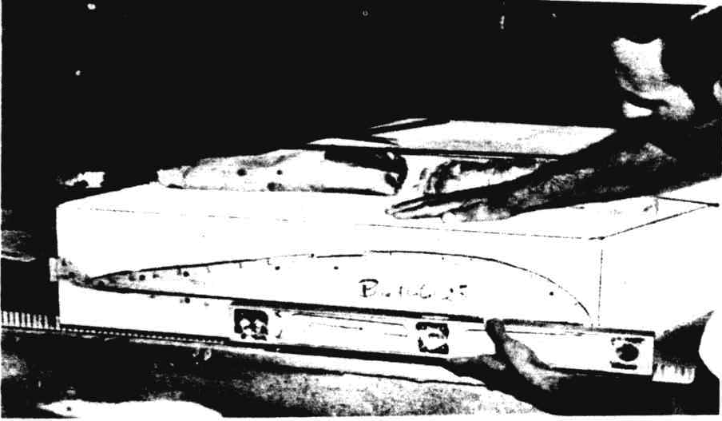 Figure 3-11: Hot wire cutting

### <u>HOT WIRE CUTTING</u>

The airfoil-shaped surfaces of your Long-Ez are formed by hot wire cutting the blue styrofoam of 2 lb/ft3 density. The hot wire process gives airfoils that are true to contour, tapered, properly twisted, and swept with a minimum of effort and simplest of tools. The tetails for making your hot wire saw are shown on page 3-2.

The hot wire saw is a piece of stainless steel safety wire, streatched tight between tw pieces of tubing. The wire gets hot when an electricial current passes through it and this thin, hot wire burns through the foam. by making smooth steady passes, the hot wire gives a smooth, even surface. The foam offers little resistance to the hot wire's passage. To get a smooth accurate cut, a template is required. Tempates are made from thin plywood, sheet metal, masonite or formica. A variable voltage control is used to supply the electrical current that heats the wire.

The blue foam used n your flying surfaces was selected for a cmbination of reasons and its hot wire cutting ability was one of them. Other types of foams are readily hot wire cut, but some (white expanded polystyrene) have poor physical properties and others (urethane) give off poisonous gases when hot wire cut. Use only the recommended materials!

### <u>HOT WIRE TEMPLATES</u>

Hot wire templates can be made from 1/16 to 1/4 inch plywood, formica, or masonite or .032 to .064 sheet metal. It is important to have smooth edges on the templates. A rough edge may cause the wire to hang up and burn into the foam excessively. Templates are required on both ends of the foam being cut. The size, shape, and orientation of the two templates is varied to taper, and twist the foam core as required. The <u>planform</u> (span and sweek) is set by squaring up the foam block before the templates are used. In general, the <u>trailing edge</u> of the wing is the reference; a "trim line" on the templates is lined up on the trailing edge.

Full-size template drawings are provided in the plans. To make your templates, just glue the template drawings to a piece of plywwod or sheet metal and trim to the contours shown. There are a number of markings on each template which aid in the alignment and cutting of the foam core. 

Each template has a waterline (W.L.) marked on it which is used to aligh the <u>twist</u> of the foam core. Each template's waterline is leveled using a carpenters bubble level. This assures that the relative twist at each template is correct. The template is then nailed to the foam block to obtain the correct <u>planform</u>; a foam trim line is provided near the trailing edge of each template which is lined up on the foam edge before cutting.

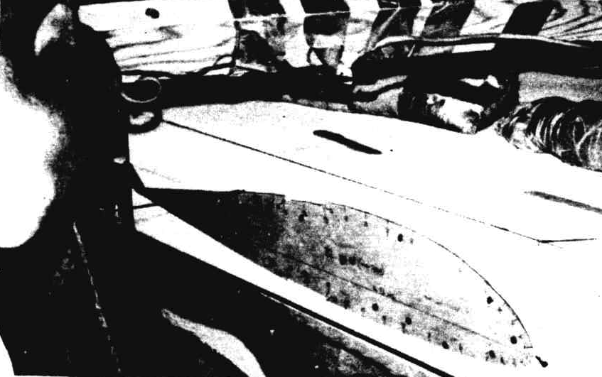Figure 3-12:Hot Wire Template

Each rib template has numbered marks running from the trailing edge around the leading edge and back to the trailing edge. These are called "talking numbers". When the foam cores are cut into their airfoil shape, the talking numbers are used to assure that each end of the hot wire is co-ordinated to obtain the correct, tapered airfoil. The person calling the numbers should be at the largest template. A typical cut would sound like this: "resting on the tabl 1/4" from the foam, moving forward, entering foam now - one, half, two, half, ..., 34, half, 35, half, 36, coming out of the foam and pausing on the tab, wire's out." As the cut is made, the person on the small rib follows the numbers, passing over them as he hears them called out. Pause marks are indicated in places where it is necessary to pause for a couple of seconds and let the hot wire's center lag catch up with the ends.

Preparing a foam block for an airfoil cut is begun by trimming the retangular foam block to the basic dimensions for the correct planform. These "trim" cuts are made usng two straightedged trim templates. The templates are held against the foam by nails through the template into the foam. Enough nails should be used to hold the template firm so that it won't move when the hot wire is held against it.

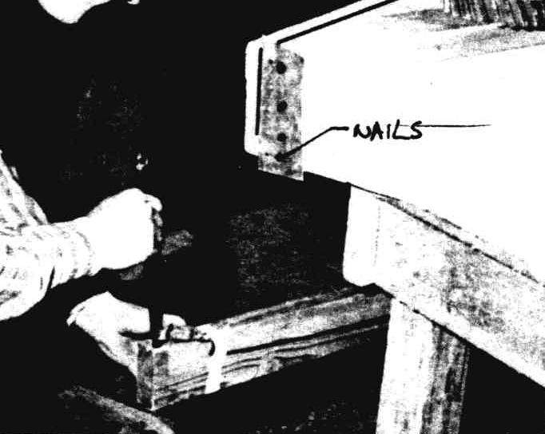Figure 3-13: Squaring a foam block

Cutting straight down along template with hotwire.

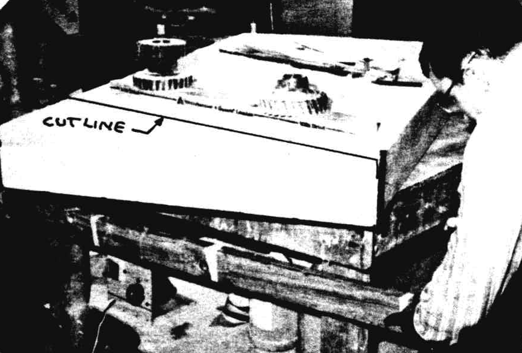Figure 3-14: Hotwiring a block into shape

Note the diagnol cut being made by correctly positioning the verticl tempates and passing the hotwire downward along them.

Each template has symbols for the general location of holes for the nails, (Circle with a "+") 4D (four penny) nails are good for this use. The holes in the templates should be a close fit for the nails. Be careful not to angle the nails so that the hot wire can catch on them! Some rib templates are used several times, for both inboard and outboard, {because of} this {you} may have to transfer the talking numbers, pause marks, trim line, and waterline to the opposite side of the template.

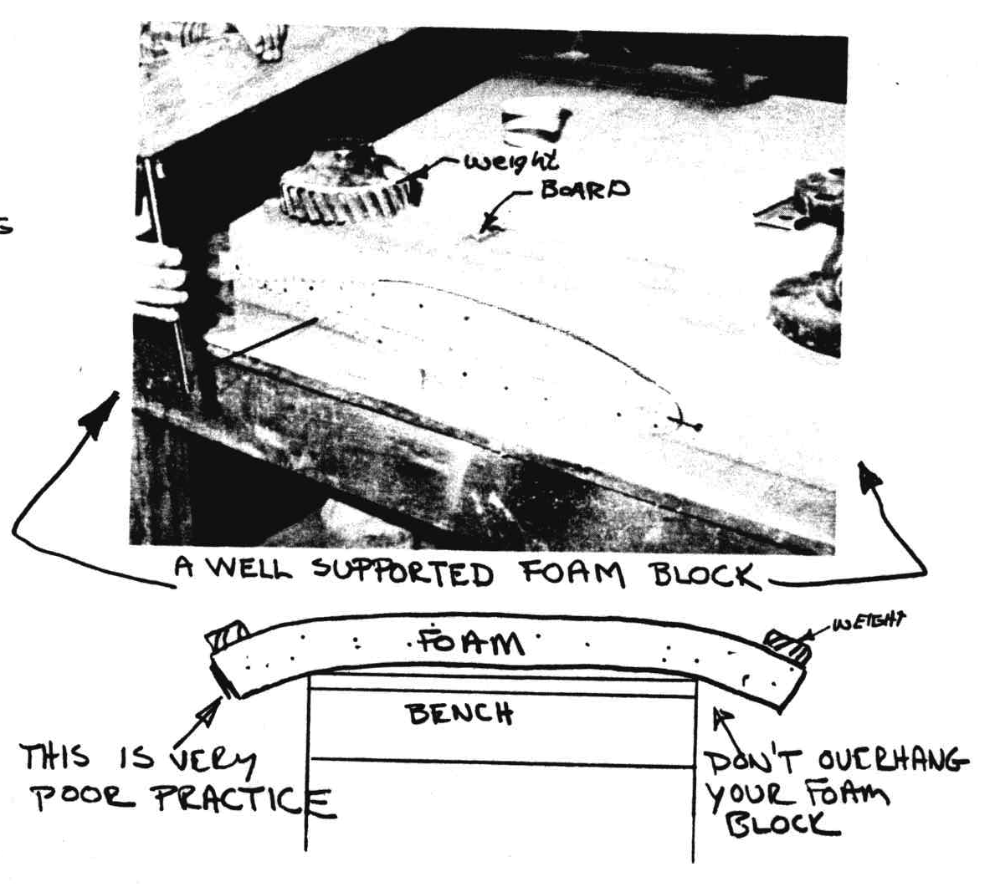Figure 3-15: Hotwiring an airfoil

===
The use of the hot wire saw is a simple thing if your equipment is set up properly. Proper wire tension and wire temperature should be maintained for good cutting. The wire tension should be tightened after the wire is hot by twisting one tube with a pair of pliers. The wire should be as tight as possible. The wire should be hot enough to cut one inch of foam in four to siz seconds without having to force the wire. A wire that is too hot will burn the foam away excessively. To cool an over-heated wire, simply turn voltage control to a lower voltage setting. If you use a battery charger, you wil lhave to add length to the wire. To warm up a cool wire, just increase the voltage setting or, with the charger shorten the wire. Although the foam offers only mild resistance to the hot wire, a long cut will cause the middle of your wire to lage behind the ends. Wire lag can cause problems in tight curves like the leading edge of an airfoil. To reduce lag there, the cutting speed is reduced to about one inch in 8 to 10 seconds. The arifoil templates have notations in the areas where reduced speed cutting is necessary an dpause marks where it is necessary to allow the lag to catch up completely.

The most common hot wire error is wire lag which causes a bow in the leading edge. The following method solves this problem and thus we recommend you use it for cutting the canard, wings and winglets. Instead of making one cut all around, glue nails on the template at the waterline at the leading edge as shown. Now, cut the core in two phases: one from the leading edge up over the top to the trailing edge, the other from the leading edge under the nail down under the bottom to the trailing edge. The thin "flash" of foam left on the leading edge due to the thickness of the nails is easily removed with your butcher knife. The result is a perfectly straight leading edge. Care must be taken to assure that both ends simultaneously approach the template at teh leading edge. Use the following vocal commands "wire is moving toward the nail, now resting on the nail 1/2 inch from the template (confirm both ends on that position), moving toward template 1/4 inch away, 1/8" away, on the template, moving up and "X" (talking number), "Y" (talking number)...". When approaching the trailing edge overlap notch (see sketch) slow down and pause 3 seconds on the notch to assure full, sharp, accurate surface for the skin overlap. See chapter 10, 19 and 20 for clarificatin of the trailing edge overlap.

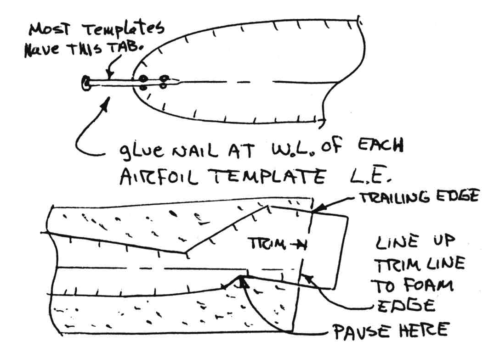Figure 3-16:Hotwiring from the leading edge

The hot wire should be guided around the templates with light pressure. Pushing too hard against the template may move them or flex the foam block with results in an under cut foam core.

The correct set-up is just as important as using the correct tools and materials. Foam is a fairly flexible material and an improper set-up can cause deflection. The foam block should be well supported at each end, so that it doesn't sag and doesn't move aruond while being cut.

You need clearance for the hot wire cutter to pass by the table and the weights used to hold the foam steady.

Foam is manufactured in sizes that are often too small to get a solid core from a single block. It is necessary to use two foam blocks to get the size required for the wing cores. These blocks have to be joined using an eposy / microsphere mixture. The hot wire won't cut through the micro joint, so all of the hot wire cutting is done with the blocks temporarily joined. Nails or blobs of 5-minute epoxy are used for temporary foam joints, but the hot wire won't cut through these. Thus they have to be placed carefully so that the wire doesn't have to pass through them. 

Don't be overly concerned if you don't make perfect foam cuts: ridges o the foam core fro inadvertently lifting the hot wire off the templates are easily faired in with a sanding block. A less-than-perfect leading edge can be blended in by sanding after the foam core is assembled. gouges in the foam can be smoothed and filled with dry micro to contour after applying the glass skins. The foam is too expensive to throw away because of a minor gouge.

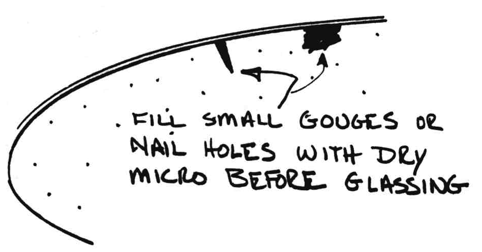Figure 3-17: Repairing a foam gouge

A finished foam core may warp out of shape after it is removed from the original block. This is due to nternal stresses in the foam from the manufacturing process, and is no cause for concern.

A warped core is simply weighted into the jib blocks and shimmed straight. Once the skin has been installed, the foam is held firmly in position.

### <u>Urethane Foam Shaping</u>

One of the real treats in the construction of your Long-EZ will be shaping and contouring urethane foam. Urethane is a delightful material that shapes with ease using only simple tools. A buter knife, old wire brush, sandpaper, and scraps of the foam itself are the basic urethane working tools. A vacuum cleaner is convenient to have handy since working urethane produces a large quantity of foam dust. A knife is ussed to rough cut the foam to size. The knife needs to be kept reasonably sharp, a sander or file is an adequate knife sharpener since its a frequent task an da razor edge isn't necessary. Coarse grit sandpaper (36 grit) glued to a board as shown on page 3-1 is used for rough shaping outside contours.

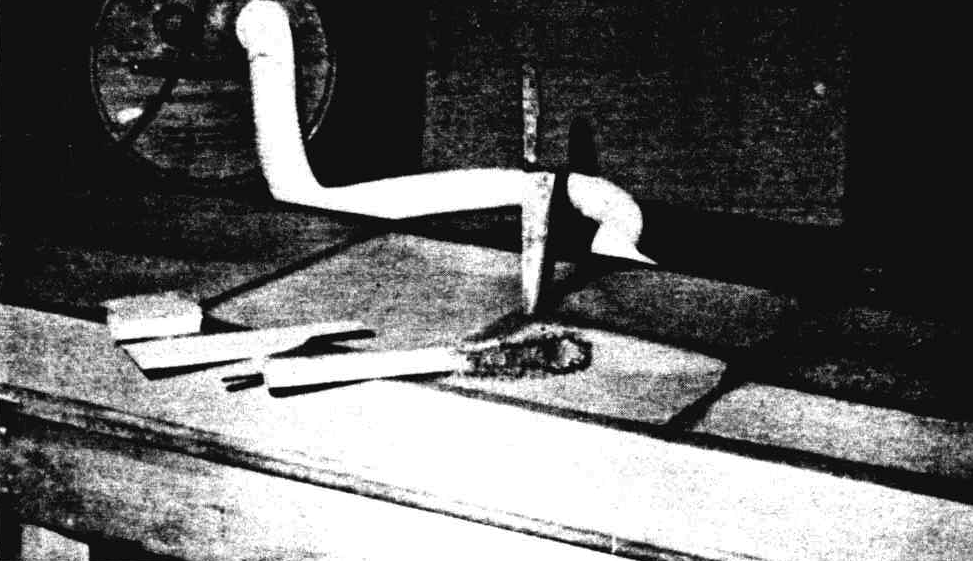Figure 3-18: Foam gouge repair

Inside contours or "dishing" is done by using a ragged old wire brush to rough out the bulk of th efoam and following up with a scrap foam piece to smooth the surface. The foam scrap conforms to the shape of the surface resulting to a very smooth contour.

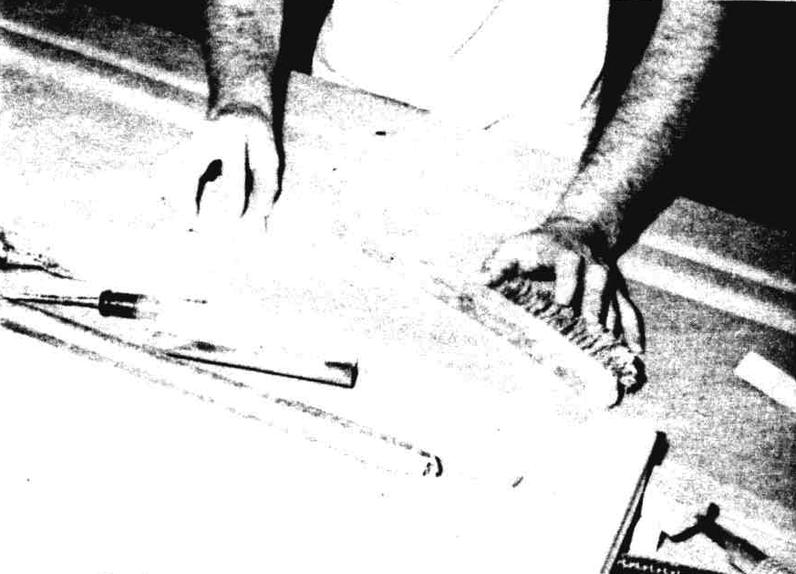Figure 3-19: Dishing an Interior curve

Outside contours are roughed out with a sanding block and finished using a foam scrap. Dry micro and flow are used to fill voids and pot fasteners in a number of places. All foam shaping should b efinished before any micro filing is done, because the filler is much harder than the foam and makes smooth contouring very difficult. Your best carving template is your eyeball; an occasional check on the depth of a contour is about the only measurement necessary.

Keep your shop swept reasonably well. The foam dust can contaminate your glass cloth and your lungs. <u>Use a dust respirator mask while carving urethane.</u> Try not to aggrivate the better half by leaving a green foam dust trail into the house.

### <u>Glass Layup</u>

The glass layup techniques used in your Long-EZ have been specifically developed to minimize the difficulty that glass workers have traditionally endured. Most of the layups that you will do will be on a flat horizontal surface without the molds vacuum bags, and other special equipment that are common in glass rok. The layups that you do will cure at room temperature; no ovens or special heating is required. If you have suffered through a projec that requires you to build more molds and tools than airplane components, then you are in for a real treat.

The techniques that you will use are very easy, but they still need to be done correctly. 90% of the work that you will do is covered in the next few paragraphs, so make sure that you read and understnd this section very well. If you learn these basics, your airplane will be very easy indeeb. If you skip ver this information, you will probably end up very frustrated.

#### <u>Step 1: Personal Preparation</u>

Before you get started with a layup, plan ahead. Some major layups take several hours and before gettng you hands in the epoxy, it's a good idea to make a pit stop at the restroom.

Figure 3-20: Skin barrier cream

Do not start a large layup if tired. Get some rest and do it when fresh. Its best to have three people for any large layup, two laminators and one person to mix epoxy. Be sure the shop is clean before your start.

Take the recommended health precautions (discussed later in detail) using gloves or barrier skin cream. Get your grubby, old cloths on or at least a shop apron. Make sure that your tools are clean from the last layup and ready to use. Your working area should be between 65F and 95F. Best results are obtained at 75 to 85F. Below 70F the epoxy is thicker making it more difficult to wet the cloth. Above 85F the possibility of an exotherm is greater.

#### <u>Step 2: Cut Fiberglass Cloth</u>

The fine points of glass cutting have been covered on page 3-3. Remember that there isn't any requirement to cut accurate dimensions. Cloth dimensions are given well oversize. Your scissors trim them as you go, while laying the cloth up. It is a good idea to keep two pair of scissors: one clean and in the glass storage area, and one in the shop that gets epoxy on it. After cutting roll or fold the material; keep it clean and handy for layup.

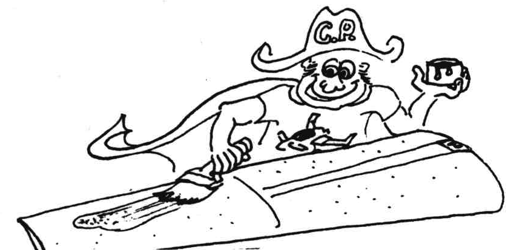Figure 3-21: Slurrying Foam

#### <u>Step 3: Prepare Surface</u>

The only difference between layups over different materials is in surface preparation. The layup over foam will be covered here since you will be dong more of it, the other surface preparations will be covered separately.

The foam surface is prepared by leveling uneven areas with a sanding block and brushing or blowing any dust off the surface. Use a compressed air or vacuum to remove dust.

Now is the time to accurately check that the foam core is correc size, shape and contour. Refer to teh section views of the part - be sure your core looks exactly like that on the section view. Lay a 12-inch straight edge spanwise on all the critical areas of the flying surfaces (see sketch pg 3-13) and be sure you don't have any high or low places or joggles. Measure any areas that involve fiberglass buildups to check for correct depth. Build up is 0.009 inch per ply for UND and 0.013 inch per ply for BID.

#### <u>Step 4: Mix epoxy and Paint surface</u>

Mix epoxy only when needed, not before. Epoxy, micro and flox may b needed at various stages, so you may need several cups. If you are laying up over cured fiberglass or PV foam, paint a libercoat of epoxy on the surface. When laying up over Styrofoam or Urethane foam, paint a liberal coat of Micro Slurry on the surface, before laying on the first ply. the slurry or epoxy can be poured on the foam and spread thin with a squeege or it can be brushed on with a brush. Then, fill any dings or gouges in the foam core with dry micro.

#### <u>Step 5: Lay on the Cloth</u>

Lay on the cloth in the specified orientation. Pull the edges to straighten the cloth out and to remove wrinkles. Maximum strength and stiffness is obtained if the fibers are not wavy or wrinkled. If the cloth is to be applied around and into a sharp corner, you will find the job easier to do if the fiber orientatio is at 45 degrees to the corner. Don't get depressed if the layup looks like a hopeless mess at this point. Press on with patience and things will work out fine. To remove wrinkles, study the direction of fibers, follow the fibers to the outern edge of the cloth and <u>pull</u> on the <u>outside edge</u>. <u>Pushing</u> a wrinkle off the part is incorrect. Once the part is free of wrinkles use a squeege and make light passes <u>from the center outwards</u> to smooth the cloth.

Figure 3-22: Layout Fiberglass cloth

#### <u>Step 6: Wet Out the Cloth</u>

WET OUT - Squeegee cloth from center outward aligning the the fibers straight and removing wrinkles.  Pull the outside edges to straighten any wrinkles.  Brush or stipple epoxy into any dry areas or pour on additional epoxy and squeegee out uniformly.  Check for excess epoxy "ridge" with the squeegee.  (~~page 3-11~~ Step 7). {CP28 PC57, MEO}

~~Wet out the cloth by brushing on a thin coat of epoxy. Do not use micro <u>between</u> plies of cloth. Extra epoxy {may} not be necessary if there is enough epoxy under the cloth to be brought to the surface. This is done by "stippling", which involves a verticle stabbing motion of a paint brush over the cloth. This brings excess epoxy up from below to wet out the cloth, resulting in a weight savings as compared to adding more epoxy on top. __REMEMBER__, epoxy adds no strength beyond what is needed to wet out the white color of the cloth and fill air voids; any further addition of epoxy is only dead weight.

Where multiple plies are required, the first plies may be laid up wet and the esxcess resin brought up by squeegeeing and stippling to help wet out the middle plies. To do this, <u>pour</u> epoxy onto the part and move it around the surface with a squeegee. Your work will go much faster if you make the layup too wet, then remove excess epoxy with many <u>light</u> passes with the squeegee. Do not squeegee too hard, as this can starve the surface of micro and introduce air. Continue to inspect for air (tiny white flecks or bubbles) and stipple or squeegee in more epoxy to remove the air. A handy squeegee can be cut from flexible plastic found on a coffee can lid. You may also find a paint roller handy for spreading around the epoxy. Special stipple rollers are available at Long-EZ distributors. The final plies are ambitiously stippled and additional epoxy is applied sparingly. When in doubt - stipple it out or squeegee.~~

Figure 3-23: Stippling

As you wet out each ply, scissor trim to within 1/2" of any overhang (trailing edge, etc.). This 1/2" will be knife trimmed after the layup cures. If an overhanging ply isn't trimmed, it lifts the edge up and makes a bubble.

After scissor trimming, restipple the edges to be sure there are no voids. Wet the cloth beyond the trim line at least 1/4" to allow easy knife trimming later.

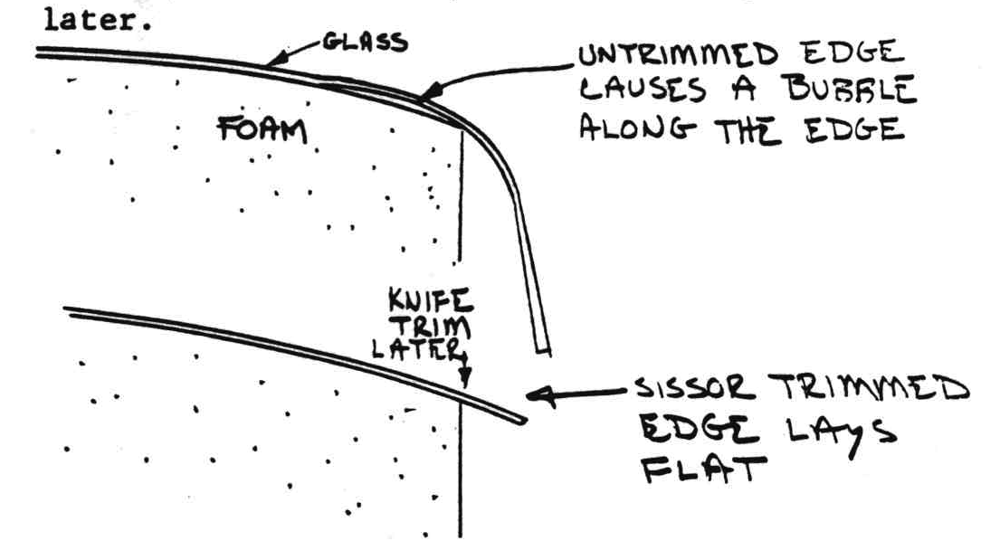Figure 3-24: Scissor Trimming

#### <u>Step 7: Squeegeeing</u>

Squeegee out excess epoxy. This involves drawing a plastic or rubber squeegee over the layup as shown. Plastic squeegees (scrapers) are available at any paint store. If excess epox exists, it will be pushed off the edge of the piece. Remember, excess epoxy is much better on the floor than on the airplane. it is possible to squeegee too hard and make the layup too dry. If this occurs, the surface will appear white, indicating the presence of air. If this occurs, wet the cloth by painting on a little more epoxy and stippling it down into the layup. The best quality layup is obtained if <u>each layer</u> of a multilayer layup is <u>squeegeed</u>. The excess epoxy which is pushed off the edge can be recovered and returned into the cup. This is easily done by catching the epoxy on the squeegee and scraping it on the side of the cup.

The finished layup should appear smooth and green so that the weave of the cloth is clearly visible, but not so dry that <u>any</u> area appears white in color. If you've done an excellent job, the weight of resin will be about 1/2 of the weight of cloth used.

To check if there is too much epoxy in the layup, pull a squeegee across the surface, stopping before you reach the edge. Lift the squeegee up and look for a large "ridge" of epoxy where the squeegee stopped. The ridge under the top ply indicates that the layup is too wet and you should spend time with the squeegee to remove epoxy off of the sides.

Don't hesitate to use your stippling roller or brush on an area after squeegeeing. Some places are not suited to the use of a squeegee and the dry brush or roller must be used to expel the excess epoxy. On a given layup, about 1/2 of your time should be spent squeegeeing.

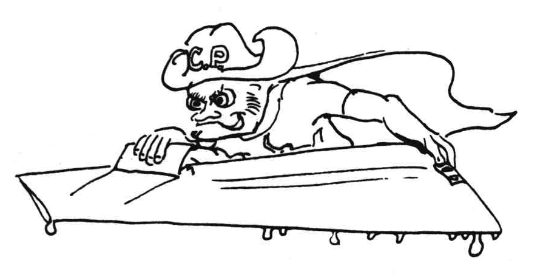Figure 3-25: Squeegeeing

#### <u>Step 8: General Inspection</u>

After you have finished the layup, take a few minutes and give it a <u>good</u> general inspection for trapped air, dry glass, excess epoxy, and delamination. It is much easier to correct these things while the layup is wet than to repair the cured layup. Also, have <u>someone else</u> inspect it, usually a different person can find air flecks or bubbles that are missed by one inspector. Carry a good light around for inspection. Glance the light off the surface at various angles to look for airflecks. <u>If any air is visible, stipple it out</u>. Exception: It is allowable to have many tiny bubbles of air <u>at the foam surface</u> of the low density PV (dark blue) foam. These are difficult to remove. More than adequaate peel and sheer strength exists with them present. They should be considered normal. Do not confuse this with air between plies.

Be sure the overlaps on the edges are perfect. If, due to a sharp corner etc. you have a problem eliminating an air bubble, use one of the following two methods:

(1) Lift the cloth up off the foam, trowel some wet micro into the troublesome area, add more epoxy as you stipple the cloth back down.

(2) Add excess epoxy over the bubble, cover the surface with Saran wrap (thin plastic wrap) then push firmly outwards to force the air out to the sides. The Saran wrap will seal the surface to keep air from being drawn in. This method will force the cloth to stay down een around a sharp corner.

#### <u>Step 9: Preliminary Contour Fill</u>

Certain areas, like over the spar and along the trailing edge (see cross section views) require a dry micro fill. It is preferred to apply this fill within 2-3 hours of finishing fiberglass layup. However where the micro filler obscures the structure underneath, like over the spar cap, FAA inspection should be completed before dry micro filling. Areas like the trailing edge where the structure can be inspected from the other side should be filled while the layup is still tacky (within three hours of the layup). If you wait until the layup cures, you will have to sand the fiber-glass surface to a dull finish before applying the micro. So, mix up a "dry" micro mix and trowel it into low aeas while the layup is still wet, and save the work of sanding where feasable.

#### <u>Step 10: Cleanup</u>

Brushes can be used two to four times if after each layup they are washed with soap and wter. Wipe excessive epoxy off with a paper towel. Wet the brush & work soap into all fibers by mashing it int a bar of soap (Lava brand is best).  Rinse with hot water and repeat 3 times. Be sure they are dry before next use. We generally use a cheap brush (approximately $2.00 to $4.00 per dozen) and discard after two or three layups.

Clean the squeegees the same way.

If you use skin barrier cream (Ply No. 9) the epoxy and cream will wash off easily with soap and water. When you get epoxy on unprotected skin, Epo-cleanse is used to remove the epoxy. Both of these products are available through RAF distributors and are listed in the bill of materials. Once you are sure your skin is clean, <u>wash again thoroughly</u> with soap & water, even if your hands were protected with plastic gloves.

If you get epoxy on tools or metal parts, clean them with acetone or MEK before the epoxy cures.

The only good way to protect your clothing is not to get epoxy on anything that you care for. Use a shop apron and don't make layups in good cloths. A surplus flight suit or other cheap coveralls are a good investment.

You may feel that layups are real messy work after your first experience with them. However after you've <u>done</u> several, you will have learned not to wipe you hands on your clothing (keep a roll of paper towels handy), <u>not to scratch your ears, eyes etc. during a layup.</u> If your tools and work area are clean and organized well and you are disciplined with the epoxy, the job can be alot less messy than working with other materials.

#### <u>Step 11: Knife Trim</u>

When a layup is wet, you can only scissor trim to within about 1/4 inch without disrupting the fibers in the ply. An easy clean trim can be obtained by waiting three to five hours after the layup. At this time, the lamnate is firm enough to support the cloth from fraying, yet soft enough to cut easily with a sharp knife. This "knife trim" stage is the optimum time for edge trimming with ease and accuracy. Take a sharp, single edge razor blade or X-Acto knife and trim the edges with a motion downward toward the edge. Experience will help you determine the correct time in the curing cycle for optimum knife trimming.

Figure 3-26: Knife Trim

In the plans when "knife trim" is called for, this assumes the three to four wait, even though not specifically stated. Don't fall apart if you miss the knife trim stage and have to trim the fully cure glass. If you wait unti the layup is completel set, then saw along the edge with a coping saw, dremel, bandsaw, saber saw, etc. Smooth the edge with the Disston abrader. When trimming a cured edge, be careful of the "needles" (sharp projections of glass-frayed edges suppored with epoxy).

The needles can be avoided by returning three hours after the layup to make the knife trim. Knife trim time varies with temperature: about siz hours at 60 degrees and one hour at 90 degrees.

### <u>Quality Control Criteria</u>

One of the unique features of the glass-foam-glass composite construction technique is your ability to <u>visually</u> inspect the structure from the outside. The transparency of the glass/epoxy material enables yo to see all the way through the skins and even through the spar caps. Defects in the layup take four basic forms: resin lean areas, delaminations, wrinkles or bumps in the fibers, and damage due to sanding structure away in finishinng. Resin lean areas are white in appearance due to incomplete wetting of the glass cloth with epoxy during the layup.

<u>Dryness Criteria</u> - Pick any 6"x6" square in the layup in the critical area. Assess carefully if any evidence of air in the layup is present (whiteflecks, bubbles, air at the foam face). If the dryness evidence is more than 10% of the area, the part __MUST__ be rejected. Reject or repair <u>any</u> evidence of dryness or voids in the trailing edge or leading edge overlaps. Better yet, do an adequate inspection with good light <u>before</u> cure when it's easy to fix. If in doubt on overlaps be sure to stipple in enough epoxy.

<u>Delaminations</u> in a new layup may be due to small air bubbles trapped between plies during the layup. The areas look like air bubbles and are distinctly visible even deep in a cured layup. Small delaminations, or bubbles up to 2-inches diamater, may be filled with epoxy by drilling a small hole into the bubble and filling the void with epoxy.

When making a layup, do not be concerned if the brush occasionally sheds a few bristles-these do not need to be removed. If the bristle count exceeds about 10 per square foot, change your brush and remove bristles.

Occasional sanding through the weave in the first kin ply is not ground for scrapping the part. Care should be exercised in areas, such as the skin joints not to weaken the structure in pursuit of an optimum finish. (Refer to chapter 25 for details).  An excess of resin (wet) will make your airplane heavy and does weaken the layup but usually not enough to reject the part for strength reasons.

<u>Bump/Joggle/Dip Criteria</u> - the best way to check this is to lay a 12-inch straightedge on the part <u>spanwise</u>. Move it all over the surface in the critical areas. If you can see 1/16" gap in any area, the part <u>must</u> be repaired. It is best to repair or beef up lumpy areas even if they meet this criteria. Better yet, do a good job in core preparation and use your squeegee well in layup to avoid the lumps in the first place.

A reprint of the inspection criteria for homebuilt composite aircraft that has been distributed to FAA inspectors is included at the end of this chapter.

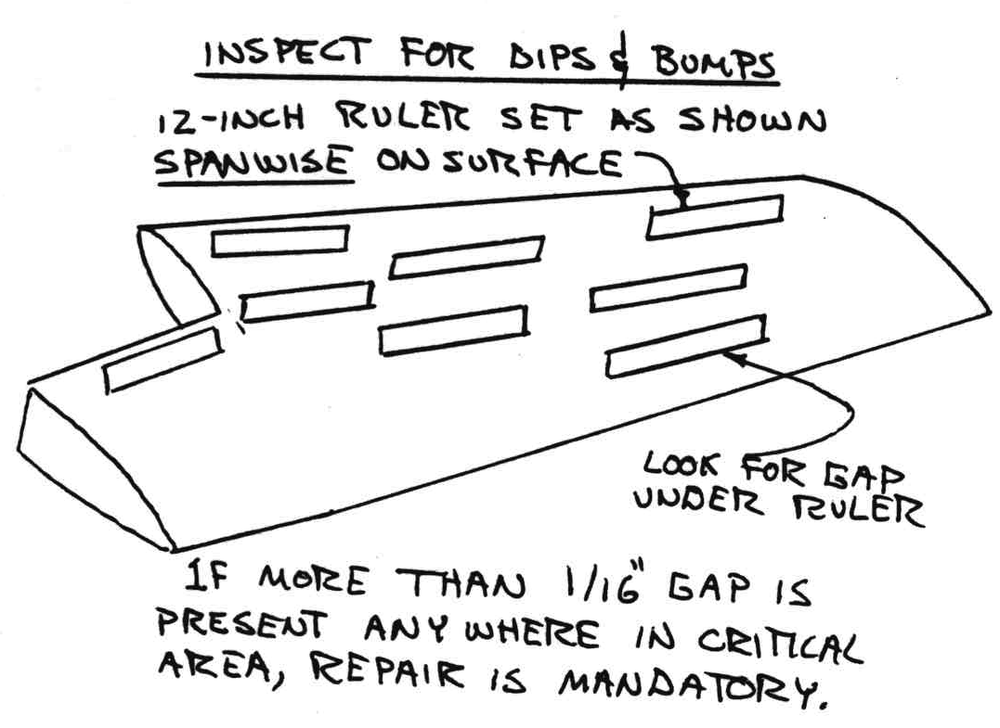Figure 3-27: Layup inspection

The following is a listing of the "critical areas" - the portions of the Long-EZ that must meet all the inspection criteria:

1. Center section spar-entire outside skin and spar caps.
2. All portions of the fuselage within 10" of the engine mounts and canard lift tab attachments.
3. All control surfaces.
4. All flying surfaces in the shaded areas shown plus all overlaps at L.E. & T.E.

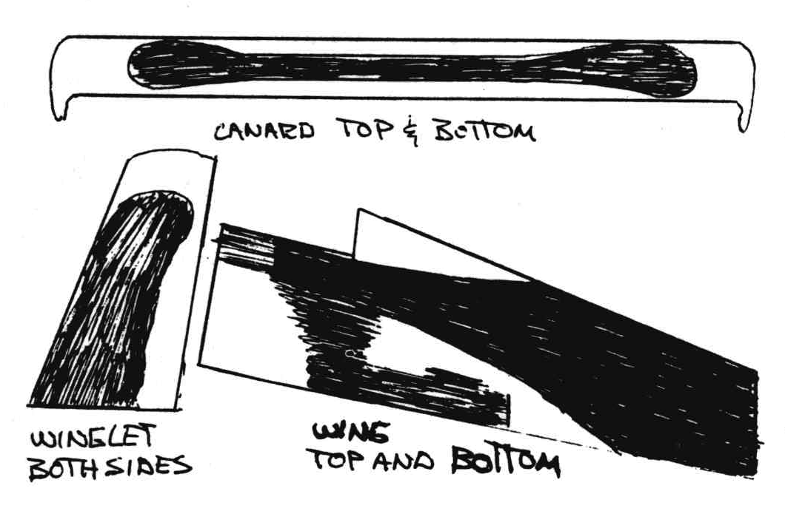Figure 3-28: Critical area inspection

Major wrinkles or bumps along more than 2" or chord are cause for rejectionn in the wings, canard and winglets, particularly on the top (compression side). This does not mean you have to reject the whole wing - anything can be reparied by following the basic rule: remove the rejected or damaged area and fair back the area at a slope of 1" per ply with a sanding block in all directions. By watching the grain you will be able to count the plies while sanding. Be sure the surface is completely dull and layup the same plies as you removed, plus one more ply of BID over the entire patch. This will restore full strength to the removed area. Use this method to repair any areas damaged for any reason - inadvertent sanding through plies during finishing, taxiing a wing into a hanger, etc.

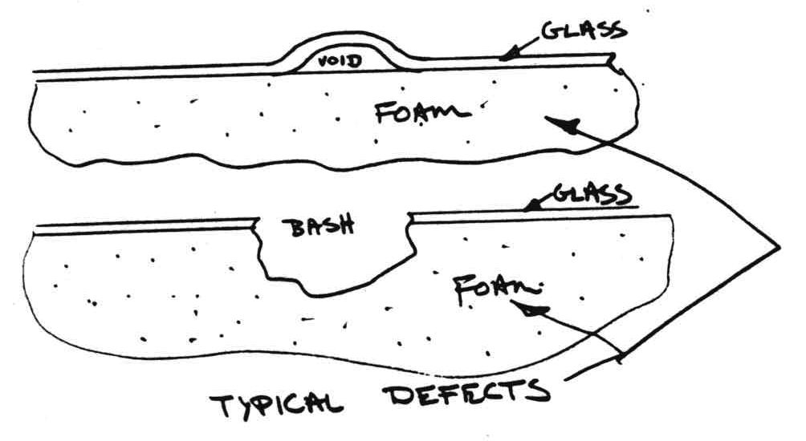Figure 3-29: Identifying a ding

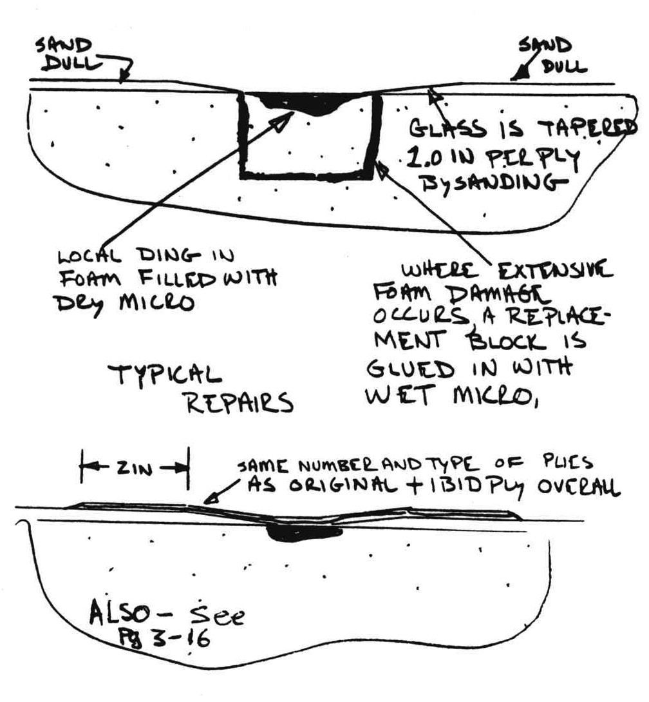Figure 3-30: Repairing a ding

### <u>Corner Treatment</u>

A variety of structural corners are employed in the construction of your Ez. There are two basic types of corners; one where the glass fibers are continuous around the corner, and the other where a structural filler is used and glass is bonded to the filler. The corner with the glass fibers running completely around it is used where maximum strength is required.

Inside corners can be laid up quite abrupt and only a very slight wipe of dry micro is needed to get the glass to lay into it. BID cut at 45 degrees is used on this type of corner.

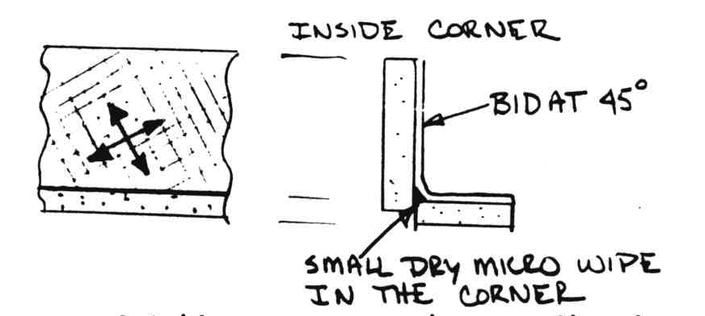Figure 3-31: Inside Corner layup

Outside corners require a radiused edge. Where the glass fibers run directly around the corner a minimum radius of 3/16 inch is required. Where the fibers run at an angle to the radius, only a 1/8 inch radius is needed. 

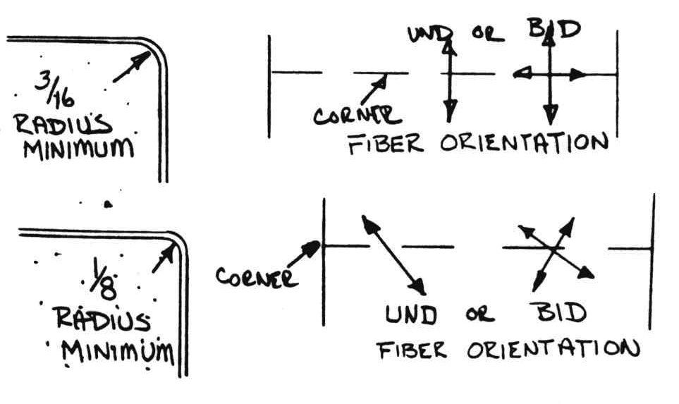Figure 3-32: Minimum corner radius

In some areas a sharp corner is desirable and maximum strength isn't required. In these areas a flox corner is used. A simple unsupported glass corner has very poor strength. To strengthen this corner a triangle of flox is used to bond the glass plies together. The flox corner is done just before one glass surface is applied for a wet bond to one surface. The other glass surface has to be sanded dull in preparation as shown.

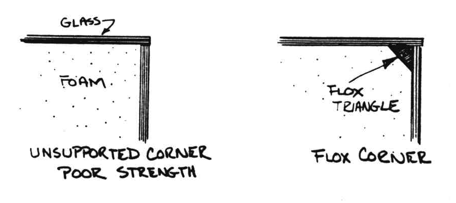Figure 3-33: Supporting an inside corner with flox

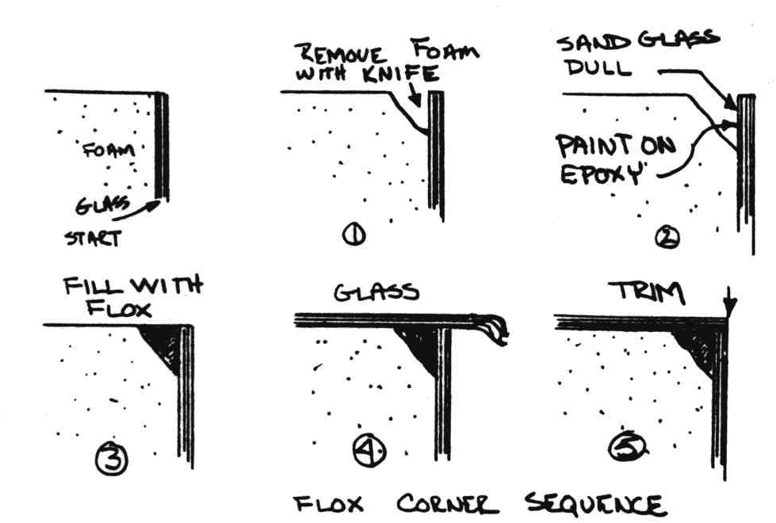Figure 3-34: How to flox a corner

If a specific size of flox corner is desirable, an approximate dimension may be given as shown. Don't make your flox corners square. The extra flox only adds weight, not strength.

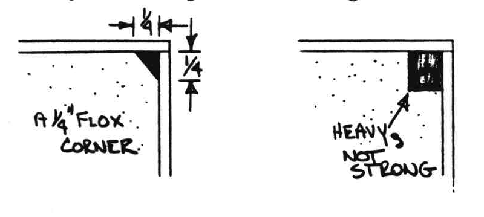Figure 3-35: Flox corner flox triangle

### <u>Peel Ply</u>

Peel ply is a layer of 2.7 oz dacron fabric which is layed up over a fiberglass layup while the fiberglass is still wet, and is later removed by lifting an edge and "peeling" it off. The most convienient form of dacron to use is "surface tapes", normally used is covering fabric aircraft. These are available in rolls. You will need several rolls, 1", 2" and 4" wide. Peel ply is used for two purposes:

\(1.\) Peel ply any area that will later be structurally attached to another fiberglass layup. Once the dacron is peeled off, the surface is ready for another layup, without sanding. If you do not use peel ply you will havae to sand the surface completely dull (no shiny spots). This sandng is hard, itchy work and ruins the strength of the outer ply of fiberglass. So, remember to peel ply the followng areas: leading and trailing edges of all flying surfaces, outboard 15" of wings and lower 10" of winglet (for chapter 24 layups), canard & wing shear web surfaces (for sparcap layups) all joining edges of Bulkheads & Fuselage sides, fuselage skin on both ends, fuel tanks, and at Landing brake, and all other places where a <u>Future</u> layup will be made. Not that to peel ply the trailing edge overlap area, the peel ply is the <First> ply made to the foam core. Lay a strip of dacron down on the overlap notch & secure it with tacks or staples so it doesn't move when you laup the skin.

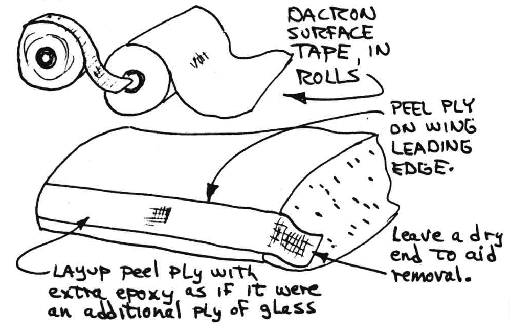Figure 3-36: Peel ply preparation

\(2.\) The second use of peel ply is to transition the area where the top ply of a layup terminates on the fiberglass surface. These are found at the wind/winglet junction, where the fuel tank, cowling lip, and nose joins the fuselage, and on all corner tapes inside the fuselage. Refer to the adjacent sketches. If the top ply edge is laid up bare it results in a rough edge that can delaminate if a little dry. Sanding the edge is hard, itchy wok and usually results in damaging the adjacent surface. If the edge is overlaid with a strip of dacron durin gthe layup (lay on the dacron & wet out by stippling or squeegeeing) it will make the edge lay down flat and will form a wedge of epoxy to smoothly transition the edge. After cure, peel off the dacron. The result is beautifully transitioned smoothe edge with no delamination tendency. Use this method in all places where a cloth edge terminates on the surface.

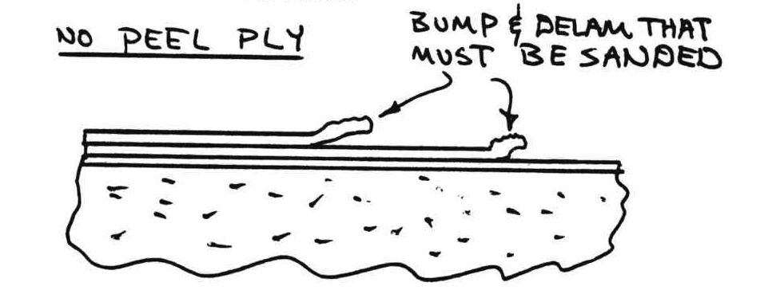Figure 3-37: Ply edge without peel ply

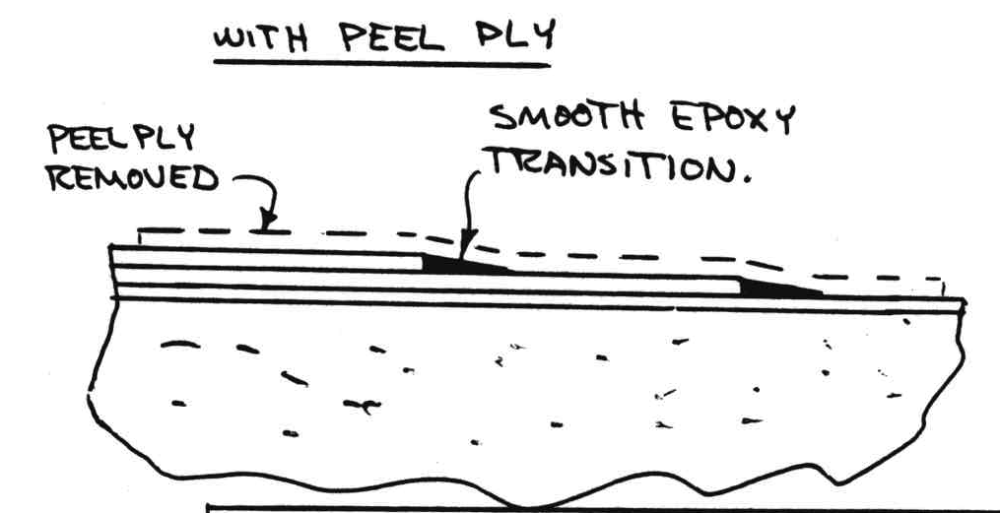Figure 3-38: Ply edge with peel ply

## <u>Health Precautions</u>

### <u>Skin Protection</u>

If you work with epoxy on your bare skin, you can develop an allergy to it. This "sensitization" to epoxy is an unpleasant experience and is to be avoided. You generally have to get epoxy on your unprotected skin to become sensetized. If you use a protective barrier skin cream like Ply No. 9 (available from Lont-EZ distributors) or disposable plastic medical examination gloves (also available from Lont-EZ distributors) the allergy can be avoided. The barrier skin cream also allows you to clean up with soap and water after a layup.

The RA epoxy systems are low toxicity (SPI-2). However, many people (about 5 to 7 percent) are sensitive to epoxy to a great extent and thus will find it impossible to build their airplane without extensive skin rash, facial swelling, etc. These people can get some help by using doctor perscribed anti-allergy medicines and / or by using elaborate masks/multigloves, etc. to reduce exposure, however in many cases the allergy is sufficiently stron to preclude their ability to make layups. Remember to <u>Always</u> use skin protection, never let epoxy come in contact with bare skin, even if you have no reaction to it. Sensitivity is accumulative, such that you may <u>later</u> develop an allergy unless you protect your skin.

### <u>Dust Protection</u>

Sanding or grinding fiberglass and foams creates dust that can be harmful to you lungs. Use a dust respirator mask for these operations. Disposable dust masks are available at most paint stores.

### <u>Ventalation</u>

Mix and work with your epoxy in a ventilated area. Some epoxy / hardner systems may irritate your eyes (like cutting onions) in a poorly ventilated work area. If your shop is not ventilated, set up a small fan to move a small flow of air in or out.

__DO NOT HOTWIRE URETHANE__

## <u>Construction Hints</u>

### <u>Rod End cantilevered off one side of a bellhorn</u>

<u>Anytime</u> a rodend is cantilevered off one side of a belhorn, the bolt head <u>must</u> be on the belhorn side {with a washer between the bolt head and the rodend to protect the rodend from the bolt head.  {CP 30, pg 9, LPC #81, MAN-GRL}}

### <u>Drilling, Grinding and Sawing</u>
Drilling through cured glass tends to tear the surface plies on the back side. Backup a glass layup with a wood block for drilling as shown and drill at medium speed.

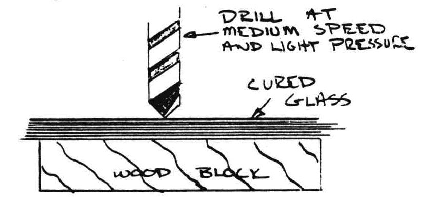Figure 3-39: Drilling cured glass

Using a small hone, grind the cutting edges of your drill bit flat as shown (not undercut). This will keep the drill from grabbing into the glass. Don't overdo it, just make a couple of light passes with the hone.

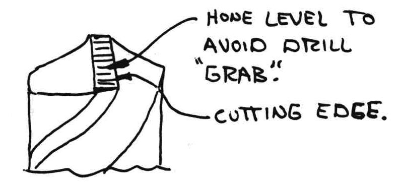Figure 3-40: Preping a drill bit

In several places rough cured glass surfaces occur where overlaps or thick buildups are done. These rough edges should b smoothed as shown using a grinder or sanding block.

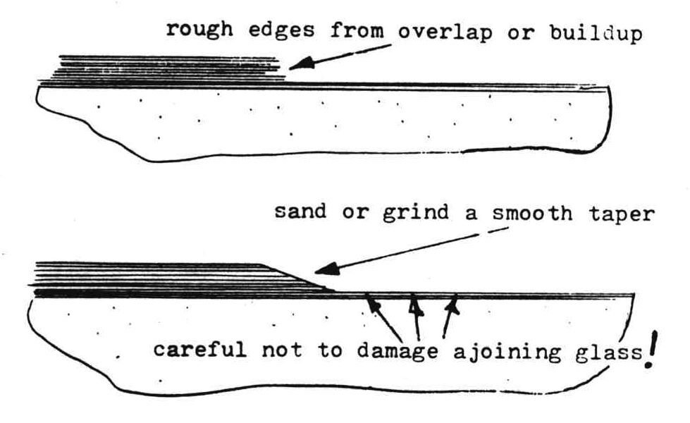Figure 3-41: Smooting a buildup edge

The Dremel (Moto Tool) or Home shop (Weller) is very versatile tool with many uses in the construction of your Ez. The kits usually have a nice seletion of bits, cutters, grinders, stones, and mandrels for every concievable use. The three types of bits shown here are the most useful for your project. Don't throw the others out, your buddy next door might be able to use them on his radio controlled golfball project.

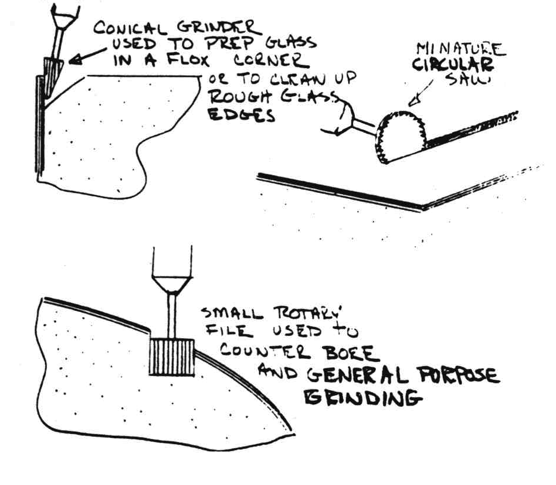Figure 3-42: Dremel grinding bit types

### <u>Recognition of a dry layup</u>

One of the most important things you must know is how to inspect for the presence of air within a layup. Air leaves somewhat crystal-like flecks of white areas, noticeably different than the white color of the microballoons. The presence of air is shown in the adjacent sketches in 3 forms:

1. A bubble or large void at the foam surface or within the laminate.
2. Small bubbles of air scattered throughout an area, or
3. in adequate filling of the outer ply.  

Make a layup of 3 ply BID in a 6-inch square over a scrap piece of foam, trying to achieve thse 3 types of dryness. Let it cure with the defects. This will be a handy sample to use to instruct others who will help you inspect.

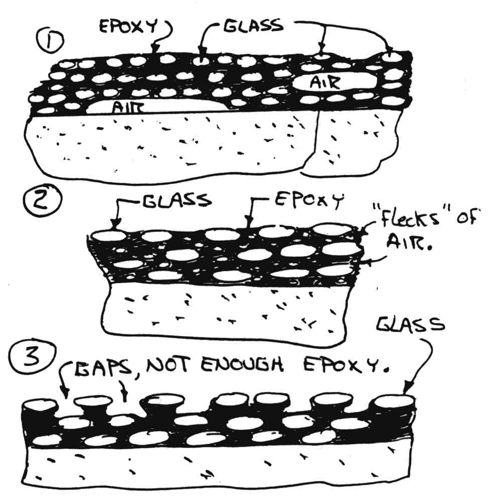Figure 3-43: Examples of dry layups

# <u>SAFE-T-POXY - NEW LOW-TOXICITY EPOXY SYSTEM</u>

In 1979 a new epoxy system was introduced that can be used in place of RAEF and RAES epoxy. This new system essentially eliminates the skin irritation problems experienced with normal epoxies. Safe-T-Poxy also has improved physical strengths, less water absorbtion and better fuel compatibility than normal epoxies. Due to its different curing characteristics, Safe-T-Poxy is less exothermic and can be used in place of both RAEF and RAES, ie. in all cases where "epoxy" is called out in the plans. Safe-T-Poxy uses a different mix ration - see page 3-2. If you are using Safe-T-Poxy consideration should be given to two areas:

1. When mixing micro baloons with Safe-T-Poxy, <u> 3M B23, 500</u> (available from distributors) <u>glass balloons</u>, should be used.
If you use Quarts Q-Cell balloons, due to alkaline, the cure will be delayed, depending on temperature as much as two or three days. Although it does ultimately cure, and is structurally ok, this is {to}  much delay, particularly in finishing is not acceptable.

2. Safe-T-Poxy has a higher viscosity than the previous resins, thus requiring a higher working temperature to use, especially on larger layups. The high viscosity was selected for Safe-T-Poxy to eliminate the tendency of the previous material to bleed-out (inducing air in the layup during cure).

If you are building in a cold garage in the winter you can still use the new Safe-T-Poxy if you take the following precautions:

1. Warm the resin and hardner evenly to 85 to 90F prior to mixing. Do not try to hurry this. Use a light bulb under the ratio pump 3-4 hours prior to use, or keep your resin jugs in a cabinet with a light bulb inside.
2. It's important to have <u>everything</u> thoroughly warm prior to starting work. This also cannot be rushed. It takes time to get the parts (wings, foam blocks, etc.) up to a stable temperature through out. If you are stating from a very cold garage, the warming process could take 4 hours or mor. Don't think just because the air is warm that all the material is warm.
3. Use an electric hair dryer to warm the area as you work, being carefull not to over heat the part or epoxy. When, due to cool temperatures, a part is slow to wet out, a few quick passes with a hair dryer will greatly speed the layup time. Do not use a hair dryer to heat a cup of epoxy. This can give local hot spots and ruin pot life.

What shop temperature is satisfactory? That has a lot to do with the size of the job. Small jobs can be worked to as low as 65F but the working time will be excessive. It will also be more difficult to remove excess epoxy, resulting in a heavier part. On large layups like the fueslage, wings, etc. where there is a lot of epoxy to drag around, 77F should be considered the minimum. That epoxy prewarmed to 85-90F and all parts, glass, foam, tools, table -- everything up to 77F for 4 hours then go to work. Those temperatures are minimums, add 5 to 10F and your working time will be greatly reduced and parts built lighter.

# <u> Some More Hints</u>

You can generally tell teh quality of a men's workmanship just by looking at his shop. Clean up and sweep after every step. Keep your tools organized and clean. Dirt in or under a layup will increase weight and decrease strength. A clean shop will reflect on your airplane, and will make construction more pleasant.

A flour sifter is excellent for getting any lumps out of micro. Keep micro bag closed to avoid moisture.

A key to a good glass layup is preparation. Copy this check list below and post in your shop:

__Before any Glass Layup__

1. tools cleaned & available squeegees, cups, sticks, brush, scissors, ruller, Ply 9 or gloves
2. Workbench clean
3. Glass cut and rolled
4. Surface to be glassed - correct shape & smooth contour sanded dull dust blown or vaccuumed off
5. Temperature of room and epoxy 70 to 80F

## <u>Errors - How to Fix</u>

The following are accepted practice to repair common errors. Of course, it's best to be careful and avoid the error in the first place. Remember, most errors can be avoided by reviewing your newsletters.

__ERROR:__ Depression in skin or spar cap in spanwise direction on wing, winglet, or canard.

__REPAIR:__ Sand surface dull. layup UND plies out as shown to fill depression, fiber orientation spanwise. Add on ply BID at 45 degrees lapping two inches on each side of depression. This repair is allowable for depressions up to 1/10 inches deep.

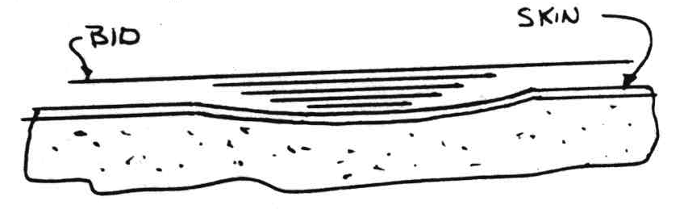Figure 3-44: Repair a depression

__ERROR:__ Bump in skin or spar cap in wing, winglet, or canard.

__REPAIR__ Using a hard block, send bump level. Determine number of plies in area of bump. Sand completely dull the area around bump to a radius in inches equal to number of plies at bump. Layup the same plies as effected area, being sure to observe fiber orientation. Add one ply BID at 45 degrees as shown.

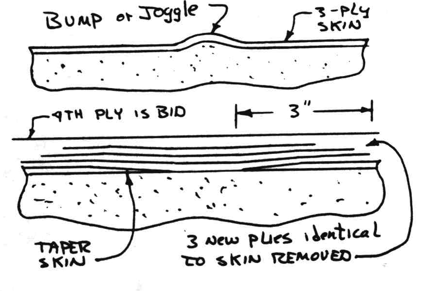Figure 3-45: Repair a bump or joggle

__ERROR:__ Inadvertently sanded through plies during finishing process.

__REPAIR__ Determine number of plies damaged. Repair as shown in "bump" repair above.

__ERROR:__ Due to incomplete wetting of layup I have several pin holes in my winig fuel tank so it will not meet leak check.

__REPAIR__ Pull a mild vaccuum (1500 ft) on the tank. Hold the vaccuum for 1/2 hour as you brush, stipple, or rub epoxy over the area with pin holes. Then vent tank to equalize pressure. Paint a coat of epoxy over affected area. Be sure tank is vented during cure.

__ERROR:__ Due to a poor or heavy layup, elevator or aileron will not balance to specification.

__REPAIR__ Start over; sloppy workmanship cannot be patched on these parts.

## __IMPORTANT!__
Avoid adding extra systems, night lighting, or extensive avionics. Remember, the Long-EZ is smaller than the average light plane and thus is effected to a greater extent by the addition of excess weight. A light Long-EZ is a thrill to fly and has extensive utility. A Long-EZ that is loaded down with extensive systems, avionics etc. can be so heavy as to preclude two-place operation and destroy its exciting solo performance. <u>Resist the temptation to add anything.</u> In an airplane this small you should be carefully counting grams, not just pounds of excess weight. The best test to decide whether something should go in the airplane is as follows. Take the object in your hand. Toss it up into the air - if it comes down, its too heavy to belong in your airplane!

Starter -- Electric start, while available for the Long-EZ, does compromise it enough so that we recommend <u>against</u> its installation. The engines are easily hand-propped, particularily since you hve a pusher with nose-down parking. In this configuration most aspects of manual start are considerably safer than for conventional aricraft - see Owners Manual. The plastic airplane does not conduct. Thus, your large heavy start cable must run to the battery and back. Electric start adds over 25 lbs weight, most of it after on the engine. You will initially want to fly your first flights at forward cg and at as light a weight as possible (see Owners Manual). Therefore, even if you insist on need electric start, <u>leave the starter and heavy cable</u> out for your initial test flying. This will avoid possible nose balast (thus a double weight penalty).

# __PRACTICE LAYUPS__

## __FLAT LAYUP__
The first practice layup that you will make is a layup of six BID plies onto a flat surface. This is inteneded to give you experience in the techniques of glass/epoxy work and to give you a check on your workmanship. You should be able to complete this layup in about half an hour. You should be able to complete this layup in about half an hour.

Protect your work bench by taping waxed paper over an area about 24" by 24", (or, find a piece of metal and wax its surface). This will keep the epoxy from bonding to the table top. Cut six plies of BID that are about 12-1/2 inches by 18 inches.

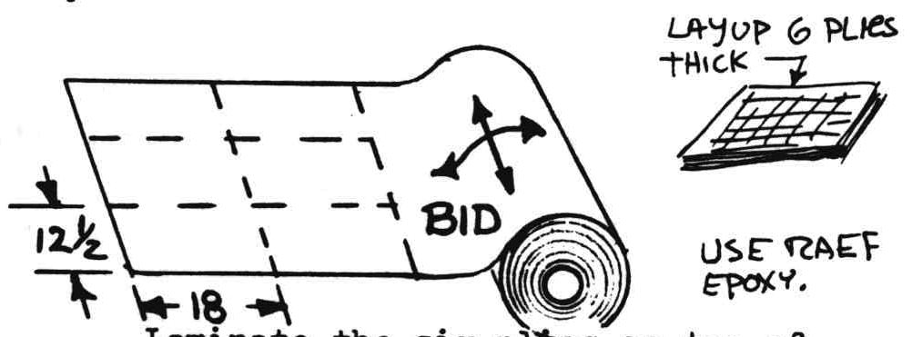Figure 3-46: An Practice layup

Laminate the six plies on top of the waxed paper. Try to do your best job of stippling and squeegeeing so that the plies are <u>completely wetted</u> but not full of excess epoxy. Let the layup cure to knife trim, about four hours. Carefully mark a 10-in. by 16-in rectangle and knife trim the layup to that size using a sharp razor blade or trim knife. Allow the layup to cure completely. If you forget the knife trim, cut the cured piece with a coping saw or band saw.

Take the cured 10"x16" piece to your post office, or any accurate scale, and ask them to weigh it for you . Your laminate should weigh between 10-1/2 and 12-1/2 ounces. A 10-1/2 ounce layup is about as light as can be done <u>without voids</u> (white areas). A 12-1/2 ounce layup has too much resin, and if you make all of the layups in the airplane this wet, your Long-EZ may be as much as 40 pounds over weight. An 11-ounce layup is just about perfect. Save this piece; it will be useful material later on.

##__Confidence Layup__
The second practice layup is one intended to give you confidence in the <u>strength</u> of your work. This layup is a sample of composite sandwich structure and is typical of the load carrying structures in your Long-EZ. When this layup is finished and completely cured, you will subject it to a simple load test and thus demonstrate the strength of your workmanship.

First, tape a piece of waxed paper about 30 inches long to the top of your work table. Shape a piece of green foam as shown.

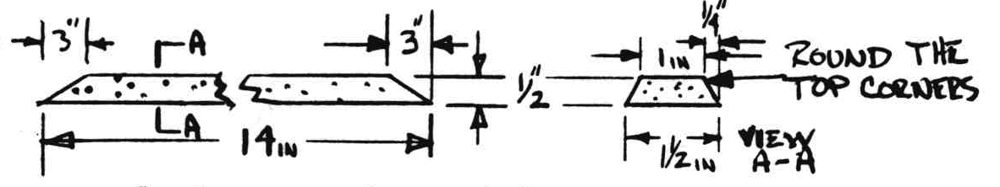Figure 3-47: Green foam confidence layup

Go to your glass cutting area and cut the glass plies shown.

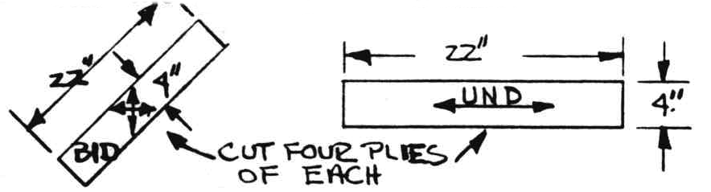Figure 3-48: Cutting glass

Lay up two plies of UND, two plies of BID, paint the foam with micro slurry and press it in the center. Then lay up the other BID and UND plies.

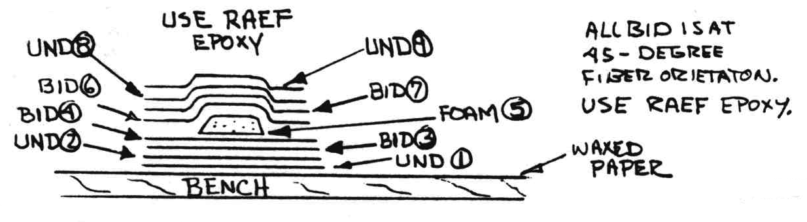Figure 3-49: Confidence layup side views

Be careful to work all air bubbles out of the corners. The best way is to stipple with the brush. The glass is oversized so that it can be trimmed to exact dimensions later. Trim to the dimensions shown after curing 24 hours. Using a coping saw or band saw.

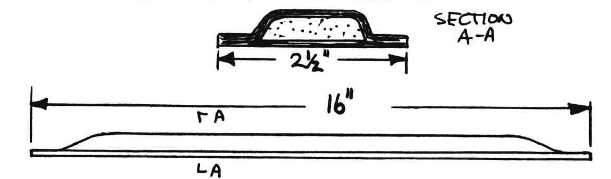Figure 3-50: Layup finished view

Allow the pieces to cure for four days at room temperature before the load test.

Now for the test; lay a broom handle or piece of tubing on the work bench and try to break the sample by putting all of your weight on the ends.  A 200 pounder will stress the sample more than any part of your airplane is stressed at 10 g's!

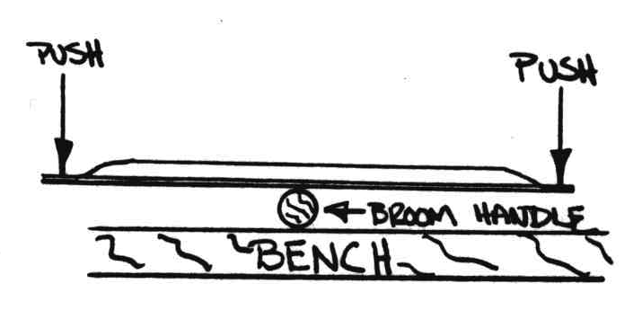Figure 3-51: Strength test

## __Book End__

The last practice part that you will make before starting on you airplane is a book end. It takes three layups to make the book end and involves most of the operations that you will need to learn, to build your airplane.

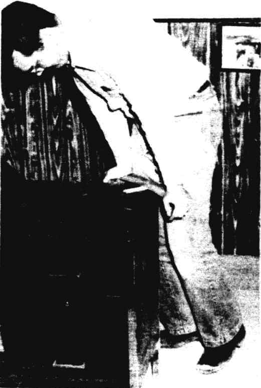Figure 3-52: Bookend

Cut the two blocks of green urethane foam (2 lb/cu ft) as shown.

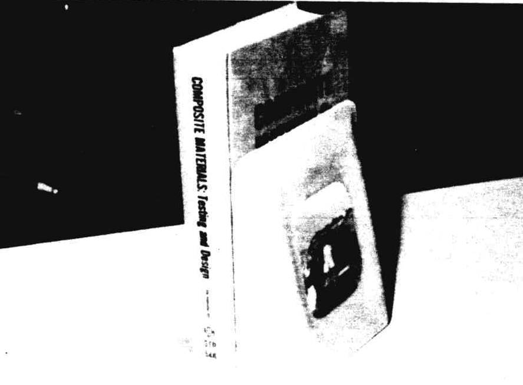Figure 3-53: Bookend foam

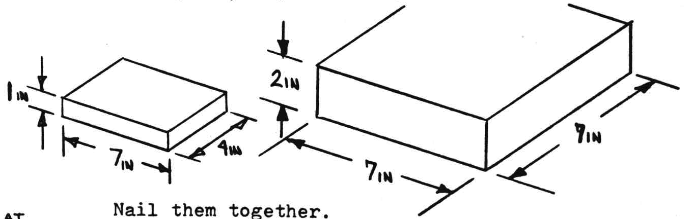Figure 3-54: Nail bookend together

Cut three plies of BID as shown.

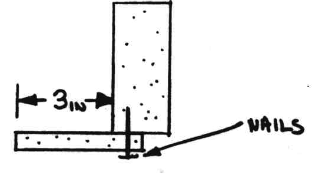Figure 3-55:BID orientation

Mix 4 oz of RAEF epoxy; using about 1 oz, make a small batch of micro slurry and coat the foam as shown. Make dry micro from the leftover slurry and make a <u>small</u> radius with it as shown.

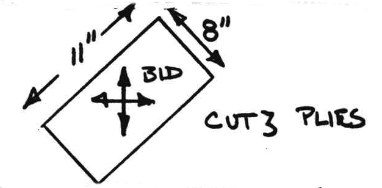Figure 3-56: Apply Micro slurry

Layup the first ply of BID as shown. Using plain epoxy (no micro) lay up the other two plies and allow to cure. Note how the 45 degree fiber orientation allows the glass to lay down completely into the small radius.

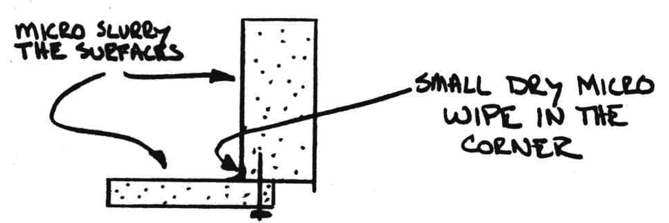Figure 3-57: Knife trim bookend

Knife trim along the foam edges.

After the first layup has cured and the edges have been trimmed, the thicker foam block is carved and contoured as shown.

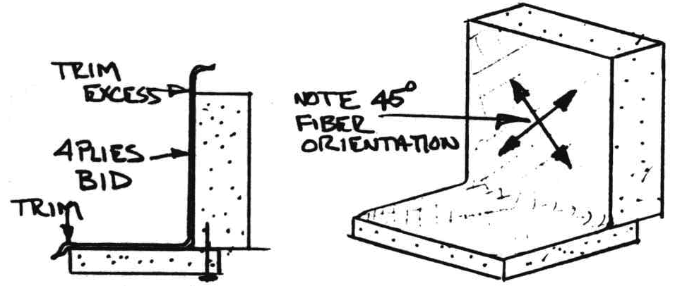Figure 3-58: Carve verticle block

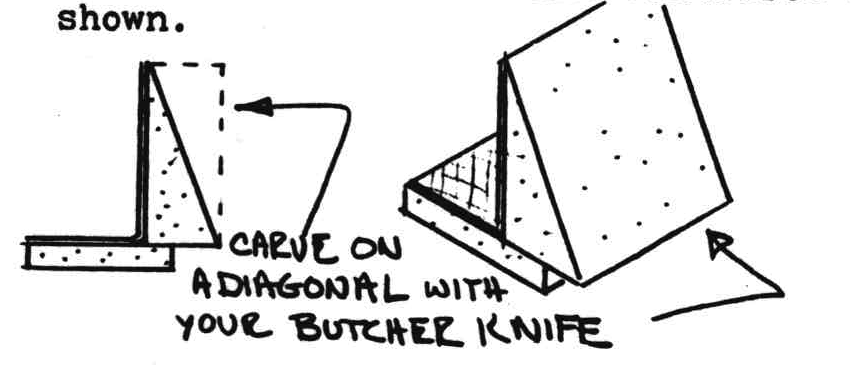Figure 3-59: Sand the edges

Put a generous radius on the foam edges and sand the 1/4" wide glass edges dull for glass to glass bond. Use your wire brush to rough out a depression in the middle of the block.

Finish smoothing the depression by rubbing it with a scrap of green foam. Radius the corners of the depression. Blow or brush all of the foam dust off the surface.

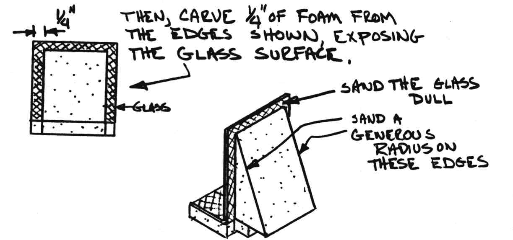Figure 3-60: Dish out depression in verticle block

Cut three plies of BID as shown.

Figure 3-61: Cut BID for Verticle block

Mix RAEF, make a small batch of slurry and save the remaining epoxy. Slurry the foam surface and apply two plies of BID to the contoured surface. Start the layup in the center and work out toward the edges. If you have trouble getting the glass into the depression corners without bubbles, lift the plies and wipe in a little dry micro. You will then find that it will lay smoothly in without voids (see sketch). This depression is sharper than any in your airplane and is intended to give you a feeling of how sharply you can form the cloth.

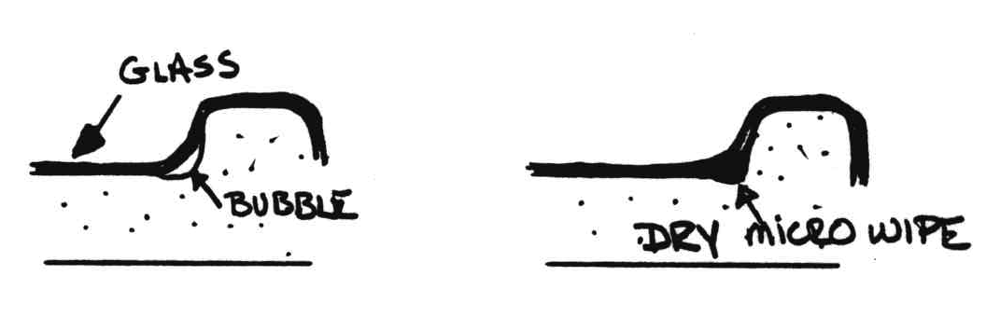Figure 3-62: Layup depression on verticle block

Before laying the third BID ply down, place yor favorite photo in the depression, and then lay the third BID ply over it. Scissor trim the excess glass cloth. Allow the cure and knife trim the edges.

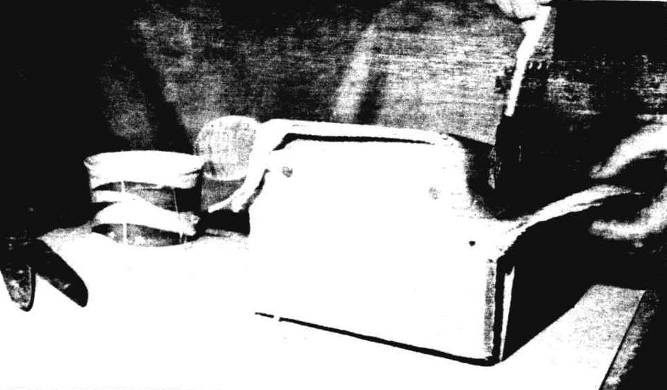Figure 3-63: Put a photo in book end

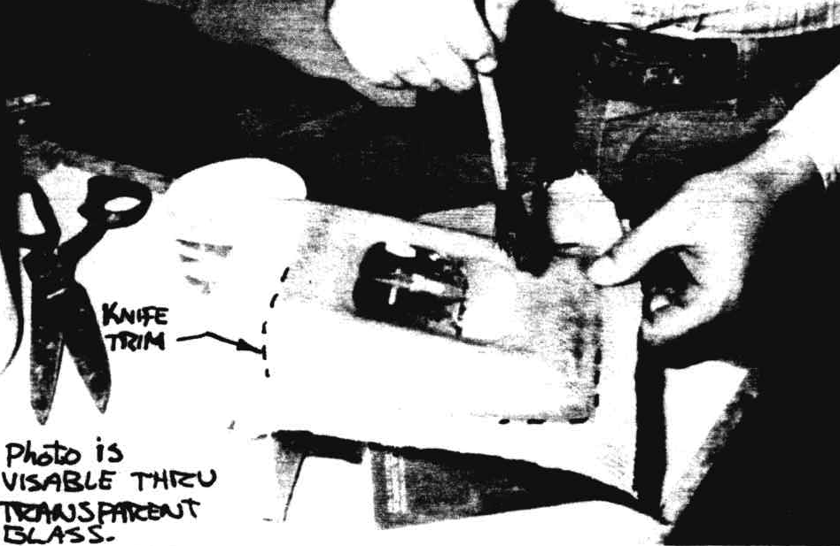Figure 3-64: Epoxy in the photo

The lower edge is trimmed flush with the bottom of the foam block.

Wait until the second layup is fully cured. Remove the 1 in foam block with a butcher knife and sanding block. Remove foam from a 1/4" flox corner and sand the glass surface dull.

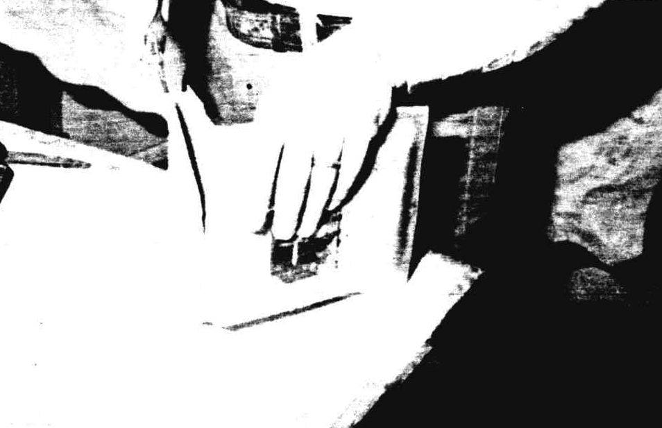Figure 3-65: Trim bookend bottom

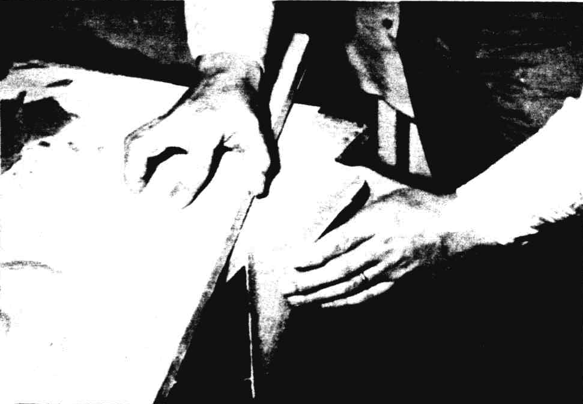Figure 3-66: Sand bookend

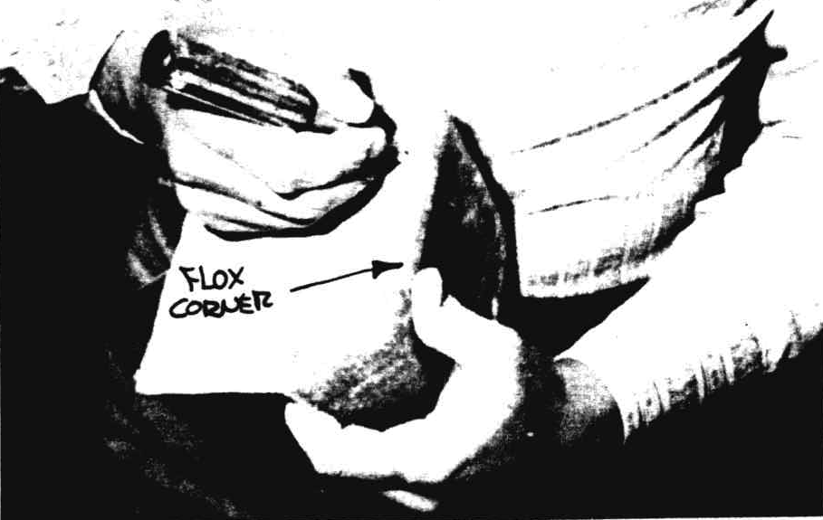Figure 3-67: Flox corner of bottom to verticle

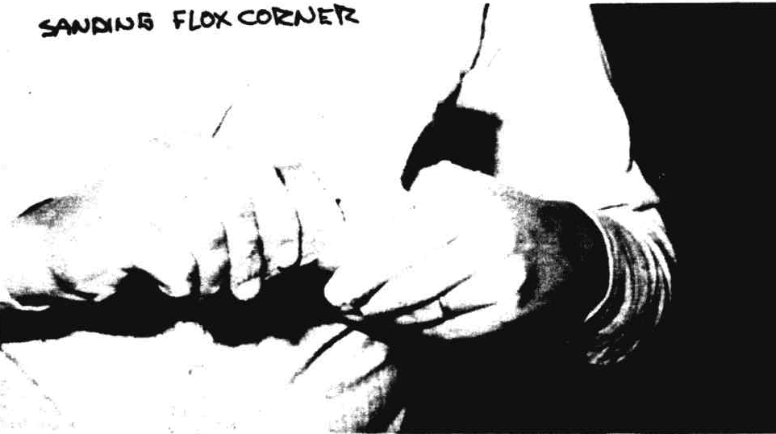Figure 3-68: Sand flox corner

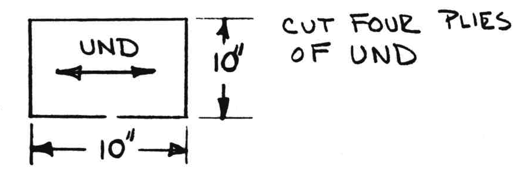Figure 3-69: layup UND plies

Mix RAEF, a small batch of flox, and a small batch of micro slurry. Fill the corner with flox and slurry the foam. Lay up the four UND plies with the orientation shown.

Figure 3-70: Sand bookend

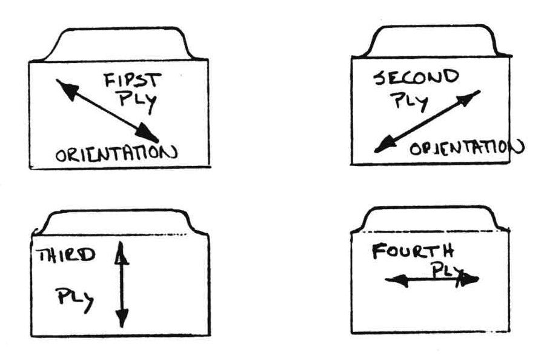Figure 3-71: UND orientation

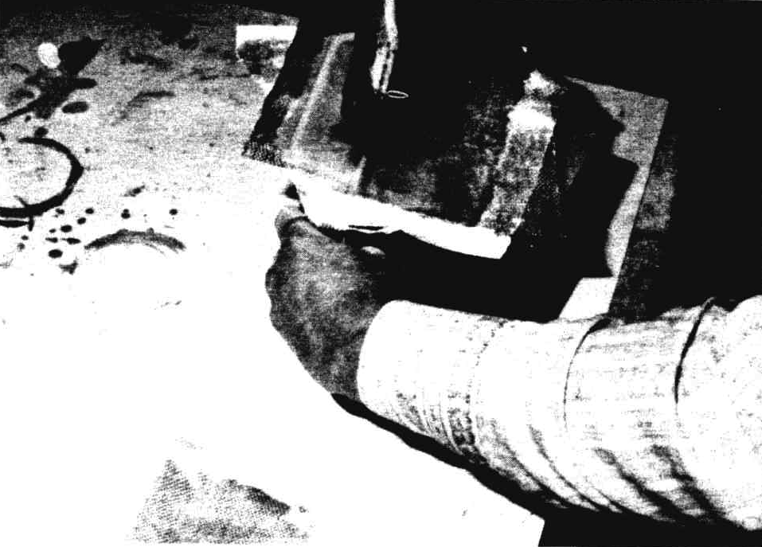Figure 3-72: Sanding edges

Knife trim the edges. After 12-hour cure, sand the edges with 100-grit sandpaper as required for smoothness and good appearance.

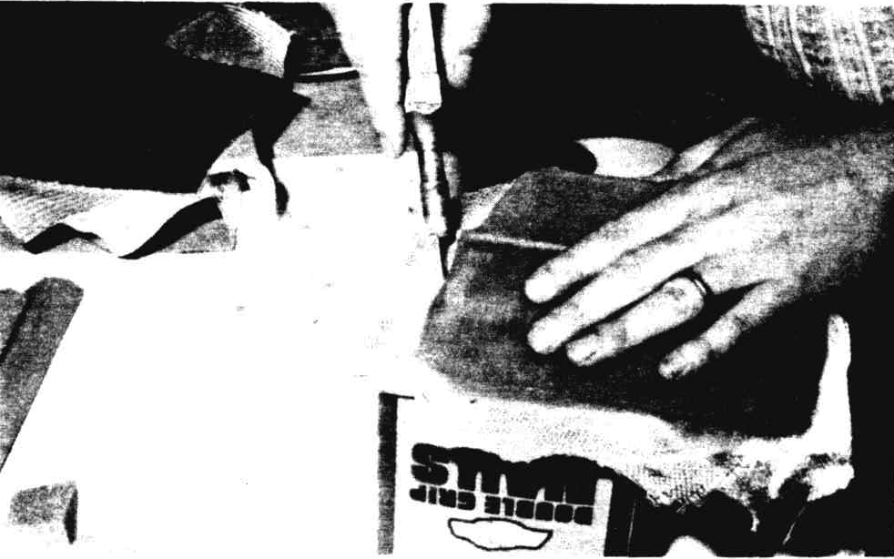Figure 3-73: Knife trim edges

It may at this time seem a bit ridiculous to use three layups, about four hours work, and two days cure, just to make a book end! But remember, this book end was not designed for ease of construction; it was designed instead, to let you get a first hand exposure to the following operation before starting on your airplane: glass cutting, foam preparation (slurry), BID and UND layups (flat surfaces, corners, and compound curves), flox corner, knife trim, concave and convex foam carving, glass to glass surface preparation and sanding edges. So, use this experience to your best benefit and spend the curing time studying the plans. Even if you're experienced in glass layups, the book end is a worthwhile project to get familiar with the workability of this BID and UND weave cloth.

# AIRCRAFT MEASUREMENT REFERENCE SYSTEM

To ease the engineer's task of defining where things go in these odd-shaped gadgets called aircraft, a fairly standard system of references has been developed. Fortunately the Long-EZ is so simple that an elaborate measurement system is not necessary. It is, however, convenient to use the standard terminology for reference occasionally and you should b efamiliar with its meaning.

The three basic references are called butt lines, fuselage stations, and waterlines. Don't blame us for the absurd names, we didn't set the system up. All three are given in inches from some arbitrarily chosen reference, so, fuselage station 100 is not 100 inches away from fuselage station 0, and similarly for butt lines and waterlines. Being as lazy as anybody else, we abbreviate these as F.S., B.L., and W.L.  We use these abbreviations with periods, F.S not FS, so that they are't confused with part numbers like CS, which do not use periods.

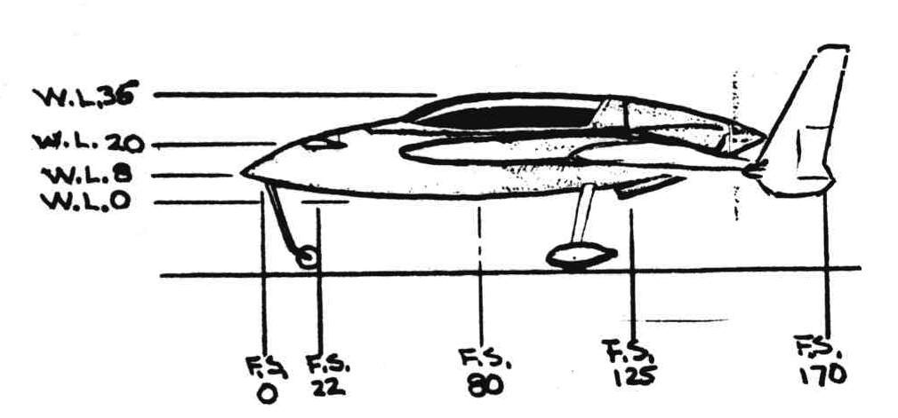Figure 3-74: How to specify location on the airframe

Fuselage stations (F.S.) are used to define the location fore and aft on an airplane. To make things easy, fuselage station 0 is generally located near the nose of an airplane and measurements are made aft. Fuselage stations are the most commonly used of the references and later on you will make a reference mark on you airplane to use as a permanent F.S. reference point.

Waterlines (W.L.) are used to define verticle locations. Waterline 0 is generally found near the ground an dmeasurements are made up from W.L. 0. On your Long-Ez the top surfae of the fuselage longerons (W.L. 23) is used as the verticle reference. Waterlines are utilized in amny place to position components or templates relative to each other by leveling reference waterlines with a carpenters level.

Butt lines define positions infoard and outboard. Butt lines zero is the verticle centerline of the airplane and measurements are taken to the left and right of B.L.O. Since left and right depends on which way you are facing, it is standard practice to define left and right as the pilot would while seated in the cockpit.

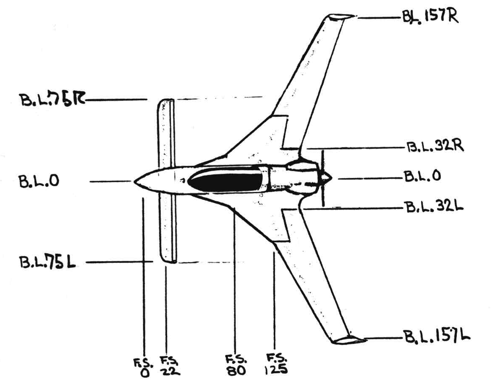Figure 3-75: Butt lines

Using these three references, any point in an airplane can be described with a fuselage station, butt line, and waterline. Fortunately, your Ez is so simple that we don't need to locate very many thins this way. When you start on your 4/5-scale replica of a C-5A, this reference will be real handy.

# ATMOSPHEREIC CONDITIONS

Temperature has the greatest effect on the working properties of your epoxies. 75 degrees farenheit is an ideal temperature. The range from 60 to 90 is acceptable with the precautions mentioned in the section on EPOXY. Humidity has a lesser effect on these materials than it does on aircraft dopes and some paints. Humidity will only create problems if it over 75%. Don't undertake a layup if it is pouring down rain outside or, if you notice a cloudy "blush" on the wet epoxy surface, or any evidence of whiteness in the epoxy due to moisture.

### Tools Comment
A pneumatic riveter is not required to build your Ez. The few hard rivets used can be set with a hammer, using your vice as backup. The "pop-type" rivets are pulled with a low cost hand puller available at any hardware store. Note that Cherry rivets can be substituted for the Avex rivets (bill of materials).

### Printing comment
Due to limitations of the printing process used, several of the full size drawings are broken down to more than one sheet. To assemble your full size drawings, trim the edge off one sheet as shown and glue it to the adjacent sheet, lining it up carefully at the lines shown. Be careful to keep all <u>waterlines</u> perfectly straight.

## <u>Heat Deformation and Creep</u>

Several builders have had flying surfaces warp or bend due to being poorly supported unti fully cured. Do not hand or support them at each end of long periods as they may "creep" or slowly deform. Store them leading edge down with support in at least three places. Your surfaces can be better protected against "creep" if you post-cure them. Sail plane manufacturers do this by putting the entire airplane in an over at 160F. You can do it as follows: After you have painted on the black primer put the wing/winglet or canard out in the sun. Be sure it is well supported in at least three places along its span. At noon a black surface can reach 140 to 180F. Giveing it a relatively good post-cure. After the post-cure, the structure is more stable for warping or creep. If you have a wing or canard that is twisted wrong, apply a twisting force in the opposite direction before and during the post-cure (weights applied to boards Bondoed or clamped to the surface can be used). Remove the force only after the surface has cooled. A 200 ft-lb torque (50-lb weight on a 4-ft arm) applied twice, once while the top surface is post-cured and once for the bottom surface, can twist your Ez wing or canard over one degree. The twist correction will be permanent and will stay as long as the surface remains cool (below the post-cure temperature). This si generally referred to as the heat-deformation characteristic of the Epoxy. If it is room-temperature cured only, it will soften above 140F. But if post-cured it will not soften until over 160F. Heat for post-curing or for intentional deforming can be applied by other means such as heat lamps, hair dryers or electric radiant lamps, hair dryers or electric radiant heaters (household type), however this is generally not recommended, since it is too easy for the homebuilder to get the part <u>too hot</u> and ruin the part. The blue foam is damaged above 240F. If you want to use these heat sources, do so by applying the heat <u>very</u> slowly and checking the temperature often by placing your hand on the surface.  If you can hold your hand on the surface five seconds without pain, the temperature is okay-three seconds is <u>too hot</u>.

creep is rare on teh main gear since this part is post-cured. However, the main gear <u>is</u> subjected to a continuous high stress over long periods when the airplane is parked. This stress can be greatly relieved if you lift under one wing and allow the gear legs to spring together, then set the airplane back down when you park it. It is doubtful if gear reep will be a problem with the Ez, but if you do notice creep (gradual spreading of the gear) it can be reset by pulling the wheels tightly together with a rope (weight off the gear) heating then cooling the strut, then removing the rope. Another handy use of the heat deformation method is setting toe-in. If you need more toein, clamp boards on the wheels as shown, heat, then cool the strut, remove the boards and presto, toe-in that's easier than installing shim plates!

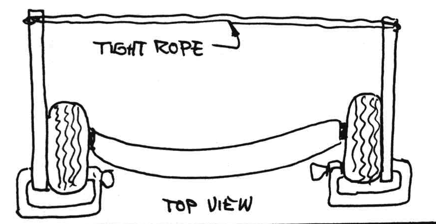Figure 3-76: Curing main gear creep

# AMATEUR-BUILT LONG-EZ INSPECTION CRITERIA

## 1.0 SCOPE

This document has been prepared to assist inspection personnel by providing recommended acceptance criteria and acceptable repair practices for the Long-EZ amateur-built composite sandwich structure.

## 2.0 Background Information

### 2.1 Design Criteria

The materials, methods, and practices employed by the amateur builder in the construction of the Long-EZ type are new to light aircraft construction and may be unfamiliar to the inspection personnel involved with the licensing of amateur-built aircraft. Structural design criteria for the Long-EZ exceed F.A.R. part 23 requirements. In-house component testing of the prmary flight structure has been conduction to 200% design limits. Detail documentation of text data is on file at Rutan Aircraft Factory. The aircraft is considered to be a utility category aircraft. Long-EZ builders are being supplied with a complete owner's manual which specifies all placards, operating limitations, normal and emergency operations, flying qualities, maintenance specifications, inspection procedures, and initial flight test procedures.

### 2.2 Structural Approach

The basic structure throughout the design is a composite sandwich of load bearing fiberglass skins separated by light-weight foam core. While the materials and processes are tailored to the amateur builder, the structural layout is very similar to the honeycomb composit structures utilized in military and transport type aircraft and fiberglass sailplanes. Loads are carried by epoxy / "E"-type fiberglass lamina. Foams of various types and densities are employed as a form (upon which the load bearing material is shaped) and as local buckling support. In no instance are foams used to transmit primary loads, as is the case in some other amateur-built designs.

### 2.3 Inspection Techniques

The transparent nature of the fiberglass/epoxy material allows for visual inspection of primary structure from the outside prior to finishing. Defects in the structure, as described in paragraph 3.0, are readily visible even in the deepest laminate.

### 2.4 Inspection Sequencing

The external visual inspection capability provided by the materials allow inspection of all primary structures at any point before finishing. All primare structures are at the surface, eliminating the requirement for "pre-cover" or "closure" inspections. Opaque filler materials are used throughout the airplane in finishing, and inspection must take place before any areas are obscured. Some areas may have opaque materials applied to one surface where the structure is inspectable from the oppisite side (wing trailing edge for example).

## 3.0 Defects

### 3.1 Voids

Interlaminar voids in a new layup may be due to small air bubbles trapped between plies during the layup. These void areas look white and are distinctly visible even deep in a cure layup. Interlaminary voids up to 1 inch in diameter do not require repair, as long as they do not consist of more than 5% of the surface area.

Interlaminar voids (air bubbles) up to 2 inches in diameter are acceptable when repaired as follows: A small hole is drilled into the void and epoxy is injected into the void area. Small voids such a this may occupy up to 5% of the laminate surface area.

Voids greater than 2 inches in diameter should be repaired as shown in paragraph 4.

### 3.2 Lean Areas

Areas where the epoxy/glass matris is incomplete because of inadequate wetting of the cloth with epoxy (lean areas) are speckled whitish in appearance. The fully wetted laminate will have a consistant transparent greenish appearance. Epoxy lean areas are aceptable, as long as the white speckled area is less than 10% of the surface area. White to green ratios greater than 10% require rejection or repair as shown in paragraph 4.

### 3.3 Rich Areas

Resin richness primarily adds weight to the laminate. While some degration of physical properties does occur, an overly wet (rich) layup is not grounds for rejection.

### 3.4 Inclusions

Bristle paint brushes used throughout the layup process. As a brush begins to deteriorate it will shed some pristles into the laminate. The bristle inclusions, up to 20 bristles per square foot are not coause for rejection. Occasional inclusions of <u>small</u> woodchips or other small foreign objects is not grounds for rejection.

### 3.5 Fiber distruption

In all instances, it is good practice to have the glass fibers laying flat and without wrinkles. Major wrinkles or bumps along more than 2 inches of cord are cause for rejection in the wings, canard, and winglets, particularly on the upper surfaces (compression side). Disruptions greater than 2 inches require repairs per paragraph 4.

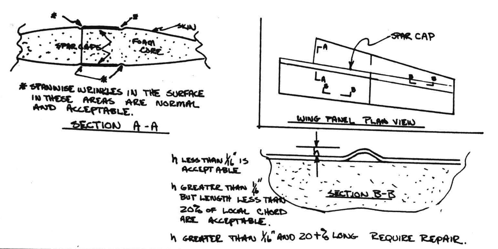Figure 3-77: Repair Fiber disruption

### 3.6 Finishing Damage

Damage to the external structure by sanding in preparation for surface fill and paint can occur. Occassional sanding through the weave of the first skin ply is not grounds for rejection. Sanding through areas greater than 2 inches in diameter completely through the first ply or any damage to interior plies must be repaired in accordance with paragraph 4. A damp rag passed over the sanded surface will make the plies show up to determine how many plies have been sanded away.

### 3.7 Service Damage

Damage to the glass structure will be evidenced by cracked paint, or "brooming" of glass fibers. Both of these indicators are clearly visible. If either type of indication is presnt the paint and filler should be sanded away, bare laminate inspected, and repairs made per paragraph 4 as required. Where surface damage has occured it is also likely that local foam crushing has been inflicted.

### 3.8 Delaminations

Delamination of glass/epoxy lap joints is evidenced by physical separation of plies. These defects are easily visible and easily repaired. The leading and trailing edges of flying surfaces (wing, canard, winglets) should be free of delaminations.

### 3.9 Multiple Defects

Where multiple types of small defects occur in a laminate (voids, fiber disloacations, and lean areas for example). They should not exceed a total of 10% of the surface area of the laminate, or 20% of the wing cord at any one spanwise position.

## 4.0 Repairs

There are seldom single defects so massive that a major component must be scrapped. The repair procedures described here may be applied throughout the Long-EZ andVariViggen SP composite sandwich structures.

### 4.1 Small Void Repairs
Voids up to 2 inches in diameter may be repaired by drilling a small hole into the void and injecting the void full of epoxy. A vent hole opposite the injection point is required to allow air to escape.

### 4.2 Large Defects
Excessively large voids, lean areas, finishing damage, fiber disruptions, major fiber wrinkles, or service damage may be repaired using this procedure. Remove the rejected or damaged area by sanding or grinding and taper the glass laminate on a slope of approximately 1 inch per ply in all directions. The plies are visible as the sanding is done. The tapered glass edges and surrounding two inches of glass surface must be sanded completely dull Damaged underlyin foam should be removed and the void filled with a dry microsphere/epoxy mixture or replacement foam piece. The damaged area is then laminated over using the same type an dorientation of glass plies removed, each ply lapping onto the undamaged glass at least one inch. The whole repair area is covered with an additional bi-directional glass ply.

### 4.3 Delaminations
A delaminated joint should be spread, the mating surfaces sanded dull, gap filled with flox (epoxy/flocked cotton mixture), then clamped shut while it cures.

## 5.0 Materials

Since a wide range of similar appearing materials exists which exhit substantial differences in physical (structural) properties, Rutan Aircraft Factory has established a distribution system to provide the amateur builder with proven acceptable materials. RAF strongly discourages the substitution of materials. Homebuilder sutstitutions for the basic structural materials constitutes major structural modification to the Long-EZ design, and could adversely effect flight safety.

## 6.0 Applicability

These acceptance criteria are different from and, in some cases, much looser than for similar structures found in sailplanes and other contemporary composite structures. These criteria apply only to the Long-EZ and VariViggen structures. Design safety factors in excess of three enable somewhat relaxed acceptability criteria compared to other similar structures.

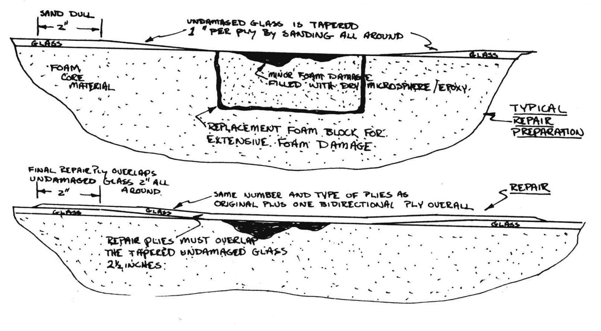Figure 3-78: Typical repair preparation

# Education Supplement
Rip this page out of your plans and staple it to the wall of your shop. While it is a handy reference, it's still a good idea to real <u>all</u> the words in the education chapter once in a while. Don't skip the details - they're all important.

## URETHANE FOAM SHAPING

__BASIC TOOLS:__ Sharp butcher knife, sanding block, surfoam file, wire brush and blocks / scraps of urethane. Use a dust mask. Hack away, have fun.

## HOT WIRE CUTTING STYROFOAM

Hot wire tool has two lengths: 62" for wings and 43" for winglets, canard and elevators. Wire must be <u>tight</u>. The adjustable voltage control is best, but the job can be done with a 12 volt, 6-amp battery charger or 12-volt car batterys. Foam block must be well supported and weighted. Templates must be nailed on tight. First cut the basic block to size; <u>this determines the planform size and shape</u>. Level the template level lines <u>this determines correct twist</u>. Set hot wire temperature for about 1" travel through the foam in about 4 to 6 seconds with light pressure. Do the actual cutting at about 1" ever 6-7 seconds (8-10 seconds around the leading edge). Practice on scraps first.

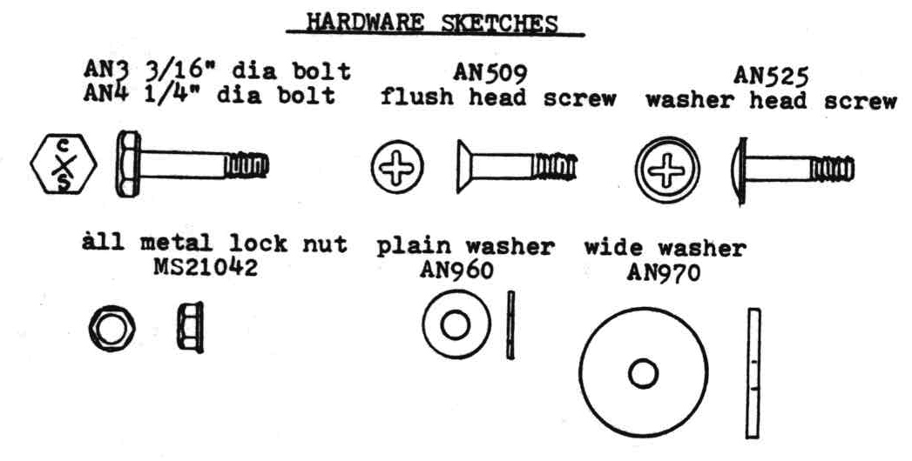Figure 3-79: Bolts, nuts and washers

## BASIC LAYUP PROCEDURE

1. <u>PREPARATION:</u> PLY 9 or gloves on hands, shop temperature 75F +/- 10F.
2. <u>CLOTH CUTTING:</u> You can get by with just a standard pair of good fabric scissors, but the job is much easier with the large pair of industrial scissors (Weiss model 20W). They're $20 (gulp!) but worth it in the long run.

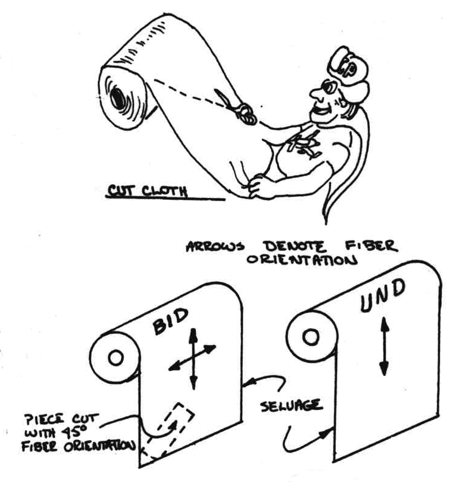Figure 3-80: Cutting cloth recommendation

3. <u>SURFACE PREPARATION:</u>
Foam -- Hot-wire-cut surface needs no preparation. Sand ledges or bumps even, fill holes or gouges with dry micro <u>immediately</u> before the layup. Brush or blow away dust.

Glass - <u>Always</u> sand <u>comopletely dull</u> any cured glass surface (36-grit or 60-grit sandpaper). Resand if it has been touched with greasy fingers.

Metal - Dull with 220-grit sandpaper.

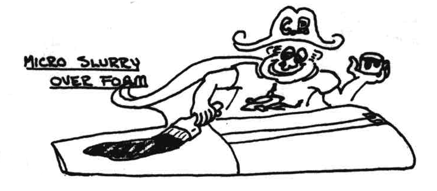Figure 3-81: pre-layup surface preparation

4. <u>MIX EPOXY:</u> Follow <u>all</u>mixing steps shown on your epoxy balance. Mix two minutes, 80% stirring and 20% scraping the sides and bottom. Don't mix with a brush.

* Micro Slurry - Approximately equal volumes of <u>mixed</u> epoxy and microspheres.

* Wet Micro - Enough microspheres for a "thick honey" mix.

* Dry Micro - Enough Micro so it won't run.

* Wet Flox - Thick, but pourable mixture of epoxy and flocked cotton.

Figure 3-82: Mix epoxy

5. <u>APPLY TO SURFACE:</u>

Lay over foam - Brush or squeegee on a thin micro slurry (thick over urethane).

Lay over Glass - Brush on a coat of epoxy.

6. <u>LAY ON CLOTH:</u> Pull edges to straighten wrinkles. If working alone on a long piece, roll the cloth, then unroll it onto the surface.

7. <u>WET OUT:</u>  Don't slop on excess resin; bring epoxy up from below with a verticle "stab" of the brush ("stippling"). Start in the center and work out to sides. <u>Most</u> of the time of a layup is spent stippling. Stipple resin up from below or if required, down from above. "Not Wet, Not White".

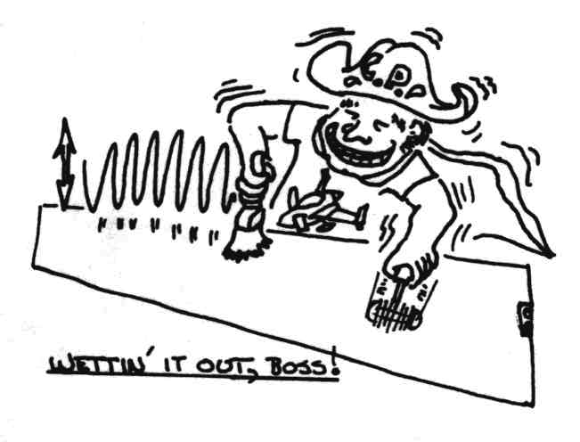Figure 3-83: Wetting out epoxy

Figure 3-84: Not wet not white

8. <u>SQUEEGEE:</u> If you have excess resin, squeegee it off to the side. Use squeegee with many light passes to move epoxy from wet areas to dry areas. 

Figure 3-85: Squeegee

9. <u>PRELIMINARY CONTOUR FILL:</u> Save sanding by trowling dry micro over low areas while the glass layup is still tacky. This is done at trailing edges, spar caps, or over any low areas. The low places are overfilled with micro then sanded smooth after full cure.

Figure 3-86: Preliminary contour fill

10. <u>KNIFE TRIM:</u> Save work of sawing and sanding edges by razor trimmin the edges at the "knife trim stage" which is about 3-4 hours after the layup.

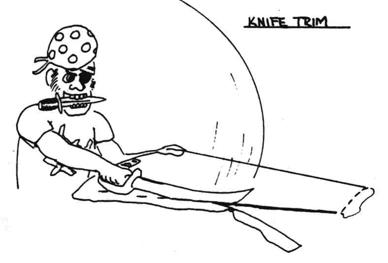Figure 3-87: Knife trim

11. <u>GENERAL INSPECTION:</u>Take a good look for dry glass, excess resin, bubbles, and delamination before walking away from your wet layup.

12. <u>CLEANUP:</u>If you've used Ply 9 skin barrier, you can get all epoxy off your hands with soap and water. Epocleanse is also excellent for removing epoxy and it returns natural skin oils. Brushes - rince twice in MEK and wash with soap and water. Throw away after two to four uses.

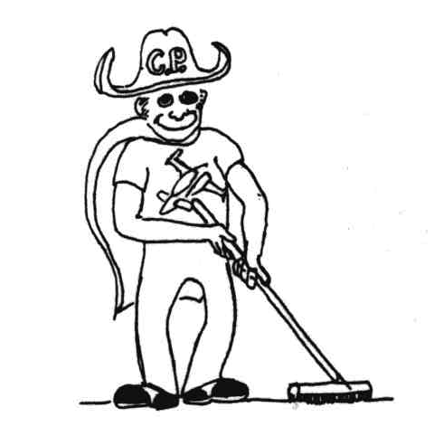Figure 3-88: Keep a clean shop

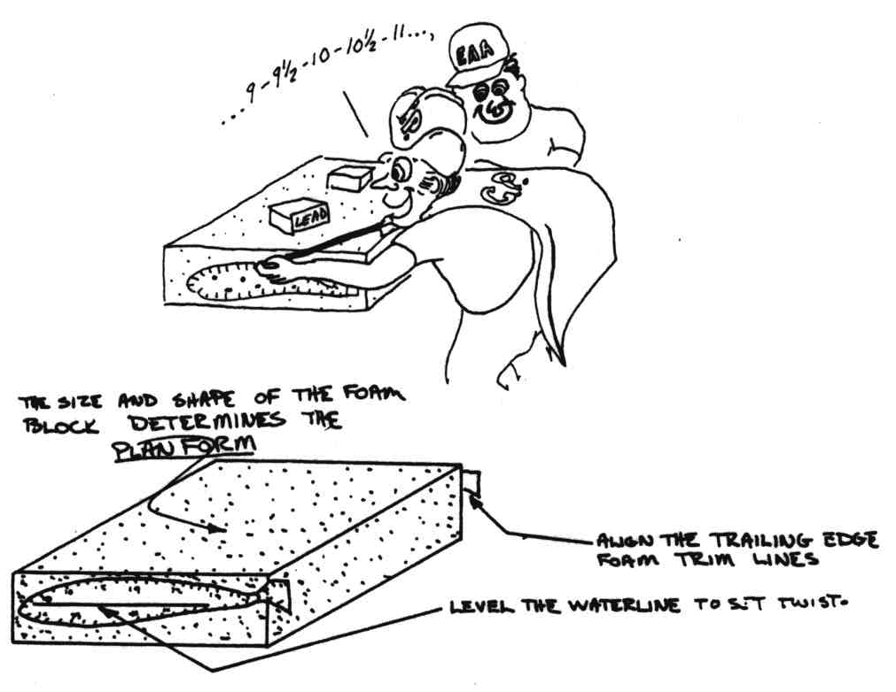Figure 3-89: Using wing templates

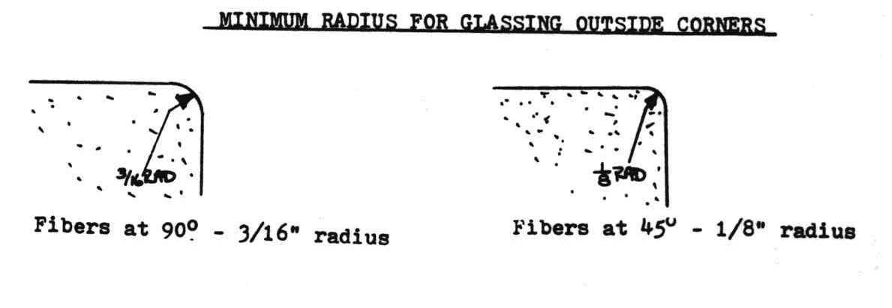Figure 3-90: Minimum radius outside corners
