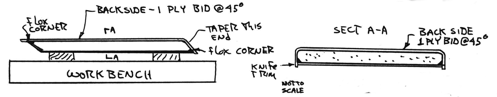
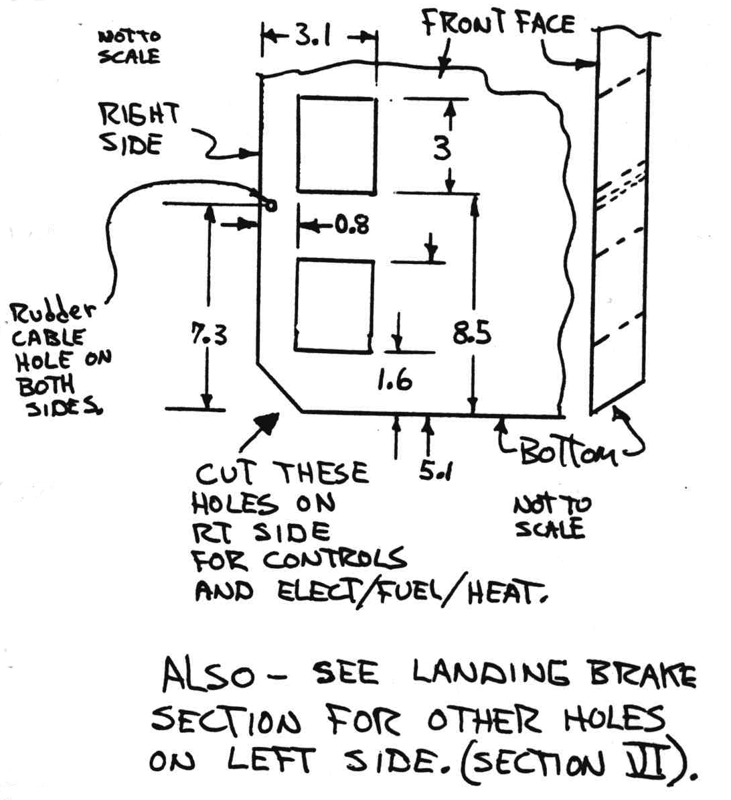
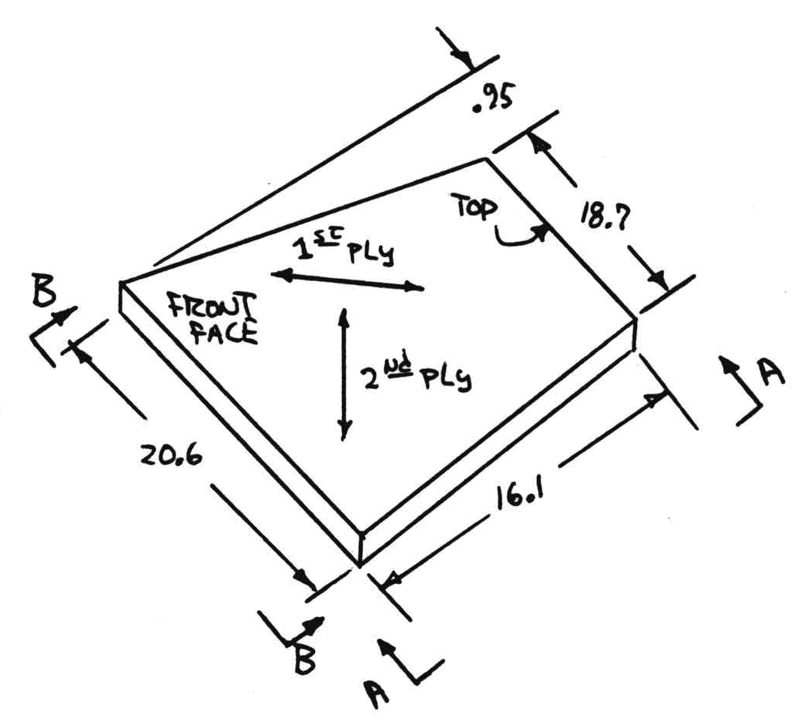
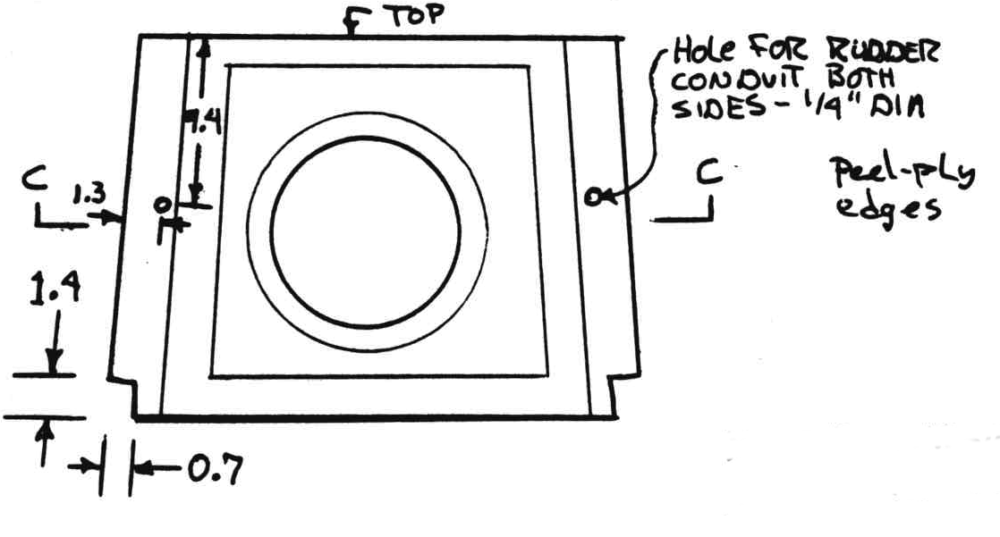
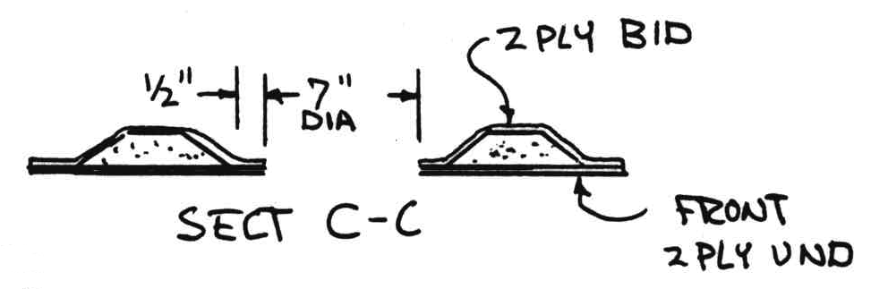
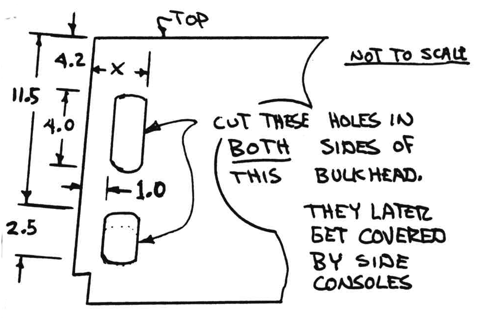

# CHAPTER 4

## FUSELAGE BULKHEADS 

Figure 4-1: Fuselage Bulkheads

**Overview** – In this chapter you will manufacture the six bulkheads that go into your Long-EZ fuselage. Two of the bulkheads are your front and rear seat backs, another doubles as your instrument panel, and still another is the firewall. 0.2-inch thick, high density Red PV core is used in the instrument panel and other forward bulkheads. Type R-45 PV core (dark blue) is used in the seat back bulkheads. Birch plywood is used in the firewall bulkhead. You will find that there are many short jobs in this chapter with cure cycles in between, so you may want to work on several of the bulkheads simultaneously or even do some work in following chapters while waiting for a cure. Appro­ximately 20 man-hours are required for bulkheads. 

### <u>STEP 1 - Front seat bulkhead</u>

Refer to chapter 5 to see how the inclined front seat bulkhead fits in the fuselage. Cut a rectangular piece of 0.8" thick R-45 foam 28.3" long and 23 inches wide. Taper and round one end as shown. Cut 2 plies UND and glass the front side and tapered end. Knife trim flush with the foam edges all around. 

Figure 4-2: Front seat bulkhead foam

Figure 4-3: Front seat bulkhead layup

Figure 4-4: Peel ply front seat bulkhead

After cure, flip over, taper and round the other end (0.7" also) and round the side edges. The one ply BID glass skin on the back not only covers the back and taper but also folds around the side edges to meet the glass on front. Support the bulkhead up about 1" above the table so the glass edges can hang down unobstructed by the table surface. Use a 1/4" flex corner all around. After cure, use a finetooth coping saw and notch the corners as shown to fit the fuselage longerons. 

Figure 4-5: Control system pass thru

### <u>STEP 2 - The rear seat bulkhead</u>

This bulkhead serves as the lumbar support for the passenger and helps support the main gear attachment structure. A large hole in its center provides acess to the small baggage area behind the rear seat. Cut a .8" thick type R45 block to the dimensions shown. Glass this front face with 2 plies UND at 45° crossing fiber orientation. Knife trim all around flush with the foam edges. After cure, use a fine-tooth coping saw or knife to taper the top and bottom edges as shown. This allows the bulkhead to fit flush to the center section spar at the top and to the floor at the bottom. See also page 5-3 and page A5.

Figure 4-6: Rear bulkhead dimensions

Figure 4-7: Rear bulkhead top and bottom slopes

Figure 4-8: Rear bulkhead side slopes

Now use a butcher knife and sanding block to remove the foam at the side edges as shown. This provides a strong edge and allows the bulkhead to sit back in the correct position in the fuselage.

Figure 4-9: Rear seat passthrus 

Figure 4-10: Tapers for rear seat

Use your knife to remove foam from the rear down to the front glass surface in a 8" diameter circle roughly centered in the bulkhead. Round all foam edges, stand the bare glass surfaces dull, and glass with two plys BID using 45° fiber orientation. Knife trim all around the edges and cure. Use a knife or saber saw to remove a 7" diameter glass piece in the center (access hole to baggage area). Remove a 0.7" x 1.4" piece each lower corner as shown to clear lower fuselage longeron. Cut the holes shown to allow clearance for controls, electricals, cabin heat, and landing gear removal.

### <u>STEP 3 - The instrument panel and 2 forward bulkheads.</u>

Figure 4-11:Instrument panel

Full-size patterns for the instrument panel, F22 and F28 forward bulkheads are shown on pages A1, A2, and A3. These are made from type 250 high density PV foam (dark red), 5 mm thick (0.2 inches). Layout the bulkheads on the flat sheet foam. Cut and shape the bulkheads and the doubler. Don't cut your instrument holes until after the panel is glassed on both sides. Lay up 2 plies of BID over the aft face of the pieces. Fiber orientation isn't critical. You can save glass by using strips and over lapping the joints. With the 2 ply layup still wet, press the doubler into position and lay up 2 BID plies locally over it. Add a third ply BID to the instrument panel above the leg cutouts. Knife trim and let the lay-up cure, then flip the pieces over and layup 2 BID plies on the forward faces (add the third one on upper instrument panel). Add the 5 UND and 4 BID additional plies local buildups for the canard attachment in the area shown. Knife trim and cure. After a full cure, open your instrument holes with a fly cutter or hole saw.

Figure 4-12:F22 

Figure 4-13: Instrument panel layups

### <u>STEP 4 - Firewall</u>

A full-size layout of the plywood and stainless firewall is shown on page A4. But the plywood outline to shape. Lay up one ply BID over the aft face. While layup is wet, roll the 0.040 FiberFrax sheet out flat over it. Trim the FiberFrax to the outside contour of the plywood. Cut the stainless sheet to size. Be careful; stainless can cut you easily. Clamp the plywood over the stainless on your work bench and drill the 6 pully bracket holes and notches for the 4 aluminum extrusions (shown on page A4) through the plywood, FiberFrax, and stainless. The stainless firewall is now set aside – it is not permanently installed until after the fuselage is assembled. Countersink the six holes for the rudder system pulley bracket into the **forward** face of the plywood. Epoxy the 6 AN509-10R10 screws in position, then lay up one ply BID over the front face of the plywood. Fill the screw heads with epoxy, so they can bond to the glass ply. These six screw heads are covered by the spar when the fuselage is assembled. The epoxy will keep them from turning until the rudder pulley brackets are installed. Knife trim and cure. Use a coping saw or saber saw to cut the four rectangular holes and two square (0.7 x 0.7) holes in the plywood to allow the six longerons to pass through during fuselage assembly.

Figure 4-14: Firewall Mount points

Figure 4-15: Firewall overview

Note: The 970-F Fiberfrak is a new, excellent, high temperature insullation replacing the asbestos previously used for firewall protection.
