# CHAPTER 5

## <u>THE FUSELAGE SIDES</u> 

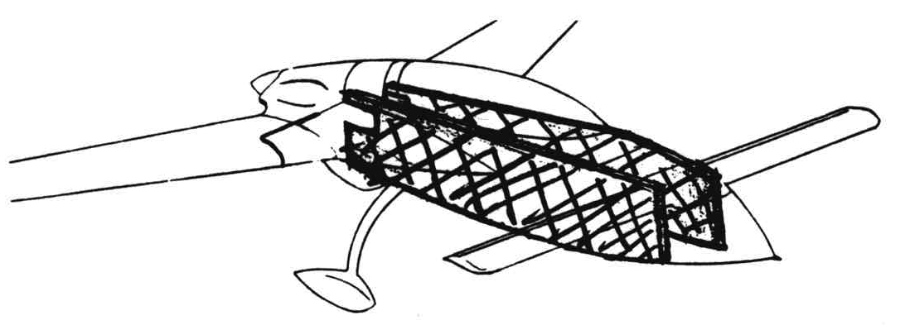Figure 5-1: Fuselage sides overview

**Overview** - In this chapter you will manufacture the sides of your fuselage. To do this, 0.8" thick dark blue PV core type 45 foam is cut to size, determining the fuselage profile. The inside surfaces are contoured (dished out) for fuel gages and for extra room near the front control stick. The inside (contoured) surface receives a 2 ply UND skin and, while the layup is wet, the upper rectangular wooden stringers are bonded in position. The lower triangular stringers and some local beef-up in the landing gear attachment area are then installed and cured. The area where the center­section spar mates to the fuselage is opened and the main gear attachment fittings installed. The outside foam surfaces are left bare until after assembly of the fuselage is completed in chapter 6. 

### <u>STEP 1 - Shaping the foam sides.</u>

Butt pieces of 0.8" thick dark blue type 45R PV core together to obtain two 103" x 21" rectangles laid flat on your workbench. Bond the joints with wet micro. Trim or sand one 103" edge absolutely straight.

Using the adjacent drawing, your decimal ruler, and carpenter's 1square as shown, measure and mark the 12 dimensions that determine the curve of the fuselage bottom. Refer also to pages A5, A7, and A8 to check the shape of the curve. Draw this curve on the foam with a ball-point pen or felt marker. Cut along this line and use this as a pattern to make the other fuselage side.

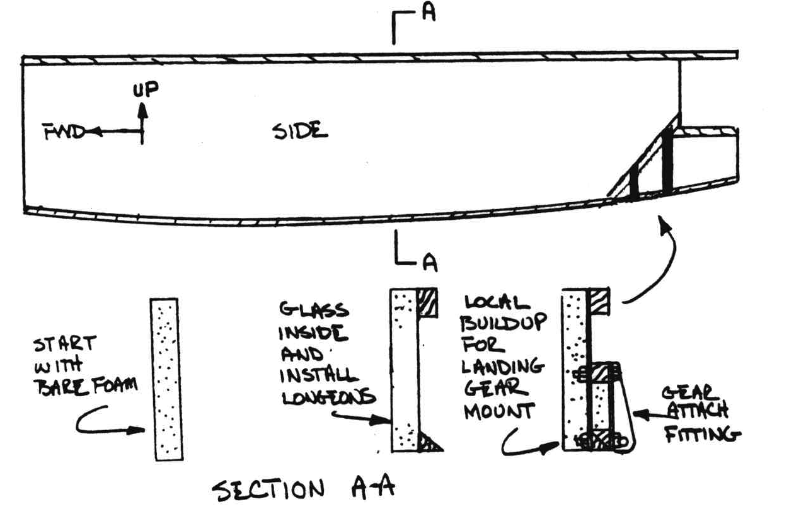Figure 5-2: Side foam buildup overview

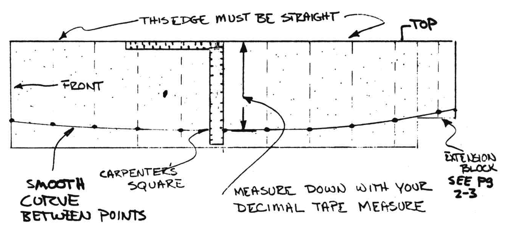Figure 5-3: Side foam outline shaping

Layout the positions of the four interior bulkheads. Use drawing A5 (full size) to layout the aft seat bulkhead and spar cutout. 

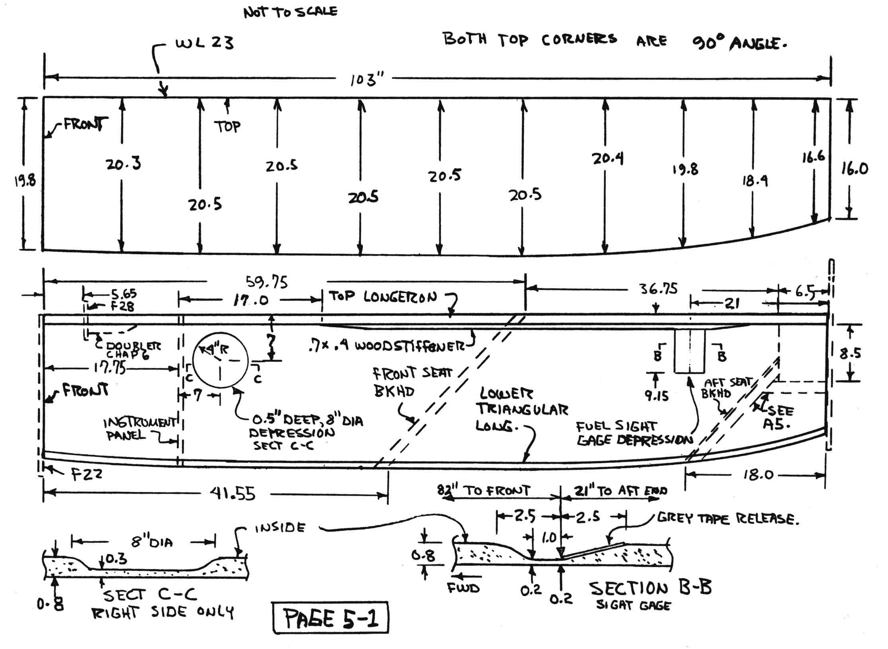Figure 5-4: Bulkhead locations

Now, layout the circular depression shown, in the right side **only** (inside surface). The depression gives some extra room inside at the control stick area. Using 36-grit sandpaper, dish out this area about 0.5" deep with smooth edges.

Refer to the dimensions for the fuel sight gauge depressions. Refer also to Chapter 7 and Chapter 21 to see the function of these. Note how the depression is tilted to face the pilot. **All** foam is later removed in this area so the fuel can be viewed through the translucent glass skins. After carving, apply a 2 1/2" strip of shiny-surface grey tape (duct tape) to this area so the layup does not bond to the foam. 

### <u>STEP 2 - Fitting the longerons and making the inside layup</u>

This step should take you about three to four hours. An assistant is nice for the layup but not absolutely necessary. Refer to the full­scale drawing on page A5 and cut your rectangular 1.0 x 0.7 wood longeron material to lengths as shown. Cut UND cloth and lay up 2 crossing plies over the contoured foam as shown. This is the **inside** of the fuselage. Be sure you are making a left and a right side. Do **NOT** use micro slurry. See chapter 3 for type 45R PV foam. With both plies wet out and squeeged well, apply wet flox to the 103.5" wood longeron mating surfaces and position on the fuselage sides. Install, with wet flox, the 0.7 x 0.4 wood stiffeners under the longerons. Weight them into position for cure. Peel-ply the bottom edge. Refer to the full-size drawing on page A5 and carefully position and flox in place the other two small longerons. Knife trim skin to the foam edge all around. Allow to cure. After cure, radius the edge of the top longeron and glass the 3 ply UND and 1 ply BID strips.

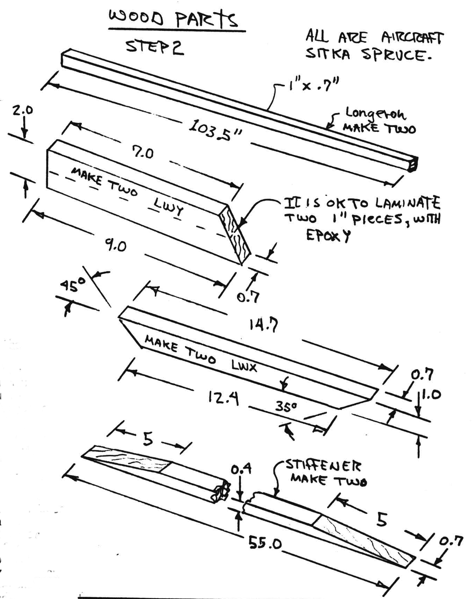Figure 5-5: Longeron preparation

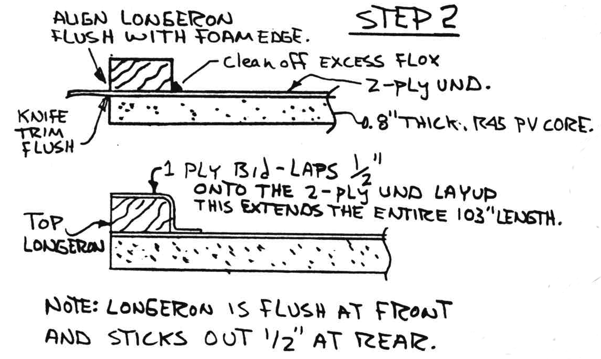Figure 5-6: Laminate longeron in place

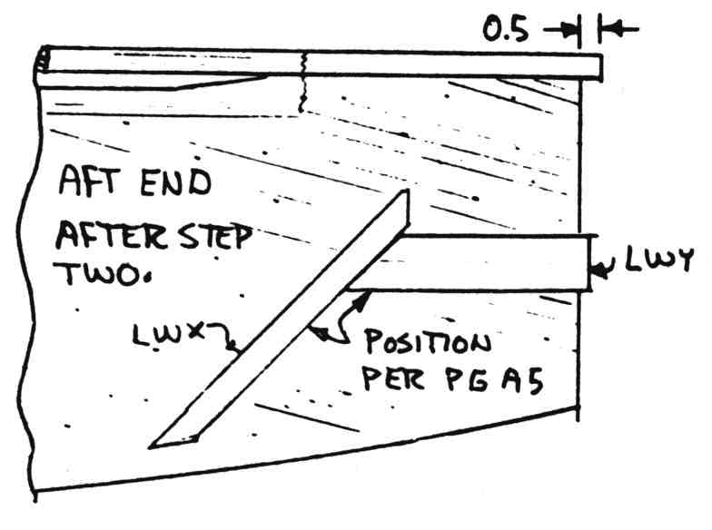Figure 5-7: Longeron positions aft of fuselage sides

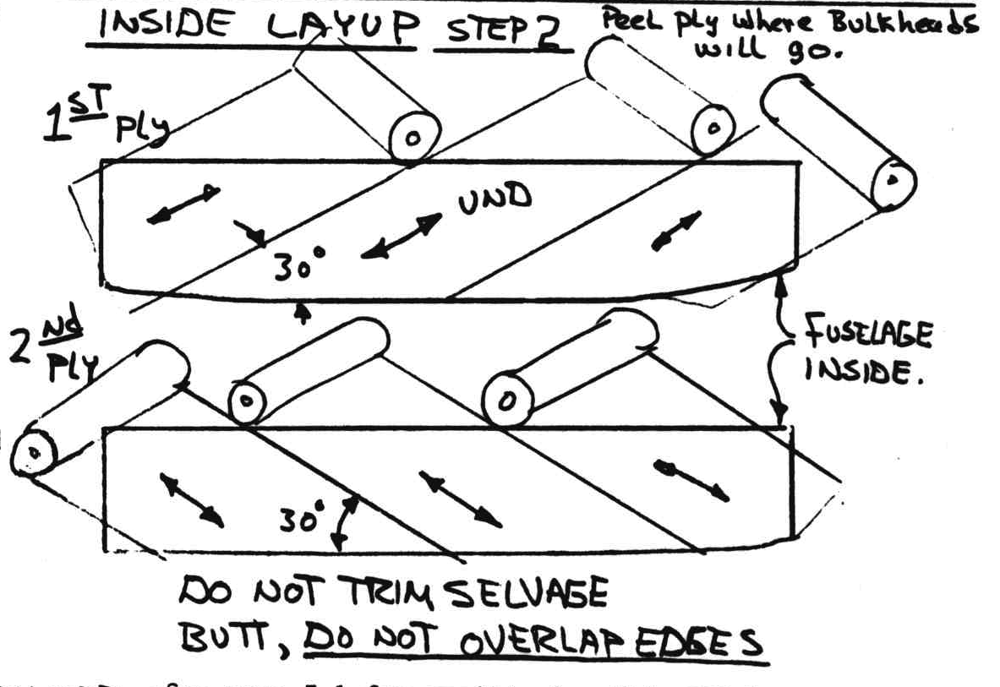Figure 5-8: Inside layup of UND

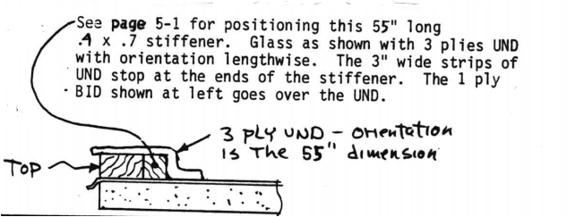Figure 5-9:Glass in longeron 

### <u>STEP 3 - Installation of the lower triangular longerons</u>

This step should take about one hour. Remove peel ply along the bottom edges of the fuselage sides. Fit the triangular longeron to the lower  edge foam curvature by holding it in position with nails as shown in the photo. Don't try to drive the nails with a hammer; drill a hole for them so you can shove them in by hand. Notch the longerons with saw cuts every 2 inches at the aft end so they will more easily bend to the correct curvature. The longerons are installed with wet flox. Wipe off excess flox.

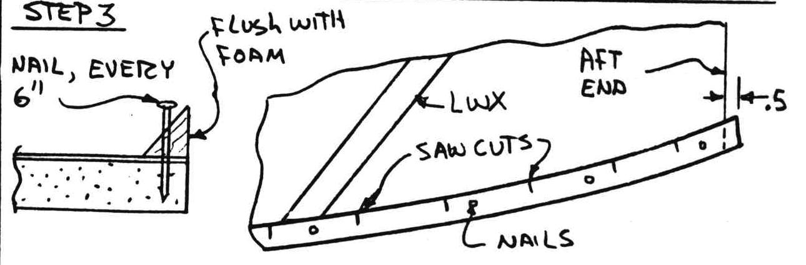Figure 5-10: Nail lower longeron to side

At the bottom rear of the fuselage, from LWX aft, the lower triangular stringer is doubled to form a square (see page A5 and A4). A pair of clamps and a few nails can be used to position the doubler (while the flox cures) as shown in the photo. Wet micro a 1" urethane block in the area bounded by LWX and LWY as shown in the photo. Notice that the lower stringer is left long at this point to be trimmed later, after the firewall is installed.

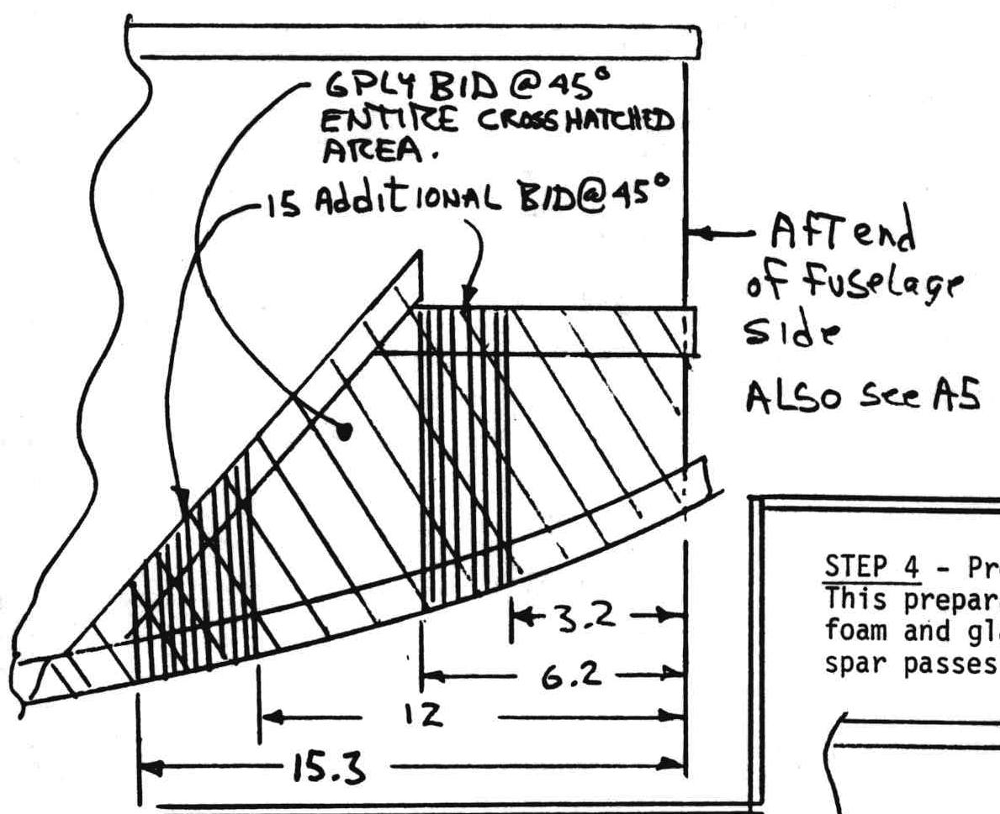Figure 5-11:Layup for aft fuselage sides 

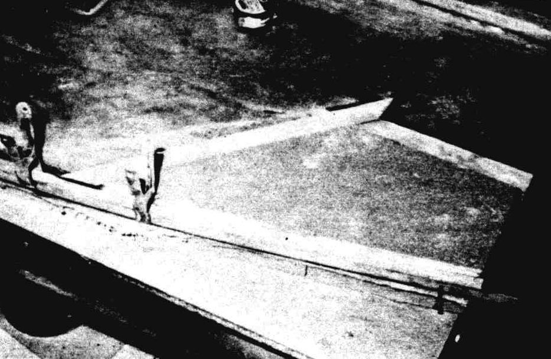Figure 5-12:Photo aft fuselage

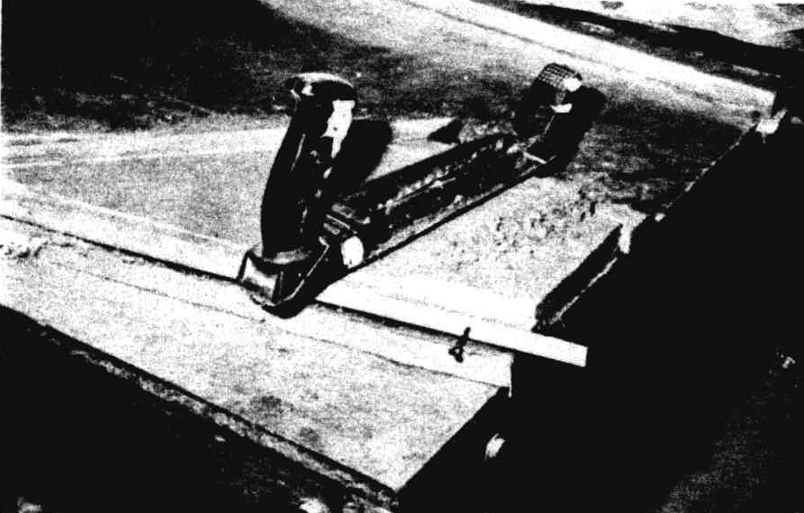Figure 5-13:Foam leveling

### <u>STEP 4 - Preparation for fuselage assembly</u>

This preparation takes about an hour. Remove the foam and glass from the area where the center section spar passes throught the fuselage sides.

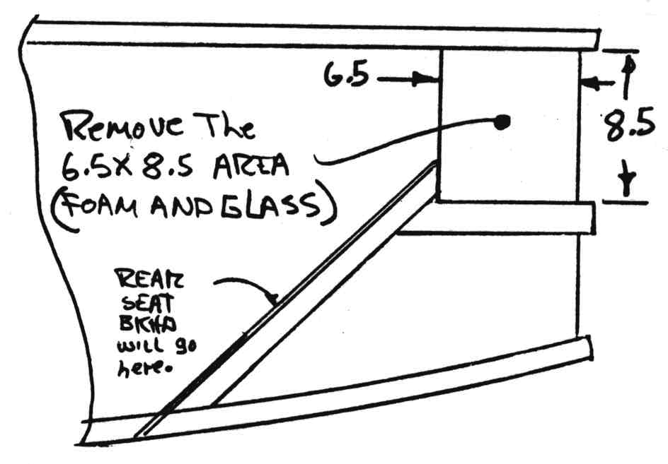Figure 5-14:Remove Center section spar thru hole 

Fabricate the 1/4" aluminum extrusions, referring to the page 9-12 ~~drawings~~ Figure 9-23 and to A5. Be sure to make one left and one right set. Fabricate, or purchase from a distributor, the LMGA assembly. This is two LMGAB bushings pressed into a 6.75" length of 5/8 x 0.049 4130 tube. Using the AN6-80A bolt, assemble the sets of 2 extrusions and LMGA tube as shown – this holds the extrusions in the exact relationship relative to each other.

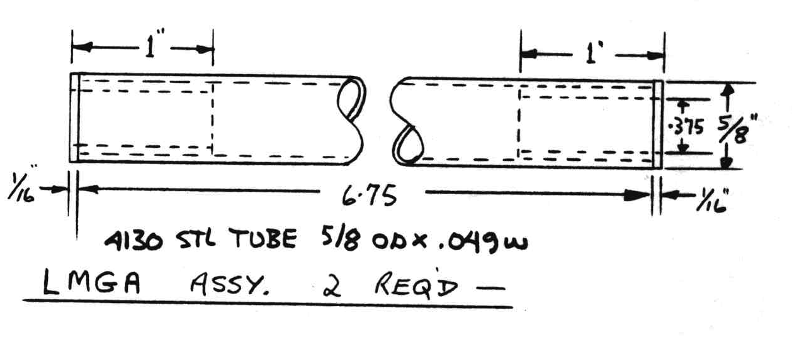Figure 5-15: Landing Main Gear Assembly (LMGA) Dimensions

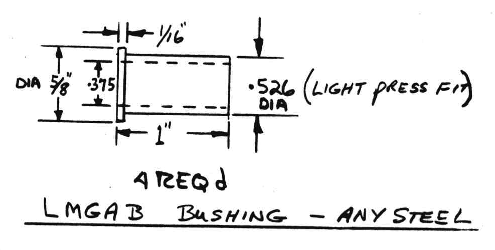Figure 5-16: LMGA Bushing dimensions 

Referring to drawing A5, position the assembly on the fuselage side and drill through the sides at the eight locations (per side) with a 1/4" drill. Coat the extrusion faces with wet flox to bond. Install the 16 each AN4-16A bolts, AN960-416 washers, and MS21042-4 nuts to permanently mount the 4 extrusions (see A5).

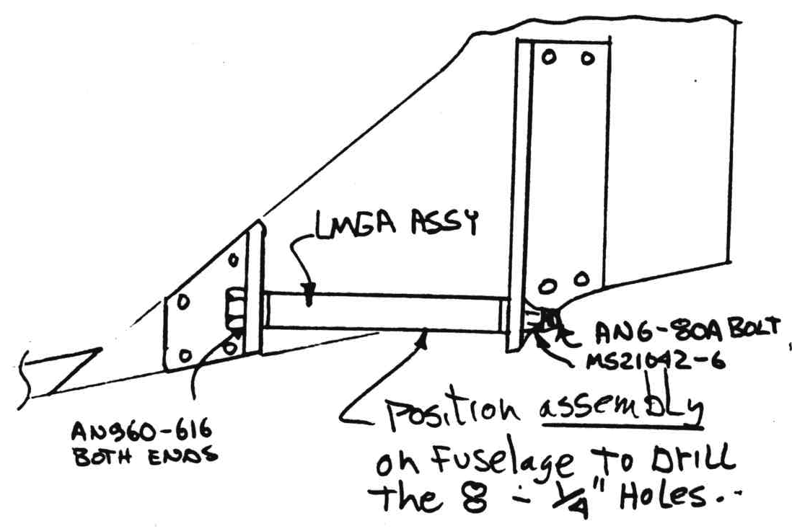Figure 5-17: LMGA assembly on fuselage
