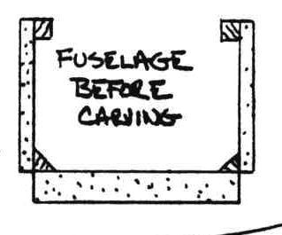

# CHAPTER 7 

## FUSELAGE EXTERIOR

**OVERVIEW**: In this chapter you will carve the fuselage exterior to shape, rounding the sharp corners for an esthetically pleasing airplane and preparing the fuel tank area. The outside foam surface then receives its two-ply glass skin. Up to this time your fuselage was a fra­gile, flexible, weak, square box. After it gets glassed, it will then be an extreme­ly stiff, strong composite sandwich struc­ture. 

### STEP 1 - CONTOURING THE FOAM

Believe it or not, this step should only take one to 3 hours. This is where the ease of rigid foam carving really pays off, Your fuselage cross section, before carving, looks like this.

When you've finished carving, it will look like this.

To do this contouring smoothly, you will need a long sanding block (30" is about right), your butter knife (good and sharp), and a soft sanding block. A block of flexible foam with 36 grit is an excellent carving tool for the finish smoothing. Rough cut the corners with your butcher knife. Finish the rounding with your sanding block. Use the sanding block with the long side parallel with the longerons, and sand gradually along the full length, rather than finishing one area at a time. Gradually working the full length, will result in a smoooth, even fuselage. Leave the corner countour high at the lower aft end where the gear extrusion attach bolts would otherwise be ground off.

The next job is to cut out and contour the area in the forward top of the fuse­lage where the canard and elevator tubes pass through. This is done by cuting out the full-size pattern shown, locating it inside your fuselage sude and using a coping saw, saw out the entire corner shown. This includes removing the longeron forward of F28 and removing the tab of F22 that sticks up about W.L. 18.9. Refer to chapter 12 (canard installation) for additional clarification. Now, contour the top longeron and foam side behind the canard cutout as shown in the sketches. 

Refer to the sketch and mark the outline of the fuel sight gauge on both sides of the fuselage. Sand the foam away from the fuel gauge as shown. Remove the 2 1/2" width of grey tape installed back on page 5-2. Do not contanimate this area. It must be **clean** to allow good fuel level visability.

Micro some foam chips into the holes around the bolt heads at the landing gear and engine mount extrusions. Round the edges of the plywood firewall {1/8" radius) so the skin can lap onto its aft face. Trim away 1/2" of the FiberFrax on the areas where the skin will lap onto the aft face (6.5 inch area on sides only). 

Do **not** carve the landing brake depression now - it's best to do this later, (chapter 17) to allow more accurate contour and easier fuselage skinning. 

Refer to the adjacent sketch showing a small wood insert in the lower corner of the fuselage. Remove the bottom foam and micro this insert in place. This provides additional strength needed to support the external step ( see chapter 8, step 6). **Left side only**.

### STEP 2 - GLASSING THE OUTSIDE SKIN

This step should take about 4 hours with two people, not counting cure. The foam surface should be smooth and even. Micro slurry is **not** used on this foam. The presence of many tiny air flecks on the foam surface is normal - see chapter 3. There must be **no** air present on the fuel sight gauge area.

The skin layup schedule is two plies UND, crossing at 30° to the longerons. A third ply of UND is added forward of the front seat bulkhead **only**. This third ply has a fiber orientation **parallel** to the longerons. Also, a 3 inch wide, 52" long strip of 3 plies UND is added to stiffen the upper longerons. This strip should be tapered to minimize the bump at the ends, i.e., 1st ply 52" long, 2nd 50", and 3rd 48". 

As shown in the sketches, the skin extends from the inside top corner of the longerons and around the fuselage. It laps onto the firewall `/2" along the 6.5 inch area that matches the side foam. It is knife trimmed flush at the bottom foam block aft end, near the bottom of the aft seat bulkhead. It is knife trimmed flush at the F22 bulkhead forward edges, the canard cutout, the nose wheel-well, and the spar cutout. Lap the skin onto the lower longerons at the lower aft edges. 

It is not convienient to glass all around at one layup, since the glass will fall off as the fuselage is turned. Thus, you should jig the fuselage in a 45° left bank to glass the right side. After this cures 2-3 hours, you can then roll it to a 45° right bank to glass the left side. Overlap the layup 2" at the bottom centerline. The third ply is butted, **not** overlapped.

The 2-3 hour tacking period should assure the glass will not peel off. A close sissor-trim at the bulkheads and longerons will also prevent the glass from peeling.

Boards clamped to the upper firewall to a saw horse as shown can support the fuselage for skinning.

Peel-ply the area where the wing strake will bond (Chapter 21), a 2" strip around the spar cutout and a 1" strip at the firewall and F22 bulkhead. You now have bare foam **only** at the aft edge of the bottom block, the wheel well sides, and around the canard cutouts. Leave these bare now. After cure, you can sit in the cockpits, however, fit and comfort is **not** representative until the side consoles, thigh support (floor in front behind instrument panel), nose section and cushions are installed. Support the fuselage on a large foam block, not a sharp saw horse, to avoid skin damage. 
