# CHAPTER 8

## ROLL-OVER STRUCTURE & SEAT BELTS

**OVERVIEW** - In this chapter you will fabricate and install map case/headrest/roll-over structure which mounts on the forward seat back bulkhead. This structure is fabricated from medium density foam sheets which are glasses inside and out with local inserts and buildups for the shoulder harness mount points and the attachment of a cable that will later be installed to keep the canopy from opening too far. Large holes are then cut in the sides and back for access to the interior to be used as a map case. This chapter is a one-man job, involving approximately six hours work.

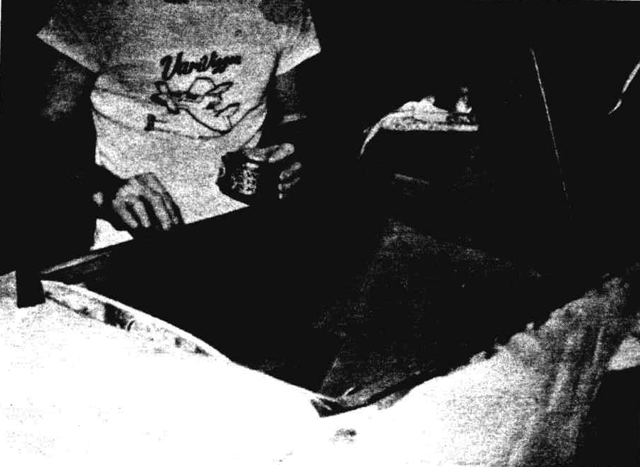Figure 8-1: Rollover structure

### STEP 1  - CARVING THE FOAM PIECES

Cut the foam pieces shown from 0.35" thick type R45 PV core foam (dark blue). See page 2-3. Trial fit these pieces together (use nails) on the seat back. Chamfer the edges and trim as required to mate as shown.

Figure 8-2: Front seat front Triangle

Figure 8-2: Triangle side foam 

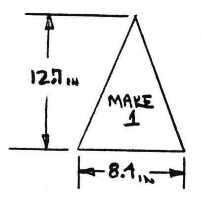Figure 8-3: Rollover triangle

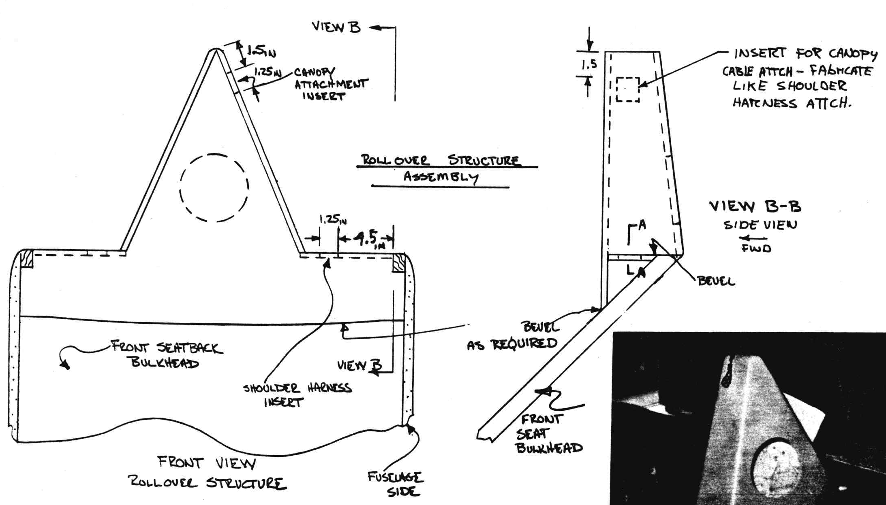Figure 8-4: Rollover Assembly

### STEP 2  - LOCATING THE SHOULDER HARNESS AND CANOPY ATTACHMENT INSERTS AND GIASSING THE INSIDE SURFACES FOR WET ASSEMBLY

Disassemble the foam roll over box pieces, cut the three plywood inserts shown, and locate them as shown flush with the inside foam surfaces.

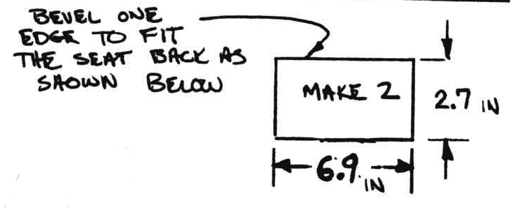Figure 8-5: Plywood insert for shoulder harness and canopy attachment

Lay up one ply BID over all the **inside** foam surfaces. Let this layup cure to knife trim, trim the  foam pieces, mix wet micro and reassemble the roll-over box on the fuselage with nails holding it in place. Use micro on all joining surfaces. Be sure to sand the cured glass surfaces of the seat back and fuselage sides before bonding. Clean off excess micro and cure.

### STEP 3 - GLASSING THE OUTSIDE OF THE ROLL-OVER STRUCTURE

Sand a radius on the roll over peak and round all corners for glassing. Contour the foam around the inserts as shown. Sand the seat back and fuselage sides dull where the roll over structure glass laps over cured glass surfaces. Lay up the local buildups over the in­serts. The 12 plies locally provide the required bearing strength for the harness and canopy stop bolts. Lay up two plies BID over all of the outside surfaces. These plies should overlap the adjoining seat and fuselage skins one inch. Lay up three additional plies over the peak and two additional over the shoulder harness pads as shown.

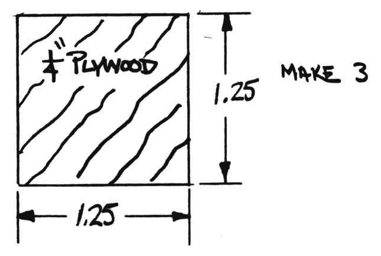Figure 8-6: Plywood insert sizes

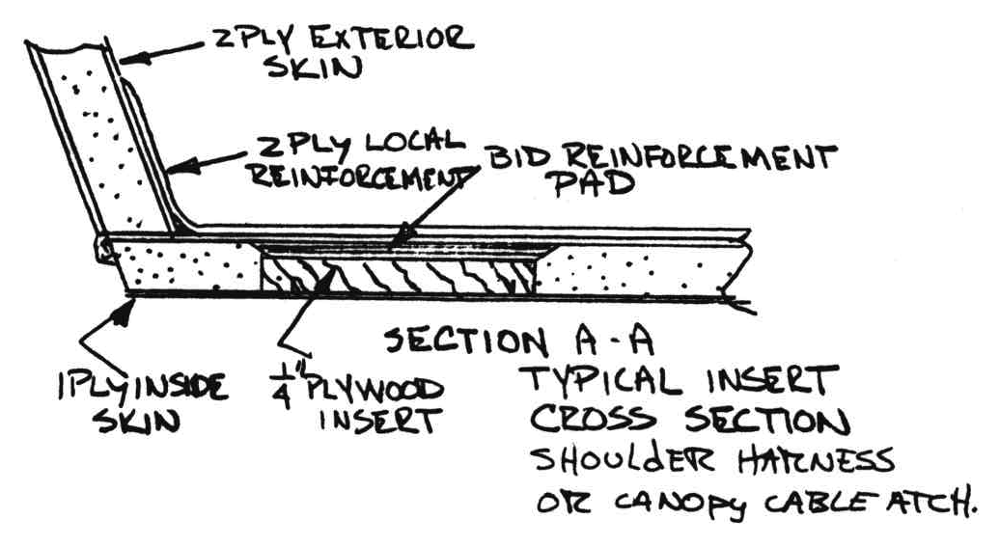Figure 8-7: Placement of plywood inserts

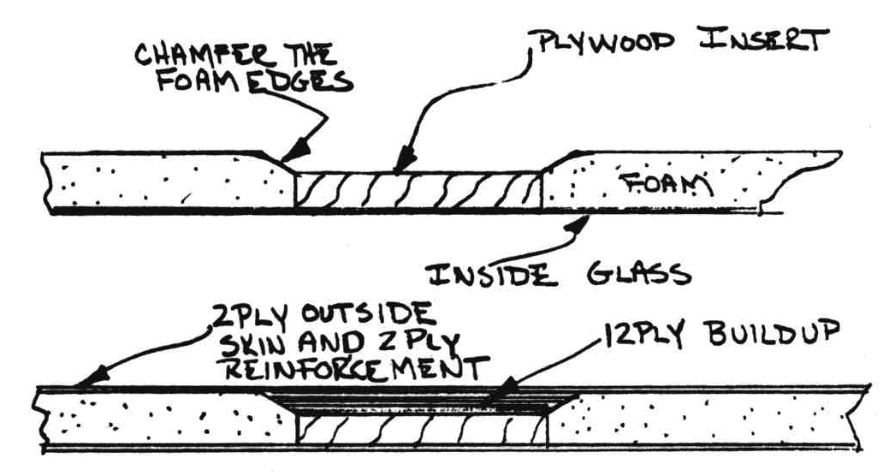Figure 8-8: Seat belt attachment point reinforcement

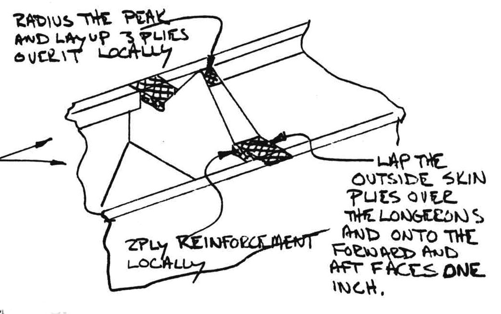Figure 8-9: Reinforcement glass for rollover

### STEP 4 - CUTTING THE ACCESS HOLES

The access holes shown, can be cut after step 3 has cured. They allow the roll­over structure to be used as a handy map case. Sectional maps inserted in the side slot are easily reached by the pilot.

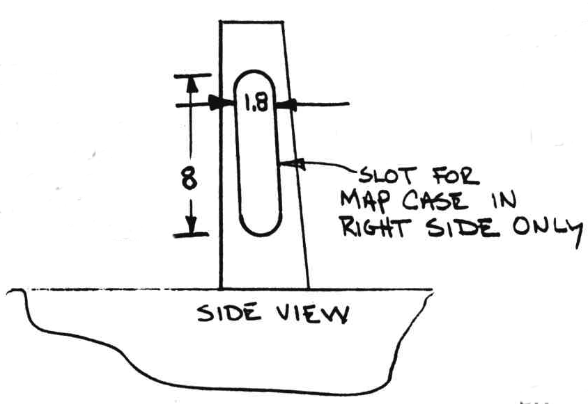Figure 8-10: Map storage access holes

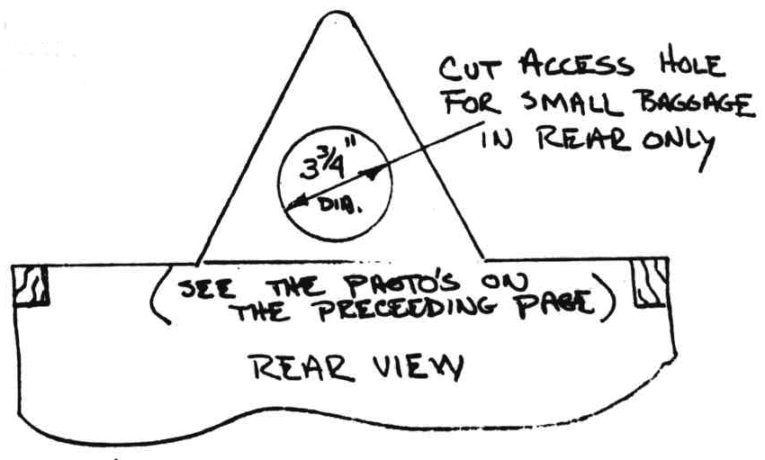Figure 8-11: Small luggage access hole

### STEP 5 - INSTALLING THE SHOULDER HARNESS ATTACHMENTS

The seat belt/shoulder harness assembly made to fit your Long-EZ and complete with adjustments, is available from the distributors.

Drill a 1/4" hole through the center of the inserts in the roll-over structure and attach the front seat shoulder harness using the hardware shown.

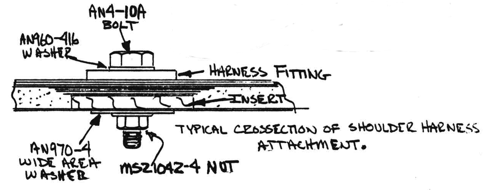Figure 8-12: Shoulder harnes mounting bolt

Refer to chapter 14. Bolt the aft shoulder harness to the tabs provided on the center section spar (use the AN4-6A bolt).

### STEP 6 -Installing the seat belt attachnents and external step

Refer to the 2-view shown of the seat belt attachnents. These are installed in four places (each side of both cockpits). 

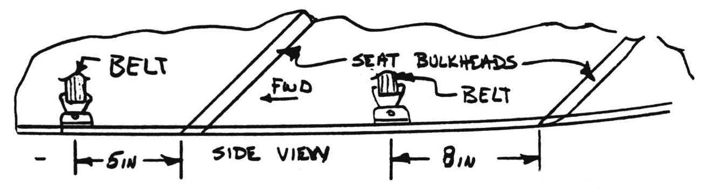Figure 8-13: Seat belt attachment location

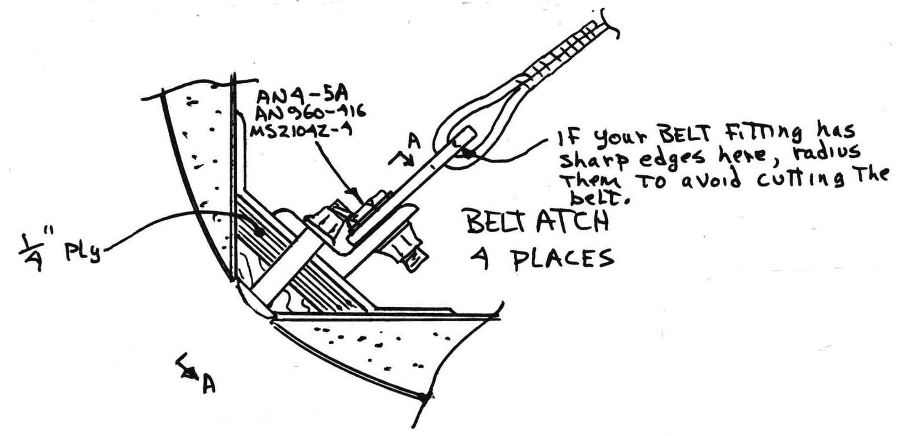Figure 8-14: Seat belt attachment callouts

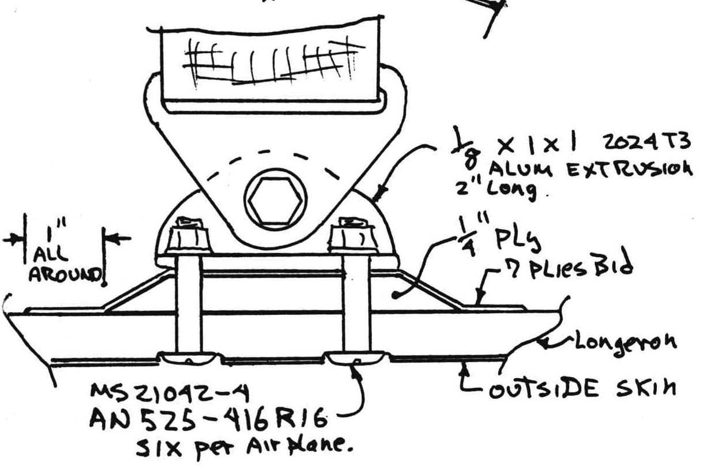
Figure 8-15: Seat belt attachment

The plywood insert does **not** have to be carved accurately to fit. Just rough it out to approximate shape, install with sufficient wet flox to fill voids. and immediately layup the 7 plies of BID. After cure, hold the extrusion angles in place and drill through with 1/4" bit. Use a counter bore or your dremmel to flush the screw heads and install the AN525 bolts and angles wet with flox.

Do not counter bore the left forward position. These bolts are used to attach the fixed step to allow short and medium pilots to enter the cockpit with the nose gear extended. A retractable step is not worth the trouble, since the aerodynamic drag of this step, when rounded as shown, slows the airplane by only 0.2 knots!

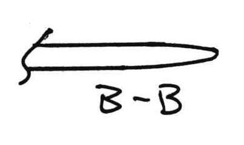Figure 8-16: Step outer edge rounded

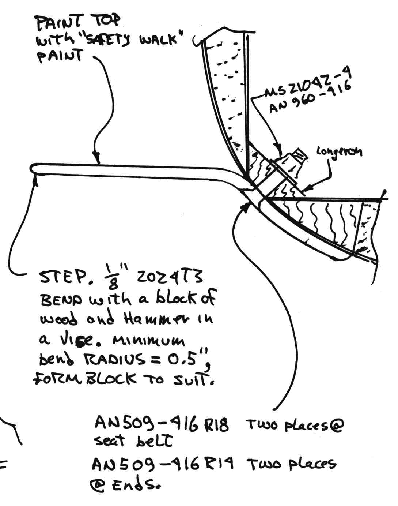Figure 8-17: Step mounting 

Fabricate the 1/8" x 4.5 x 4.5 2024T3 aluminum step. Mount with the four fasteners shown (two go through the seat belt attach).

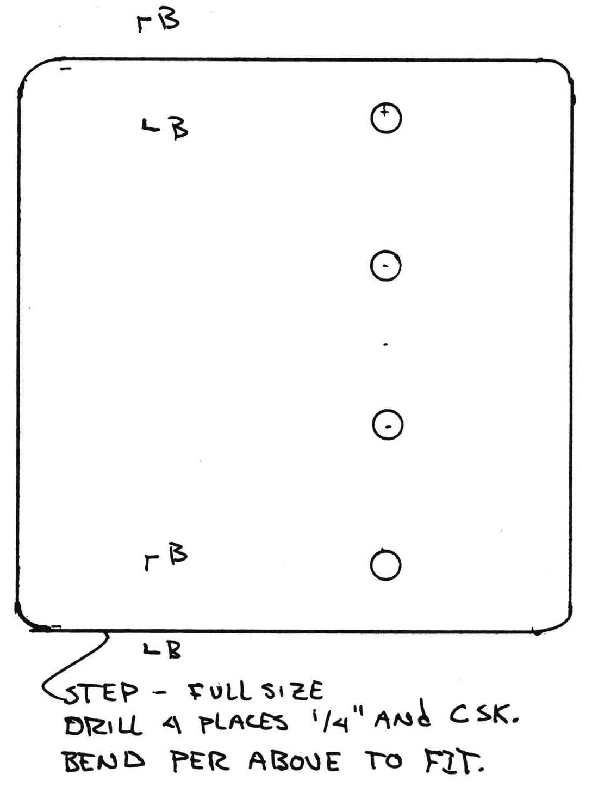Figure 8-18: Aluminum step place dimensions (**not to scale**)

You will now probably want to remove the AN4 bolts so you can remove the harness assembly to store it in a clean place, until after the cockpit has been painted.
