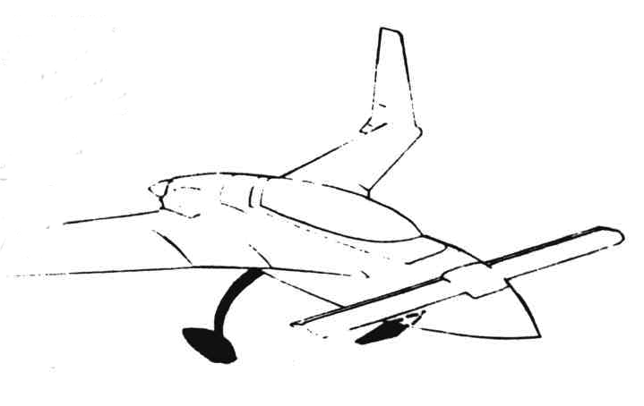
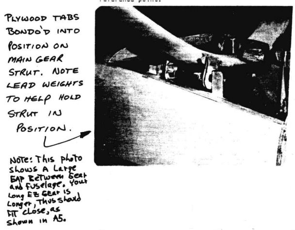
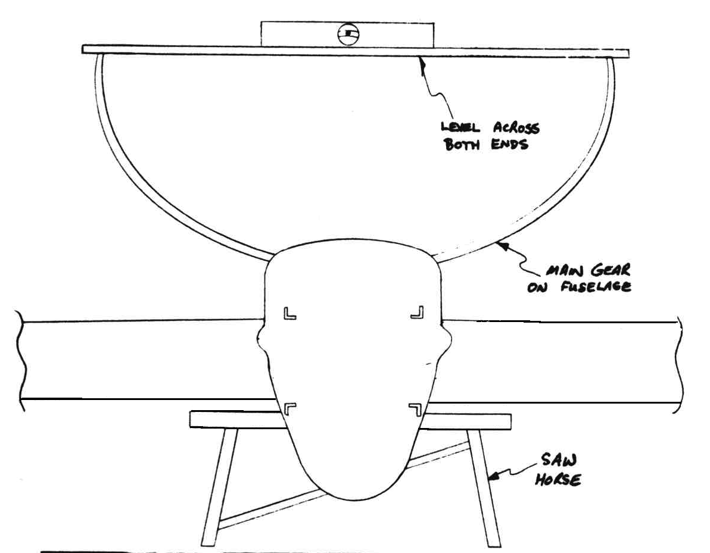
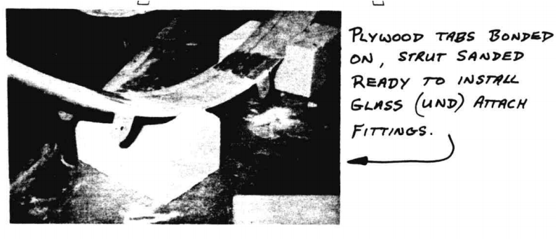

# CHAPTER 9

## MAIN LANDING GEAR AND LANDING BRAKE

Figure 9-1: Context

**OVERVIEW** -  In this chapter you will mate the main landing gear to the fuselage and to the wheels/brakes/axles.
You will sand the entire gear dull, and layup 8 plies of UND at 40º over the strut for torsional stiffness.
You will trim the molded gear legs to fit your axle/brake assembly, jig the gear strut into position on the fuselage, make the attachment glass tab layups and assemble the gear onto the fuselage.
With the gear installed, the axles are mounted, drilled in, and installed.
Brake lines are installed and routed through the baggage compartment and firewall.
The main gear strut is a one piece, airfoil shaped "S" glass molded part, available through a VariEze distributor.
__Caution: Do not use a VariEze gear (16 lb).__
A Long-EZ gear weighs 22 lb.
The gear and its structure have been sucessfully drop tested to the stringent requirements of FAR part 23 for certified aircraft.
The Cleveland 500 x 5 wheel and brake assembly and axles are available from VariEze distributors.
The 4130N steel tubes and machined steel plugs are also available through a VariEze distributor.

### TORTIONAL STIFFNESS LAYUP

This step should take 3 hours.
Using brand new 36 or 40 grit sand paper, thoroughly sand the gear strut until the **entire surface is dull**.
Drive 3 nails into the top of your work bench so that the gear strut can sit on the heads of the nails.
Rough the heads of the nails with a coarse file, and glue the gear strut, trail­ edge up, to the nail heads with a dab of five minute epoxy mixed with a little flox.

Figure 9-2: Fixture to glass main gear

This will hold the gear in position in order to make the layup.
After the five minute epoxy is thoroughly cured, you will make a layup using UND strips, cut 9" wide and 30º to the selvage edge.
You will need 16 strips (see sketch).

Figure 9-3: UND Reinforces main gear

Now paint a coat of pure epoxy (Safe-T-Poxy or RAEF) all over the strut and layup the first ply of UND so that the major fibers cross the face of the strut at approximately 30 to 40º on each face.
It should take 2 "strips" of UND to layup one ply from tip to tip.
Do not lap the UND, but rather butt them together at the center.
Up to 1/4" gap between each piece is acceptable and far better than an over lap joint.
The second ply is layed up with the major fibers **crossing** the first ply of UND opposite angle).
Thus, you will have a cross hatched effect (see sketch).

Figure 9-4: Main gear layup

Similarly the third and forth plies of UND are layed up, giving you a torsionally very stiff 4 ply layup.
In all cases the major fibers must be straight without wrinkles.
Allow this layup to cure completely.
A sharp blow will crack the gear strut free from the nail heads.
Now you must trim the excess glass.
Use a hard block and 36 grit, sand the edges of the layup to a good transition to the molded "S" glass.
Now the strut is mounted on the 3 nail heads again, this time **leading edge up**, and 4 plys of UND, crossing each other, are layed up, exactly as you did the first 4 plies.
After this layup cures, remove the strut from the nail heads, trim the excess glass, and sand it smooth.
Do not cut into the previous layup.

Figure 9-5: cross view of main gear layup

Now you must trim the leading edges at the axles to clear the brake calipers (see sketch) and accomodate the wheel/brake/axle assembly.

 Figure 9-6: Mount brake caliper

### LANDING BRAKE

Refer to Section VI (Landing brake) install this system now.
Note that the rudder conduit will later fit outside LB 17 rather than as shown in Section VI.
Refer to Chapter 24 for the required left arm rest installation.

Due to different armrest dimensions, substitute an AN-26A bolt for the AN4-22A bolt and use two LB16 spacers.

Also, the Long-EZ brake is slightly larger. Increase the 16xl6 dimension to 17.5 x 17.5.

### POSITIONING THE MAIN GEAR ON THE FUSELAGE

This step will take about 2 hours and an assistant is desirable.
Cut four 1/4" thick jigging blocks (shown full size Figure 9-7 ~~1~~) from 1/4" plywood.

 Figure 9-7: Plywood Tab

Bevel the blocks as shown (Figure 9-8 ~~2~~) 0.8" to a sharp edge. Drill 5/8" diameter holes through all 4 pieces to fit nicely on the steel tube. Slip 2 jigging blocks on each tube, bevels to the outside, and bolt the tubes into place between the aluminum angles on the fuselage.

 Figure 9-8: Plywood tabs on fuselage

Turn your fuselage upside down on a pair of saw horses.
Level the fuselage longitudinally and laterally (pitch and roll) using the top longerons as a reference (Figure ~~1A~~ 9-9).

Place the main gear leg in position on the four jigging blocks.
You may need small foam wedges to space the gear leg up off the steel tube.

Make certain that the center line of the gear leg is in line with the fuselage center line. Double check by levelling accross the ends of the gear legs.

Don't be concerned if the tabs do not set exactly flat on the gear leading and trailing edges. Just do the best you can to match them up as shown in ~~figure 2~~ Figure 9-9.

Use the aft face of the center section spar as a vertical reference at B.L. 26.75 and F.S. 125.5 (refer to chapter 8) for setting the fore and aft position of the gear leg.
This is done by holding a straight edge vertical against the back face of the center section spar and moving the gear leg until the axle center line is 15" forward of the straight edge (see ~~sketch 1A~~Figure 9-9).

 Figure 9-9:Align main gear

Do this on both sides, shimming the gear leg into position as required.
At this point check that the plywood jigging blocks are centered up on the steel tube.
You should have 0.65 approximately of steel tube showing on each side of the plywood blocks (see ~~figure 2~~Figure 9-8).
Now trowel a generous blob of Bondo between the plywood and gear leg.
This must be capable of supporting the plywood blocks while you layup the outer glass tabs (~~figure 3~~Figure 9-10).
Also, Bondo the steel tube to the plywood block, just a tiny dab will do (~~figure 2~~Figure 9-8).

 Figure 9-10: Glass tab layup

After the Bondo has cured, carefully remove the AN6-80A through bolt and lift the gear leg off the fuselage.
Set it down on its axle ends and support it well.
Now Bondo a small wood reference pointer (~~figure 2 & 3~~Figure 9-8) to the gear leg under each steel tube.
When this is cured, scribe a mark on each steel tube to coincide with the reference point (~~figure 2~~Figure 9-8).
This will enable you to replace the steel tubes in exactly the same position.
Now carefully scrape the small Bonda dabs off the steel tubes, and withdraw the tubes from the plywood jigging blocks.
Be sure not to displace the jigging blocks or the reference point.

Figure 9-11: Main gear tab on fuselage

Now turn the gear leg upside down and support it well on two foam blocks, 3 feet apart.

Thoroughly sand the main gear leg using 36 grit where the glass tabs will go, and sand (hard block) a <u>good smooth transition</u> from the plywood jigging blocks to the glass gear leg.
Now stick grey (duct or furnace) tape on the plywood jigging block for a good release. You are now ready to layup the glass tabs.

Figure 9-12: Main gear on airframe

Plywood tabs bonded on, strut sanded ready to install glass (UND) attach fittings.

Figure 9-10: Main gear jig

### GEAR ATTACHENT FITTING LAYUP

This step should take about 2 hours.
Cut 72 plies of UND 2 1/2" x 12", cut 72 plies of BID 2 1/2" x 2 1/2", and cut 72 plies of BID 2 1/2" x 3 1/2" (see ~~figure 4A~~ Figure 9-10).

Figure 9-10: UND and BID for Glass Tabs

Using Safe-T-Poxy (or RAEF) wet out 18 plies of UND 2 1/2" x 12" on a piece of paper (not wax paper) as shown in the photo to make a thick UND glass pad.

Figure 9-11:Tab glass preparation

__Wet out 18 plys UND on a piece of paper.__

Squeege out excess and check for dryness.
Then paint a coat of epoxy over the gear leg and fore and aft plywood blocks.
Now peel the wet 18 plies of UND off the paper and lay it across the gear and down the grey tape face of each jigging block, as shown in the photos.

Figure 9-12: Glass the tabs to the main gear

Drape wet UND glass pad over the gear strut and down the face of the plywood tabs.

This should overlap the plywood pieces all around.
Squeege out excess epoxy. Now, layup 18 plies of BID 2 1/2" x 3 1/2" on a piece of paper, peel the wet layup off the paper and place it on the aft face of the plywood block over the 18 plies of UND and lapped up over the trailing edge of the gear (Figure ~~3~~09-13).

Now make a similar 18 ply BID layup using 2 1/2" x 3 1/2" and place it on the face of the leading edge plywood block over the 18 plies of UND and lapping up over the leading edge (~~figure 3~~ Figure 9-12)

 Figure 9-13: Glass layup path.

With the UND wrap and BID pads in place, cover with Saran wrap.
Using 2 1/2" x 2 1/2" square blocks of 1/4" plywood, on either side of the jigging block, and a small 'c' clamp, to hold everything securely in place until cured (see Figure 9-14 ~~figure 4b~~).
The siran wrap keeps the plywood blocks from bonding to the glass tabs.
The clamp should be snugged down to keep the blocks firmly in place, but **not** tightened hard.

 Figure 9-14: Clamp the tabs to main gear

Allow the layup to cure fully, then remove the clamps and clamping blocks and trim the glass tab down to **flush with the plywood jigging blocks** (2" wide) with your coping saw.
The layup is much too thick to knife trim.
Use your dremel to smooth out any rough edges.

At this point your tabs should look exactly like ~~Figure 3~~ Figure 9-15.

Figure 9-15: Main gear tab layup

Using a 3/8" drill bit, drill a hole as nearly in the center of the 5/8" diameter hole in the jigging block as possible.
This is a clearance hole and not critical.
Now using your 5/8" diameter spot face chuck the 5/16" dia. x 10" long steel tube into your drill, insert it from the rear through the aft tab (3/8" dia. hole), then screw the 5/8" diameter spot face tool onto the end of the 5/16 diameter tube, and locate the spot face in the 5/8" diameter hole in the plywood jig block on the forward tab, start the drill and carefully bore a 5/8" diameter hole through the 18 plies of UND and the 18 plies of BID (see ~~figure 3~~ Figure 9-13).

Drill slow to avoid heat.
Now take the tool apart and repeat the procedure for the aft tab.

When you have 5/8" diameter holes bored through both sets of gear attach tabs, you can carefully chisel the Bondo blobs from between the plywood jig blocks and the gear leg, and the jig blocks should then be easy to remove due to the grey tape release.

Now, **before going any further**, reinsert the 5/8" diameter steel tubes through the glass tabs so that the scribed mark lines up with the reference point (~~figure 2~~Figure 9-8).
You do still have the reference point Bondo'd on, don't you?
With the marks aligned, scribe a mark on the steel tube, flush with the outside of each glass tab.
Then knock off the reference pointer and sand the strut and inside the tabs dull with 36 grit.
Trowel a small amount of flox into the corner between the glass tab and the gear strut (see ~~figure 4~~ Figure 9-10).
Make a generous radius in the flox and using the same methods, layup 18 plies of UND from tab to tab, carefully stippling the UND down into the corners fore and aft (~~figures 4 & 5~~ Figure 9-13) against the flox.
Now, same as before, layup 18 plies of BID pad 2 1/2" x 2 1/2" and lay the pads onto the glass tabs per ~~figure 4 & 5~~ Figure 9-16.

 Figure 9-16: Glass the inside of gear leg

Now use the same 2" x 2" blocks of 1/4" plywood and with saran wrap (or grey tape) for a release clamp the tabs with moderate pressure until fully cured.

After curing, trim the inside tabs layup down flush with the outside tabs (2" wide) and use your 5/8" dia spot face tool on the end of the 10" extension to bore the 5/8" hole all the way through both tabs.

Drill about 10 #30 holes in each 5/8" diameter tube (see ~~figure 7~~ Figure 9-17) betwen the glass tabs.

 Figure 9-17: Prepare Steel tube for BID glass overlay

These holes will allow the 2 ply BID wrap (see ~~figure 5~~ Figure 9-18) to mechanically bond to the steel tubes.

 Figure 9-18: Bond steel tubes to leg

Using wet flox, slide the tubes into the tabs and align the scribe marks previously checked.

Get a scrap of urethane foam and carve it to fit under the steel tube and a reasonable fit on the top of the gear leg (see sketch).
Now layup 2 plies of BID at 45º wrapping around the 5/8" steel tubes, over the small carved piece of urethane foam and down onto the gear leg.
Make sure it also laps onto the inside face of each glass tab.

Flox an AN960-1018 steel washer onto the outside faces of each glass tab (see ~~figure 5~~ Figure 9-18) and layup 2 plies of BID over the washers and lapping onto the glass tabs. Cure, then trim. Press the machined steel plugs (~~figure 6~~ Figure 9-19) into the ends of each steel tube.

 Figure 9-19: LMGAB

Your gear attachment fittings are now complete.

### INSTALLING THE AXLES, BRAKES AND BRAKE LINES

This step should take about 3 hours.
Cut two squares of 0.063" 2024T3 aluminum plate, 2 1/2" x 2 1/2".

Be sure the flats on the ends of the gear leg are not toed out.
A small amount of toe-in is desired (0°-1/2º).
A hard sanding block can be used to adjust the toe-in.
Refer to figure 8A.
Slip the Cleveland brake torque plate on the axle as shown – it must fit flush on the axle flange.
Slip the brake caliper on the torque plate, then, using this assembly as a pattern, use a coping saw and file to carve the leading edge of the gear strut to fit (with 1/16" clearance) as shown in ~~figure 8~~ Figure 9-6.
Also, trim the 0.063 aluminum plates to avoid interference with the caliper.
Note that the caliper will move 0.1" as the brakes wear – be sure to allow for this with clearance.

Lay up 3 plies of BID on the inside and outside faces of the lower gear leg, where the axles mount.
While this layup is still wet, clamp the square plates (inside) and the axles (outside) onto the gear legs (~~fig 9~~ Figure 9-20).

 Figure 9-20:Mount axel to main gear

Now, using a 2 ft. steel carpenter's square on each axle, (Figure 9-21), measure the distance between the tips A and the bases, B, of each square.

 Figure 9-21: Check Langing gear spread

Now B minus A should equal between 0.2" and 0.45" (1/4 to 1/2 degree toe-in) to get this dimension, adjust or reposition the clamps using the caliper, check positioning.
Recheck the meaurements A and B and allow to cure.
After cure, use your-long 1/4" drill and using the holes already drilled in the axle flanges as a pattern, drill through the gear leg and the 0.063 aluminum squares, and bolt the axles to the gear leg.
Four AN4-22A bolts, each axle.

Now install the wheels, tires, tubes and brake calipers and plumb the brake lines.
Cut two pieces of 3/16" O.D. x 0.025 wall high-pressure Nylaflow nylon tubing about 72" long.

 Figure 9-22: Install brake lines

Now install one end into the top of each brake caliper.
Use a short (1/2" long) piece of brass tubing such as the telescoping tubing found in hobby stores, inserted into the end of the Nylaflow tubing so that the fitting makes a better clamp on the nylon line, allowing higher pressure (figure 11).
The tube required is 1/8" dia. x 0.015" wall x 1/2" long.
You will need four of these, two on each brake caliper and two in each brake master cylinder.
Route the brake line tubing up the trailing edge of each gear leg to the glass attach tabs, then coil them up and tape them together to keep them out of your way.
You can position the brake lines along the trailing edge by using small pieces of grey tape about every 4"-6".
Now trowel dry micro onto the trailing edge to fair into the brake line between the grey tape strips.
After this cures, remove the grey tape, carefully sand the dry micro to a pleasing contour, do not sand the brake line at all, trowel a little dry micro into the gaps left by the tape, and layup one ply of BID at 45° so that it wraps around the trailing edge and brake line and laps onto the gear leg approx 1".
This layup extends from the glass attachment tabs to approximately 6" up from the axle centerline.
The brake line then curves gently forward between the brake disc and the face of the gear leg to the 90° # 269-P Nylaflow fitting.
To avoid heat damage the tubing must lay flat on the strut, away from the hot brake disc.

Now, drill a #10 hole through the firewall, see page A4 for correct location.
Route the brake lines through these holes, taking care to route left wheel to left master cylinder!
Hook up to master cylinders as described above for the brake calipers.
Pot the nylon brake lines as they go through the firewall with RTV (Silicone rubber).
Flip your airplane right side up on its own feet.

Figure 9-23: Main landing gear brackets

**Note: Main landing gear brackets are installed during chapter 5.**
