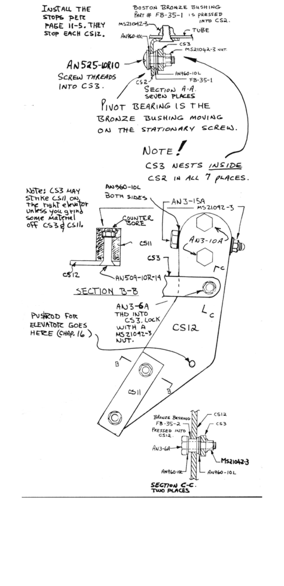
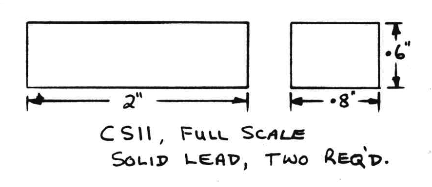
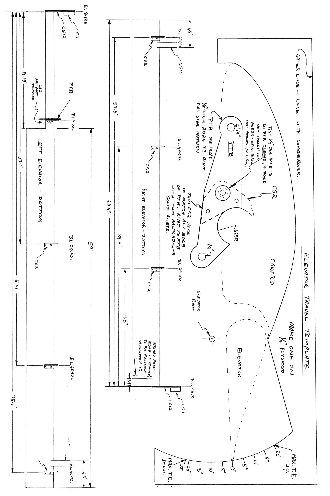

# CHAPTER 11 

## ELEVATORS 

**Overview** - In this chapter you will manufacture and mount your primary pitch control surfaces.
The elevator is a simple, hinged, slotted flap that attaches to the canard.
The elevators move up and down together as the control stick is moved fore and aft. 
To build the elevators, you will hot wire the foam cores, bond them to long aluminum tubes and glass over both surfaces.
You will then install the hinge brackets, the actuator arms and the mass balance weights.

 Figure 11-1 Elevator assembly steps

You will also assemble the elevators to the canard.

The following parts are available from a Long-EZ distributor:

| Name| Description | Quantity|
| --- | --- | --- |
| CS2 | Brackets with bushing | 7 |
| CS3 | Brackets | 9 | 
| CS9 | Plugs | 2 |
| CS10 | Lead weights | 2 | 
| CS11 | Lead weights | 2 |
| CS12 | Belcranks with bushing | 2 |
| PTB | Belcrank | 1 |

### STEP 1
This step should take about 2 hours and you will need some one to help with the hotwire.
The rest you can do alone. 
cut the hotwire templates shown on page A2.

Now find the foam cores left over from chapter 10 (see page 10-1).

 Figure 11-2 Setup for elevator templates

These pieces are approximately 1.9 x 4.7 x 64".
Your elevators will be about 59" long when they are complete (you will trim to fit your airplane).
So cut the 64" long foam lock down to 59" long, then cut this piece in half.
59" is too long of a piece to hot wire in one cut, particularly for such a small section as the elevator.
So you will now have four blocks of foam, two for each elevator.
Weight the foam blocks down onto your work table, nail the templates on as shown level to each
other, and hotwire each core out as follows: first: cut the tube notch, then the top of the elevator, then the bottom.

Now you need two pieces of aluminum tubing 1 1/4" O.D. x .035 wall 6061-T6, one piece 62" long and the other 30" long.
Check the tubing to assure that it is straight.
Bent or curved tubing is not acceptable.
Use MEK to clean all grease or oil off and sand lightly with 220 grit sandpaper.

 Figure 11-3 Elevator tube foam alignment

Lay Saran wrap on your work bench and clamp or weight the tube to hold its ends down.
Mix up some wet micro and apply an even coat to the foam cores where they will join the tube and each other.
Push the foam cores into position on the tubes and wipe off excess micro.
Weight the cores to be sure they sit flat on the table and allow to cure.

 Figure 11-4 Prep for glue

### STEP 2 - Installation of the top skin

It should take about 1 1/2 hours and you can do it alone.
Cut the following glass: 8 pieces of UND cut at 30° to the selvage edge 7" wide and 64" long.

Roll them up to avoid distortion, and save four of them for the bottom skins.

 Figure 11-5 Cut Glass

Apply a light coat of slurry to the foam cores and layup two crossing plies of UND as shown on each elevator upper surface.
Do not leave excess epoxy in this layup.
It is better to be almost too dry here.
Your elevators **must not** be over weight.
Scissor trim the leading edge so that the plies lap over the tube as shown.
Allow to cure and knife trim the trailing edge.

 Figure 11-6 Glass top of elevator

### STEP 3

This step should take about 2 hours and again you can do it alone.
Turn the cured elevators over and clamp the tubes to your table again.
Be sure that the tubes are straight - you may need to shim the tubes under the clamps to avoid bending the tubes.
Clean up any epoxy or glass ravels on the aluminum tubes with 100-grit sandpaper.
Taper the top skin edge as shown.
Remove foam from the trailing edge to expose the last 1/4" of glass for bonding the bottom skin to the top as shown.

 Figure 11-7 Layup bottom glass

Locate the 4 remaining plies of UND.
Like the top skin, the bottom is also 2 plies thick.
Apply a light coat of slurry to the foam core, and pure epoxy to the tube and area of top skin that the bottom skin will lap onto.
Fiber orientation is the same as the top skin.
Lap the bottom skin about 1/2" onto the top skin at the leading edge as shown.
This lap **must** be above the centerline so that the bump dosen't interfere with the CS2 hinge brackets.
The slight bump is faired smooth with peel ply or by sanding after it cures.
After both skin plies are wet out, wipe dry micro into the trailing edge as shown.
Allow to cure and knife trim the trailing edge and ends.

 Figure 11-8 Cut Glass

### STEP 4 - Installing the outboard mass balance weights

This should only take about one hour.
Refer to the scale drawing on page 11-6 for the final dimensions of each elevator.
Trim the tube flush with the outboard foam edge.
Trim the inboard end of the tube as required to the final length.
Locate the couterweight jig span­wise and glue it to the top elevator skin with a dab of Bondo.
Flip the elevator upside down and locate the CS10 lead weight and spacer in the jig.
The spacer is carved from a scrap of 1" thick 6lb/ft3 (light red) core foam.
See page A2.

 Figure 11-9 Counter weight jig

Bond the spacer (foam) and CS10 lead weight to the elevator skin with 5 minute epoxy.
When the 5 minute is cured, knock the jig block off and sand the top and bottom glass skin dull behind the mass balance.
Layup three strips of UND around the spacer weight and elevator as shown.
The sides of the mass balance are painted with epoxy.

 Figure 11-10 counter weight glass cut

 Figure 11-11 Install counter weight

### STEP 5 - Installation of belcranks and hinge brackets

Should take about two hours. 
With the elevators, bottom side up on your work bench, the CS2 hinge brackets and CS12 belcranks are installed.
Align the CS9 plug and CS12 belcrank and drill as shown.

 Figure 11-12 Prepare Belcrank and hinge brackets

Install AN3-10A bolts and MS21042-3 nuts.
Do **not** over­torque these bolts! (#10 bolts should not be torqued over 25 inch pounds).

With the upper elevator surface leveled on the table, insert the belcrank assembly into the tube and level the vertical level line as shown.
Drill the #12 hole through the tube and CS9 plug.
This hole is roughly parallel to the bottom surface of the elevator as shown.
Don't final install these bolts until the elevator CS2 hinge brackets have been installed.

 Figure 11-13 Install belcrank

Refer to page 11-6 for a full size pattern for PTB, the pitch trim arm (chapter 17).
It is available prefab.
Rivet it to a CS-2 as shown (use two AN470 AD4-5 rivets) then trim excess CS-2 at aft end.
Refer to page 11-1 top drawing for positioning, also page 11-6 inboard CS-2 of left elevator tube.
Be sure to do this **before** attaching this trimmed CS-2 to the left elevator tube.

Mark the position of the seven CS2 hinge brackets on the elevators as shown on page 11-6.
The hinge bracket is located fore and aft, by nesting the fitting against the tube radius with the fitting flat against the bottom skin.
Care should be taken to sand off any bumps or dicontinuities that may keep the CS2 bracket from fitting correctly.
With all the CS2 hinge brackets sitting on the elevator, sight through the bushings to assure that they line up within 1/16".
With the brackets located properly, drill the #30 holes (three).
One of these holes is into the bottom glass skin 
It serves only to locate the hinge bracket, not for strength.
Apply wet flox to the CS2 flange.
Position it over the previously-drilled holes and install the bracket with two pop rivets.
Wipe off any excess flox.

 Figure 11-14 Install CS2 hinge brackets

Drill the center hole out to #12 drill size and counter­sink it (100° countersink) for an AN509-10R7 flush screw.

Installing the MS21042-3 nuts on the flush screws requires a **long** 1/4" box end wrench.
This is easy to make using a cheap ignition wrench and a four-foot long stick or dowel of wood, as shown.
When the 5 minute cures you can bend the wrench so it is even with the edge. 

 Figure 11-15 Make 1/4" 4 ft long wrench

It will take two people to install the locknuts, one to maneuver the nut into position inside the tube with the long wrench, and one to install and tighten the screw.
After the lock nuts are installed on the hinge brackets, you can final-install the CS12 belcrank assembly.
Make a small foam plug for the outboard end of the elevator tube and 5 minute it in place.
Layup one ply of BID over the outboard end to seal and protect the foam and tube.
Leave the inboard end of the elevator bare foam until Chapter 12.

 Figure 11-16 Elevator end treatment

### STEP 6 - Mating the elevators to the canard

This should take about 4 hours.
You will be working with both elevators and the canard in this step.
Lay the canard bottom side up and mark its centerline (BL 0").
Mark the position of the outboard balance weights on the canard and cut a slot to accomodate it.
Cut the slot oversize for clearance (approx. 1").
Layup one ply of BID to protect the exposed foam.

 Figure 11-17 Cut canard for counterweight

Make four elevator jig blocks B from 1/4" plywood or 1 x 12 lumber (page A6).
Bondo one elevator to the jig blocks with the jig blocks spaced about 1/3 and 2/3 of the elevator span.
When the Bondo is hard, position the elevator and jig blocks on the canard as shown here and on page A6.

 Figure 11-18 Elevator mounting

Check to see that the canard trailing edge lip is at least 0.1" from the top of the elevator.
If not, shim the elevator up (down?).
Bondo the jig blocks to the canard to hold the elevator securely in place.

 Figure 11-19 Bondo Elevator to Jig

Bolt the CS3 hinge brackets to the CS2's and
mark the area where they strike the canard.
This should be approximately in the center of the canard's high density foam inserts.
Don't set your brackets off center more than ± 0.3 . Use a drill with a 1/4" bit and rout a slot 
in the canard's high density foam inslots along the marks.
**Don't** drill through the top skin, but do remove foam down to the top skin.
Unbolt the CS3's and drop them down in the slots for a trial fit.
They should bolt to the CS2's and butt down against the canard's top skin without being forced.

 Figure 11-20 Align Elevator to Canard

When everything fits feely, remove the CS3's, fill the slots with flox mixed up just thin enough that you can pour it into the slots, and reinstall the CS3's.
Wipe off excess flox and allow to cure at least 24 hours, without moving anything.

 Figure 11-21 Prep high density insert

 Figure 11-22 Install CS3

Knock the jig blocks off after the flox has cured. Check for freedom of movement and slot clearance. See **page 11-6** for elevator travel limits of 20° trailing edge up and 22° trailing edge down. Now remove the elevators and install The inboard balance weights (CS11). They bolt on the left side of the CS12 belcranks as shown.

 Figure 11-23 Install inboard balance weights

Now hang the elevators upside down by the pivot holes. Suspend them on fine wire, such as safety wire. They should hang 12° to 25° leading edge down, as shown. Recheck this later after painting. Your elevators should weigh close to 3.3 lb (right) and 3.6 lb (left).
Do not add more than 0.3 lb of lead to balance an over­weight elelvator.
If some extra lead is needed, add all of it to outboard mass balance.

 Photo 11-24: **Check elevator balance**

 Figure 11-25: **Check elevator balance**

 Figure 11-26: CS12 Assembly

 Figure 11-27: Check elevator movement

 Figure 11-28: CS12 - **NOT TO SCALE**

CS3's and CS12's are made from 1/8" thick 2023T3 aluminum. Use the full size pattern. Homebuilding the CS2's is not recommended since they must be formed from 0.063 2024-0, and then heat treated to T3. The pivot must be 0.1" forward of the tube centerline with elevator bottom level.

 Figure 11-29: CS10 Weight

 Figure 11-30: CS11 weight

 Figure 11-31: CS9 Plug dimensions

 Figure 11-32: Verify Elevator tolerances

 Figure 11-33: Elevator Travel Template
