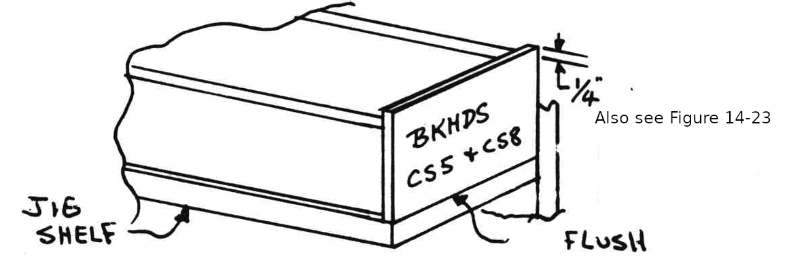
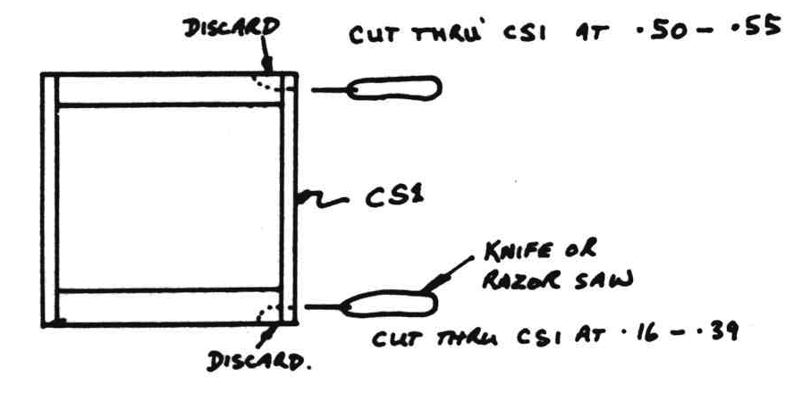
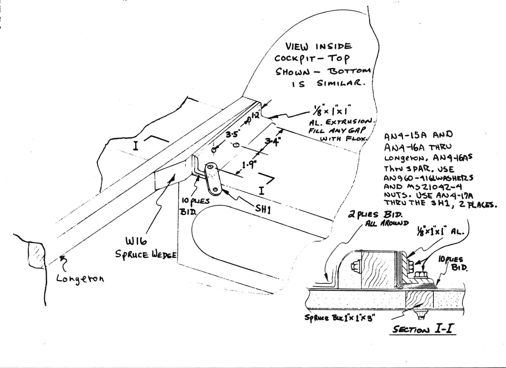
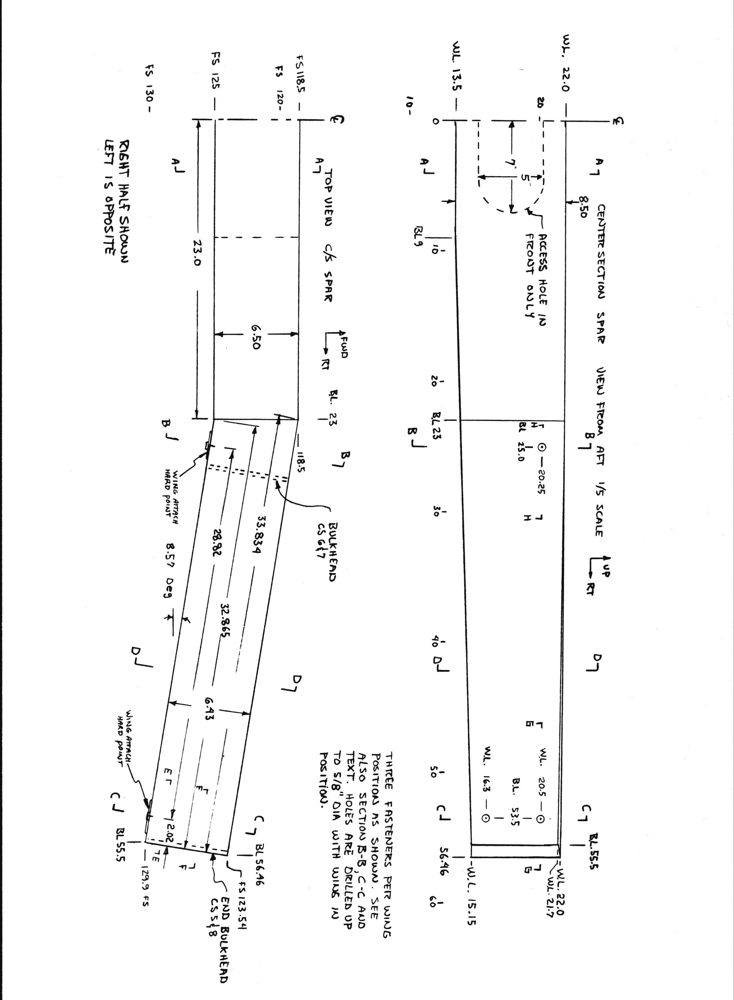
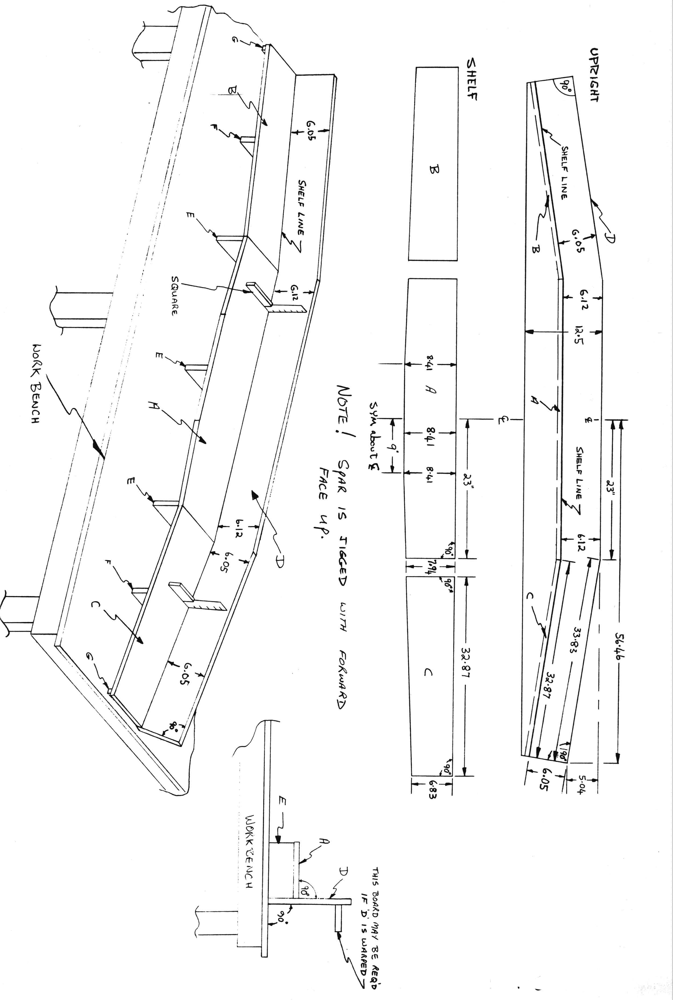

# CHAPTER 14

## CENTERSECTION SPAR

 Figure 14-1: Center section spar

**Overview** - In this chapter you will build the center box spar which joins the wings to the fuselage.
You first build an accurate jig, from particle-board then you assemble a box from 1/4" pvc foam and 1" urethane foam slab
It is glassed on the inside, and bulkheads are installed.
The center section box is removed from the jig, the outside is contoured and carved to accept the spar caps, metal inserts are installed at wing attach points, a Bi-directional glass shearweb is layed up, the uni-directional spar caps are layed up, then the external bi-directional shear web is layed up.
Additional metal and glass is installed at the wing attach areas, and an oval-shaped panel is removed for access to the· baggage area inside.

The center-section spar is the heart of your wing structure and in order to have a straight and true wing, follow all steps carefully and have patience.
Before going onto Step 1, study page 14-5 very closely until you really have a good understanding of what the centersection spar looks like.
Note that the top of the spar is flat: that it sweeps aft and that the bottom has positive dihedral in order that fuel will run inboard.
If in doubt about exactly how things fit together, study the fullsize section drawings (Section A-A, B-B,C-C,D-D, and E-E).

### STEP 1

In this step you will make the particle -board jig in which you will assemble your centersection spar.
Accuracy here is very important so don't rush!
Particle-board is available at your local lumber yard.
Bondo is handy to bond the pieces together, since it provides adequate strength and 5 minute cure.
You will cut a strip of 3/4" thick particle-board x 12 1/2" wide.
This needs to be 112.92" long.
You can join it in the center or anywhere you like.
Now carefully and as accurately as you can, layout the top view outline of the spar on this 12 1/2" x 112.92" strip of particle-board (part # D) as shown on page 14-6.
To do this determine the centerline, layout the 56.46 & 23" dimensions, measure down the 5.04 dimensions, mark a point and draw the diagonal.
Then layout the 90° angle to the diagonal and measure the 6.05 to the shelf line.
Accurately mark the shelf line full span.
Cut the diagonal top edge down to the shape shown.
Now draw a straight line on the top of your work bench at least 112.92" long and stand part 'D' up at 90° to your table top and carefully aligned along the straight line.
Bondo it firmly to the table top.
If it warps, support it straight with more lumber ...... Cut out parts, A,B, and C together with parts E, F, and G.
Bondo parts E, F, and G into position against parts D, such that when you bondo the "shelf" parts A, B, and C, to the upright part D, they fit exactly on the shelf line.
Carefully check that the angle between shelf and upright is 90°.
Caution!
The spar is mounted **aft face down** in jig.
But all statements like "top, foward etc, relate to how it is mounted in your completed aircraft.

### STEP 2

Cut out all foam parts for the center section spar, ~~page 14-7~~ Figure 14-24.
Micro joints are ok if your pieces are too small.
Carve or sand the local clearance depressions in the urethane pieces at the outboard wing attach points as shown below.

Figure 14-2: Wing attach points clearance depressions

Lay the 6mm pvc foam aft face (part # CS1) down on shelf 'ABC' (use grey tape or saran wrap on the jig for a release where applicable to keep the spar from bonding to the jig).
Glue the three pieces together with micro (butt joints).
Note that the 6" wide urethane parts are too wide.

Set them up against the jig as shown on top of CS1 and sand to flush with the jig - do this for all six urethane pieces.

 Figure 14-3: Center section spar jig

This assures correct spar width.
Now micro the urethane foam (spar top) (part #CS2) to part #CS1 against the jig upright (part D).
Hold in place with grey tape.

 Figure 14-4: Center section spar CS2 bond to CS1

Part #CS2 will also have two micro'd butt joints.
Next micro urethane foam (spar bottom) (part# CS3) into position along the edge of part #CS1.
Hold it in position with a few nails, and bondo several 1" x 1" pine sticks to the fixture and up the face of part CS3 as shown {in Figure 14-4.}
Use as many pine sticks and nails as it takes to hold CS3 aligned on the edge of CS1.
The urethane will easily bend at the small angle change at B.L. 9.
Fit and bond with micro the end bulkheads CS5 & 8.
They must fit flush with your jig all around and stick up 1/4" above the edge of the jig top.
Nail to urethane pieces.

 Figure 14-5: CS5 and CS8 bulkheads at ends of center section spar

### STEP 3

Lay the three pieces of 6 mm pvc foam that make up part #CS4 (spar forward face), down on your table with the spar inside face up.
Lay up one ply of BID at 45° to the longest edge on each piece (layup 1).
Peel ply 1" along all edges and allow to cure.
Knife trim at the appropriate time.

### STEP 4

Fabricate all LWA metal pieces.
Remove any grease or dirt and sand dull with 100-grit.
They must be clean and dull on installation.
Pull all nails out of the spar box interior.
Fit (don't bond) interior bulkheads CS6 and CS7, trim if neccessary to allow for 1 ply of BID {as shown in Figure 14-6}.
They fit flush with edges of top and bottom pieces.
The remaining layups of this entire step should be done in one layup without curing inbetween.
Prepare all the foam surfaces inside the spar box with slurry and apply layup 2 – one ply of BID at 45° orientaion to all three faces, including the end bulkheads.
Overlap where needed.
Bulkheads CS6, CS7 are now installed, using wet micro.
These are perpendicular to aft face, 27" from center line.
Nails through the urethane blocks will hold them.
Be carefull not to disturb the ply of BID already in place.
Now, apply the local reinforcements (layup 3) at the inboard wing attach hard point areas (see {Figure 14-26} section B-B and {Figure 14-28 Section}H-H).
The first ply of BID is layed up over the interior bulkheads (both sides) and lapped onto the top, bottom and aft faces of the spar box, 1" **except** where the attach points will be, where it laps 5".
Now layup three plies of UND 4" wide over the inboard wing attach hard point areas as shown (lapping onto top and aft face).

 Figure 14-6: Postion LWA1 in spar

The first is 10" long, second 8", third 6", fibers run along long dimension. Flox two {L}WA1 aluminum plates into position centered over the attach points (BL 25-25" from center) and layup 1 ply of BID lapping over {L}WA1's approximately 1" all around.
Place saran wrap over the metal {L}WA1 and weight in position with about 5 lb. weight.
This removes excess epoxy and makes a strong reinforcement.

Now, while layup 2 is still tacky, apply the following reinforcements (layup 4) in the **outboard** wing attach hard point area.
Refer to {Figure 14-27} section C-C, {Figure 14-28 Section} E-E {and} F-F, and {Figure 14-29 Section} G-G, and the sketch below. As in the inboard reinforcement (layup 3) layup the 1 ply BID over the bulkhead lapping 5" inboard, then 3 UND plies 4" wide as show, then the metal LWA-1 plates, then a final BID over the metal parts that laps onto the bulkhead.
Weight in place for cure, about 5 lb on each piece.
The UND pieces are 4" wide and 15, 13 and 11" long - fibers oriented along long dimension.
Layup 4 is now complete.
Note: Be sure the raduis on the LWA-1 is in the corner as shown on the section views.

 Figure 14-7: Center section spar tape

### STEP 5

Now bond the three forward face pieces in place with wet micro to complete the box.
Butt together – it is not required to lap glass across this internal joint.
After a **complete** cure (2-3 days), remove your spar from the jig and place it forward face down on your work table.
Refer to the adjacent drawing.
Layout the points shown as dimensioned on the aft face (.50, .40, .55, .16 and .39) and connect with straight lines.
Using a razor saw or rigid sharp knife, cut along the lines through the aft face (CS1) and into the urethane.
Break off the sliver of foam and discard.

 Figure 14-8: Spar cap cutouts

Refer to sections A-A, B-B, C-C, D-D to familiarize yourself with the size and shape of the spar cap troughs.

 Figure 14-9: Eight spar cap troughs

Cutout and mount on template board, the eight spar cap troughs templates shown on page A11.
Using these and a 36-grit hard-block sanding block, carve the top and bottom troughs and contour the topside to size.
These troughs must be straight and at the correct depth.
Note that the three inch wide troughs follow the aft face and make a turn at BL 23.
Note that the top of the spar box is flat out to BL25, and tapers down to the aft, starting at BL 25. The bottom is flat full span (fore-aft).

Using a saw, file and or hard block, cut the 1/2" x 1" angle on both top and bottom edges full span along the forward face (see section views).

### STEP 6

See the sketch below {Figure 14-10} and section views to locate positions for the 1/4" thick aluminum blocks.
Use your dremel to remove the CS1 foam from the aft face to enable you to insert the 1/4" thick aluminum blocks (LWA4, four pieces and LWA5, 2 pieces).
Thoroughly sand the aluminum blocks and flox them into the appropriate places so that they are flush with the aft foam face (CS1) with the radius on the outside corner.

 Figure 14-10: Install LWA4 and LWA5

Allow to cure, then radius the foam corners with a hard sanding block and layup a three ply BID shear web at 45º fiber orientation (layup 5).
This shear web goes under both top and bottom spar caps, and across the aft face of the spar, full span.
Be sure orientation is 45º!!!
Overlap 1" if required, but don't stack more than one overlap in anyone location.
Peel ply this entire sheer web layup.

### STEP 7

The spar caps are layed up in this step.
These are cut from a roll of unidirectional glass that is 3" wide and .0350 thick (it lays up about .0375 thick).
**Do not** use UND cloth as used for VariEze spar caps.
You will need a total of 1677 inches, cut as follows.

| Top Cap Number Strips | Length |
| --- | --- |
| 4 | 113 |
| 1 | 100 |
| 1 | 90 |
| 1 | 80 |
| 1 | 70 |
| 1 | 60 |
| 1 | 50 |
| 1 | 40 |
| 1 | 30 |

| Bottom Cap Number Strips | Length |
| --- | --- |
| 4 | 113 |
| 1 | 96 |
| 1 | 82 |
| 1 | 68 |
| 1 | 54 |
| 1 | 40 |
| 1 | 26 |

 Figure 14-11: Spar cap layups

Build a dam along the aft face of the center section spar as shown.
Use a firring strip, or a 2" wide strip of 1/4" plywood.

 Figure 14-12: Dam for Top and bottom Spars  

Grey tape will assure an easy release and glue the dam to the shear web with **small** dabs of bondo every 6-8".
Now cut the unidirectional glass tape pieces as shown for the top and bottom spars.
Remove the peel ply in the top spar "trough" and layup the spar cap.
There are 12 plies in the top cap, the first four plies are full span, then they taper inboard 5" per ply per side, the last ply is centered between BL 15.
This is an easy layup, keep fibers as straight as possible ans squeegee from the center to the outboard on each ply.
Allow to cure, then round the trailing edge to approximately 3/16" radius with a hard 36-grit sanding block (see section views).
Flip the spar box and layup the bottom cap which is similar, but with only 9 plies and with only the first 3 plies full span; each ply tapers inboard 7" per ply per side and the last ply is centered between BL 13.
Allow to cure and round the trailing edge.
Measure the depth of the spar  – if the layup is over-size, sand (maximum of 0.04) to size.
Sand smooth the "steps" at the end of each 3" tape.

### STEP 8

Cut four pieces of spruce 1" x 1" x 3" and install these as shown by removing the urethane foam at BL 7.5 left and right (top **and** bottom).
Micro the spruce block into the spar box flush with top and bottom.

 Figure 14-15: Engine mount spruce blocks

These blocks will later let you bolt the engine mount extrusions to the spar.
Now set the centersection spar box aft face up and make a three ply BID (at 45º) layup from top leading edge to bottom leading edge around the three sides.

 Figure 14-13: BID for Engine mount plywood pads

This is layup number 6 (see sections).
Now flox LWA2 (two pieces) and LWA3 (two pieces) into position and weight these parts down until cured.
These must be located directly over the other metal parts.
Figure 14-25 Section B-B, Figure 14-26 Section C-C, Figure 14-28 SectionG-G and H-H.

### STEP 9

File the corners of the aluminum parts LWA2 and LWA3 to a 1/8" radius and layup (layup 7) three plies of UND 3" wide centered over LWA2 and LWA3 as shown, lapping onto the top and bottom at the outboard hard point, and onto the top at the inboard.

 Figure 14-14: Wing attach reinforcement

Now add one ply of BID 5" wide at 45º orientation, centered over the UND strips, only on the aft face.
Do not lap BID onto the top or bottom of spar box.
Peel ply edges for a good transition.
Allow to cure.

### STEP 10

Layout and cut out a baggage access panel in the **forward** face of the spar centered up vertically and laterally 5" high and 14" long (see page 14-5).
Sand the foam edges down as shown in Section A-A, to allow a glass-to-glass edge.
This is a baggage hole and allows installation of inboard wing attach bolts.
Jig the spar box aft face down and layup 3 plies of BID at 45° full span lapping 1" onto the top and bottom as shown (Layup 8).
These three plies are glass to glass all around baggage access hole (see section A-A).

 Figure 14-16: Baggage access hole in spar

### STEP 11

Using your dremel, make a small flox corner all around the two out-board bulkheads CS5 and CS8, trowel in flox and make a 1 ply BID at 45° layup over each outboard bulkhead, see section E-E (Layup 9).

### STEP 12

Cut a 2 1/4" dia. hole through the bottom of the spar box at B.L. 53.5 as shown (section C-C).
This is your access for wing attach nuts.
After cutting the hole, remove a small amount of foam around the edges of the hole and trowel in dry micro to protect the bare foam.

### Step 13 - Mounting to fuselage

Your spar is now complete and can be mounted in the fuselage.
Slide it in from one side and center it on the fuselage (mark a centerline on the firewall).
Check for skew by measuring from tip to fuselage nose (equal, both sides).
Incidence is most important - be sure a vertical level held against the outboard fittings (LWA3) is level when the fuselage is level (level longerons).
Level across the longerons and the spar to check roll.
Remove foam or wood as required and/or install wedges as needed.
When satisfied with fit, slide the spar out 2", coat all surfaces with epoxy, trowel in flox then slide it back into place.
Layup two plies of 45° BID, two inches wide all around the outside of the spar at the fuselage skin.
Also use 1-ply BID tape to glass the spar to the firewall on the inside.
Now, referring to the sketches below, epoxy the W16 spruce wedges in place and layup a 10-ply BID reinforcement that connects the spar with the inside face of the fuselage longerons (4 places top and bottom).
Note: W16 mounts to the inside of the fuselage longerons and realigns the EM12 extrusions, allowing the Long-EZ to use a VariEze engine mount.
While this layup is wet, install the EM12 engine mount extrusions extending 1.6" aft of the firewall.
Weight them in place for cure.
After cure, drill the four 1/4" holes (per corner) as shown (2 into the longerons and 2 through spar) and install the 16 bolts.
Don't forget the two SH1 metal pieces that will later mount the rear seat shoulder harness.
These bolt to the forward bolts on the top of the spar.
The first two of the 10-ply BID plies should extend over the top of W16 and onto the top of the longeron **and** forward over the side of WI6, lapping one inch onto the inside of the longeron.

 Figure 14-17:SH1

 Figure 14-18:EM12

 Figure 14-19:WA16 Spruce wedge

 Figure 14-20: Center Section fuselage side spar cutout

 Figure 14-21: Attach spar to fuselage

 Figure 14-22: Right side Center section spar

 Figure 14-23: Center section spar jig

 Figure 14-24:

 Figure 14-25: Sections A-A and B-B

 Figure 14-26: Section C-C and D-D

 Figure 14-27:Section E-E and F-F

 Figure 14-28: Section G-G & H-H
