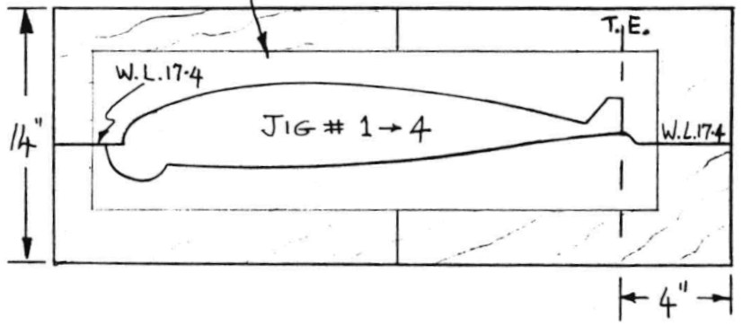
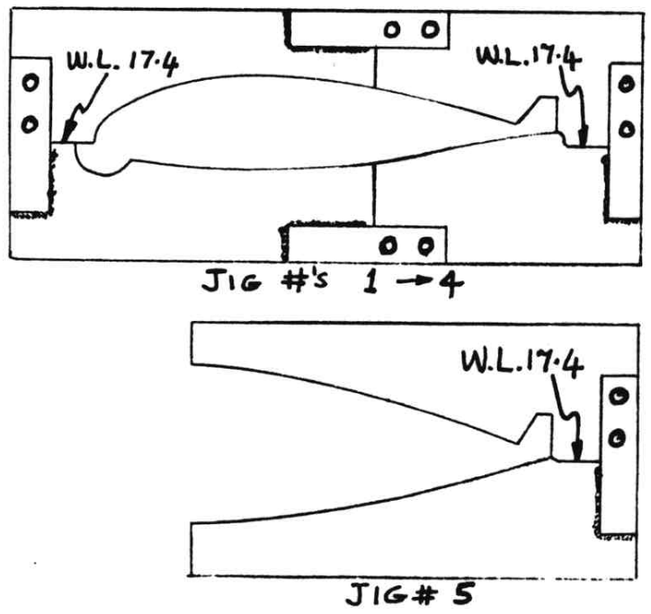
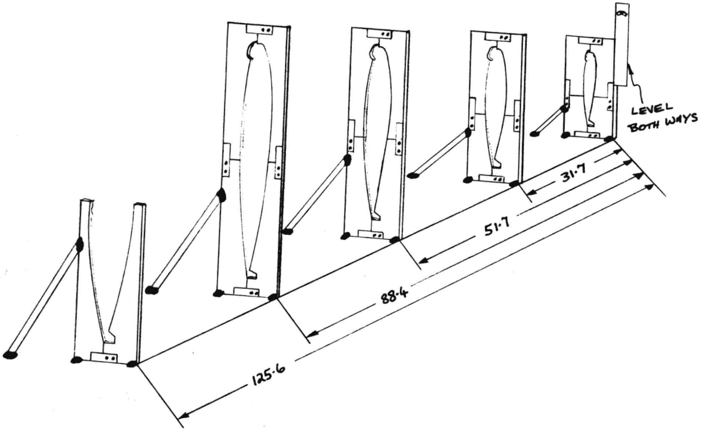
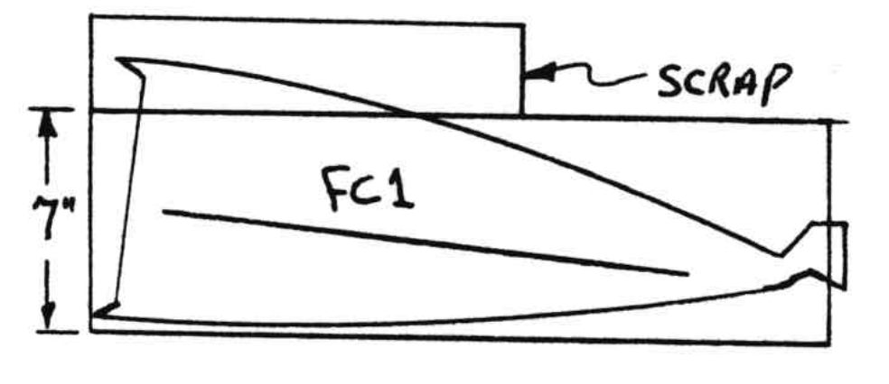
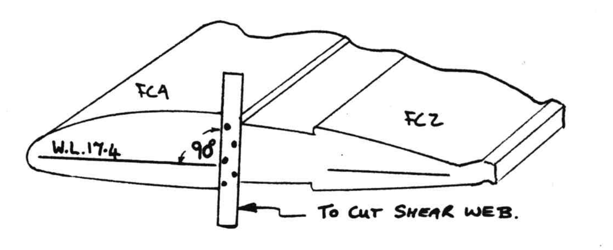

# Chapter 19

## Wings and Ailerons

**Overview**: This is it, the big one!
In this chapter you will build jig templates, cut foam cores, layup shear webs, spar caps and skins, install
attachment reinforcements, build and rig ailerons and
install wing-mounted aileron controls.
Study carefully the dimensioned plan view drawing and all the section drawings to get thoroughly acquainted with your wings before you start.
The wings have no roll trim tabs like the VariEze.
Roll trim is provided in the cockpit and the wing incidence can easily be adjusted to trim the airplane at neutral aileron.
Do accurate and careful work here – smooth, straight wings make a fast, good­ flying airplane.
Details show a right wing – left wing is a mirror image.
Note: LWA9 (12), A2 (2), and A5 (4) are available at a Long-EZ distributor.

### Step 1 - Building the jig templates

The jig consists of five templates that fit over the outside contour of the wing at five spanwise locations, perpendicular to the trailing edge.
The tops and bottoms of all jigs are at the same waterlines (WL 24.4 for top, 10.4 for bottom).
Thus, by merely sighting or stringing them in relative to each other in a straight line, you are assured a perfect wing with the correct twist.
The jig templates disassemble into 4 parts (2 parts for Jig #5) to allow you to partially remove the templates for wing skinning etc.

Cut the rectangle shown from smooth, flat, 1/2 inch thick plywood.
Draw the three lines shown (WL 17.4, trailing edge mark, and vertical line).
Note – jig 5 does not have the vertical line.

Now refer to pages All through A13.
Glue these pages together to obtain a full size drawing of the wing
cutouts in the jig templates.
Cutout the individual pieces and glue to your jigs as shown, using care to line up the WL 17.4 lines and the T.E. (trailing edge) line.
Now, saw along the rib shaped lines to obtain the correct wing cutouts in your jigs (see sketch).
Note that the reliefs in the lower leading edges are there to allow you to make the top skin overlap in step #8.

Now, saw each jig into 4 pieces (2 pieces for jig 5) by sawing along the WL 17.4 line and the vertical line.

Cut out 17 pieces of 1/2 inch thick plywood 1" wide and 8" long.
These provide "links" to detach the various pieces of each template.
Lay each piece as shown across the WL 17.4 lines and vertical lines flush with the template edge (17 places) on one side of each line drill two ¼" holes spaced as shown.
On the other side of each line carefully mark the outline of the link.
On jig #1 through 4 the holes must be drilled on the T.E. side of the template.
Number and remove the links.

Reassemble the templates using 1 1/4" long,  1/4" diameter bolts (cheap hardware store type – you need 34 bolts and nuts) and gluing the links to the non-bolted sides with Bondo or wet flox.
You now have rigged templates that can be unbolted into 4 pieces (2 pieces for jig #5).
Be sure the assembled jigs are square and parallel.
Your finished jigs should look like this sketch.

### Step 2 - Setting up the jig

The first set up jigs your wing leading-edge **up** to allow layup of the full-span shearweb.
It can be jigged on your table or floor – the shear web layup is reached easier if you jig on the floor.

Draw a **straight** line 125.6 inches long, set the jigs leading-edge up as shown and shim as required to get them in a straight line and vertical – use a string and level.
Bondo the jigs to the floor.
To provide adequate support, Bondo some small diagonal wood pieces as shown.
Recheck accurately that they are vertical in both planes and top and bottom edges are in a perfect straight line.

### Step 3 - Cutting foam cores

You will need five 7 x 14 x 64" and two 7 x 14 x 41" styrofoam blocks for each wing.
You will have excess foam left over for winglet construction.

Template construction - glue page A9 to page A10 at the line shown.
Glue this entire page to a 2' x 4' piece of 1/16" birch plywood.
Carefully trim and sand **smooth** all edges of each template.
Transfer the water lines and talking numbers to the opposite sides.
Spray­-can type paper adhesives, available at stationary stores is best to glue the paper down.
Avoid water based paper  glues – these shrink the paper.
Study the plan view of the wing (page 19-10) to acquaint yourself with the three major areas of the wing:
1. Inboard, that portion from BL 23 to BL 55.5, aft of the center-section spar.
2. Center, that portion from BL 55.5 to BL 106.25.
3. Outboard from BL 106.25 to the tip at BL157.

Now refer to page 19-11, which shows how to layout the planform and to cut the cores.
Stack the cores together as shown and attach with sticks and 5 minute epoxy
as shown.
Be sure to not leak epoxy down into the joint – it stops the hotwire.
Do **not** use Bondo.
The angles on both sides of an individual core are the same – ie. 78.64° for center and outboard and 77.51° for the inboard.
Since it is difficult to **accurately** layout an angle, use the method shown – draw a 90° line with a carpenters-square, measure up 42" then over 8.44"
(center), up 28" then over 5.63" (outboard) and up
28" then over 6.20" (inboard).
Now layout the planform using all the dimensions shown.
See chapter three for hot wire suggestions.
Use a vertical level on straight templates to make an **accurate** planform.
Support the foam **firmly** with weight on a **flat** table.
Sloppy hot wire jobs make crooked wings.
Recheck dimensions on planform blocks and mark trailing edges.
Use a straight, undamaged edge of a block for the trailing edge.
Using the hotwire, cut all planforms.
On outboard blocks, mount ribs high to allow foam for winglets.

Then, using the suggestions in Chapter 3, hotwire the cores, start each cut resting on the small tabs on the leading edge.
Do top first, then bottom, starting each cut on the tab.
Be sure wire is **tight** and temperature correct.
Adjust temperature for a cut of 1" in 4 to 6 seconds with light load.
Check this on a scrap **before each cut**.
A too hot wire makes 'craters' in the surface and makes the part too small.
A correct temperature pulls tiny "strings" (angel hair) from
the foam when cut is through.
Too cold causes wire cut, lag, recheck ruining the for posspart's shape.
Before starting any cut, recheck for possible nail snags.
Be sure to pause 2 to 3 seconds at each talking number with a "P" (all corners).
This allows lag to catch up nad makes accurate spar troughs.
Be sure the "TE trim" line is accurately lined up with the trailing edge of the foam block.
Be sure each waterline is level.

Note that the inboard block is thicker at one end than the 7" block.
Use a scrap block on top to fill in this extra (see sketch).

Note that the BL55.5 rib is used at the outboard of
the **inboard block** – only to the front of the spar trough.
The hot wire stops on the tabs of the BL 23 rib.
Then, remove both ribs and using the vertical straight templates, accurately cut the inboard cores' leading edge, double checking the 22.8" and 25.1" dimensions.
The length of the leading edge of FCl should now be 32.87 inches.
Check this, it is important for correct positioning of wing attach points.

Next, the center and outboard cores are cut into two pieces along the shear web.
This is done by aligning the vertical templates accurately along the forward edge of the spar troughs.
This cut should be perpendicular to the waterlines – check this.

Now, refer to chapter 3 page 6 for instructions on foam core bonding.
Bond the foam pieces together where there are joints due to the 14" blocks (see sketch).
Use lots of nails to hold in place and cure.
You now have 5 pieces, labeled FC1 through 5 as shown.

Next, align the "torque tube" templates against each end of the FC 1 inboard core.
One at BL 55.5 aligns with TE for positioning.
The other BL 23 aligns along top surface 9.2" from TE (along **top** surface) as shown.
Using the hotwire, follow the numbers (0 to 16) and cut the core out, which will later allow installation of the aileron torque tube.
Move fast between #0 and #2 and #14 and #16, to avoid a large gap in the surface.

Next you will modify the FC1 inboard core to allow later installation of aileron controls and wing attach reinforcements.
Layout the 6" and 1" dimensions and bandsaw off the wedge on the inboard end.
Turn this wedge up on end and bandsaw out its center as shown with a 0.6" width all around.
Bond the 0.6" wide "shell" back onto FC1, then reinstall the center piece to temporarily support the shell.

This center piece will later be removed **after** wing is skinned.
Note, if you do not have a bandsaw this wedge and shell can be cut with the hot wire. but **only** if you do it **before** gluing the individual pieces of FC1 together.

The 0.6" dimension is critical **only** where it will later align the wing attach at the top forward edge (see section C-C).
At other places it can vary ±.25" without concern.
For further clarification see view GG and O-O.

#### Aileron cutouts

Now you will hotwire the aileron cutouts.
This will **not** remove the ailerons from the wing, only make some inside cuts.
The ailerons are not removed until **after** the wing is skinned.
Locate the three "aileron" templates, nail the root and mid span ones to FC 2, lining up the templates to the TE.
Be **sure** FC 2 is placed and weighted **flat** on a **straight** surface (not warped), then hotwire #0 through #15.
Pause in corners, but move fast between #0 and #2 and #13 and #15 to avoid a large gap in the top foam surface.
Now locate FC 3 and layout the dimensions shown.
Using a coping saw or hacksaw blade, cutout the 3" x 8" chunk **perpendicular to the TE**.
Position the "aileron tip" (BL 118.1) template as shown and hot-wire the inside cutout #0 through #15, using the midspan template again, this time nailed to BL 106.25 on FC 3.
See sketch.
After hotwiring, bond the 3" x 8" chunk back in using wet micro.

A few dabs of 5 minute mixed with flox can be inserted in the gap in the top surface to better stabilize the core from warping.
Leave the center pieces of foam in.

Now. locate FC 4, FC 5 and the two small templates that make a 1" diameter hole.
This hole is located near the bottom surface and will later be used to install any desired electrical wires for position lights
or strobes.
Position the templates as shown – this gives a straight hole that misses any foam joints and ends up at 12, moving fast at the surface.
**Remove** and discard the 1" core form both FC4 and FC5.
This completes the hot wiring of cores.
If you do not immediately jig them, store in the original blocks, weighted down, to keep them from warping.
**Protect from sunlight** from now on, until your airplane is painted.

### Step 4 – Assembly of foam cores and layup of shear web

Grab the foam cores for the right wing and slide them into the jig, positioned as shown.
After confirming that they all fit accurately, remove and set aside the two large leading edge cores (FC 4 and 5).
Now micro FC1, FC2, and FC3 to each other, positioned
as shown in the jig.
Check the 1", 5" and 10" (3 places) dimensions.
Place a few small dabs of flox between jigs and cores to keep  things from moving around, on **top** wing surface **only**.

Now remove the **forward** two pieces of jigs 1, 2, 3 and 4 to expose the shear web area.

Layout and cut the 1.7 inch wide wing-attach access depressions shown in FC1, top and bottom.
See also page 19-12 Section B-B.
These should have round corners on the inside.
A coarse rotary file bit as shown is used to cut the depressions.
Refer to section B-B for accurate **depth** of these.
Top is not the same depth as bottom width and position **is** the same.

Now, using a sharp knife or razor saw, notch the shear
web as shown, to position the three 1/4" thick 2024T-3
aluminum blocks **flush with the shear web face**.

Outboard 2 pieces are LWA4, inboard single piece is LWA6.

Now, glass layup #1, a two ply BID "liner" in the access depressions.
Knife trim flush with edges all around.
Micro in the two LWA4 and one LWA6 metal pieces flush with the shear web face and with the radius on the outside corner.
Now, fabricate WI8s the two pieces of .016 thick aluminium shown and bond them over the access depressions in the spar cap area – 5 minute epoxy is ok.
They must sit perfectly flat against the foam – hold in place with small nails to cure.

Next is the shear web layup (layup 2).
It extends across the shear web and down the spar cap faces top and bottom, full span.
Cut 12 pieces of 13" wide 45° UND as shown.
Roll them up to prevent fiber distortion (elongation of long dimension).

Radius the foam edges, full span approximately 0.2R to match the radius of the metal blocks and allow a smooth layup around the corner.
Be sure all foam faces flow smoothly over all joints, without joggles.
Layup the first ply full span diagonally across the shear web face at 45°.
Wet out onto the three sides then trim edges just **short** of the joggle.
It's better to be ¼" short of the joggle than to lap or bunch up against it.
Do not allow a buildup here.
You need 2 splices.
Butt, **do not** overlap the UND cloth at the splices.
The second ply is the same except **crossed** diagonally the **other** direction, and running full span.
Check the approximate 45° fiber orientation on the shear
web **and** spar cap faces.
Squeegee all plies well, from the center along the fiber direction out-toward the joggle.
Do not leave excess epoxy or overlaps that buildup the area incorrectly.
The thickness of this layup must be correct.

The 3rd through 6th ply are similar, except they do not extend full span.
3rd and 4th are crossed and extend from 39" from tip to inboard end.
5th and 6th are crossed and extend from 91" from tip to inboard end.
The completed shear web is 6 plies thick from BL 23
to BL70, 4 plies thick from BL70 to BL120, and 3 plies thick from BL 120 to BL 157.
Add a 3-ply BID at 45° pad (layup 3) at the two locations shown to strengthen attachment areas.
These pads are centered over the metal parts and do **not** extend over onto the spar cap area.
Then, epoxy the LWA3 and LWA2 plates on, centered over the other metal parts.
Weight in place for cure with about 10 lb on each plate.
Peel ply the spar cap faces.

Refer to Chapter 3 page 6 (foam block joining) then bond the FC4 and FC5 leading-edge cores in place over the shear web.
If the shear web is not cured it will allow you to use nails to hold FC4 and 5 in place.
Replace the front pieces of jigs 1, 2, 3 and 4 to hold FC4 and 5 in the proper position.
Accurately check the fit at the shear web so the joggle on each side of the spar cap area is the same dimension (see sketch).

Check that all jigs stand vertical in both planes to assure a straight wing with the correct twist.
Place small dabs of flox to bond the wing cores to the jig, top surface only.
Check all alignments by sighting all sides of jigs, and let cure.
Your wing should look like the sketch below.

Now place a carpenters square on the inboard spar cap joggle and mark FC4 as shown.
Use a carpenters saw or coping saw to saw off the corner – see plan view page 19-10.

### Step 5 - Bottom spar cap

Break the bondo away from the jig TE, lift the entire wing (with all jigs in place) to your table and lay it bottom up.
If your table is perfectly flat your wing will set down with all jigs in contact with the table surface and with the wing aligned.
If not, shim each jig as required until their edges "string" and
"sight" flat.
Weight in place if necessary.
Bondo each jig to the table surface to hold it firmly in place.
Recheck alignment, then unbolt the two bottom pieces of each jig (one for jig #5) to expose the bottom of the wing.

Remove the peel ply on the spar cap area and sand if required to remove any bumps or high places.
Install a ¼" plywood "dam" on the inboard area to contain the spar cap.
The dam butts to LWA3.
Now, cut the five strips of 3" x .035 unidirectional tape to the lengths shown and layup as shown.
Do **not** use UND cloth.
Squeegee each ply from the center out to the ends.
When you are done, the spar cap should be built up to just **flush** with the foam edges.
A spar cap that is a little-­low is preferred to one that is high (easier filled and finishing sanding won't cut into wing skin).
After cure, round the leading edge between BL23 and 55.5, to flow smoothly into the front face (Section B-B and C-C).
Using a fresh 36 grit hard block remove the joggles at the ends of the spar cap strips and fair any high spots down to the foam level.
If the cap is **low**, fair the foam down to it, this low place is easily filled with micro **over** the skin during finishing.

### Step 6 - Bottom skin

Fair smooth any bumps or joggles at the joints on the entire bottom surface of the wing.
Carve and radius the edges of LWA3 and LWA7 to fair into the spar cap.
The bottom only gets 2 plies of skin, so care must be taken to avoid any lumps.
If the skin has a bump it is easily damaged there when sanding during the finishing process.
A smooth, straight foam core makes a light, strong wing.
A crooked, lumpy foam core makes a weak wing that gets heavy in the finishing process.

Blow or vacuum the wing **clean** as well as your entire work area before skinning.
Cut a 65 inch length of 1" wide peel-ply.
Using small brads or staples, tack it down in the position shown on your foam core.
The skin gets glassed over this strip of peel ply, so it must lay nice and flat.
If you're curious why you are doing this, refer to step 10.
Install peel ply held with small brads of staples every 10" along the TE overlap area (see sketch).
This is later removed before skinning top.

Fill any gaps around the spar cap with dry micro and make a small flox corner around
(illegible, text cut off of page).

The skin is two plies of unidirectional UND, each joint is butted, **not** overlapped.
Do not trim selvage.
Refer to the sketches for ply orientation.
Note that the first selvage edge orients diagonally across FC2 and FC4, then the remaining skin is butted parallel to it.
This is also true of the 2nd ply of skin except it orients on the opposite diagonal, **crossing** the first ply.
Be sure all fibers are straight and squeegeed from the wings center toward the edges.
The third ply is a reinforcement of BID at the tip as shown.
Peel-ply the entire surface of this BID reinforcement.

Scissor trim the inboard edge BL 55.5 rib wingtip edge L.E. and T.E. to less than 1/2" excess.
At the leading edge face of FC1, lap each skin ply down the face 4 inches (see sketch).
Use flox to avoid bubbles at the edges of LWA3 and LWA7.
Be sure the glass is stippled well into the trailing edge overlap area without voids, and stippled/squeegeed down well around all edges including the leading edge.
Peel-ply the 3 inch wide strips shown near the attach depressions (see step 9).
Also peel ply the leading edge, 2" wide.
At knife trim time, trim the TE **flush** with the foam edge and the L.E. at the L.E. tangent line as shown.
Trim the inboard rib, BL 55.5 rib and tip rib flush with the foam edge.
Also, at knife trim time pile some **dry** micro onto the T.E. depression as shown.

### Step 7 - Top spar cap

After bottom skin cure, bolt on the jig pieces you removed in step 5.
Apply some dabs of Bondo to join these to the cured bottom skin.
Now, using a small chisel, knock off the Bondo dabs that hold the jig to the table.
Turn the wing over, recheck alignment and Bondo the jig to the table.
Make one final check for straightness and twist – there is **no** adjustment after skinning the top.
Remove the top pieces of the jigs to expose the top of the wing.
Follow the instructions in step 5 to layup the spar cap **except** use the lengths and dimensions below.
The top cap has **seven** plies.

### Step 8 - Top skin

Follow the instructions in step six with the following exceptions:
Before skinning you must install the nylon conduit for the rudder cable.
This is a .025 wall 3/16 OD Nylaflow tube.
Do **not** substitute nylo-seal tubing.
Layout the locations shown using the full size template for the small curve at the tip and a straight line to the dimension at the root.
The dremmel tool held against a straight edge as shown works well for this groove.
See the completed installation in Section A-A.
At the root, curve the conduit **downward** (deeper groove) about 0.7" over an 8 inch length (see G-G).
This "points" the conduit at the rudder pulley.
Hold the conduit in place with tooth picks every 10".
Fill the groove with dry micro **just before** skinning.
Cover with a piece of tape to keep epoxy off the outboard 3" of the conduit groove (see chapter 20).
The conduit should stick out 2" on each end of the wing.

Remove the leading-edge peel ply from the bottom skin.
Refer to the sketch and carve a smooth taper on the last 1/2" of the bottom skin.
A fresh 36-grit hard block works well for this.
See also Section A-A, page 19-12.

Cut a 65 inch long strip of 1" wide peel ply.
Brad or staple it **flat** on the foam surface immediately **forward** of the aileron hot-wire gap.
Lap this peel ply slightly over the gap to keep excess epoxy out of the gap.

Using a hacksaw blade, remove the foam ridge at the trailing edge.
Then peel back the peel ply to expose the bottom skin.
Then use a 36-grit hard block to fair the foam smoothly into the overlap.
Do **not** gouge into the bottom skin – it's only 2 plies!
If the TE is not straight between jigs, shim it as required to hold it firmly until the top skin cures.
The top skin has a third unidirectional ply, installed before the top BID reinforcement.
This third UND ply extends from the aileron hinge line forward **only** (see sketch).
Stretch the selvage along the hinge line and smooth the cloth forward.
Then proceed with the BID reinforcement.
Do **not** put the 3rd ply over the aileron!

Wrap and squeegee each ply, lapping 2" onto the bottom skin at the leading edge (see section A-A).
This is best done by first painting epoxy underneath, then on **each** ply (1) layup skin leaving excess hanging down (2) scissor trim to 2" (3) **wipe** onto bottom with a squeegee.
Successive plies can be scissored shorter to taper over­lap.
Wrap the skin down the inboard face similar to the bottom skin, overlapping it 1", peel ply the 3" x 12" strips near the attach depressions.
Install 3 plies UND layup #4 over the inboard wing hard point (LWA7) as shown.
These are 3" wide and 14, 10, and 6" long (section C-C).

Squeegee well for a smooth, light layup.
Check for voids and inspect for a good TE and LE overlap.
Knife trim the TE accurately flush with the edge of the bottom skin.
Knife trim the inboard and tip ribs.
After cure, while the wing is still in the jig, carefully check for **level** waterline (reinstall a top jig template).
Then Bondo a 2 foot **straight** board on the cured top skin as shown, shimmed to exactly level.
This is now your incidence reference for rigging wing to the fuselage.

### STEP 9 - Wing ribs

Refer to the adjacent sketch and section F-F.
The rib about 0.7" with a rotary file.
Stand the wing on its trailing edge.
Remove the 3" wide strips of peel ply around the attach depressions.

Layup 3" wide UND strips as shown (layup 5) wrapping around the metal areas and lapping back 12" onto the wing skins, top and bottom.
Two plies are required, each is 30" long.
Fibers orient along **long** dimension.
Then, layup 3 plies BID in the rib hollow (layup 6) section F-F.
One of the 3 plies laps 4" inboard, covering the previous UND reinforcement.
After cure, cut out the attach depression holes as shown.
Note, the 3" UND strips are not cut.

Now, remove and discard the large foam block in the wing's inboard end, exposing the face that is 90° to the trailing edge.
Study **carefully** views G-G and M-M.
Also sections C-C, E-E, and N-N.
Note how the 0.6 inch foam "shell" is completely removed for glass­-to-glass layup around all outside edges and at the forward face where the CS127 brackets will mount.
The foam is also completely removed at the **LWA6** (1/4" thick aluminium) block.
Note also the local removal at the CS 132L belhorn (view G-G and section E-E).
**Caution** – leave the 0.6" directly above the inboard wing attach (view M-M and section C-C).
Using a knife, rotary file and sandpaper, conduct the required surgery on the shell.
Use care to not damage the nylon rudder conduit.
Then layup a 3 ply rib in the **entire** area (layup# 7).
While its wet, layup 3 plies UND 2 1/2" wide lapping over the LWA6 piece, extending 1" below it and 4, 5 1/2, 6" aft of it (layup 8 Section C-C).
Clamp LWA7 in place and cure.
After cure cover LWA8 with 1 ply BID, extending 1" all around.

### STEP 10 - Ailerons

Study Sections H-H, I-I, J-J, K-K and L-L to acquaint yourself with your aileron and wing trailing-edge spar.
Layout the dimensions shown below.
Then using a razor saw – cut the skins and remove the aileron.

Jig the wing leading edge down and remove the foam shown by peeling off the peel-ply installed before skinning the wing (see section I-I, H-H and J-J).
Smooth up this trough and extend it into the wing on each end – see sections K-K and L-L.
Layup (layup #9) the wing trailing edge spar.
This layup extends about 1" into the torque tube hole on the inboard end – round the foam edges here.
This is 3 plies BID and 1 extra BID at the hinge locations.
Overlap 1" where needed, but don't stack overlaps at one location.
This layup extends out the edges to the T.E. (Section K-K and L).
Be sure to avoid voids at the skin laps.
Scissor trim to 1/4" after each ply.
Knife trim flush all around.
Notch the wing top skin 0.2" deep in the places shown below.
These will later accept the hinges and allow the skin to seal the gap between hinges.

Refer to the page 19-17 drawing and fabricate these metal parts.
Caution – **Reverse** the hinge halves before sawing to length (see 19-17).
Slice 3/8" of foam from the LE of the aileron and bond the 3/8 dia steel rod on with dry micro - **full** aileron span.
Mark the hinge positions from the wing, then remove foam to install the two A-5 pieces **flush** with the front face.
Remove foam for the A-10 tube and fit it as show on Section I-I, also fitting A2 flush with the forward foam face.
The A10 tube extends one inch inboard from the inboard edge to the aileron.
Positioning is important to aileron balance – accurately recess the A2 and A5 pieces.
The 5/16" holes go against the **top** skin.

After assuring A2 and A5 are parallel to each other, jig the aileron trailing edge down, round the corners, bond A10 and A2, and A5 in with wet micro and layup 1 ply BID at 45° over the leading edge lapping 1" onto top and bottom skins.
Peel-ply the edges.
This is layup #10.
Set the aileron aside to cure.

Now remove the 0.4" of foam at the ends (section K­-K and L-L).
Layup 2 plies BID to form the end ribs (layup #11).

Back to the wing, now, using a straight edge, align the extruded hinges in the wing notches so they are all parallel.
Drill the seven #12 holes through the wing and hinge as shown (drill #30 pilot hole, first).
Install the AN525-10R8 screws and K1000-3 nutplates (see I-I and H-H).

Now, place dabs of Bondo on the aft hinge pieces and position the aileron on the wing to line up top and bottom skin and TE.
After the Bonda cures, remove the 7 screws, remove the aileron and drill the 24 holes for the pop rivets.
See page 19-17.

Then, pop the Bondo loose, remove the hinge pin, sand the aileron and hinge halves dull and pop rivet the 3 hinges on with wet flox and 23 pop rivets.
Keep flox out of the hinge holes.

Now, hang the aileron by a fine wire, not string, through two hinges and check balance.
The aileron must hang **between** the angle that makes the top level and the angle that makes the bottom level **after** painting.
So, if the bottom is nearly level it may be out of tolerance after painting.
You can add maximum of 0.3 lb to the nose to balance by stacking lead behind the steel bar (do **not** extend forward, this ruins aerodynamic balance).
If 0.3 lb aft of the steel bar is not enough you will have to discard and build new ailerons – your first ones have excessively heavy, epoxy-rich skins and cannot be made safe.
This will happen only with poor workmanship.

Now mount the ailerons and check all gaps (top, bottom and sides) against the tolerances on Section J-J and K-K.
The ailerons should move free with no excessive binding.

### STEP 11 - Controls

First fabricate the phenolic block and metal parts shown full size page 19-17 dimensions not shown.
Drill (#12) and bolt the parts together as shown.

Remove the layup #7 glass rib, in the 1.6" diameter area at the torque tube hot wire hole.
Revise dimension A to position CS 132L and CS 152 as shown in Section E-E with CS 151 about 1/4" from the glass rib.
Install the aileron.
Slip the phenolic block (sand its surfaces dull with 36-grit) onto CS152 and flax it up against the glass rib (section E-E and view G-G).
After cure, remove the aileron/torque tube assembly and layup 1 ply BID (layup# 11), over the phenolic, lapping 1"
all around.
After cure, remove glass from the hole.
Install the aileron and the CS 132L belhorn.

Refer to the CS127 bracket and all adjacent parts (view O-O).
Assemble these, including the two pushrods.
Position the stop bolt to stop CS 128 20° travel from
the neutral position shown.
Bolt the assembly on the shear web in the position shown in view O-O and view G-G, using the four AN3-4A bolts.
Hook up the pushrod.
Adjust it so the stop bolt stops the motion at 20° up aileron.
A Sears "Angle Finder" is real handy to check control surface travels.

### Step 11 Attachment - Wing to Centersection Spar

Mark A and B marks on the wing top and centersection top directly above the center of the aluminum blocks.
Hold the wing up to the spar to verify that the A-A and B-B marks line up.
This verifies correct horizontal position of all blocks before drilling.
Refer to chapter 6 and 7 section drawings and verify correct vertical positions before continuing.
When the wing and center­section holes are drilled up to 5/8" diameter they must be drilled in place together to assure bolt angle and position alignment.
The procedure is for right wing. Left wing is a mirror image.

**STEP 1** - Pilot holes and access holes in centersection spar

The drawing below shows dimensions for the 3 holes on the aft face of the centersection spar.
Lay these out accurately and drill straight through into the interior of the spar with a #10 drill.

While you're at it, layout the same dimensions on the centerseciton spar forward face.
Drill these 3 holes ¼" diameter.

**Step 2** - Wing line-up and line-bore

Jig your fuselage level - level longerons and level centersection spar.
Cut several large foam wedges from you wing-hotwire scrap pile, and round up two sawhorses.
With these, position the wing up to the centersection spar until it butts to it in the correct position.
Observe the following about wing jigging:

1. **Sweep** - with the wing butted to the center spar the sweep should be correct. Check this if you wish, and check skew by measuring from the nose to each wing tip. However, fit to the spar is **more important** than sweep accuracy, as this has a very small effect on flying qualities. Butt to the spar even if the wing tips are as much as 3 inches different than the correct sweep.

2. **Dihedral** - with the wing top and bottom edges matching the top and bottom edges of the centersection spar, the wing should be flat, at its 17.4 waterline plane. The top slants down and bottom up due to the thickness taper. Check this if you wish, by sighting a long level, using a water filled tube or using a transit. However, fit to the centersection spar is **more important** to aerodynamics than a slight difference in dihedral. Fit the spar accurately even if it changes dihedral as much as two inches at the wing tip.

3. **Incidence** - with the wing butted to the centersection spar, the reference board that is Bondoed to the wings' top should be **level**. Incidence must be set exact, or the airplane will roll. Jig for zero incidence, **even** if it requires several shim washers on one of the outboard attach bolts. Once the wing is jigged, apply several large Bondo "lumps" to connect the corners of the wing and spar top **and** bottom. Once cured, these will firmly hold them in position for line-boring.

Locate your 10 inch long, 1/4 inch diameter drill bit
and drill through from the front all three holes
as shown.
Clear the bit every 1/4" of drilling.
Do not start this job with a dull bit.

Now, locate your 5/8" spotface with 1/4" pilot.
This is the same tool needed in Chapter 9 and 16.
As in the above paragraph, drill through with the spot face, going slow and clearing the bit often.
Do not attempt this with a dull spot face.
All holes are now opened to 5/8 and aligned with each other.

You must fill the inboard hole on the forward face
of the spar (foam and 2 plies BID) to seal fuel
from the spar.
The outboard ones can be left open.
Machine or purchase the LWA9 bushings - see drawing.

Now, knock off the Bondo and using the tool shown, measure the **actual depth** of each of the six 5/8" diameter holes (spar and wing).
Face the LWA 9 bushings to a length that is the same as, or .010 shorter than the hole length.
Do **not** make the bushings **longer** than the holes.
Epoxy the bushings in and let cure.

Refer to chapter 7 section B-B and G-G for locations for the wing mounting hardware.
Needed are (each wing):

| Quantity | Description |
|---|---|
| 2 | AN8-21A bolts (see note) |
| 1 | AN8-23A bolt (see note) |
| 6 | AN960-816 washers |
| 3 | AN960-816L thin washers (between bushings) |
| 3 | AN363-820 nuts |

Additional 960-816L washers may be needed if required to shim incidence.
One washer changes incidence by 0.4°.
Finer adjustments are made by filing washers.

Tool needed for wing attach:

| Quantity | Description |
|---|---|
| 2 | 3/8" drive ratchet |
| 2 | 3" extension |
| 2 | 3/4" socket |

Note: Due to the long (28.83 inch) distance between bolts, the tolerance on fit of bushing-to-bolt is not real critical, like it normally is on aircraft wing attachment.
Even a .015" clearance ("slop") is acceptable and safe.
The large diameter ½" bolts are selected to get adequate washer - overlap on the bushings.
From a purely strength stand point, ¼" bolts are enough!

