# CHAPTER 25
## FINISHING
Finishing the composite airplane is more important than simply
obtaining an attractive paint job. The finish on a composite aircraft serves to protect the structure from weathering and deterioration
from ultra violet radiation (sunlight). The finishing materials
also give the aiplane its final aerodynamic shape. Using the proper materials and techniques, the finishin9 process is fast, pleasing
(both aesthetically and aerodynamically), and provides for long
maintenance-free service. Use of sub-standard materials can limit
the life of the finish, result in an overweight airplane, or even
limit the service life of the airframe. Sanding is done constantly
during the finishing process and __extreme__ caution must be exercised
to avoid damaging the structure. A poorly executed finishing job
can destroy the structural integrity of the airframe. Even the
finished __color__ of the composite aircraft can effect its structure.
Proper techniques must be adhered to for safety as well as to obtain an attractive airplane.

## FINISH COLORS AND HEAT
Epoxies and foams are all sensitive to high temperatures. Room
temperature curing epoxies soften and loose their rigidity at only
moderate temperatures (160 degrees F). Foams are also heat sensitive and tend to soften and swell with moderately elevated temperature
(250 degrees F). The sun is a potential source for heat. In still
air, on a hot sunny day it is possible to obtain surface temperatures that approach 220°F on a black airplane. Color of the surface
determines how much solar heat it will absorb. White surfaces
absorb very little (10%) of the sun's heat while a black surface
(95% absorption) will heat up tremendously. The accompanying graph
shows the relationship between color and surface temperature. White has been chosen as the only color for fiberglass sailplanes to
preclude any possibility of excess temperature due to solar heating.
The same criteria apply to the Long-EZ. White is the only recommended color for these aircraft. Trim colors in non-critical areas are
acceptable as desired. Such as the fuselage, vertical winglet
surfaces, and the underside of wings and canard. Dark trim colors
are definitely __not approved__ on the upper surface of the wings and
canard. Do not stripe wing or canard with trim, except at the
canard tip where structure is not critical.

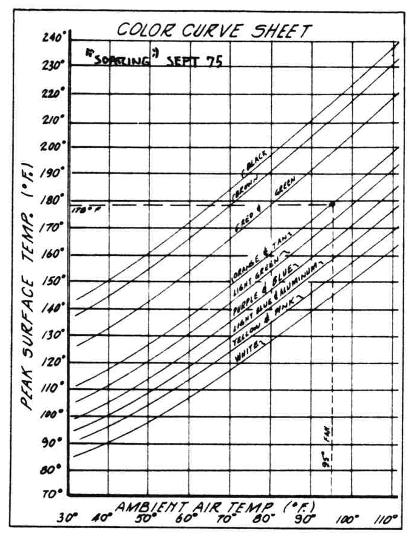

## TOOLS AND MATERIALS
A low density microsphere/epoxy mixture (dry micro) is used for
coarse filling requirements. Automotive type polyester body fillers
(Bonda) are very heavy and not rec01T111ended for aircraft finishing
work. One product that works fast like Bonde, and is light like
dry micro is Stitts micro putty. It can also be used for contour
filling, but is not a replacement for featherfill. Medium to
light surface filling (less than .030 in) is done with a light
weight polyester spray (or brush) filler/primer called Feather-
Fill. Feather-Fill is note-worthy for its ability to fill medium
thicknesses in a single spray or brush coat and for its easy sanding
to a smooth surface, when mixed with micro balloons prior to application. Dupont 70S, 100 S or if using enamel paint, 3011S dark gray lacquer
primer/surfacer provides an effective ultra violet radiation barrier.
The actual finish paint type is largely a matter of the builder's
personal preference. Automotive finishes in lacquer, ename1, acrylic
lacquers, acrylic enamels, and the polyurethanes are all acceptable.
We find the acrylic lacquer is easy to work with, easily patched and
readily polished to a high gloss. The enamels and acrylic
enamels are low cost and easy to apply, however, they are not readily
repairable if chipped. The polyurethane finishes offer the best gloss
for the longest life, but they are high cost and virtually impossible
to repair. Also, the fumes present when spraying polyurethanes are
dangerous to your health.

Sanding will occupy a large percentage of the time spent finishing
the composite aircraft. Sand paper in 36 to 60-grit, 100- grit,
220-grit and 320-grit roughness will be used. Standard 9" x
11" sheets are the most versatile. Use a good quality aluminum
oxide, or silicon carbide sandpaper. Don't waste your money on
the cheap flint-type sandpapers. Power sanders are not recommended; it is too easy to damage the structure while using them. Hard
(wood) and soft (foam) sanding blocks and the sanding spline shown
on page 2 will be your primary finishing tools. A paint spraying
setup will be.needed for the U.V. barrier primer and finish painting.
Some hand brushing of feather fill and U.V. primer will also be
done.

### Optional Ice Shields.
The Long-EZ was not designed to fly in icing conditions. No
de-ice nor anti-ice provisions have been made. The aircraft has
__not__ been tested in icing conditions. However, we do have some
limited icing experience in the Defiant. An aircraft with similar
structure and configuration. We found that this aircraft handled
ice quite well, with no decernable trim changes. However, we found
that ice forms on the blunt leading edge of the outboard elevator
balance weight, and could restrict elevator travel. We installed
ice shields on the Defiant to correct this problem.
If you are contemplating IFR operation of your Long-EZ you should
install the ice shields detailed below. They are merely a 3-
ply BID shield in front of the balance weight.
Wait until after the featherfill application so the shields don't
interrupt your ability to smoothly contour the canard surface. Install the elevator with 2 hinge screws. Tape it in the 10 degree elevator
position (use template on page 11-6). Sand away any featherfill
down to bare glass on the canard skin out to ½" from the balance
weight. Apply at least 8 thicknesses of gray duct-tape to the
balance weight sides and front to provide clearance .. Then layup
3-plies BID as shown over the weight lapping ½" onto the canard
skin. After cure, remove elevator and gray tape.

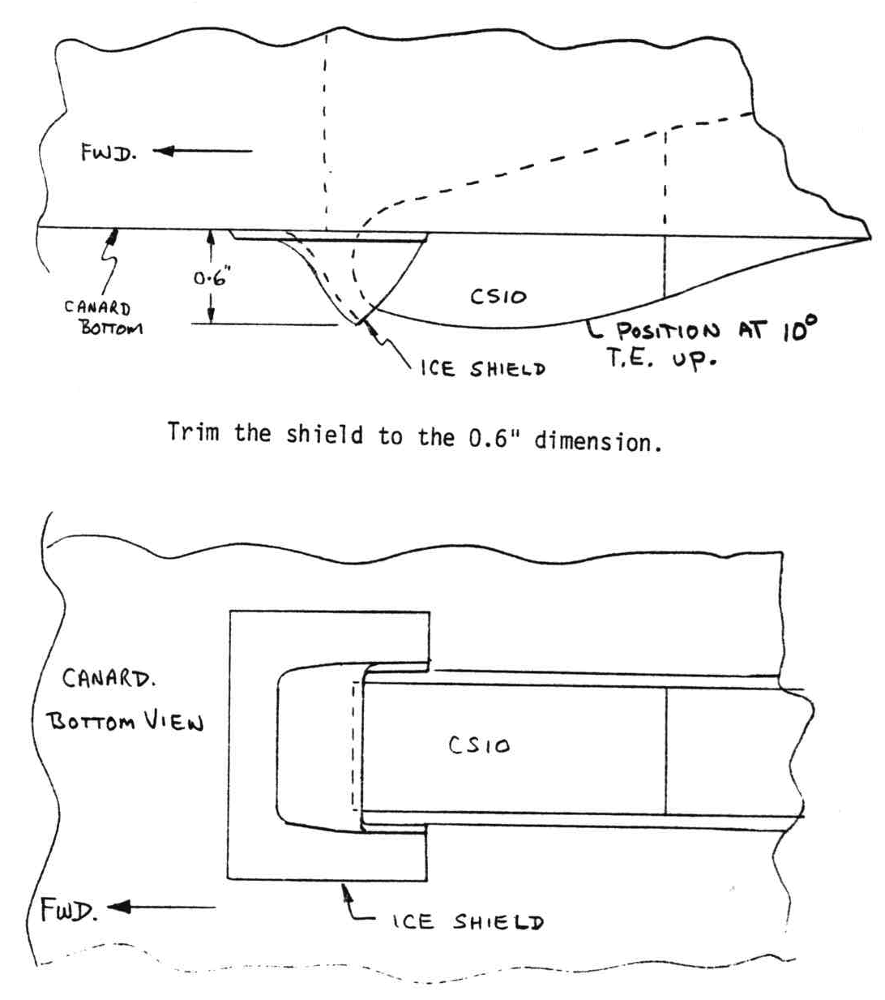

## The Spline
The sanding spline is a finishing tool common to the sailplane industry. It is an easy tool to
make and does an excellent job of contouring.
You may find it handy to make two, one for coarse grit sandpaper and one for medium or fine sand­ing. The spline is an easy tool to use but it
may require your close attention at first.
The spline is always held with handles parallel
to the leading edge of an airfoil surface (wing, canard, etc.) as shown in the sketch. The sand­ing motion is on a diagonal to the leading
edge while the spline's handles are held parallel. This takes a little getting used to but becomes
second nature after a little practice.

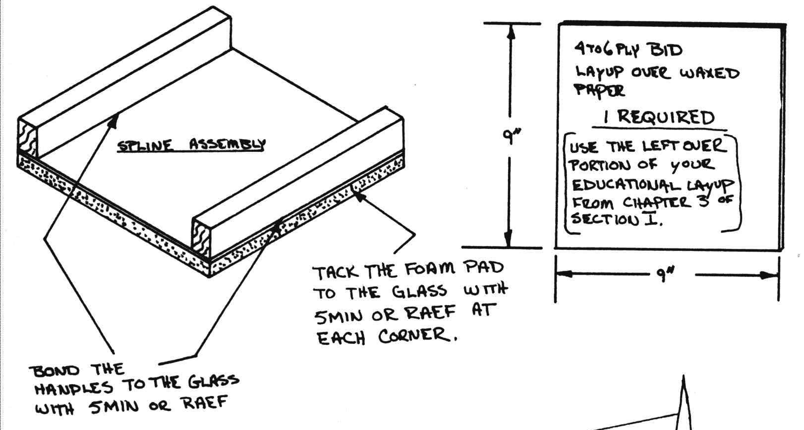

## THE FINISHING PROCESS
Finishing the composite airplane is a five­
step operation. Repairs or rework of structure
must be completed first before the obscuring
finish is applied, and final structural inspections must be complete. Second, coarse contour
filling is done with micro /mixed with
epoxy (dry micro) as required in areas requiring
.03 inch to .20 inch of fill. Any exception-
ally gross filling (over .20 in) is also accomplished at this stage using a foam filler. The initial
contour sanding begins with the cured microsphere
filler, and exceptional caution must be exercised
to avoid damaging the structural skins while sand­ing.
Third, featherfill is applied to fill medium
sized surface defects up to .03, and as a general
fill of the glass surface weave. The fourth step
is the application of an ultra violet barrier primer.
Fifth, the final finish paint is applied.
The following sketches are descriptive of
the finishing process and its potential pit falls.
The sketches are grossly exaggerated scale to show
details more clearly.

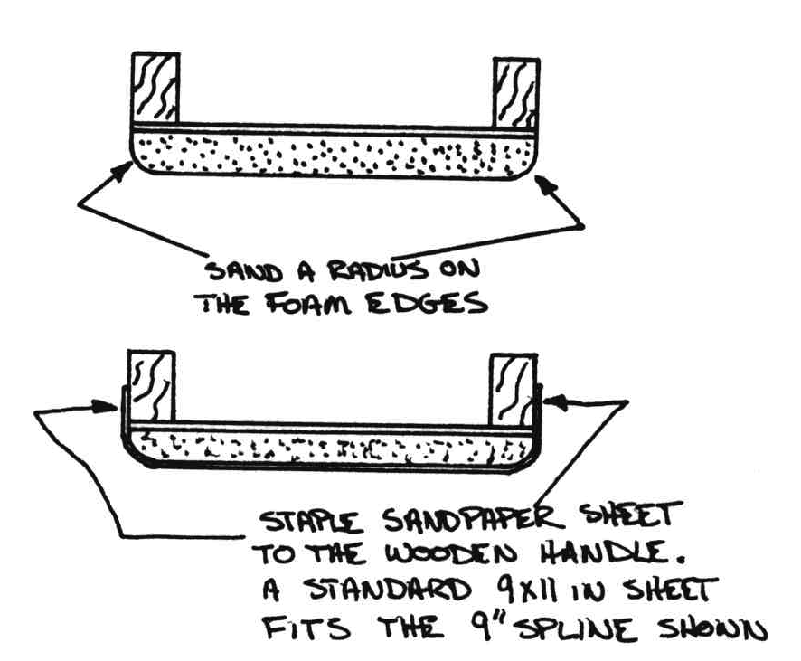
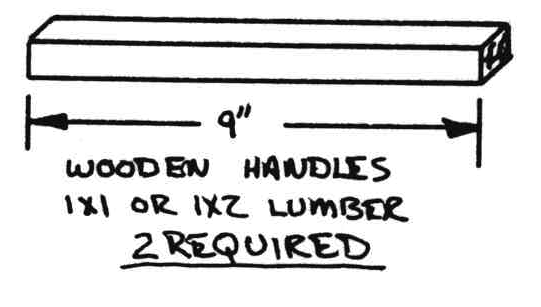
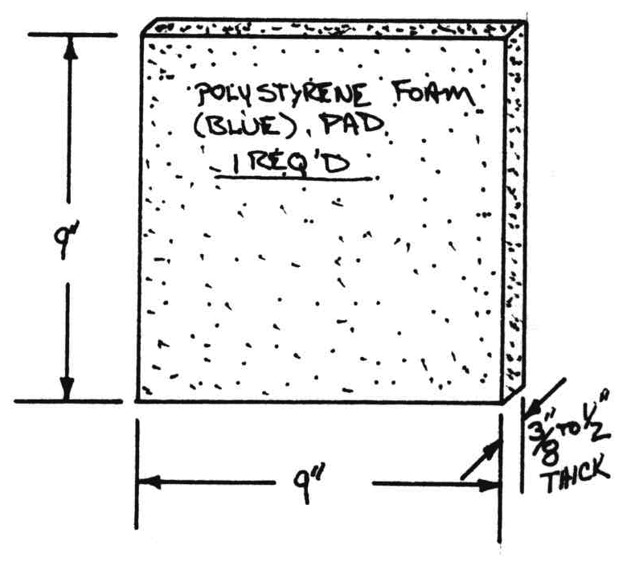
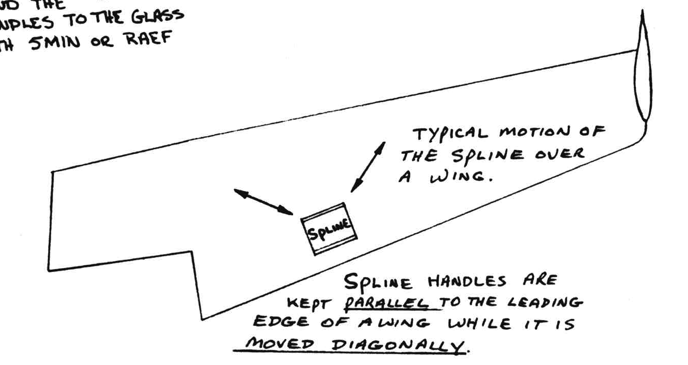
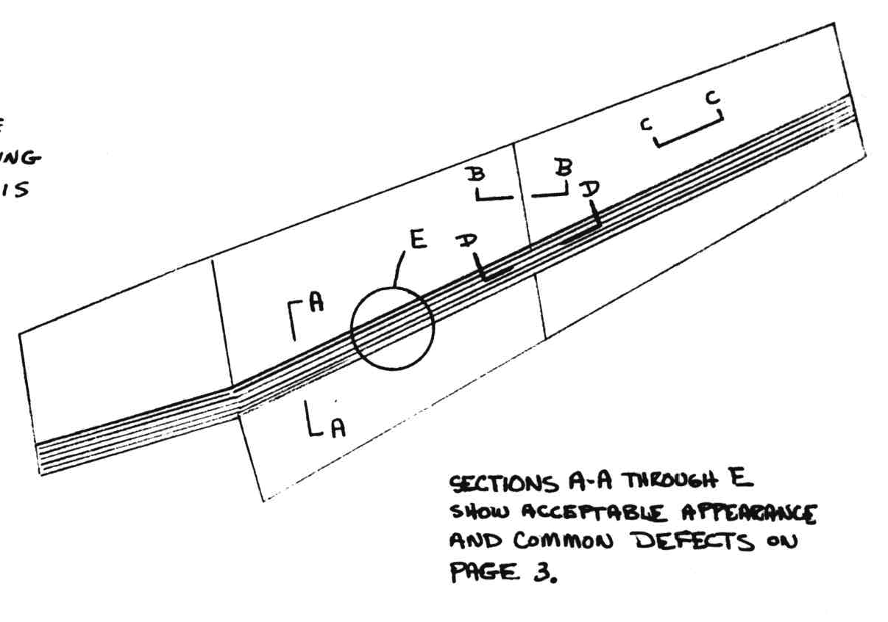

### Step One; Inspection/Repairs
When you begin finishing, the entire structure must be airworthy. You can hide poor work­manship from your own eyes and from the inspector who will finally approve your first flight, but you can't fool mother nature! Everything has to be structurally sound before finish materials are applied. The following sketches are a review
and clarification of the quality control criteria found in chapter 3,
Each airplane must have a thorough inspection and required repairs completed as the
first step in finishing. Comply with the 12" ruler check before continuing (PAGE 3-13)

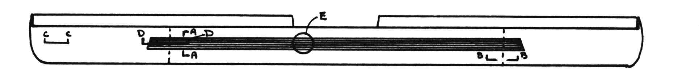
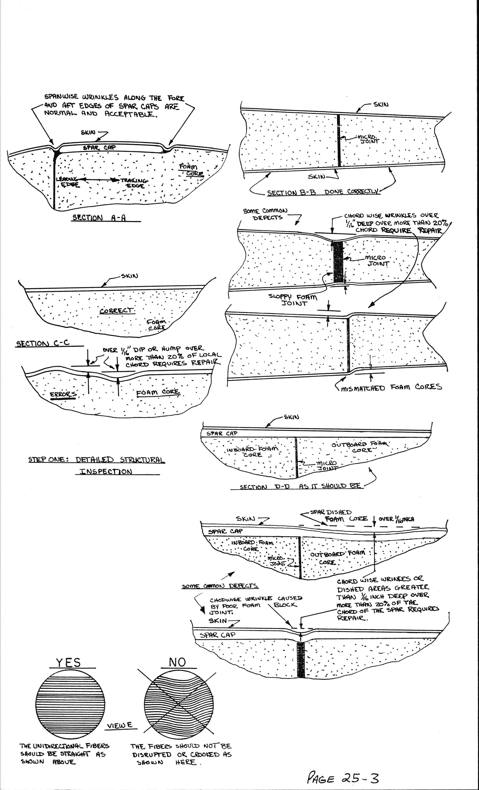

### Step Two: Coarse Filling
You must be extra cautious in this step or you
may destroy your structure. When you take a piece of sandpaper and start grinding on your composite structure it's like using acid to clean a
metal wing spar, It must be done carefully!

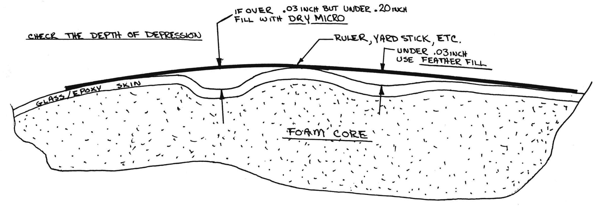

Start by determining which areas require micro filler as shown using a flexible yard
stick and a scale. Prepare the areas to be filled by hand-sanding lightly. Do not try to use a
sanding block or spline on these areas.

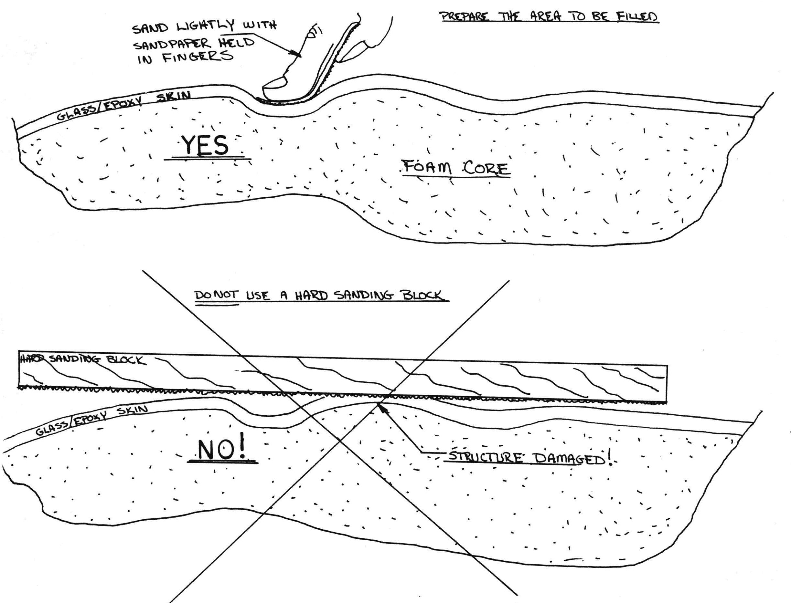

Paint a __thin__ coat of epoxy over the area to be filled. Dry micro is then lumped over the area. The fill must be high, such that material is sanded away to bring the area into contour. The micro should be mixed very dry (lots of microspheres to save weight). Let the micro cure at least 24 hours. Be sure to use glass bubbles, not microspheres with Safe-E-Poxy.

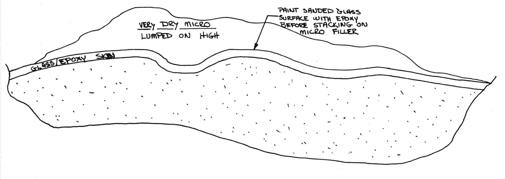

Sand the micro overfill into contour using a hard sanding block,or spline with coarse (35 to 60-grit) sandpaper. Exercise extreme caution while sanding A few careless strokes with coarse paper can ruin your structure!

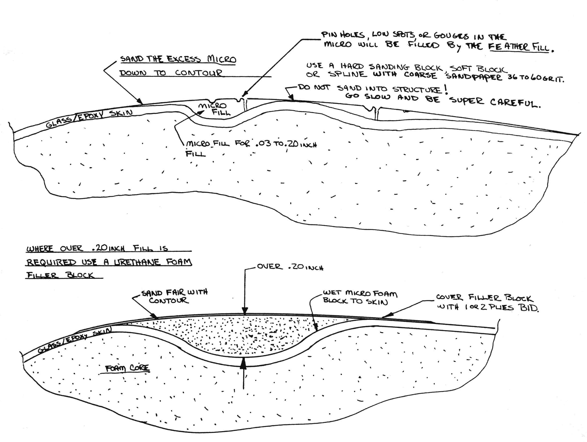

### STEP 3 - Feather Fill
Sand the surfaces lightly by hand or with a soft foam
sanding block in preparation for feather fill. A brush
coat of feather fill will build up .02" to .03" thick,
fill the glass weave and any medium size out of contour spots. Feather fill will require several hours curing
time before it can be sanded. The cured feather fill
is sanded to contour using a spline of soft block and 100-grit sandpaper. Do not use 36-grit on feather
fill. Again, extreme caution must be exercised not
to damage the glass structure in pursuit of a good
finish. The contouring must stop immediately when
the highest glass peaks begin to be visible as the
feather fill is sanded away.
If you find that you have underestimated the fill required or just have a thin coat, don't hesitate to use a second coat of feather fill. A well prepared surface generally won't need more than one coat. When you have finished
contouring the feather fill, the surface should be
basically smooth and fair. The primer to follow· is
not intended to be contoured heavily, just smoothed
with finer sandpaper for a smooth finish while leaving
a substantial ultra violet barrier. Be sure the surface is dry, dull, and clean. Be sure the Feather Fill
a􀀒d shop is at least 70° F. Mix the catalyst
with a paddle or wire on your electric drill motor.
After mixing catalyst, mix in about 25% by volume of
micro balloons, and brush on. Micro balloons makes
it go further, fill better, and sand easier. Feather
Fill catalyst is extremely dangerous to sensitive tissue. Use eye protection. A small amount in the eye can
cause vision damage.
When finishing glass in preparation for Feather Fill,
use coarse 36-grit paper, since Feather Fill requires
a mechanical bond, not a chemical bond.
Do not wet sand Feather Fill, it absorbs moisture.
Feather Fill cannot be used over primer. 3M sanding
screen type 18N FABRICUT WET0RDRY silicone carbide
180 works excellently on Feather Fill. It is available at lumber yards.

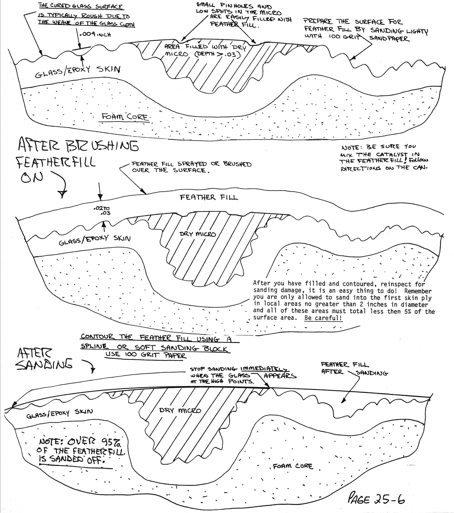

### STEP 4 - Primer
The ultra violet radiation barrier is provided by the heavy carbon black content of the dried primer. The primer give the whole surface a flat black or dark gray color and the sanding should never remove it completely, exposing the light gray Feather Fill below. The primer is sprayed on, allowed to dry, and sanded lightly to achieve a smooth surface. The first primer coat is sanded using 220-grit and the second coat very lightly wet sanded with_320-grit. When complete, the primer is very smooth, dark, and ready for finish paint. Inspect for imperfections or pin holes. Fill with lacquer spot putty (in a tube) and feather with 320- grit.

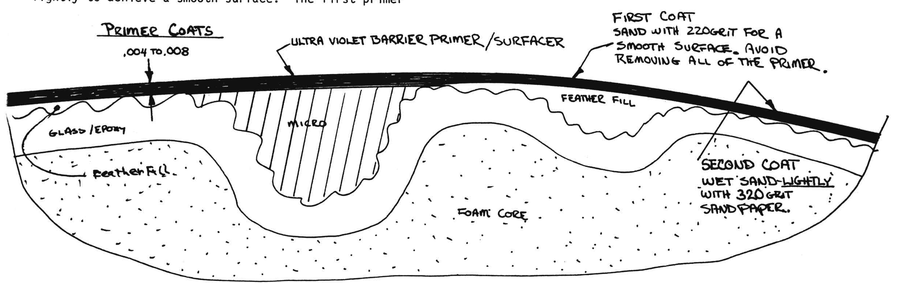

### Step Five: Finish Paint
Follow the manufacturer's directions for the type of finish paint that you have chosen.

## MISCELLANEOUS
### Seals
Where a flexible, durable seal between two assemblies is required, white silicone rubber
(RTV) is recommended. For a removable seal,
such as between the wing root and fuselage, or canard and fuselage, one side of the seal is bonded to the part and the other side is treated before application of the sealant so that it
can't adhere. A simple release can be achieved
by taping Saran Wrap tightly over one side of the joint. The seal is installed by assembling the two components with Saran Wrap protecting one side, lightly sanding the other, and then wiping the
wet silicone into the gap. Remove all excess silicone at the surface. This assembly has to
dry for at least two days before the parts are disassembled. The Saran Wrap will easily peel
off of the cured silicone.

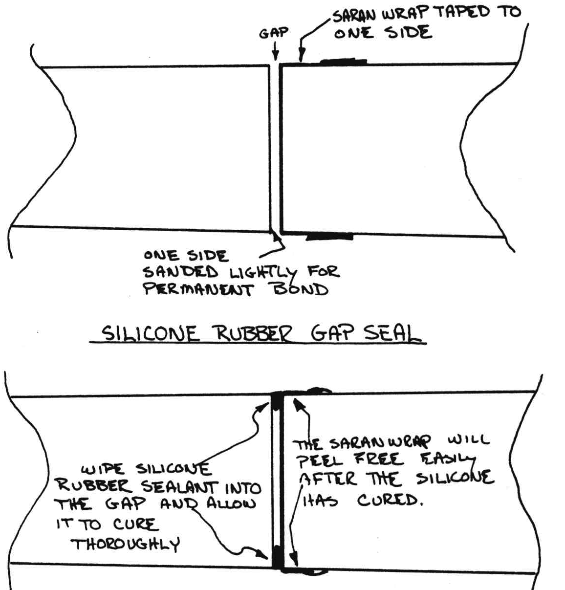

### Mismatch Treatment

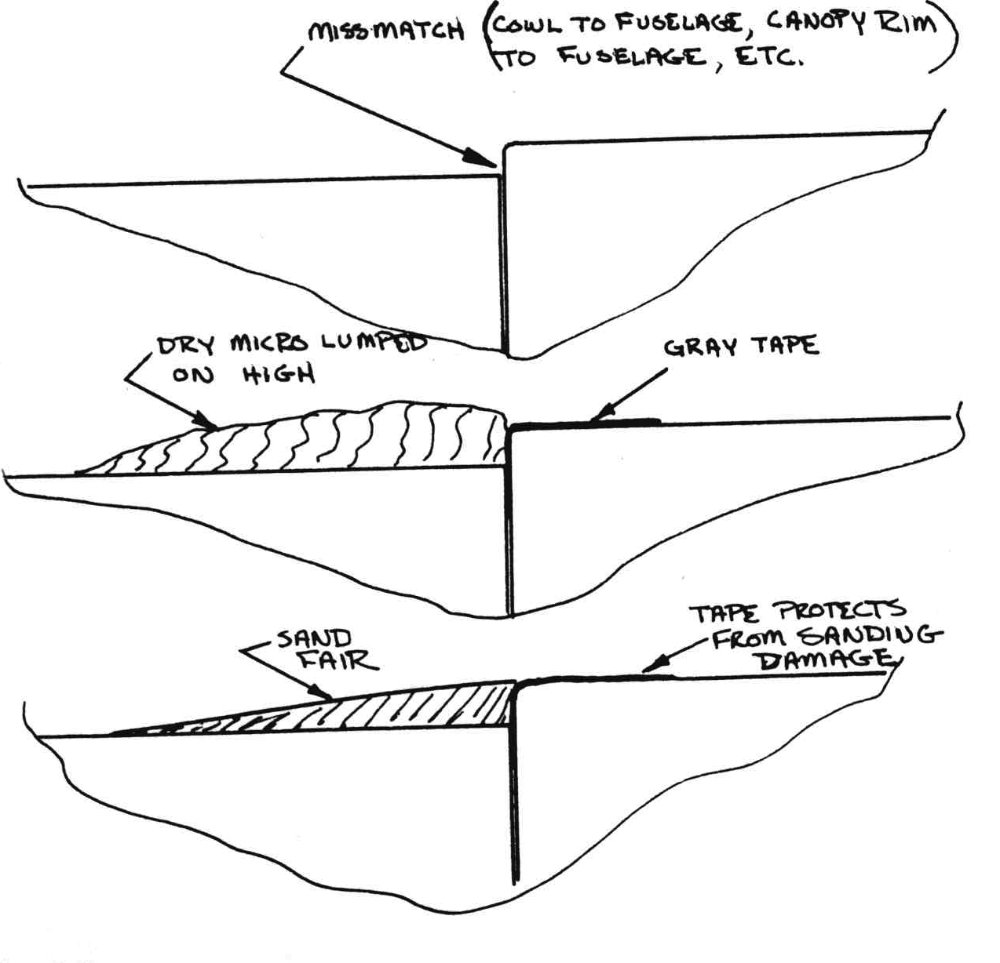

### Cockpit Interior Paint
You may use colored cockpit interior paint to suit
your own taste. For example, gray was used on the
prototype N79RA. It is not necessary to fill the glass
weave and some very light sanding may be done to smooth
the surfaces slightly. Apply one coat of the primer
to the interior glass surfaces for ultra violet protection and color to suit over that. Be sure to mask the nose
gear window and fuel gauges before painting. A light
color (light gray, green, or blue etc.) is recommended
on the cockpit interior to avoid high heat buildup
when the airplane is parked in the summer sun with
the canopy locked. The instrument panel is shaded
and can be black.

### N-Numbers (Registration Marks).
You may use adhesive type letters and numbers or paint
your registration marks directly on the airplane; your
choice. Some simple hints may save some trouble on
either method. When installing the self-adhesive tape,
first use Windex window cleaner to wet the area where
you want the markings, strip the protective backing
off the letter or number, and apply it to the wet surface. The Windex will allow you to slide the markings around
for perfect positioning, and then when located properly, just press them down lightly. The pressure squeezes
the Windex out and allows the adhesive to bond to the
airplane. If you paint the registration marks directly
onto to your airplane, first mask off the outlines for
painting, then sand __lightly__ with 320-grit sandpaper,
then paint and remove the masking tape.

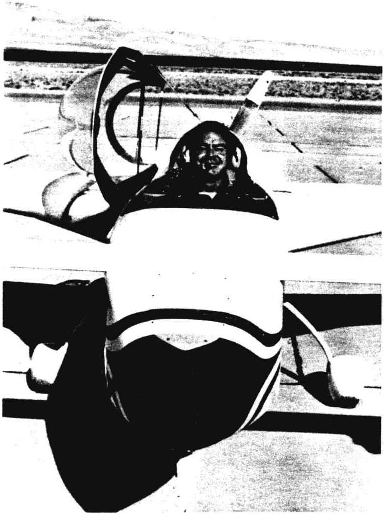
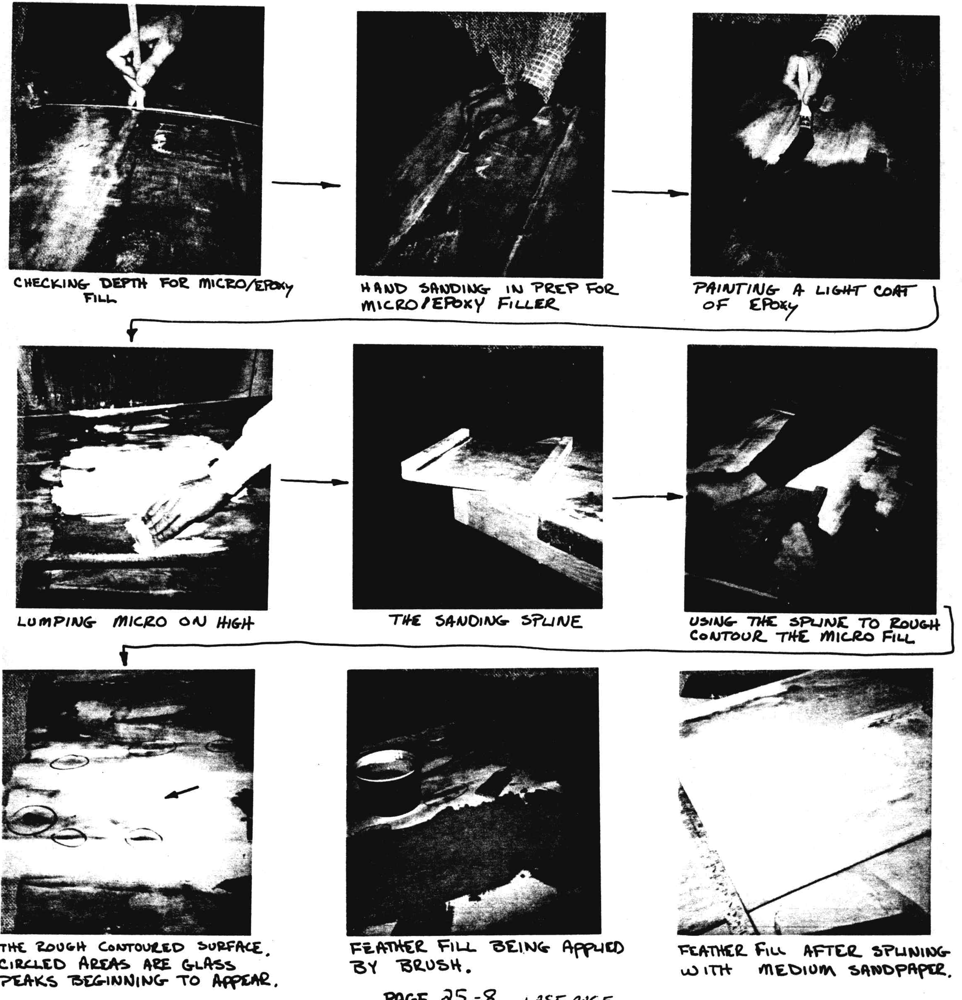
